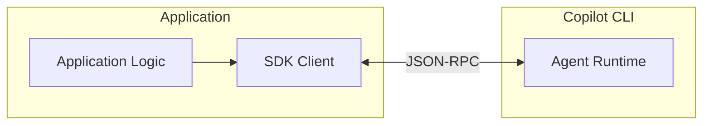

# Day 02 - 認識 GitHub Copilot SDK：應用程式如何接入 Agent Runtime

如果使用者只需要摘要或單一問題的答案，應用程式通常送出 Prompt、等待模型回應即可。但當任務變成「檢查專案的登入流程，找出問題並完成修正」，Agent 可能要搜尋程式碼、讀取檔案、修改內容，再執行測試確認結果，過程中還涉及權限判斷、狀態維護與錯誤處理。

剛開始接觸 GitHub Copilot SDK 時，很容易把它看成另一套模型 SDK。如果只從「送出 Prompt、取得回應」的模式來看，Session、事件與 Permission 等機制確實不容易看出用途。理解應用程式實際接入的是 Copilot Agent Runtime 後，這些設計在執行流程中的位置就會清楚許多。因此，在開始實作之前，需要先釐清模型呼叫與 Agent Runtime 之間的差異。

## 從一次模型呼叫到一段任務執行

一般 LLM SDK 的核心是提供模型存取能力。應用程式準備訊息與參數，模型則回傳文字、結構化資料或工具呼叫請求。用來處理分類、摘要或固定格式的內容產生時，這種請求與回應模式通常已足以應付需求。

以修正登入流程的錯誤為例，模型第一次可能先要求搜尋檔案，取得搜尋結果後，才知道應該讀取哪一段程式碼；完成修改後，又要根據測試輸出判斷是否需要繼續修正。每一次工具執行的結果，都會成為後續判斷與行動的上下文，整段流程也無法只靠單次模型呼叫完成。

這類任務需要一個能反覆呼叫模型、協調工具，並持續保存互動狀態的 Agent Loop。使用一般模型 SDK 時，這段流程通常要由應用程式自行建立，或交給額外的 Agent 框架處理。GitHub Copilot SDK 提供另一個切入點，讓應用程式直接使用 Copilot 既有的 Agent Runtime。兩種方式都能支援工具呼叫，主要差別在於由誰根據執行結果持續把任務往下一步推進。

## SDK Client 與 Copilot CLI 的架構關係

GitHub Copilot SDK 並未在各語言的程式庫中重新實作整套 Agent 執行機制。SDK 提供應用程式操作 Copilot 的程式介面，並透過 JSON-RPC 與 Copilot CLI 通訊；Copilot CLI 則承載 Agent Runtime，負責持續推進 Agent Loop、模型呼叫與工具協調。

GitHub Copilot SDK 的整體架構關係可以整理如下：

**JSON-RPC** 是一種以 JSON 表達遠端程序呼叫的通訊協定，SDK 與 Copilot CLI 可以透過明確的訊息格式交換操作指令、執行事件與回呼資訊。放到應用程式架構中，SDK Client 提供型別化的操作介面並管理連線；Copilot CLI 則提供 Agent Runtime 的執行環境，承接 Session、模型與工具相關的工作。

以 Node.js SDK 的預設設定為例，套件會附帶相容版本的 Copilot CLI。SDK 可以管理 Copilot CLI **子行程（child process）** 的啟動與連線，並透過 **標準輸入與輸出（standard input/output，stdio）** 傳送 JSON-RPC 訊息。標準輸入與輸出是程序之間交換資料的基本串流介面，在這套架構中負責承載 SDK Client 與 Copilot CLI 之間的通訊。

Copilot CLI 也可以獨立以 **伺服器模式（server mode）** 執行，再由 SDK 連接既有的 Copilot CLI server。無論是由 SDK 在應用程式所在的執行環境中啟動 Copilot CLI 子行程，或連接獨立執行的 Copilot CLI server，應用層主要操作的仍然是 `CopilotClient` 與 `CopilotSession`，Session 的互動方式不需要跟著改變。

SDK 負責維持應用程式與 Copilot CLI 的連線，並將底層通訊包裝成可操作的 API；Agent Runtime 則維護 Session 執行狀態、協調模型與工具，持續推進 Agent Loop。若使用應用程式提供的 **自訂工具（Custom Tool）**，實際的工具處理邏輯仍由應用程式端執行，再將結果回傳給 Agent Runtime，作為後續任務執行的輸入。

## 應用程式操作 Runtime 的核心介面

理解 SDK 與 Copilot CLI 的架構關係後，回到應用程式端，主要會透過幾個核心介面操作 Runtime：

* **`CopilotClient`**：應用程式接入 Runtime 的入口，負責啟動或連接 Runtime、建立 Session，以及管理連線。
* **`CopilotSession`**：單一工作階段在應用層的操作介面。應用程式透過它送出訊息、接收事件或控制執行；Agent 執行所需要的 Session 狀態則由 Runtime 維護。
* **Session 事件**：Runtime 將訊息、工具執行、錯誤與狀態變化回傳給應用程式，讓應用程式掌握目前的執行情況。

這三個介面構成後續實作的基礎。`CopilotClient` 管理 Runtime 連線，`CopilotSession` 承載一段持續進行的工作階段，Session 事件則讓應用程式觀察其中的執行過程。

透過這些介面，應用程式可以操作與觀察 Agent Runtime；使用者身分、資料權限與業務規則，仍然需要由應用程式自行管理。後續介紹的 Streaming、Tools、Permission 與 Hooks，也都會建立在這套 Client、Session 與事件機制之上。

## 與 LangChain、LangGraph 的定位差異

如果已經使用過 LangChain 或 LangGraph，很自然會問 GitHub Copilot SDK 是否也在處理相同的問題。LangChain、LangGraph 與 GitHub Copilot SDK 都能支援具備工具使用能力的 Agent，但提供給開發者的起點不同。比較三者時，可以先看開發者從哪一層開始建立應用，以及哪些執行內容需要自行定義：

| 技術                 | 開發起點                        | 主要自訂內容                      | 適用情境                            |
| ------------------ | --------------------------- | --------------------------- | ------------------------------- |
| LangChain          | 預先建立的 Agent 架構與整合介面         | 模型、工具、Middleware 與 Agent 行為 | 快速組合模型、工具與常見 Agent 流程           |
| LangGraph          | State、Node、Edge 與編排 Runtime | 流程拓撲、狀態轉移與執行策略              | 需要細緻控制長時間、有狀態或混合確定性步驟的工作流程      |
| GitHub Copilot SDK | 既有的 Copilot Agent Runtime   | Session 設定、可用能力與應用程式整合方式    | 將 Copilot 的 Agent 能力接入應用程式或既有系統 |

LangChain 提供較高階的 Agent 架構，目前其 Agent 能力建立在 LangGraph 之上；LangGraph 則將 State、Node 與 Edge 等編排元件交給開發者，保留更細緻的流程與狀態控制。GitHub Copilot SDK 的起點則是既有的 Copilot Agent Runtime，開發者可以直接將 Runtime 接進應用程式，不需要先自行組裝完整的 Agent Loop。

選擇這些技術時，關鍵在於應用程式希望自行掌握多少執行流程。使用 GitHub Copilot SDK，開發重心會較集中在 Runtime 如何接入應用程式，以及 Agent 可以讀取哪些資料、使用哪些工具與執行哪些操作。

| NOTE: |
| :--- |
| 如果想進一步了解 LangChain、LangGraph 與 Agent 應用的實作方式，可以參考我在 2025 iThome 鐵人賽撰寫的系列文章《[用 Node.js 打造生成式 AI 應用：從 Prompt 到 Agent 開發實戰](https://ithelp.ithome.com.tw/users/20150150/ironman/8383)》，或延伸閱讀《[Node.js 生成式 AI 應用開發實戰：實作 OpenAI API × LangChain × LangGraph × RAG，打造從雲端到本地 LLM 的混合式安全架構](https://www.tenlong.com.tw/products/9786264144964)》。兩者都有更完整的 LangChain、LangGraph 與相關 Agent 開發內容。 |

## 什麼情況適合使用 GitHub Copilot SDK？

是否需要使用 GitHub Copilot SDK，可以先從應用程式需要的 Agent 執行方式判斷。當需求包含以下情況時，就比較適合直接使用 Copilot 既有的 Agent Runtime：

* **需要持續推進任務**：一則使用者要求可能經過多次模型呼叫與工具執行，並根據每次取得的結果繼續處理。
* **需要整合工具與外部能力**：Agent 需要讀取資料、呼叫服務或執行操作，再將結果帶回後續的執行流程。
* **需要延續工作狀態**：任務會跨越多輪互動，需要保留前面的對話、工具結果與執行脈絡。
* **需要觀察與控制執行流程**：應用程式需要接收執行事件、處理權限，或在 Agent 工作期間介入流程。
* **希望直接使用 Copilot Agent Runtime**：應用程式可以透過 SDK 接入既有 Runtime，減少自行建立 Agent Loop 與相關執行機制的工作。

如果需求只是分類、摘要、固定格式產生或其他單次模型處理，直接使用模型 SDK 通常即可滿足需求。當任務開始涉及持續執行、工具協調與工作狀態，並希望以 Copilot Agent Runtime 作為執行基礎時，就可以進一步考慮 GitHub Copilot SDK。

## 小結

我們先從模型呼叫與 Agent 任務的差異出發，釐清 GitHub Copilot SDK、Copilot CLI 與 Agent Runtime 之間的關係，也整理出應用程式操作 Runtime 時需要掌握的核心概念：

* GitHub Copilot SDK 是應用程式操作 Copilot Agent Runtime 的程式介面，可以用來建立與操作 Session，並接收執行事件。
* Copilot Agent Runtime 負責維護 Session 執行狀態、協調模型與工具，持續推進 Agent Loop。
* 應用程式主要透過 `CopilotClient`、`CopilotSession` 與 Session 事件操作與觀察 Runtime。
* 自訂工具可以由應用程式提供與執行；使用者身分、資料權限與實際允許的操作，也仍由應用程式管理。

釐清這些角色與分工後，GitHub Copilot SDK 的定位也更加明確。應用程式透過 SDK 使用既有的 Agent Runtime，並依照應用需求決定提供哪些能力、保留哪些控制方式，以及哪些工作由自己的系統處理。
