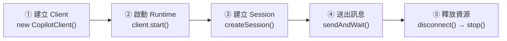

# Day 03 - 快速上手：建立第一個 GitHub Copilot Agent 應用

掌握 GitHub Copilot SDK 的定位與整體架構後，下一步就是把這些概念真正放進程式中。前一篇已經知道應用程式會透過 SDK 操作 Copilot Agent Runtime，接下來要實際確認 Runtime 如何啟動、Session 如何建立，以及一則訊息如何完成最基本的互動流程。

我們先從一個最小可執行的 Copilot Agent 應用開始，實際驗證應用程式如何接入 Agent Runtime，並建立後續實作會持續沿用的基本執行路徑。

## 準備執行環境

接下來的範例使用 Node.js 與 TypeScript。在開始建立專案前，先確認目前的 GitHub 帳號具備可用的 [GitHub Copilot](https://github.com/features/copilot) 權限，並確認本機已安裝符合需求的 Node.js。

GitHub Copilot Free 目前也可以嘗試基本的 CLI 與 Agent 功能；如果希望降低額度與功能限制對後續實作的影響，可以使用 [GitHub Copilot Pro](https://github.com/features/copilot/plans)，或使用組織提供的 Business / Enterprise 方案。實際可用的能力與額度，仍會依目前使用的方案與組織政策而有所不同。

| NOTE: |
| :--- |
| GitHub Copilot SDK 也支援 BYOK（Bring Your Own Key），可以使用自有的模型提供者與認證資訊，因此不一定需要 GitHub Copilot 訂閱。本系列仍以 GitHub Copilot 作為主要範例基礎，後續介紹 BYOK 時會再完整說明這種模型存取方式。 |

確認帳號條件後，接著檢查本機的 Node.js 執行環境。GitHub Copilot SDK 的 Node.js 範例以 Node.js 20 以上為基礎，先確認版本符合需求，可以避免後續在安裝套件或啟動 Runtime 時遇到不必要的相容性問題。

可以透過以下指令查看目前的 Node.js 版本：

```bash
$ node --version
```

請確認 Node.js 版本為 20 以上。

| TIP: |
| :--- |
| 可以使用 [nvm](https://github.com/nvm-sh/nvm)（Node Version Manager）管理 Node.js 版本。nvm 能在同一台電腦中安裝多個 Node.js 版本，並依照不同專案切換。Windows 使用者則可參考社群維護的 [nvm-windows](https://github.com/coreybutler/nvm-windows)。 |

確認 GitHub Copilot 與 Node.js 都符合前置條件後，就可以開始建立第一個範例專案。

## 實作：建立第一個 Copilot Agent 應用

這個專案的目的，是用盡可能少的設定，準備一個可以驗證 Runtime 連線與訊息互動流程的執行環境。

### 建立專案環境

先建立專案目錄並進入該資料夾：

```bash
$ mkdir copilot-sdk-first-agent-app
$ cd copilot-sdk-first-agent-app
```

接著初始化 Node.js 專案，並設定使用 ES Modules（ESM）：

```bash
$ npm init -y --init-type module
```

這個指令會建立 `package.json`，並將 `"type": "module"` 一併寫入設定，讓專案直接採用 ESM 格式。後續就可以直接使用 `import` 語法，不需要再額外調整模組設定。

接著安裝範例需要的套件：

```bash
$ npm install @github/copilot-sdk tsx
```

這裡會使用兩個套件：

* `@github/copilot-sdk`：提供 Client、Session 與事件等應用層介面，並負責與 Copilot Agent Runtime 溝通。
* `tsx`：讓 Node.js 可以直接執行 TypeScript 檔案。

Node.js SDK 安裝時會自動帶入相容版本的 Copilot CLI，因此不需要另外全域安裝 CLI；使用 `tsx` 後，也不需要先透過 `tsc` 編譯 TypeScript，就能直接執行程式，讓第一個範例可以把焦點放在 SDK 的互動模型上。

| NOTE: |
| :--- |
| `tsx` 主要負責轉譯與執行 TypeScript，無法取代型別檢查。正式專案仍建議另外設定 `tsc` 或其他對應的型別檢查流程。 |

### 確認 Copilot CLI 與 GitHub 登入

套件安裝完成後，可以先確認 Copilot CLI 能否正常啟動：

```bash
$ npx copilot --version
```

如果尚未登入，可以啟動 Copilot CLI：

```bash
$ npx copilot
```

進入互動介面後，輸入 `/login`，再依照畫面提示完成 GitHub 登入。完成登入後，Copilot CLI 會保存目前使用者的認證資訊，SDK 預設會沿用目前已登入使用者的認證，因此後面的 `CopilotClient` 不需要另外傳入 GitHub Token。

先確認 Copilot CLI 能正常啟動並完成登入，也有助於後續 Runtime 啟動失敗時，判斷問題來自 Copilot 執行環境，還是 SDK 與應用程式的整合流程。

### 建立應用程式

確認專案環境與 Copilot CLI 都能正常使用後，在專案目錄中建立 `index.ts`。這段程式碼會依序啟動 Runtime、建立 Session、送出訊息並取得回應：

```ts
import { CopilotClient } from "@github/copilot-sdk";

const client = new CopilotClient();
await client.start();

const session = await client.createSession({
  model: "auto",
});

const response = await session.sendAndWait({
  prompt: "請用一句話介紹 GitHub Copilot SDK。",
});

console.log(response?.data.content);

await session.disconnect();
await client.stop();
```

這段程式會先建立 Client 並啟動 Runtime，接著建立 Session、送出訊息並取得回應，最後釋放相關資源，完成一次最基本的 Agent 互動流程。

### 執行應用程式

完成 `index.ts` 後，透過以下指令執行程式：

```bash
$ npx tsx index.ts
```

如果環境設定正確，終端機會顯示一段由模型產生的回應。這代表應用程式已經完成 SDK 初始化、連接 Copilot Agent Runtime、建立 Session、送出訊息與取得結果，整條基本執行路徑都能正常運作。

## 理解基本執行流程

前面的程式可以依照執行順序拆成 Client 建立、Runtime 啟動、Session 建立、訊息互動與資源釋放幾個步驟：



這條流程先建立應用程式操作 Runtime 的入口，再建立 Session 完成一次訊息互動，最後釋放相關資源。接下來分別拆解每個步驟在 SDK 中負責的工作。

### 建立 Client：準備 Runtime 操作入口

```ts
const client = new CopilotClient();
```

`CopilotClient` 是應用程式接入 Copilot Agent Runtime 的主要入口。

建立物件時，底層 Runtime 尚未啟動，也還沒有建立任何 Session。這一步先在應用程式中準備好 Client，後續再透過它管理 Runtime 連線與 Session。

前面已經透過 Copilot CLI 完成登入，因此這裡不需要另外提供 Token。預設情況下，Client 會沿用目前已登入使用者的認證資訊。

### 啟動 Runtime：建立 CLI 連線

```ts
await client.start();
```

這個範例使用 `CopilotClient` 的預設連線模式。呼叫 `start()` 後，Node.js SDK 會啟動套件內附的 Copilot CLI，並透過 stdio 建立 JSON-RPC 連線。後續建立 Session、送出訊息與接收事件，都會經由這條連線完成。

| NOTE: |
| :--- |
| 目前的 Node.js SDK 在建立或恢復 Session 時會確保 Client 已經啟動，因此省略 `client.start()` 也可以直接建立 Session。這個範例仍保留 `await client.start()`，是為了明確呈現 Runtime 啟動與連線的步驟。 |

### 建立 Session：開始互動工作階段

```ts
const session = await client.createSession({
  model: "auto",
});
```

Session 是 Copilot SDK 管理互動的基本單位。即使這個範例只送出一則訊息，同一個 Session 後續仍可繼續接收新的輸入，讓 Runtime 延續目前工作階段的狀態。

這裡只指定 `model: "auto"`，由 Copilot 自動選擇適合的模型，讓範例聚焦在 Session 的建立與訊息互動流程。

### 送出訊息：等待本輪互動完成

```ts
const response = await session.sendAndWait({
  prompt: "請用一句話介紹 GitHub Copilot SDK。",
});
```

呼叫 `sendAndWait()` 後，SDK 會將訊息送入 Session，並等待 Session 回到 `session.idle`。這表示 Runtime 已經停止目前這輪處理，Session 再次進入可以接受後續訊息的狀態。

完成後，`sendAndWait()` 會回傳這段執行期間最後收到的 Assistant 訊息；如果沒有收到 Assistant 訊息，則可能取得 `undefined`。範例再從中取得回應內容：

```ts
response?.data.content
```

應用程式也就完成了一次最基本的 Session 訊息互動。

### 釋放資源：結束 Session 與 Runtime 連線

```ts
await session.disconnect();
await client.stop();
```

完成訊息互動後，先呼叫 `session.disconnect()` 結束目前 Session 物件的使用並釋放相關執行期資源，再透過 `client.stop()` 關閉 Runtime 連線並釋放 Client 相關資源，完成程式結束前的清理。

到目前為止，Client 建立、Runtime 啟動、Session 互動與資源清理都已經實際跑過一遍，也完成了第一個 Copilot Agent 應用最基本的執行流程。

## 小結

透過這個最小範例，我們完成了第一個可以實際執行的 Copilot Agent 應用，並建立應用程式透過 SDK 接入 Copilot Agent Runtime、建立 Session、送出訊息與取得回應的基本執行流程：

* `CopilotClient` 是應用程式接入 Agent Runtime 的入口，負責啟動 Runtime 並管理 Session。
* Session 承載一段工作階段，讓 Runtime 可以在其中處理訊息並延續互動狀態。
* `sendAndWait()` 會送出訊息並等待 Session 回到 `session.idle`，再取得這段執行最後收到的 Assistant 訊息。
* `session.disconnect()` 與 `client.stop()` 用來完成 Session 與 Runtime 的資源清理。

Client、Runtime 與 Session 到這裡已經形成一條可以實際驗證的執行路徑，也建立了 GitHub Copilot SDK 應用程式最基本的互動架構。
