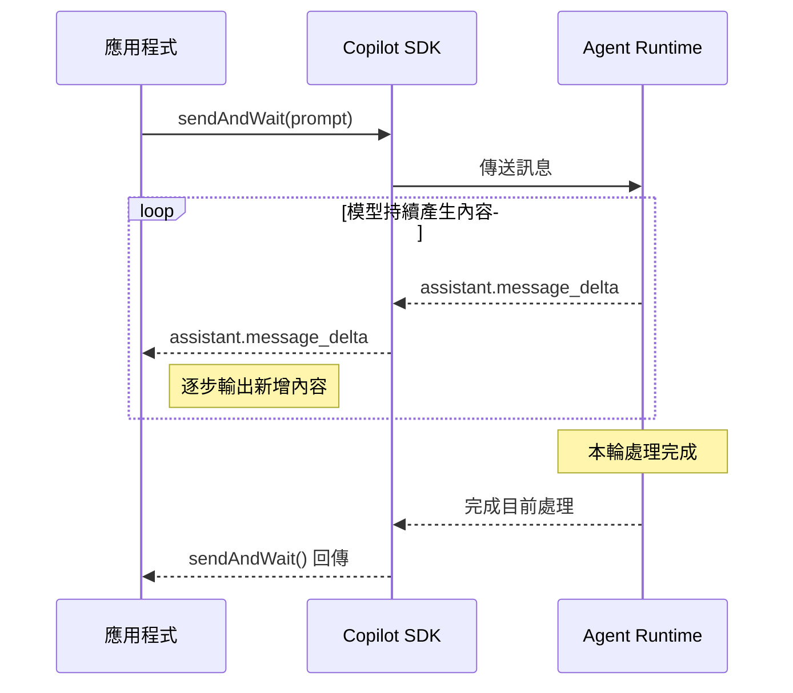

# Day 04 - Streaming 實作：逐步輸出 Copilot 回應

前一篇已經完成第一個可以執行的 Copilot Agent 應用，讓應用程式能夠建立工作階段、送出訊息並取得回應。對短內容來說，等待整輪處理完成後再顯示結果通常不會有太大影響；但當模型需要產生較長的回答時，使用者就必須等到整段內容完成後，才能看到回應。

當回應時間拉長，這種互動方式的限制也會逐漸明顯。應用程式如果只能在整輪處理完成後取得內容，生成期間就沒有新的文字可以更新，使用者也無法提早看到已經產生的回應。要改善這種互動體驗，就需要讓應用程式在回應尚未完成時，也能取得模型已經產生的內容。

## 等待完整回應會遇到什麼限制？

前一篇使用 `sendAndWait()` 完成最基本的訊息互動。應用程式送出 Prompt 後，會等待 Session 完成本輪處理，再取得最後的回應。這種流程很單純，但回應時間拉長後，也會開始出現幾個限制：

* **首批內容較晚出現**：即使模型已經開始產生回應，使用者仍要等整輪處理完成後，才能看到第一批內容。
* **生成期間無法更新**：在完整回應形成前，介面沒有新的文字可以呈現，無法隨著模型生成持續更新內容。
* **長篇回應等待明顯**：回應內容越長，從送出訊息到完整結果出現之間的等待也會越明顯。

GitHub Copilot SDK 支援 Streaming。應用程式可以在模型生成期間持續取得新增的文字，並隨著內容產生逐步更新介面，不需要等完整回應形成後才開始顯示。

Streaming 改變的是內容取得與呈現的時機，不代表模型完成整段回答所需的時間一定會縮短。應用程式可以更早取得第一批內容，再隨著後續生成持續更新畫面。

## Streaming 的運作方式

GitHub Copilot SDK 的 Streaming 透過 Session 事件提供。建立 Session 時啟用 Streaming 後，Agent Runtime 會在模型產生回應期間持續產生 `assistant.message_delta`，再透過 Copilot SDK 將這些事件交給應用程式。

每個 `assistant.message_delta` 都包含一段新產生的文字。應用程式可以依照事件到達的順序，將這些內容逐步接到目前已經收到的回應後面。

整個過程可以用訊息發生的時間順序來理解：



應用程式送出訊息後，仍然可以等待本輪處理完成。在等待期間，只要模型持續產生文字，Agent Runtime 就會陸續產生 `assistant.message_delta`，再由 Copilot SDK 將事件交給應用程式，讓已經生成的內容可以先被處理。

每次收到的內容都是新增的文字片段。假設模型最後產生：

```text
GitHub Copilot SDK 可以讓應用程式接入 Agent Runtime。
```

實際收到的片段可能依序是 `"GitHub"`、`" Copilot"`、`" SDK"`、`" 可以讓"`、`" 應用程式"`、`" 接入"`、`" Agent Runtime。"`。

實際切分方式會受到模型與 Runtime 執行情況影響，應用程式不應假設每個增量片段對應一個單字、Token 或固定長度。處理時只需要按照收到的順序，持續將每個增量片段接到既有內容後面。

啟用 Streaming 後，Agent Runtime 仍然會形成完整訊息；生成期間則額外提供增量內容。應用程式可以在等待本輪執行完成的同時，持續處理已經產生的文字。

## 實作：逐步輸出 Copilot 回應

接下來沿用前一篇建立的專案，將原本等待完整結果的程式改成 Streaming 版本。

更新 `index.ts`：

```typescript
import { CopilotClient } from "@github/copilot-sdk";

const client = new CopilotClient();

const session = await client.createSession({
  model: "auto",
  streaming: true,
});

session.on("assistant.message_delta", (event) => {
  process.stdout.write(event.data.deltaContent);
});

await session.sendAndWait({
  prompt: "請用三點說明 GitHub Copilot SDK 適合哪些 Agent 應用情境。",
});

process.stdout.write("\n");

await session.disconnect();
await client.stop();
```

和前一篇相比，Client、Session 與 `sendAndWait()` 的基本互動方式都沒有改變。這次增加的內容集中在兩個地方：建立 Session 時啟用 Streaming，以及監聽 `assistant.message_delta`，將收到的文字片段逐步輸出到終端機。

### 啟用 Streaming

建立 Session 時加入：

```typescript
const session = await client.createSession({
  model: "auto",
  streaming: true,
});
```

目前 Node.js SDK 的 `streaming` 預設為 `false`。設定為 `true` 後，Session 會在模型產生回應期間提供增量事件，這次使用的是 `assistant.message_delta`。

Streaming 屬於 Session 層級的設定，因此同一個 Session 後續送出的訊息都可以使用這項能力，不需要在每次呼叫 `sendAndWait()` 時重新指定。

### 接收增量內容

Session 啟用 Streaming 後，接著訂閱 `assistant.message_delta`：

```typescript
session.on("assistant.message_delta", (event) => {
  process.stdout.write(event.data.deltaContent);
});
```

`event.data.deltaContent` 是這次新增的文字片段。應用程式按照收到的順序接續輸出，就能逐步組成完整回應，不需要自行處理片段的切分或補上空白。

範例使用 `process.stdout.write()`，因為它不會自動換行，可以讓每次收到的文字片段直接接續前面的內容。若改用 `console.log()`，每個片段都會各自換行，反而會打斷原本連續的回應。

### 等待本輪互動完成

加入 Streaming 後，仍然可以使用原本的方式送出訊息：

```typescript
await session.sendAndWait({
  prompt: "請用三點說明 GitHub Copilot SDK 適合哪些 Agent 應用情境。",
});
```

`assistant.message_delta` 提供模型生成期間的增量內容，只要新的文字持續產生，事件 Handler 就會逐步更新終端機。

`sendAndWait()` 則持續等待目前這輪 Session 處理完成。呼叫端雖然正在等待，先前註冊的事件 Handler 仍會隨著 Agent Runtime 送出的增量事件執行，因此終端機可以在整輪處理結束前持續顯示回應。

等 `sendAndWait()` 完成後，範例再補上一個換行：

```typescript
process.stdout.write("\n");
```

這樣下一段終端機輸出就不會直接接在模型回應後面，也不需要為了這個需求另外監聽 Session 狀態事件。

### 執行應用程式

完成程式後，使用 `tsx` 執行：

```bash
$ npx tsx index.ts
```

執行後，回應會隨著模型持續產生文字逐步出現在終端機，不必等完整內容產生後才一次顯示。

實際回答內容、生成速度與每個增量片段的大小都可能不同。這個範例主要確認 Streaming 的輸出行為：在 `sendAndWait()` 尚未完成前，終端機已經可以持續看到模型新產生的內容。

如果移除 `streaming: true`，Session 就不會提供這個範例使用的 `assistant.message_delta` 增量輸出，應用程式也無法透過這個事件逐步取得模型產生的文字。

## 小結

Streaming 讓應用程式可以在模型產生回應期間持續取得增量內容，不必等整段文字形成後才第一次更新畫面：

* 建立 Session 時設定 `streaming: true`，就能啟用這個 Session 的 Streaming 能力，後續送入同一個 Session 的訊息都可以取得增量輸出。
* 透過 `session.on("assistant.message_delta", ...)` 訂閱增量事件，並從 `event.data.deltaContent` 取得每次新增的文字片段，再依照事件到達順序接續處理。
* Streaming 提供生成期間的增量內容，`sendAndWait()` 則可以用來等待目前這輪 Session 處理完成。
* 每個增量片段只代表這次新增的內容，實際切分方式不固定，不需要將每個片段視為獨立回應，也不應假設它對應固定的 Token、單字或長度。

完成這項調整後，Agent 應用在等待整輪處理完成的同時，也能隨著模型生成逐步呈現回應，讓使用者更早看到已經產生的內容。
