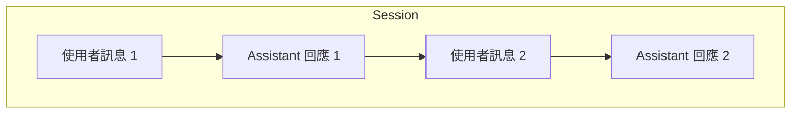

# Day 05 - Session：延續互動與工作脈絡

在最基本的 Agent 互動中，應用程式可以送出訊息、等待回應，也可以在回應產生期間逐步取得內容。這些能力足以處理單輪互動，但只要使用者開始追問、補充條件，或要求繼續處理前面的結果，新的輸入就可能需要依賴先前已經建立的內容。

當互動開始具有前後關係，應用程式就需要知道哪些內容應該延續、哪些資訊需要帶入後續處理，以及彼此無關的工作要如何分開。這些問題會直接影響多輪互動是否能維持連續，也決定一段工作脈絡應該如何被管理。

## 多輪對話如何延續前面的內容？

使用者在連續互動時，通常不會每一輪都重新描述完整需求。前面的問題、已經確認的條件，以及 Agent 剛剛產生的結果，都可能成為理解下一則訊息所需要的上下文。新的輸入因此常常只補充變化的地方，甚至只用一句很短的追問延續前面的語意。

如果後續處理只能看到目前這一則輸入，就可能缺少理解問題需要的資訊。多輪互動要能自然延續，關鍵就在於讓後面的訊息仍然能使用前面已經建立的對話內容。

假設使用者先問：

```text
台灣最高的山是哪一座？
```

模型回答玉山後，接著又問：

```text
那日本呢？
```

第二句沒有重新說明問題，只延續了前一輪的語意。要正確理解這句話，就需要知道前面正在討論「最高的山」，才能判斷使用者想問的是日本最高的山。

使用常見的 message-based 模型 API 建立這類多輪互動時，應用程式通常需要保存先前的訊息，並在下一次模型呼叫時一起帶入。例如：

```typescript
const messages = [
  {
    role: "user",
    content: "台灣最高的山是哪一座？",
  },
  {
    role: "assistant",
    content: "台灣最高的山是玉山。",
  },
  {
    role: "user",
    content: "那日本呢？",
  },
];
```

模型取得前面的對話內容後，就能知道目前正在討論「最高的山」，進一步理解「那日本呢？」所延續的問題。

這種延續前文的效果，在一些 LLM 或 Agent 應用中也會被稱為短期記憶。從應用程式的實作來看，通常需要保存與目前對話相關的訊息，並在後續模型呼叫時帶入必要的上下文。模型能理解哪些前文，也取決於每次呼叫實際取得的內容。

互動持續增加後，應用程式還需要進一步區分不同工作的上下文。如果所有歷史都持續累積在一起，彼此無關的內容也可能進入後續處理；如果每次都建立新的上下文，又無法自然延續前面的工作。

GitHub Copilot SDK 以 **Session** 作為一段持續工作的範圍。建立 Session 後，Copilot Agent Runtime 會在同一個工作階段中維護對話歷史與相關狀態，讓後續訊息可以延續已經累積的工作脈絡。

## Session 承載的工作脈絡

多輪互動要能持續延伸，需要先有一個範圍把前後相關的內容放在一起。建立 Session 後，應用程式可以持續將屬於同一段工作的訊息送進這個工作階段，讓後續處理沿用先前已經建立的內容。

Session 內前後互動的關係，可以表示如下：



一個 Session 可以包含多次前後相關的互動。對話歷史是目前最容易觀察到的部分，但 Session 並不只是一份由應用程式自行維護的訊息陣列。Agent Runtime 會以 Session 為工作範圍維護對話與執行需要的相關狀態，讓後續訊息可以接續原本的工作脈絡。

這和直接使用常見的 message-based 模型 API 有一項重要差異。採用這類模型 API 時，應用程式通常需要自行保存歷史訊息，並決定下一次模型呼叫要重新帶入哪些內容；使用 GitHub Copilot SDK 後，應用程式主要需要決定的是哪些互動屬於同一段工作，再將它們持續送進同一個 Session。

因此，Session 也讓應用程式與 Agent Runtime 的分工更清楚。應用程式決定哪些互動應該歸在同一段工作，Agent Runtime 則在對應的 Session 中維護執行所需的工作脈絡。只要後續互動仍然依賴前面的內容，就可以繼續沿用目前的 Session。

## 實作：讓 Session 延續前面的工作

前面的概念說明了 Session 如何承接一段持續進行的互動，接下來可以直接透過一組最小範例觀察這個行為。範例只保留兩則具有明確前後關係的訊息，確認後面的輸入是否能沿用同一個 Session 中已經建立的內容。

沿用前面建立的專案，更新 `index.ts`：

```typescript
import { CopilotClient } from "@github/copilot-sdk";

const client = new CopilotClient();

const session = await client.createSession({
  model: "auto",
});

console.log(`Session: ${session.sessionId}`);

const firstResponse = await session.sendAndWait({
  prompt: "台灣最高的山是哪一座？請簡短回答。",
});

console.log("\n第一次回應：");
console.log(firstResponse?.data.content);

const secondResponse = await session.sendAndWait({
  prompt: "那日本呢？",
});

console.log("\n第二次回應：");
console.log(secondResponse?.data.content);

await session.disconnect();
await client.stop();
```

這段程式只建立一次 Session，再依序送入兩則訊息。第一則先建立「最高的山」這個對話脈絡，等這一輪處理停止後，再透過相同的 Session 送出第二則訊息。第二則只問「那日本呢？」，沒有重新說明完整問題。

### 延續同一個 Session

程式先透過 `createSession()` 建立 Session，後面的兩次 `sendAndWait()` 都使用同一個 `session`：

```typescript
const session = await client.createSession({
  model: "auto",
});
```

`session.sessionId` 可以取得目前 Session 的識別碼。這裡將它輸出到終端機，方便確認目前操作的是哪一個工作階段：

```typescript
console.log(`Session: ${session.sessionId}`);
```

第一則訊息先建立「最高的山」這個對話脈絡。`sendAndWait()` 會等待目前這輪處理停止，再繼續執行後面的程式：

```typescript
const firstResponse = await session.sendAndWait({
  prompt: "台灣最高的山是哪一座？請簡短回答。",
});
```

第一輪處理完成後，再直接在相同的 Session 中送出第二則訊息：

```typescript
const secondResponse = await session.sendAndWait({
  prompt: "那日本呢？",
});
```

應用程式不需要另外建立 `messages` 陣列維護對話歷史，也不用在第二次呼叫時重新帶入第一則問題與回答。因為兩則訊息都位於相同的 Session，Agent Runtime 可以沿用前面已經累積的對話脈絡，理解「那日本呢？」延續的是最高的山這個問題。

如果第二則訊息改送到新的 Session，就不會具備前面的對話內容。多輪互動要持續延續，應用程式只需要將前後相關的訊息送進同一個 Session，後續的工作脈絡則由 Agent Runtime 持續維護。

### 執行應用程式

完成 `index.ts` 後，透過以下指令執行：

```bash
$ npx tsx index.ts
```

執行後可能看到類似以下結果：

```text
Session: <session-id>

第一次回應：
台灣最高的山是玉山。

第二次回應：
日本最高的山是富士山。
```

實際的 Session ID 與回答文字會依執行結果而不同。第二則訊息雖然沒有重新說明完整問題，仍能沿用同一個 Session 中的前文，理解目前詢問的是日本最高的山。

## Session 的工作邊界

Session 可以延續工作脈絡，但同一位使用者的所有要求不需要全部放進同一個 Session。應用程式需要判斷的是，後續工作是否仍然依賴目前已經累積的上下文。需要沿用前面內容時，可以繼續使用原本的 Session；如果工作已經彼此獨立，就適合另外建立新的 Session。

例如，使用者正在分析某個 API 的錯誤處理方式，接著要求針對剛才發現的問題提出修正建議，後面的工作明顯需要前面的分析結果，適合沿用原本的 Session。如果接下來改為規劃另一個前端專案的測試策略，新工作已經不依賴原本的內容，就可以另外建立 Session。

實務上，可以從幾個方向判斷：

* **延續前面的結果**：追問、補充條件、要求調整或進一步處理既有結果，適合沿用原本的 Session。
* **仍在完成同一項工作**：即使經過多次互動，只要主要目標沒有改變，就可以繼續留在目前 Session。
* **開始新的獨立任務**：新的要求不需要先前內容就能完整理解，通常適合建立另一個 Session。

同一位使用者可以同時擁有多個 Session，每個 Session 分別承載自己的工作脈絡。只要後續輸入仍然依賴目前工作的內容，就不需要因為收到下一則訊息而另外建立 Session。

透過明確的 Session 劃分，前後相關的互動可以持續沿用原本的工作脈絡，彼此獨立的任務也能分開管理。

## 小結

Session 讓前後相關的互動維持在同一個工作階段中，後續訊息可以沿用已經累積的對話與工作脈絡，不需要由應用程式在每次互動時重新組合完整的對話歷史：

* `CopilotSession` 承載一段持續進行的工作，前後相關的訊息可以持續送入同一個 Session。
* Agent Runtime 會在 Session 中維護對話與相關狀態，讓後續互動延續既有的工作脈絡。
* Session 的劃分應依照工作是否需要共享上下文判斷，彼此獨立的任務適合使用不同 Session。

應用程式決定哪些互動應該放在同一個 Session，Agent Runtime 則持續維護其中的工作脈絡。適當劃分 Session，可以讓多輪互動保持連續，也避免彼此無關的工作累積在同一個工作階段。
