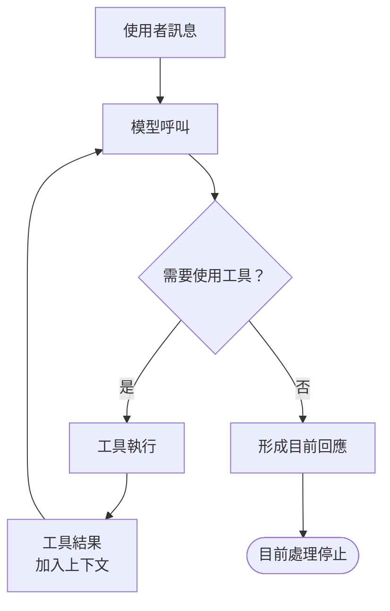
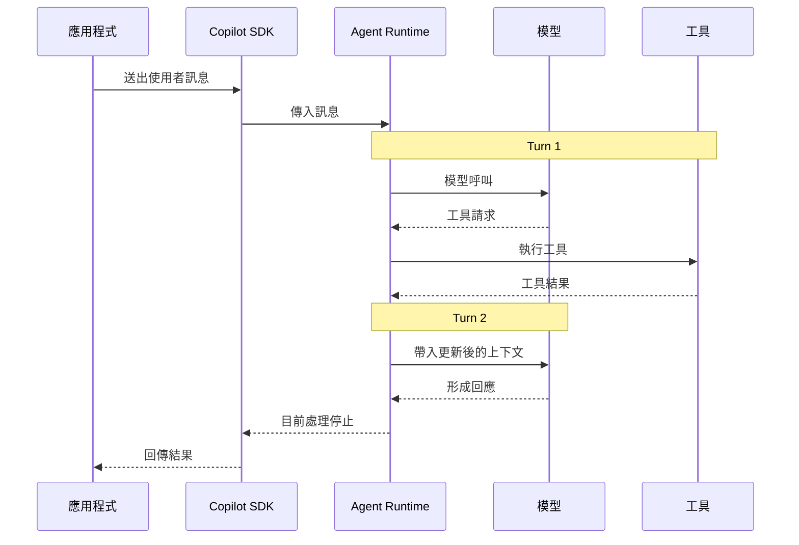

# Day 06 - 理解 Agent Loop：Turn、工具呼叫與完成訊號

Session 讓具有前後關係的互動可以維持在同一個工作階段中，後續訊息也能延續已經累積的對話與工作脈絡。不過，當應用程式送出一則訊息後，Agent 不一定只呼叫模型一次。任務如果需要取得檔案、搜尋資訊或執行工具，模型可能根據每次取得的新結果持續判斷下一步，直到目前的處理結束。

這段持續推進工作的執行機制，就是 **Agent Loop**。要理解 Copilot Agent Runtime 如何處理一則訊息，就需要進一步掌握模型呼叫、工具執行與結果回傳如何彼此銜接，以及 Runtime 如何判斷目前的處理已經停止。

## 一則訊息如何進入 Agent Loop

從應用程式的角度來看，Agent Loop 並不是一段需要自行建立的控制流程。應用程式只需要把使用者訊息送進 Session，後續的模型呼叫、工具執行與判斷，會由 Agent Runtime 持續推進。

前面的範例已經透過 `sendAndWait()` 將訊息送入 Session，並等待目前這次處理停止。從應用程式的呼叫方式來看，可以先從這個方法觀察整段互動：

```typescript
const response = await session.sendAndWait({
  prompt: "請分析目前的系統設計。",
});
```

訊息進入 Agent Runtime 後，如果模型需要取得目前上下文中沒有的資訊，就可能進一步提出工具請求，再根據工具取得的結果繼續處理。

Copilot SDK 會將應用程式的操作傳給 Copilot CLI，由 CLI 承載 Agent Runtime 並推進 Agent Loop。每次模型呼叫都會帶入目前累積的上下文；如果資訊不足，模型可以提出工具請求，Runtime 完成工具執行後，再將結果加入上下文進行後續模型呼叫。

一則訊息進入 Agent Loop 後的基本執行流程，可以表示如下：



這張圖呈現 Agent Loop 的基本循環。模型會根據目前上下文判斷下一步，需要額外資訊時就提出工具請求；工具執行結果加入上下文後，再交由模型繼續判斷。這個流程會持續到模型不再要求新的工具，並形成目前的回應，這段處理才會停止。

整個循環由 Copilot CLI 負責推進，Copilot SDK 則提供應用程式操作 Runtime 與接收執行事件所需要的介面。應用程式不需要自行控制模型與工具之間的往返。

## Turn：Agent Loop 的基本執行單位

Agent Loop 可能反覆呼叫模型，而 **Turn** 是理解這段執行流程的基本單位。一個 Turn 對應一次 LLM API 呼叫，以及這次回應直接引發的後續處理。Agent Runtime 會將目前累積的上下文送給模型；如果模型回應中包含工具請求，Runtime 會先完成相關工具執行，才結束這個 Turn。

工具執行結果通常會成為下一個 Turn 的輸入，讓模型根據更新後的上下文繼續判斷。以需要讀取檔案才能回答的情境為例，執行順序可以表示成：



第一個 Turn 中，模型發現目前資訊不足，因此提出工具請求；Agent Runtime 完成工具執行後，取得的結果會加入目前累積的上下文，成為後續模型呼叫可以使用的資訊。第二個 Turn 再根據這些新資訊進行判斷，如果不需要其他工具，就可以形成目前的回答。

每一次模型呼叫都會取得目前累積的上下文，其中包含先前的工具呼叫與結果，因此 Agent 可以隨著執行過程取得的新資訊持續判斷下一步。

這也代表使用者訊息、Turn 與 Session 分別位在不同的執行層級：

* **使用者訊息**：應用程式送入 Session 的一則使用者輸入。
* **Turn**：Agent Loop 中的一次 LLM API 呼叫，以及該次回應直接引發的後續處理。
* **Session**：一段持續存在的工作階段，可以包含多次前後相關的使用者互動。

因此，一個 Session 可以包含多則使用者訊息，而一則使用者訊息可能只需要一個 Turn，也可能經過多個 Turn。如果完成工作所需的資訊已經包含在目前上下文中，例如將一段既有文字整理成一句話，模型可能直接形成回答；需要讀取檔案、搜尋資訊或執行其他工具的任務，則可能在取得新結果後繼續進入後續 Turn。

從這段流程也可以看出各個元件的分工：

* **應用程式**：送出使用者訊息，決定 Session 可以使用哪些能力，並管理自己的資料、權限與業務政策。
* **Copilot SDK**：提供應用程式操作 Agent Runtime 的介面，並負責操作與執行事件的傳遞。
* **Agent Runtime**：推進 Agent Loop、協調模型與工具之間的執行，並將工具結果帶入後續模型呼叫。
* **模型**：根據目前上下文判斷資訊是否足夠，以及是否需要使用工具。
* **工具**：執行實際的資料取得或操作，並將結果交回 Agent Runtime。

應用程式送出的是一則訊息，但這則訊息在 Agent Runtime 執行期間可能經過多個 Turn。把這些 Turn 與工具執行事件記錄下來，就能直接觀察 Agent Loop 實際經過多少次模型呼叫。

## 實作：觀察一則訊息經過多少個 Turn

理解 Turn 與工具呼叫的關係後，接下來用一個最小範例直接觀察 Agent Loop。

範例會準備一份固定內容的文字檔，並在 Prompt 中明確要求 Agent 先讀取檔案，再根據取得的內容回答。程式只監聽 Turn、工具執行與 Session 停止相關的必要事件，把觀察重點集中在一則使用者訊息如何經過模型呼叫、工具執行與後續 Turn。

### 準備專案與測試檔案

先建立專案：

```bash
$ mkdir copilot-sdk-agent-loop
$ cd copilot-sdk-agent-loop
$ npm init -y --init-type module
$ mkdir -p src fixtures
```

安裝 Copilot SDK 與 TypeScript 執行環境：

```bash
$ npm install @github/copilot-sdk
$ npm install --save-dev @types/node typescript tsx
```

接著建立 `fixtures/project-info.txt`：

```text
Project: Atlas-27
Runtime: Node.js 22
Database: PostgreSQL 17
Cache: Redis 8
Deployment: Kubernetes
```

這些資訊只存在於測試檔案中，不需要另外準備實際系統或連接外部服務。依照這個範例的要求，Agent 需要先取得檔案內容，再根據實際資料完成回答。

### 建立 Agent Loop 觀察程式

測試檔案準備完成後，建立 `src/index.ts`，觀察 Turn 與工具執行：

```typescript
import path from "node:path";
import { fileURLToPath } from "node:url";
import { CopilotClient, approveAll } from "@github/copilot-sdk";

const projectDirectory = path.resolve(
  path.dirname(fileURLToPath(import.meta.url)),
  "..",
);

let turnCount = 0;
let toolExecutionCount = 0;

const client = new CopilotClient();

const session = await client.createSession({
  model: "auto",
  workingDirectory: projectDirectory,
  availableTools: ["view"],
  onPermissionRequest: approveAll,
});

session.on("assistant.turn_start", (event) => {
  turnCount += 1;
  console.log(`[turn:${event.data.turnId}] start`);
});

session.on("assistant.turn_end", (event) => {
  console.log(`[turn:${event.data.turnId}] end`);
});

session.on("tool.execution_start", (event) => {
  toolExecutionCount += 1;
  console.log(`[tool:${event.data.toolCallId}] start name=${event.data.toolName}`);
});

session.on("tool.execution_complete", (event) => {
  console.log(
    `[tool:${event.data.toolCallId}] complete success=${event.data.success}`,
  );
});

session.on("session.idle", () => {
  console.log("[session] idle");
});

const response = await session.sendAndWait(
  {
    prompt:
      "請務必使用 view 工具讀取 fixtures/project-info.txt，" +
      "再根據檔案實際內容整理 Project、Runtime、Database、" +
      "Cache 與 Deployment；不要根據既有知識推測檔案內容。",
  },
  120_000,
);

console.log(`\nTurn 數量：${turnCount}`);
console.log(`工具執行次數：${toolExecutionCount}`);
console.log("\n模型回應：");
console.log(response?.data.content);

await session.disconnect();
await client.stop();
```

`sendAndWait()` 的第二個參數用來設定等待逾時時間，單位為毫秒。這裡設定為 `120_000`，也就是最多等待 120 秒，避免工具執行與後續 Turn 尚未完成就太早結束等待。

`workingDirectory: projectDirectory` 將目前 Session 的工作目錄設為專案根目錄，因此 Agent 使用 `view` 時，可以透過 `fixtures/project-info.txt` 這個相對路徑找到測試檔案。`availableTools: ["view"]` 則將模型可使用的工具限制為 Copilot CLI 內建的 `view`，避免其他工具介入目前範例。

範例另外使用 `approveAll` 直接批准需要的權限請求，讓觀察重點集中在 Agent Loop，而不另外引入互動式的權限確認流程。

| NOTE: |
| :--- |
| `approveAll` 只用來簡化隔離的測試範例，不適合作為正式應用程式的權限策略。實際使用時，仍應根據操作內容、使用者身分與資源權限決定是否允許執行。 |

### 記錄每一次 Turn

範例透過 `assistant.turn_start` 與 `assistant.turn_end` 觀察每個 Turn 的開始與結束：

```typescript
session.on("assistant.turn_start", (event) => {
  turnCount += 1;
  console.log(`[turn:${event.data.turnId}] start`);
});

session.on("assistant.turn_end", (event) => {
  console.log(`[turn:${event.data.turnId}] end`);
});
```

每一組 `assistant.turn_start` 與 `assistant.turn_end` 都對應一次實際的 LLM API 呼叫。Agent Runtime 不會另外產生未反映在 Turn 事件中的規劃、評估或完成檢查模型呼叫。

因此，只需要在 `assistant.turn_start` 發生時累加 `turnCount`，就能觀察這則使用者訊息實際經過多少次模型呼叫，不需要另外保存完整事件。

### 觀察工具如何介入執行

確認模型呼叫的 Turn 後，再利用 `tool.execution_start` 與 `tool.execution_complete` 觀察工具如何參與其中：

```typescript
session.on("tool.execution_start", (event) => {
  toolExecutionCount += 1;
  console.log(`[tool:${event.data.toolCallId}] start name=${event.data.toolName}`);
});

session.on("tool.execution_complete", (event) => {
  console.log(
    `[tool:${event.data.toolCallId}] complete success=${event.data.success}`,
  );
});
```

`tool.execution_start` 表示某次工具呼叫開始執行，可以取得 `toolCallId` 與 `toolName`；`tool.execution_complete` 則表示這次執行已經結束。透過相同的 `toolCallId` 可以對應前面的工具呼叫，`success` 則表示這次工具執行是否成功。

這個 Prompt 明確要求 Agent 使用 `view` 讀取 `project-info.txt`。工具執行完成後，取得的內容會提供給後續 Turn，讓模型根據更新後的上下文繼續判斷。因此，工具執行結束仍不代表整則使用者訊息已經處理完成。

### 等待 Agent Loop 停止

前面的 Turn 與工具執行都發生在同一次 `sendAndWait()` 期間。這個方法會等待 Session 進入 `session.idle`，因此即使第一個 Turn 已經結束，或 `view` 已經執行完成，只要 Agent Loop 還在推進，就會繼續等待。

如果 Session 在指定的 timeout 前進入 `session.idle`，`sendAndWait()` 會結束等待，並回傳這段期間最後收到的 Assistant 訊息；如果先到達 timeout，則會拋出錯誤，但不會中止仍在執行的 Agent 工作。

因此，一次 `sendAndWait()` 可以涵蓋多個 Turn 與工具執行。應用程式只需要送出一則訊息，後續流程由 Agent Runtime 持續推進。

### 執行應用程式

完成後執行：

```bash
$ npx tsx src/index.ts
```

如果 Agent 先使用 `view` 讀取測試檔案，再根據內容回答，可能看到類似：

```text
[turn:<turn-1>] start
[tool:<tool-call-id>] start name=view
[tool:<tool-call-id>] complete success=true
[turn:<turn-1>] end
[turn:<turn-2>] start
[turn:<turn-2>] end
[session] idle

Turn 數量：2
工具執行次數：1

模型回應：
Project: Atlas-27
Runtime: Node.js 22
Database: PostgreSQL 17
Cache: Redis 8
Deployment: Kubernetes
```

從這份輸出可以看到，第一個 Turn 觸發 `view` 讀取檔案，工具完成後再進入第二個 Turn，最後停止目前的處理。應用程式只送出一則使用者訊息，Agent Runtime 則根據工具取得的新資訊持續推進 Agent Loop。

| NOTE: |
| :--- |
| 上面的輸出只是一種可能結果。實際 Turn 數量、工具呼叫次數與模型回答會受到模型判斷與 Runtime 執行情況影響，因此不應把「固定兩個 Turn、一次 `view`」視為 Agent Loop 的保證。可以穩定依賴的是每一組 `assistant.turn_start` / `assistant.turn_end` 對應一次實際的 LLM API 呼叫，再透過執行期間收到的工具事件觀察工具如何參與其中。 |

## Agent Loop 如何停止與完成

前面的範例最後會收到 `session.idle`，表示目前的 Agent Loop 已經停止，Session 可以再次接受下一則訊息。`sendAndWait()` 也會等待這個事件，再結束目前這次等待。

Copilot SDK 另外提供 `session.task_complete`，用來表示 Agent 認為整體任務已經完成。兩個訊號關注的層級不同：

* **`session.idle`**：Agent Runtime 已停止目前的處理，可以接受下一則訊息。Agent Loop 結束時會產生這個事件。
* **`session.task_complete`**：Agent 認為整體任務已經完成，需要模型主動標記，因此一般互動中不一定會出現。

如果應用程式只需要判斷目前這次 Agent Loop 是否已經停止，可以依據 `session.idle`；如果還需要知道 Agent 是否認為整體任務已經完成，再另外處理 `session.task_complete`。

不過，Agent 對任務完成的判斷仍不能直接取代應用程式自己的成功條件。例如 Agent 表示程式修改已完成，如果應用程式要求測試必須通過、特定產物必須存在，仍然要根據實際結果判斷工作是否符合要求。Agent Runtime 負責推進工作並提供執行狀態，工作是否真正符合要求，仍由應用程式根據自己的條件判斷。

## 小結

理解一則使用者訊息在 Agent Runtime 中的執行流程後，可以看到 Agent Loop 如何透過模型呼叫與工具結果持續推進工作：

* Turn 對應一次 LLM API 呼叫，以及該次回應直接引發的後續處理；一則使用者訊息可以經過多個 Turn。
* 模型根據目前累積的上下文判斷是否需要工具，Agent Runtime 負責協調工具執行並將結果帶入後續 Turn；Copilot SDK 則提供應用程式操作與觀察 Runtime 的介面。
* `sendAndWait()` 會等待 Session 進入 `session.idle`，因此一次等待可以涵蓋多個 Turn 與工具執行；如果先到達 timeout，則只會結束等待，不會停止 Agent Runtime 中正在進行的工作。
* `session.idle` 描述目前的 Runtime 處理已停止，`session.task_complete` 則描述 Agent 對整體任務完成狀態的判斷；應用程式仍需保留自己的成功條件。

應用程式送入的是一則訊息，Agent Runtime 執行的可能是一段包含多個 Turn 與工具操作的工作流程。理解這層關係後，就能更準確地掌握 Agent Runtime 如何持續推進工作，以及 Runtime 停止與任務完成分別代表什麼。
