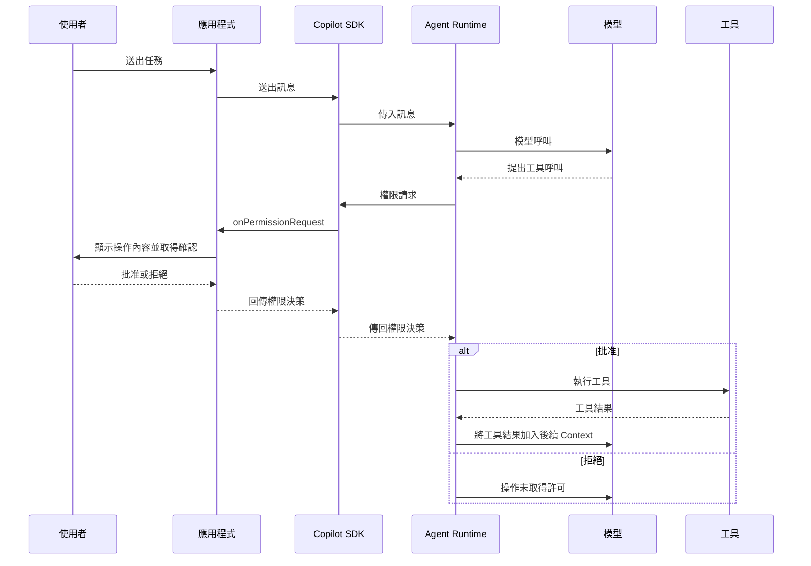

# Day 08 - 工具權限控制：決定 Agent 能否執行操作

透過 Session 事件追蹤 Agent 的執行過程後，應用程式已經可以知道模型何時提出工具請求，以及工具何時開始與完成。不過，看見 Agent 準備採取什麼操作，和允許它真正執行，仍然是兩件不同的事情。只要工具開始接觸檔案、執行 Shell 指令或呼叫外部服務，模型產生的工具呼叫就可能進一步影響實際系統狀態。

GitHub Copilot SDK 提供 **工具權限（Permission）機制**，讓需要確認的工具操作在真正執行前先取得許可。應用程式可以根據操作種類與實際內容決定是否批准，也可以將操作資訊交給使用者確認，讓模型提出的工具呼叫與實際執行之間保留明確的控制邊界。

## 為什麼工具執行前需要取得許可？

Agent Loop 會讓模型根據目前 Context 判斷下一步。如果資訊不足，模型可以提出工具請求；Agent Runtime 再協調對應的工具執行，將結果帶回後續 Turn。這套流程讓 Agent 能持續推進工作，但模型產生工具呼叫，只代表它判斷目前需要這項操作，不代表應用程式已經同意執行。

例如，同樣都是 Shell 操作，`pwd` 只會取得目前工作目錄，但其他指令可能刪除檔案、修改設定，甚至把資料送往外部服務。模型判斷目前需要使用工具，並不足以決定這項操作是否可以真正執行，應用程式仍然需要保留最後的控制權。

Permission 位在模型提出工具呼叫與工具真正執行之間。當 Agent Runtime 需要取得權限決策時，會提出權限請求，再根據回覆決定這次操作是否可以繼續。應用程式可以透過 `onPermissionRequest` 承接這項請求，再回傳批准或拒絕結果。

以需要權限確認的工具操作為例，整段互動可以表示如下：



和前面已經建立的 Agent Loop 相比，這裡多了一個工具執行前的確認步驟。模型仍然根據目前 Context 提出工具呼叫，Agent Runtime 也繼續負責協調執行；需要取得 Permission 時，應用程式則在工具真正執行前決定這次操作是否放行。

當操作可能修改檔案、執行指令或存取敏感資料時，應用程式可以先檢查實際內容，必要時再交給使用者確認。模型仍然可以提出下一步操作，但不會因為產生工具呼叫就直接影響實際系統。

## `onPermissionRequest`：決定工具操作是否放行

當 Agent Runtime 遇到需要確認的工具操作時，應用程式需要取得這次權限請求，再決定是否允許繼續執行。這項決策可以由應用程式依照固定規則自動判斷，也可以先將操作內容呈現給使用者，再根據確認結果回覆 Runtime。

建立或恢復 Session 時，可以透過 `onPermissionRequest` 註冊權限處理函式：

```typescript
const session = await client.createSession({
  model: "auto",
  onPermissionRequest: async (request) => {
    return { kind: "approve-once" };
  },
});
```

權限請求進入處理函式後，SDK 會提供 `PermissionRequest`。不同操作會透過 `kind` 區分，例如 Shell、檔案讀寫、MCP 與自訂工具等，因此應用程式應先確認請求種類，再讀取對應的操作資訊。

以 Shell 權限請求為例，擷取和目前情境直接相關的欄位後，可能會看到類似：

```typescript
{
  kind: "shell",
  intention: "取得目前工作目錄",
  fullCommandText: "pwd",
  warning: undefined,
  requestSandboxBypass: false,
}
```

`fullCommandText` 表示準備執行的完整指令，`intention` 描述這次操作的用途；如果 Agent Runtime 提供風險提示，可以從 `warning` 取得。`requestSandboxBypass` 則表示這次操作是否要求繞過 Sandbox 限制。

應用程式取得這些資訊後，就能根據實際操作內容決定是否允許執行，而不需要只根據「這是一筆 Shell 請求」做出判斷。

確認操作內容後，應用程式再回傳對應的權限決策。Node.js SDK 以 `PermissionRequestResult` 表示處理結果，目前主要的決策包括：

* **`approve-once`**：只批准目前這一次請求。
* **`approve-for-session`**：批准目前請求，並在目前 Session 記住對應的批准規則。
* **`approve-for-location`**：批准目前請求，並將指定規則保存到目前專案位置。
* **`approve-permanently`**：將 URL 網域的批准跨 Session 保存。
* **`reject`**：拒絕目前請求，可以透過 `feedback` 提供原因。
* **`user-not-available`**：目前沒有可以完成確認的使用者，因此無法取得許可。
* **`no-result`**：目前這個 SDK Client 不回覆這次請求，讓其他處理端有機會提供決策。

`approve-once` 只影響目前這一次操作，其他批准方式可能讓後續符合相同條件的請求不需要再次確認；依照批准範圍與請求種類，也可能需要提供額外的批准資訊。應用程式應依實際需求決定作用範圍，不宜只是為了減少確認次數而直接放大權限。

如果沒有提供 `onPermissionRequest`，權限請求不會因此自動批准，而會維持待處理狀態，等待其他可以處理這筆請求的使用端回覆。

| NOTE: |
| :--- |
| Permission 只決定目前的工具操作是否放行，不能取代應用程式授權。真正讀取產品資料、修改資源或呼叫內部服務時，應用程式或工具處理函式仍需要根據已驗證的使用者身分、租戶與資源權限判斷是否允許執行。Session ID、Prompt 與 Permission 決策都不能作為產品資源的存取權證明。 |

## 實作：建立工具權限確認流程

我們沿用前面建立的專案，要求 Agent 使用 Shell 取得目前工作目錄，並透過 `onPermissionRequest` 將實際指令交給使用者確認。`pwd` 只會取得目前工作目錄，適合在低副作用的情境下觀察完整的 Permission 流程。

更新 `src/index.ts`：

```typescript
import { stdin as input, stdout as output } from "node:process";
import { createInterface } from "node:readline/promises";
import {
  CopilotClient,
  type PermissionRequest,
  type PermissionRequestResult,
} from "@github/copilot-sdk";

async function handlePermissionRequest(
  request: PermissionRequest,
): Promise<PermissionRequestResult> {
  if (request.kind !== "shell") {
    return {
      kind: "reject",
      feedback: `這個範例只允許確認 Shell 操作，目前收到 ${request.kind}。`,
    };
  }

  if (request.requestSandboxBypass) {
    return {
      kind: "reject",
      feedback: "這個範例不允許繞過 Sandbox。",
    };
  }

  if (!input.isTTY || !output.isTTY) {
    return {
      kind: "user-not-available",
    };
  }

  const readline = createInterface({ input, output });

  const lines = [
    "",
    "Agent 要求執行 Shell 指令。",
    `用途：${request.intention}`,
    `指令：${request.fullCommandText}`,
  ];

  if (request.warning) {
    lines.push(`警告：${request.warning}`);
  }

  lines.push("是否允許這一次操作？(y/N)：");

  const answer = await readline.question(lines.join("\n"));
  readline.close();

  if (["y", "yes"].includes(answer.trim().toLowerCase())) {
    return {
      kind: "approve-once",
    };
  }

  return {
    kind: "reject",
    feedback: "使用者拒絕這次 Shell 操作。",
  };
}

const client = new CopilotClient();

const session = await client.createSession({
  model: "auto",
  onPermissionRequest: handlePermissionRequest,
});

session.on("permission.requested", (event) => {
  console.log(
    `[permission:${event.data.requestId}] ` +
      `requested kind=${event.data.permissionRequest.kind}`,
  );
});

session.on("permission.completed", (event) => {
  console.log(
    `[permission:${event.data.requestId}] ` +
      `completed result=${event.data.result.kind}`,
  );
});

session.on("tool.execution_start", (event) => {
  console.log(
    `[tool:${event.data.toolCallId}] start name=${event.data.toolName}`,
  );
});

session.on("tool.execution_complete", (event) => {
  console.log(
    `[tool:${event.data.toolCallId}] complete success=${event.data.success}`,
  );
});

const response = await session.sendAndWait(
  {
    prompt:
      "請務必使用 Shell 工具執行 `pwd`，" +
      "再根據實際結果回答目前工作目錄；" +
      "不要使用其他方式推測。" +
      "如果操作被拒絕，請直接說明無法取得結果，" +
      "不要再次提出相同的工具請求。",
  },
  120_000,
);

console.log("\n模型回應：");
console.log(response?.data.content ?? "沒有收到 Assistant 訊息。");

await session.disconnect();
await client.stop();
```

範例程式主要增加了三個部分。先建立 `handlePermissionRequest()` 處理權限請求，再透過 `onPermissionRequest` 將它接進 Session，最後利用 Permission 與工具事件觀察實際執行結果。接下來依序拆解這幾個部分。

### 建立權限處理函式

`handlePermissionRequest()` 會先確認目前收到的權限請求是否屬於 Shell：

```typescript
if (request.kind !== "shell") {
  return {
    kind: "reject",
    feedback: `這個範例只允許確認 Shell 操作，目前收到 ${request.kind}。`,
  };
}
```

`PermissionRequest` 可能隨 Agent Runtime 能力增加新的種類，因此處理邏輯只接受目前需要的 `shell`。沒有符合預期的請求直接拒絕，可以避免新的 Permission kind 在既有邏輯沒有明確處理時意外取得許可。

確認請求種類後，再檢查這次 Shell 操作是否要求繞過 Sandbox：

```typescript
if (request.requestSandboxBypass) {
  return {
    kind: "reject",
    feedback: "這個範例不允許繞過 Sandbox。",
  };
}
```

目前的操作情境沒有繞過 Sandbox 的需求，因此遇到這類請求時直接拒絕，不額外擴大工具可以影響的執行範圍。

接著確認應用程式是否執行在互動式終端機：

```typescript
if (!input.isTTY || !output.isTTY) {
  return {
    kind: "user-not-available",
  };
}
```

由於權限決策需要交給使用者確認，沒有 TTY 時就無法完成這次互動。此時回傳 `user-not-available`，明確表示目前無法取得使用者決策，而不會改成自動批准。

通過前面的檢查後，才進入實際的使用者確認流程。應用程式將 Agent Runtime 提供的用途與完整指令整理成提示內容：

```typescript
const lines = [
  "",
  "Agent 要求執行 Shell 指令。",
  `用途：${request.intention}`,
  `指令：${request.fullCommandText}`,
];

if (request.warning) {
  lines.push(`警告：${request.warning}`);
}
```

使用者看到的是目前實際準備執行的操作內容，而不只是一個抽象的 Shell 權限請求。如果 Agent Runtime 提供額外的風險提示，也會一併顯示，再由使用者決定這一次操作是否允許執行。

使用者輸入 `y` 或 `yes` 時，處理函式回傳：

```typescript
return {
  kind: "approve-once",
};
```

`approve-once` 只批准目前這一次權限請求，因此之後如果 Agent 再提出需要確認的 Shell 操作，仍會重新進入權限處理流程。

其他輸入則回傳：

```typescript
return {
  kind: "reject",
  feedback: "使用者拒絕這次 Shell 操作。",
};
```

`feedback` 可以將拒絕原因提供給 Agent，讓後續 Agent Loop 知道目前操作未被允許，再根據這個結果決定如何回應。

整個權限處理函式採用預設拒絕的方式。只有符合目前條件，而且取得使用者明確批准的 Shell 操作才會放行；新的請求種類或沒有處理到的情境，都不會因為既有規則沒有涵蓋而自動取得許可。

### 將權限處理接進 Session

權限處理函式建立完成後，在建立 Session 時指定給 `onPermissionRequest`：

```typescript
const session = await client.createSession({
  model: "auto",
  onPermissionRequest: handlePermissionRequest,
});
```

之後 Agent Runtime 遇到需要確認的操作，就能透過這個處理函式取得應用程式的決策。權限邏輯留在應用程式端，可以依照產品的互動方式與操作規則決定如何呈現與處理。

這裡透過 Prompt 明確要求 Agent 使用 Shell 執行 `pwd`，讓觀察焦點集中在權限流程。正式應用仍應依實際需求限制 Session 可使用的工具；工具設定負責控制 Agent 可以取得哪些能力，Permission 則負責處理需要確認的操作是否放行。

### 執行應用程式

完成後執行：

```bash
$ npx tsx src/index.ts
```

當 Agent 要執行 Shell 指令時，終端機會顯示類似：

```text
[permission:<request-id>] requested kind=shell

Agent 要求執行 Shell 指令。
用途：取得目前工作目錄
指令：pwd
是否允許這一次操作？(y/N)：
```

輸入 `y` 後，權限處理函式會回傳 `approve-once`。Agent Runtime 取得批准後，Shell 操作才會繼續執行，最後由模型根據實際結果回答目前工作目錄。

如果重新執行程式並直接按 Enter，處理函式則會回傳 `reject`，這次 Shell 操作不會執行，Agent 可以根據拒絕結果說明目前無法取得工作目錄。

## 透過 Permission 事件追蹤處理流程

前面的權限處理函式負責決定操作是否放行；Session 事件則提供另一個觀察角度，讓應用程式知道一筆權限請求何時產生，以及 Agent Runtime 最後形成什麼處理結果。

`permission.requested` 會提供 `requestId` 與完整的 `permissionRequest`：

```typescript
session.on("permission.requested", (event) => {
  console.log(
    event.data.requestId,
    event.data.permissionRequest.kind,
  );
});
```

其中 `requestId` 用來識別這一次權限請求。完成處理後，`permission.completed` 會使用相同的 `requestId`，並透過 `result` 描述最後形成的結果。因此，可以利用 `requestId` 配對同一次權限處理：

```text
permission.requested
        requestId=permission-1
        permissionRequest.kind=shell

應用程式權限處理函式
        decision=approve-once

permission.completed
        requestId=permission-1
        result.kind=approved
```

這裡需要區分處理函式回傳的 **決策** 與事件記錄的 **結果**。`approve-once` 表示應用程式決定只批准目前這次請求；`permission.completed` 中的 `result.kind` 則描述 Agent Runtime 完成這段權限處理後形成的結果。兩者位在同一條權限流程中，但分別描述應用程式做出的選擇與 Runtime 最後記錄的狀態。

如果權限請求和工具呼叫有關，`permission.requested` 中的 `permissionRequest.toolCallId` 還可以和 `tool.execution_start`、`tool.execution_complete` 使用的 `toolCallId` 建立關聯：

```text
permission.requested
        requestId=permission-1
        permissionRequest.toolCallId=call-1

permission.completed
        requestId=permission-1

tool.execution_start
        toolCallId=call-1

tool.execution_complete
        toolCallId=call-1
```

這樣就能分別利用兩組識別碼整理同一次工作。`requestId` 串接權限請求與完成結果，`toolCallId` 則連接這筆權限請求與對應的工具執行。事件關聯應以這些識別資訊為主，不需要只依賴事件出現的先後順序判斷。

| NOTE: |
| :--- |
| 若正式系統需要保存權限稽核紀錄，不建議直接記錄完整的權限請求。Shell、自訂工具或 MCP 請求可能包含指令、路徑、URL 或實際參數，可以只保留 `requestId`、必要的 `toolCallId`、請求種類、決策結果與時間，並依資料敏感度進行遮罩。 |

## 小結

Permission 讓應用程式可以在工具真正執行前取得權限決策，根據實際操作內容決定是否批准，並保留對真實系統操作的控制：

* `onPermissionRequest` 提供應用程式處理 `PermissionRequest` 的介面，可以根據請求種類與操作內容回傳對應的 `PermissionRequestResult`。
* `PermissionRequest` 會依 `kind` 提供不同資訊；以 Shell 權限請求為例，可以取得完整指令、操作用途、風險提示與是否要求繞過 Sandbox 等狀態。
* `approve-once` 只批准目前這次操作，其他批准方式則可能影響後續符合相同條件的請求，因此應依實際需求決定作用範圍。
* `permission.requested` 與 `permission.completed` 可以透過 `requestId` 配對；工具相關請求還可以利用 `permissionRequest.toolCallId` 與工具執行事件建立關聯。
* Permission 只決定工具操作是否可以繼續，產品資料與資源是否允許存取，仍然需要由應用程式自己的授權機制判斷。

在工具呼叫與實際執行之間加入權限確認後，模型仍然可以根據任務提出下一步操作，應用程式則保留是否允許這項操作真正執行的決定權。
