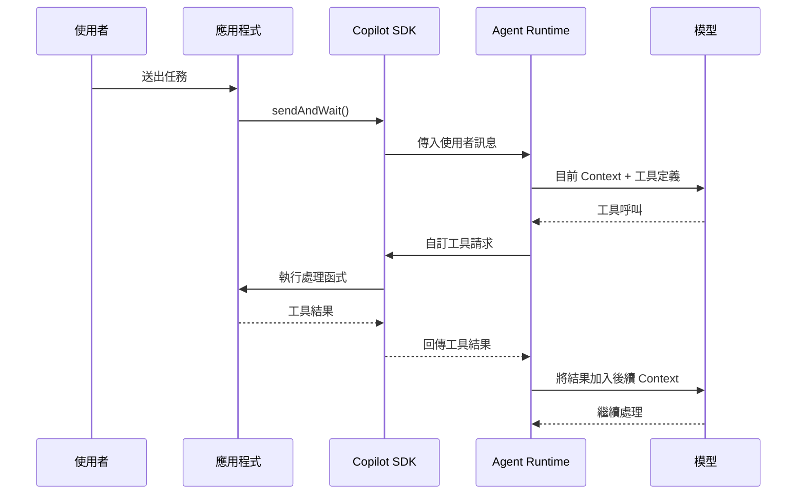

# Day 09 - 自訂工具實戰：讓 Agent 呼叫應用程式能力

到目前為止，我們已經建立 Session 的基本互動方式，也理解 Agent Loop、Session 事件與工具權限如何共同構成 Agent 的執行流程。接下來幾篇會進一步處理 Agent 的能力擴充與整合，讓 Agent 不只使用 Runtime 原本具備的能力，也能取得應用程式與外部系統提供的資料、工具與工作方法。

第一個要處理的問題，就是如何讓 Agent 使用應用程式既有的內部資料、服務與業務邏輯。這些能力不會自動進入 Agent Runtime，需要由應用程式整理成模型可以理解的工具介面，同時保留真正執行操作的程式邏輯。GitHub Copilot SDK 提供 **自訂工具（Custom Tool）**，讓應用程式可以把既有能力接進 Agent Runtime，成為 Agent 處理任務時可以使用的工具。

## 為什麼 Agent 需要自訂工具？

許多模型 API 要接入外部能力時，都會使用 **函式呼叫（Function Calling）** 或 **工具呼叫（Tool Calling）** 的概念。應用程式先提供工具名稱、用途與參數 Schema，模型再根據目前的問題判斷是否需要使用工具。需要工具時，模型會產生結構化的工具呼叫，真正的函式仍然由應用程式執行，再將結果提供給模型繼續處理。

例如，使用者詢問「台北現在的天氣如何？」如果模型本身沒有應用程式掌握的天氣資料，應用程式可以提供一支名為 `get_weather` 的自訂工具，說明它可以取得指定城市的天氣，並接受城市名稱作為參數。

模型判斷需要這項資訊後，可能呼叫 `get_weather`，並帶入 `city: "Taipei"`。應用程式收到這筆工具呼叫後，再執行真正的查詢邏輯，最後把結果交回模型。模型負責判斷目前需要什麼能力並準備工具參數，真正取得資料或改變系統狀態的程式仍然由應用程式執行。

GitHub Copilot SDK 的自訂工具也是沿著這個責任分工運作。放進 Agent 應用後，自訂工具主要帶來幾項價值：

* **接入應用程式既有能力**：內部資料、服務與業務邏輯可以透過明確的工具介面提供給 Agent，不需要讓模型知道底層實作方式。
* **延續既有 Agent Loop**：工具結果可以回到目前的執行流程，讓模型根據取得的新資訊繼續判斷下一步，不需要由應用程式另外建立模型與工具之間的循環。
* **維持能力與執行邏輯的邊界**：模型負責判斷是否使用工具並產生參數，真正的資料查詢或業務操作仍由應用程式中的 **處理函式（Handler）** 執行。
* **沿用既有執行機制**：自訂工具加入 Session 後，可以和 Agent Loop、事件與工具權限機制一起運作。

GitHub Copilot SDK 透過 `defineTool()` 定義這類能力；Agent Runtime 要求執行時，SDK Client 會呼叫應用程式中的處理函式，再將結果送回執行流程。

## 自訂工具如何進入 Agent Loop

理解自訂工具的角色後，再把它放回 Agent Loop，就能看出模型、Agent Runtime、SDK 與應用程式之間的分工。模型取得的是工具介面，真正的處理函式仍然執行在 SDK Client 所在的應用程式程序；當 Agent Runtime 要求執行自訂工具時，SDK Client 會呼叫對應的處理函式，再把結果送回 Runtime。

整體流程可以表示如下：



這條流程中，各個元件負責的工作不同：

* **模型**：根據目前 Context 與工具定義判斷是否需要使用工具，並產生對應參數。
* **Agent Runtime**：推進 Agent Loop、協調工具呼叫，並將工具結果帶入後續模型處理。
* **Copilot SDK**：負責 Agent Runtime 與應用程式之間的自訂工具呼叫與結果傳遞。
* **應用程式中的處理函式**：執行真正的資料查詢或業務邏輯，再回傳 Agent 後續工作需要的結果。

工具執行完成後，Agent Runtime 仍可能根據結果繼續推進目前工作，因此單次工具呼叫完成不代表整輪 Agent 執行已經結束。工具執行與後續模型處理仍然屬於同一段 Agent Loop。

## 實作：建立天氣查詢工具

接下來建立一支名為 `get_weather` 的自訂工具，讓 Agent 可以取得應用程式提供的天氣資料。範例使用程式內的固定資料，避免網路、API Key 或第三方服務影響執行結果，讓觀察重點集中在工具如何定義、執行，以及結果如何回到 Agent Loop。

### 準備專案環境

先建立 Node.js 專案並啟用 ES Modules：

```bash
$ mkdir copilot-sdk-custom-tool
$ cd copilot-sdk-custom-tool
$ npm init -y --init-type module
$ mkdir src
```

接著安裝 GitHub Copilot SDK、Zod 與 TypeScript 執行環境：

```bash
$ npm install @github/copilot-sdk zod
$ npm install --save-dev @types/node typescript tsx
```

範例使用 Zod 描述工具參數，讓 SDK 可以依照 Schema 推導處理函式的 TypeScript 參數型別；Node.js SDK 也支援直接使用 JSON Schema 定義工具參數。

### 建立範例程式

專案環境準備完成後，建立 `src/index.ts`，把自訂工具定義、Session 設定與工具事件整合到同一個執行流程：

```typescript
import { CopilotClient, defineTool } from "@github/copilot-sdk";
import { z } from "zod";

type WeatherRecord = {
  condition: string;
  temperatureC: number;
};

const weatherRecords: Record<string, WeatherRecord> = {
  Taipei: { condition: "Cloudy", temperatureC: 30 },
  Tokyo: { condition: "Sunny", temperatureC: 27 },
};

const getWeather = defineTool("get_weather", {
  description: "Return sample weather data for a supported city",
  parameters: z.object({
    city: z.string().describe("City name, such as Taipei or Tokyo"),
  }),
  defer: "never",
  skipPermission: true,
  handler: async ({ city }) => {
    const record = weatherRecords[city];

    if (!record) {
      return { city, found: false };
    }

    return { city, found: true, ...record };
  },
});

const client = new CopilotClient();

const session = await client.createSession({
  model: "auto",
  tools: [getWeather],
  availableTools: ["custom:*"],
});

session.on("tool.execution_start", (event) => {
  console.log(`[tool:${event.data.toolCallId}] start name=${event.data.toolName}`);
});

session.on("tool.execution_complete", (event) => {
  console.log(
    `[tool:${event.data.toolCallId}] complete success=${event.data.success}`,
  );
});

const response = await session.sendAndWait(
  {
    prompt:
      "請務必使用 get_weather 工具查詢 Taipei，" +
      "再根據工具實際回傳的示範資料回答天氣狀況；" +
      "不要根據既有知識推測。",
  },
  120_000,
);

console.log("\n模型回應：");
console.log(response?.data.content ?? "沒有收到 Assistant 訊息。");

await session.disconnect();
await client.stop();
```

程式只註冊一支自訂工具 `get_weather`，並將目前 Session 可用的工具限制在自訂工具來源。Prompt 也明確要求使用工具取得 Taipei 的資料，讓觀察重點集中在工具呼叫是否真的進入應用程式中的處理函式。

### 定義自訂工具

程式範例的核心是：

```typescript
const getWeather = defineTool("get_weather", {
  // ...
});
```

`defineTool()` 會將工具名稱、`description`、參數 Schema 與 `handler` 組成一支自訂工具。模型利用名稱、描述與參數介面理解這項能力，`handler` 則定義應用程式真正執行的程式邏輯。

`get_weather` 的 `description` 設定如下：

```typescript
description: "Return sample weather data for a supported city",
```

工具名稱與 `description` 應清楚表達能力用途。這裡使用 `sample weather data`，明確表示工具回傳的是示範資料，和程式內的固定資料保持一致。

接著透過 Zod 描述參數：

```typescript
parameters: z.object({
  city: z.string().describe("City name, such as Taipei or Tokyo"),
}),
```

`city` 必須是字串，`describe()` 則補充欄位代表的意義。SDK 可以根據這份 Zod Schema 推導 `handler` 的參數型別，讓工具介面與處理函式維持一致。

真正取得資料的位置則是 `handler`：

```typescript
handler: async ({ city }) => {
  const record = weatherRecords[city];

  if (!record) {
    return { city, found: false };
  }

  return { city, found: true, ...record };
},
```

模型不會直接讀取 `weatherRecords`，也不會自行執行這段程式。Agent Runtime 提出自訂工具請求後，SDK Client 才會在應用程式程序中執行處理函式，再把回傳結果送回 Runtime。`handler` 可以回傳 JSON 可序列化資料或字串，SDK 會將結果送回 Agent Runtime，供後續 Agent Loop 使用。

找不到指定城市時，處理函式會回傳 `{ city, found: false }`。這代表查詢已經完成，只是目前沒有對應資料；底層服務無法連線或程式發生未預期錯誤，則屬於另一種執行結果。兩種情況會影響 Agent 後續如何判斷，因此應維持清楚的語意。

工具定義另外使用：

```typescript
skipPermission: true,
defer: "never",
```

`skipPermission: true` 讓這支自訂工具略過權限確認。`get_weather` 只讀取應用程式中的固定資料，沒有外部副作用，因此可以直接執行。這項設定適合安全、可信任且輸入已由應用程式限制的自訂工具；如果需要依照每次呼叫檢查政策或參數，則應保留對應的執行前控制。

| NOTE: |
| :--- |
| `skipPermission` 只略過這支自訂工具的工具權限確認。真正存取應用程式資料或資源時，處理函式仍然需要根據已驗證的使用者身分與資源權限執行應用程式層的授權。 |

`defer` 控制工具是否可以延遲載入，預設值為 `"auto"`；設定 `"never"` 則讓工具維持預先載入。範例只有一支簡單工具，因此固定使用 `"never"`，讓工具直接保持可用，避免這次範例再加入延遲載入的行為。

| NOTE: |
| :--- |
| Copilot Runtime 提供 Tool Search，讓工具數量較多時不需要一次將所有工具完整載入模型 Context，而可以先搜尋目前任務可能需要的工具，再載入對應定義。當工具參與 Tool Search 時，工具名稱、`description`、參數名稱與描述都會影響搜尋匹配。`defer: "auto"` 允許 Runtime 在適用時採用這種延遲載入方式；`"never"` 則讓工具固定預先載入。 |

### 將自訂工具接進 Session

工具定義完成後，還需要將它加入 Session：

```typescript
const session = await client.createSession({
  model: "auto",
  tools: [getWeather],
  availableTools: ["custom:*"],
});
```

這裡有兩個和工具範圍直接相關的設定：

* **`tools`**：將應用程式提供的自訂工具註冊到 Session，讓 SDK Client 能在 Agent Runtime 要求執行時找到對應的處理函式。
* **`availableTools`**：限制目前 Session 可以使用的工具集合。`custom:*` 代表開放自訂工具來源；由於範例只註冊自訂工具 `get_weather`，Agent 實際可以使用的自訂工具也只有這一支。

兩個設定分別處理「應用程式提供哪些自訂工具」與「目前 Session 實際開放哪些工具」，用途不同。

| NOTE: |
| :--- |
| Copilot SDK 預設也會暴露 Copilot CLI 的內建工具，因此 Session 中的工具來源不一定只有應用程式註冊的自訂工具。`availableTools` 可以用來明確限制目前開放給 Agent 的工具範圍；範例設定為 `custom:*`，讓執行範圍集中在自訂工具。 |

### 觀察工具執行流程

工具接進 Session 後，可以沿用前面已經介紹過的 Session 事件，確認 Agent Runtime 是否真的執行這支工具：

```typescript
session.on("tool.execution_start", (event) => {
  console.log(`[tool:${event.data.toolCallId}] start name=${event.data.toolName}`);
});

session.on("tool.execution_complete", (event) => {
  console.log(
    `[tool:${event.data.toolCallId}] complete success=${event.data.success}`,
  );
});
```

`tool.execution_start` 與 `tool.execution_complete` 會使用相同的 `toolCallId`，因此可以對應同一次工具呼叫。模型產生 `get_weather` 工具呼叫後，Agent Runtime 會進入工具執行流程，SDK Client 再執行應用程式中的處理函式；取得 Taipei 的固定資料後，工具結果會回到 Agent Loop，讓模型根據新的 Context 繼續處理。

因此，`tool.execution_complete` 只代表單次工具呼叫已經結束。Agent Runtime 仍可能根據工具結果進入後續模型呼叫，直到目前的 Agent Loop 停止。

### 執行應用程式

完成後執行：

```bash
$ npx tsx src/index.ts
```

如果 Agent 使用自訂工具 `get_weather` 查詢 Taipei，終端機可能看到類似：

```text
[tool:<tool-call-id>] start name=get_weather
[tool:<tool-call-id>] complete success=true

模型回應：
台北的示範天氣資料為多雲，氣溫 30°C。
```

實際的 `toolCallId` 與自然語言回答會依執行結果而不同，模型也可能採用其他文字表達。執行時主要確認 `get_weather` 是否實際進入工具執行流程，以及最後的回答是否使用處理函式回傳的固定資料。

Prompt 中明確要求使用 `get_weather`，是為了讓範例可以穩定觀察自訂工具的執行流程。一般使用情境不一定需要指定工具名稱；工具加入 Session 後，模型可以根據目前任務與工具描述判斷是否需要使用。

## 自訂工具的設計原則

自訂工具加入 Session 後，工具介面的設計會直接影響模型如何辨識、選擇與呼叫這項能力。名稱與描述、參數 Schema、回傳結果，以及 Session 開放的工具範圍，都需要有明確且可預期的定義。

設計自訂工具時，可以從以下幾個面向檢查：

* **使用明確的工具名稱與描述**：工具名稱、用途與參數說明都應清楚表達能力範圍，讓模型更容易理解工具能做什麼，以及呼叫時需要提供哪些資訊。
* **維持清楚的輸入與輸出介面**：參數應使用有效的 Schema 描述，處理函式則回傳可序列化的結果，讓工具呼叫與後續 Agent Loop 都能取得可預期的資料結構。
* **只開放目前工作需要的工具**：Session 應限制實際可用的工具範圍，避免將與目前任務無關的能力一起提供給 Agent。`availableTools` 可以用來建立明確的工具 allowlist。
* **保留必要的執行前檢查**：`skipPermission` 適合安全、可信任且輸入已受限制的自訂工具；如果需要依照每次呼叫檢查政策或參數，則應保留對應的執行前控制。

這些設計共同決定自訂工具如何被 Agent 找到、呼叫與執行。工具介面需要清楚描述能力與資料結構，Session 則限制實際可用的工具範圍；真正的資料查詢與業務邏輯仍然由應用程式中的處理函式負責。

## 小結

自訂工具讓應用程式可以把既有能力接進 Agent Runtime，並沿用原本的 Agent Loop 持續處理工具結果與後續工作：

* `defineTool()` 使用名稱、`description`、參數 Schema 與 `handler` 定義自訂工具；模型理解的是工具介面，真正的程式邏輯仍由應用程式中的處理函式執行。
* Agent Runtime 負責協調工具呼叫與後續模型處理，SDK Client 則在 Runtime 要求執行自訂工具時呼叫對應的處理函式。
* 處理函式回傳的工具結果會回到 Agent Loop，因此結果的資料範圍，以及正常結果與執行失敗的語意都需要明確設計。
* 工具定義、`availableTools` 與工具權限機制分別控制工具介面、可用範圍與執行許可，真正的資料與資源授權仍然由應用程式負責。

當應用程式的能力透過明確的工具介面接進 Session，Agent 就能在需要時取得原本只有應用程式掌握的資料或操作能力，同時保留實際執行與資源存取的控制邊界。
