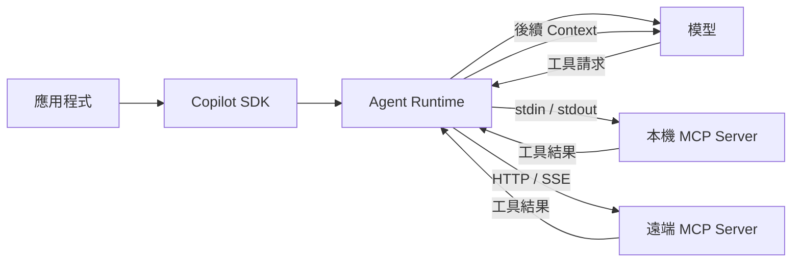

# Day 10 - MCP 實戰：讓 Agent 使用外部工具服務

透過自訂工具，應用程式已經可以把資料查詢、既有服務或業務邏輯整理成工具，交給 Agent 在執行期間使用。這種方式適合原本就屬於應用程式的能力，由應用程式定義工具介面與處理函式，再透過 SDK Client 承接實際執行。

實際系統中，有些能力早已由另一個行程、共用平台或外部服務獨立維護。如果每個 Agent 應用都重新建立一份工具介面與處理函式，連線方式、工具 Schema 與生命週期管理也會跟著散落到不同應用程式。**MCP（Model Context Protocol）** 提供了另一種整合方式，讓 Session 可以連接 MCP Server，將 Server 提供的工具帶進原本的 Agent Runtime 執行流程。

## MCP 解決什麼整合問題？

自訂工具把工具介面與處理函式都放在應用程式中。當能力原本就屬於應用程式時，這樣的責任邊界相對清楚；但如果同一項能力已經由獨立服務或共用平台維護，再讓每個 Agent 應用各自重新包裝工具介面，就會產生重複的整合與維護成本。

MCP 處理的正是這類情境。工具介面與實際執行邏輯由 MCP Server 提供，應用程式則負責讓 Session 連接 Server，並決定目前要納入哪些工具。

使用自訂工具時，工具名稱、說明、參數 Schema 與處理函式都由應用程式管理。模型提出工具呼叫後，Agent Runtime 透過 SDK Client 將請求交回應用程式，再執行對應的處理函式。這種方式適合應用程式原本就掌握的資料與業務邏輯，例如查詢訂單、取得內部設定或呼叫既有服務。

使用 MCP 時，MCP Server 擁有自己的工具介面與執行環境。Agent Runtime 取得這些工具後，模型仍然沿用既有的 Agent Loop 判斷是否需要使用；真正的工具操作則由 MCP Server 執行。

兩種方式的責任可以整理如下：

| 面向     | 自訂工具               | MCP                  |
| ------ | ------------------ | -------------------- |
| 能力提供者  | 應用程式               | MCP Server           |
| 工具介面   | 應用程式定義             | MCP Server 公布        |
| 實際執行位置 | SDK Client 所在的應用程式 | MCP Server 所在的行程或服務  |
| 生命週期   | 跟隨應用程式             | 依 MCP Server 的執行方式決定 |
| 適合情境   | 應用程式既有資料與業務邏輯      | 獨立工具、共用平台與外部服務       |

這樣的責任劃分，讓 MCP Server 可以獨立維護工具介面與執行邏輯，不需要隨每個 Agent 應用重複實作。應用程式則負責決定目前 Session 要連接哪些 MCP Server，以及實際開放哪些工具，讓外部能力可以接入 Agent Runtime，同時保留應用程式對能力範圍的控制。

## MCP Server 如何接入 Agent Runtime

釐清自訂工具與 MCP 的責任差異後，接下來要看 MCP Server 如何接進既有的 Agent 執行流程。應用程式會在 Session 中描述要使用的 MCP Server，Agent Runtime 再根據這些設定建立連線，取得目前可以提供給 Agent 的工具。

MCP 工具加入後，Agent Loop 的基本運作方式沒有改變。模型仍然根據目前 Context 與可用工具判斷下一步；需要使用 MCP 工具時，由 Agent Runtime 將工具呼叫送往對應的 MCP Server，取得結果後再帶回後續模型處理。



GitHub Copilot SDK 目前支援兩種 MCP Server 連線方式：

* **本機 / stdio**：Runtime 啟動 MCP Server 子行程（child process），並透過標準輸入與輸出交換訊息，適合由 Agent Runtime 所在環境啟動的工具服務，例如檔案存取或團隊自行維護的命令列服務。
* **遠端 HTTP / SSE**：Runtime 連接已經運作中的 MCP Server。Server 可以擁有自己的部署與行程生命週期，Runtime 再透過網路使用其中提供的工具。

無論採用哪一種方式，應用程式都會透過 Session 的 `mcpServers` 描述需要使用的 MCP Server。每個名稱對應一個 Server 設定，內容則決定 Runtime 如何建立連線，以及要從該 Server 納入哪些工具。

接下來先從本機 MCP Server 開始，把這條連線與工具執行路徑實際接進 Session。

## 實作：透過本機 MCP Server 使用檔案工具

第一個範例使用 MCP 官方維護的 Filesystem Server。應用程式會準備一個固定的測試目錄，再由 Agent 透過 MCP Server 列出目錄並讀取其中的文字檔案。

Filesystem Server 提供 `list_directory`、`read_text_file` 等檔案工具，兩者目前都標示為唯讀操作，適合用來觀察 MCP 的連線、工具載入與執行流程，同時避免修改測試資料。

### 準備專案環境

先建立 Node.js 專案：

```bash
$ mkdir copilot-sdk-mcp
$ cd copilot-sdk-mcp
$ npm init -y --init-type module
$ mkdir src fixtures
```

接著安裝 GitHub Copilot SDK、Filesystem MCP Server 與 TypeScript 執行環境：

```bash
$ npm install @github/copilot-sdk @modelcontextprotocol/server-filesystem
$ npm install --save-dev @types/node typescript tsx
```

建立 `fixtures/project-info.md`：

```text
Project: Northstar
Runtime: Node.js 22
Database: PostgreSQL 17
Cache: Redis 8
Deployment: Kubernetes
```

完成後，專案結構如下：

```text
copilot-sdk-mcp/
├── fixtures/
│   └── project-info.md
├── src/
│   ├── local.ts
│   └── remote.ts
└── package.json
```

專案中的 `local.ts` 與 `remote.ts` 分別用來實作本機與遠端 MCP Server。接下來先從 `local.ts` 開始，將 `fixtures` 目錄交給 Filesystem Server，並只納入 `list_directory` 與 `read_text_file` 兩支唯讀工具，讓觀察重點集中在固定資料的讀取流程。

### 建立本機 MCP 應用程式

專案環境準備完成後，先把本機 MCP Server 的連線設定、工具範圍與工具事件放進同一個 Session，建立一份可以完整觀察執行流程的範例。

建立 `src/local.ts`：

```typescript
import path from "node:path";
import { fileURLToPath } from "node:url";
import { CopilotClient, approveAll } from "@github/copilot-sdk";

const fixtureDirectory = path.resolve(
  path.dirname(fileURLToPath(import.meta.url)),
  "../fixtures",
);

const client = new CopilotClient();

const session = await client.createSession({
  model: "auto",
  availableTools: ["mcp:*"],
  onPermissionRequest: approveAll,
  mcpServers: {
    filesystem: {
      type: "local",
      command: "npx",
      args: [
        "-y",
        "@modelcontextprotocol/server-filesystem",
        fixtureDirectory,
      ],
      tools: ["list_directory", "read_text_file"],
      timeout: 30_000,
    },
  },
});

session.on("tool.execution_start", (event) => {
  console.log(
    `[mcp:${event.data.mcpServerName}] ` +
      `start ${event.data.mcpToolName}`,
  );
});

session.on("tool.execution_complete", (event) => {
  console.log(
    `[tool:${event.data.toolCallId}] ` +
      `complete success=${event.data.success}`,
  );
});

const response = await session.sendAndWait(
  {
    prompt:
      "請務必使用 filesystem MCP Server 的 list_directory 與 " +
      `read_text_file，先檢查 ${fixtureDirectory}，` +
      "再讀取 project-info.md，根據檔案實際內容整理 " +
      "Project、Runtime、Database、Cache 與 Deployment；" +
      "不要使用其他工具或既有知識推測。",
  },
  120_000,
);

console.log("\n模型回應：");
console.log(response?.data.content);

await session.disconnect();
await client.stop();
```

程式仍然沿用前面已經建立的 Client、Session、工具事件與 `sendAndWait()` 流程，新增的核心設定集中在 `mcpServers`。

### 將本機 MCP Server 接進 Session

本機 MCP Server 的設定如下：

```typescript
mcpServers: {
  filesystem: {
    type: "local",
    command: "npx",
    args: [
      "-y",
      "@modelcontextprotocol/server-filesystem",
      fixtureDirectory,
    ],
    tools: ["list_directory", "read_text_file"],
    timeout: 30_000,
  },
},
```

`filesystem` 是這個 MCP Server 在目前 Session 中的名稱。後續的工具使用權限請求與工具事件，也可以利用這個名稱辨識工具來源。

`type: "local"` 表示這是一個本機 MCP Server。Runtime 會使用 `command` 與 `args` 啟動子行程，再透過 stdin / stdout 和 MCP Server 通訊。這裡實際啟動的指令相當於：

```bash
$ npx -y @modelcontextprotocol/server-filesystem <fixture-directory>
```

Filesystem Server 會把檔案操作限制在允許的目錄中，啟動參數則提供 Server 可以使用的初始目錄。`timeout: 30_000` 則設定 MCP 工具呼叫的逾時時間，單位為毫秒。

| TIP: |
| :--- |
| Windows 環境如果無法直接以 `npx` 啟動 MCP Server，可以改用 `command: "cmd"`，並將 `["/c", "npx", "-y", "@modelcontextprotocol/server-filesystem", fixtureDirectory]` 放進 `args`。這只改變子行程的啟動方式，不影響後面的 Session 設定模型。 |

Filesystem Server 的允許目錄可以縮小 Server 自己能操作的檔案範圍，但這項限制仍由 MCP Server 實作。正式環境如果需要處理不可信任的工作，仍應搭配作業系統檔案權限、Container 或其他執行環境隔離機制。

### 限制 Agent 可以使用的 MCP 工具

MCP Server 連接成功後，不代表其中所有工具都需要提供給目前 Session。Filesystem Server 除了檔案讀取，也提供建立目錄、寫入、編輯與移動檔案等能力；目前工作只需要列出目錄並讀取文字檔案，因此可以進一步縮小工具範圍。

在 Server 設定中只納入：

```typescript
tools: ["list_directory", "read_text_file"],
```

`mcpServers.<server>.tools` 控制要從指定 MCP Server 納入哪些工具。可以使用 `["*"]` 納入全部工具、列出指定名稱限制範圍，或使用 `[]` 不納入任何工具。

範例另外設定：

```typescript
availableTools: ["mcp:*"],
```

`mcpServers.filesystem.tools` 負責限制 Filesystem Server 提供的工具，`availableTools` 則讓目前 Session 只使用 MCP 類型的工具。兩者一起使用，可以讓範例的工具範圍維持在預期的兩支唯讀工具。

### 觀察 MCP 工具執行

MCP 工具進入 Agent Loop 後，仍然可以透過既有的 `tool.execution_start` 與 `tool.execution_complete` 觀察執行過程。

對 MCP 工具而言，`tool.execution_start` 目前還會提供 MCP Server 與原始工具名稱，因此範例可以直接輸出：

```typescript
session.on("tool.execution_start", (event) => {
  console.log(
    `[mcp:${event.data.mcpServerName}] ` +
      `start ${event.data.mcpToolName}`,
  );
});
```

工具完成後，再透過 `toolCallId` 與 `success` 觀察執行結果：

```typescript
session.on("tool.execution_complete", (event) => {
  console.log(
    `[tool:${event.data.toolCallId}] ` +
      `complete success=${event.data.success}`,
  );
});
```

如果同一段 Agent Loop 包含多筆工具呼叫，仍然可以利用各自的 `toolCallId` 區分執行結果，不需要依賴工具一定按照固定順序完成。

### 執行應用程式

完成 `src/local.ts` 後執行：

```bash
$ npx tsx src/local.ts
```

如果 MCP Server 正常啟動，而且 Agent 依照 Prompt 使用兩支工具，終端機可能看到類似以下內容：

```text
[mcp:filesystem] start list_directory
[tool:<tool-call-id>] complete success=true
[mcp:filesystem] start read_text_file
[tool:<tool-call-id>] complete success=true

模型回應：
Project: Northstar
Runtime: Node.js 22
Database: PostgreSQL 17
Cache: Redis 8
Deployment: Kubernetes
```

實際的 `toolCallId`、工具呼叫次數與回答文字會依模型判斷與 Runtime 執行情況而有所不同。執行時主要確認 `list_directory` 與 `read_text_file` 是否實際進入 MCP 工具執行流程，以及最後回答是否使用 `project-info.md` 中的固定資料。

應用程式本身沒有實作檔案讀取的處理函式。工具介面與檔案操作都由 Filesystem MCP Server 提供，Session 則描述 Server 的連線方式與目前允許使用的工具，再由 Agent Runtime 協調實際呼叫。

## 實作：連接遠端 MCP Server

本機 MCP Server 需要由 Runtime 啟動子行程，因此 Session 必須知道執行指令與參數。如果工具服務已經獨立部署，應用程式就不需要管理 MCP Server 行程，只要提供可連接的端點，再由 Runtime 透過網路建立連線。

遠端範例使用 Model Context Protocol 官方文件提供的 MCP Server。官方 MCP 專案目前將 `https://modelcontextprotocol.io/mcp` 作為 HTTP MCP Server 使用，並提供 `search_model_context_protocol` 文件搜尋工具。

### 設定遠端 MCP Server

遠端 MCP Server 仍然使用相同的 `mcpServers` 設定模型，工具範圍與事件處理方式也不需要改變。主要差異在於 Runtime 不再啟動本機子行程，而是透過 URL 連接已經運作中的 MCP Server。

建立 `src/remote.ts`：

```typescript
import { CopilotClient, approveAll } from "@github/copilot-sdk";

const client = new CopilotClient();

const session = await client.createSession({
  model: "auto",
  availableTools: ["mcp:*"],
  onPermissionRequest: approveAll,
  mcpServers: {
    docs: {
      type: "http",
      url: "https://modelcontextprotocol.io/mcp",
      tools: ["search_model_context_protocol"],
      timeout: 30_000,
    },
  },
});

session.on("tool.execution_start", (event) => {
  console.log(
    `[mcp:${event.data.mcpServerName}] ` +
      `start ${event.data.mcpToolName}`,
  );
});

session.on("tool.execution_complete", (event) => {
  console.log(
    `[tool:${event.data.toolCallId}] ` +
      `complete success=${event.data.success}`,
  );
});

const response = await session.sendAndWait(
  {
    prompt:
      "請務必使用 docs MCP Server 的 search_model_context_protocol，" +
      "搜尋 MCP Tools capability，再根據工具取得的文件內容，" +
      "用三點整理 MCP Tool 的用途與基本運作方式；" +
      "不要使用其他工具或既有知識補充。",
  },
  120_000,
);

console.log("\n模型回應：");
console.log(response?.data.content);

await session.disconnect();
await client.stop();
```

遠端 MCP Server 不需要 `command` 與 `args`，改由 `url` 指定已經運作中的服務端點：

```typescript
mcpServers: {
  docs: {
    type: "http",
    url: "https://modelcontextprotocol.io/mcp",
    tools: ["search_model_context_protocol"],
    timeout: 30_000,
  },
},
```

Copilot SDK 的遠端 MCP Server 可以透過 HTTP 或 SSE 連線，必要時也能提供額外的 HTTP 標頭。若實際服務需要 Token 或其他認證資料，認證資訊的保存、更新與使用範圍仍應由應用程式自己的 Secret 或身分管理機制負責。

工具範圍則沿用本機範例建立的方式，只納入：

```typescript
tools: ["search_model_context_protocol"],
```

因此，從本機切換到遠端 MCP Server，主要改變的是 Runtime 如何取得 Server。工具範圍、工具使用權限與 Agent Loop 仍然沿用相同的 Session 模型。

| NOTE: |
| :--- |
| 遠端 MCP Server 的工具名稱與 Schema 由服務端維護，可能隨服務版本演進。這個範例依目前 Documentation MCP Server 公布的 `search_model_context_protocol` 撰寫；正式整合時，應將實際 MCP Server 的工具介面納入版本管理與整合測試。 |

### 執行應用程式

執行遠端範例：

```bash
$ npx tsx src/remote.ts
```

如果 Runtime 可以連接 Documentation MCP Server，而且工具正常執行，終端機可能看到：

```text
[mcp:docs] start search_model_context_protocol
[tool:<tool-call-id>] complete success=true

模型回應：
...
```

實際搜尋內容與最後的整理方式會受到 MCP Server 當下文件內容與模型判斷影響。執行時主要確認 `search_model_context_protocol` 實際進入工具執行流程，以及最後回答使用工具取得的文件資訊。

前面使用的工具事件仍然適用，因此遠端 MCP 不需要另外建立新的事件處理方式。應用程式看到的依然是 Agent Runtime 中的一次工具執行，差異只在 Runtime 將呼叫送往本機子行程，還是遠端 MCP Server。

## MCP 工具的權限與執行邊界

MCP Server 接進 Session 後，Agent 已經可以使用外部提供的工具，但 Server 能夠連線與工具可以被呼叫，只代表能力已經進入 Agent Runtime。實際執行仍然需要區分不同層次的控制：

* **MCP 工具範圍**：決定目前 Agent 可以使用哪些 MCP 工具。
* **工具使用權限**：決定 Agent 提出的工具操作是否允許繼續執行。
* **應用程式授權**：確認目前已驗證的使用者或服務身分，是否具有實際資源的存取權限。

這三個層次處理的問題不同。即使某次 MCP 工具呼叫已經取得工具使用權限，也不能直接視為目前使用者具有實際資源的存取權。真正的資源存取仍應由應用程式或提供資源的服務完成授權判斷。

MCP 的執行方式也會影響失敗發生的位置。本機 MCP Server 可能在子行程啟動階段失敗，遠端 MCP Server 可能遇到端點無法連線或認證失敗；Server 已經正常提供工具後，單一工具仍可能因參數、內部錯誤或逾時而執行失敗。應用程式需要區分這些狀態，才能判斷問題發生在 Server 連線、工具範圍，還是實際工具執行。

| NOTE: |
| :--- |
| 前面的範例使用 `approveAll`，只是為了避免工具使用權限的確認流程干擾 MCP 執行觀察。正式應用仍應根據實際 MCP Server、工具、參數與使用者權限建立自己的判斷規則。MCP 權限請求中的 `readOnly` 等資訊可以作為工具使用權限的判斷依據，但不能取代應用程式對實際資源的授權。 |

## 小結

MCP 讓 Agent Runtime 可以接入由獨立行程或遠端服務提供的工具能力，並沿用既有的 Session 與 Agent Loop：

* 自訂工具適合將應用程式本身掌握的資料與業務邏輯提供給 Agent；MCP 則讓 Session 接入由 MCP Server 提供的工具能力。
* 本機 MCP Server 由 Runtime 啟動子行程並透過 stdio 溝通；遠端 MCP Server 則透過 HTTP 或 SSE 連接已經運作中的服務。
* `mcpServers.<server>.tools` 可以限制從單一 Server 納入的工具，Session 也能透過 `availableTools` 進一步控制整體工具範圍。
* MCP 工具進入 Agent Loop 後，仍然可以沿用既有的工具事件與工具使用權限機制觀察及控制實際執行。
* 工具範圍、工具使用權限與應用程式授權分別處理能力範圍、單次執行許可與實際資源的存取權限，不能互相取代。

將外部工具服務接進 Agent Runtime 後，MCP Server 可以獨立維護自己的工具介面與執行環境，應用程式則繼續決定目前 Session 需要哪些能力，以及實際操作可以在哪些條件下執行。
