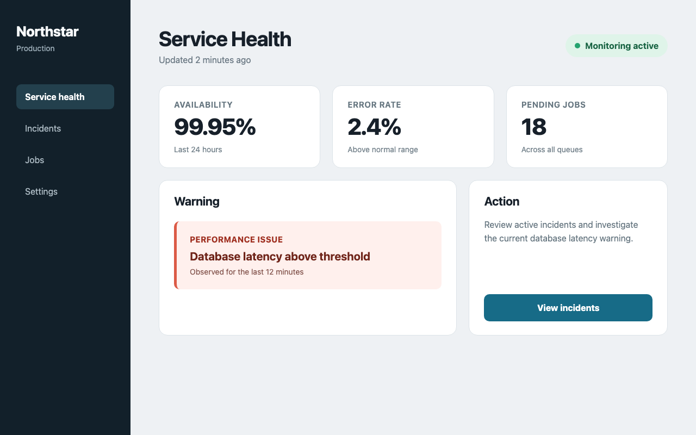
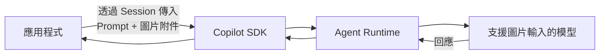

# Day 11 - 圖片輸入實戰：將視覺內容帶入 Session

前兩篇分別透過自訂工具與 MCP，讓 Agent 可以取得應用程式或外部服務提供的能力。當任務需要處理 UI 截圖、錯誤畫面、設計稿或架構圖時，限制開始出現在輸入資訊本身。這些內容除了文字，還包含元件位置、資訊層級與其他視覺關係，很難只靠 Prompt 完整描述。

如果應用程式先把畫面整理成文字，再交給 Agent 分析，部分資訊可能已經在轉換過程中遺失。Copilot SDK 可以把圖片和 Prompt 一起放進 Session 訊息，讓支援圖片輸入的模型直接根據圖片內容進行分析。

## 為什麼 Agent 需要圖片輸入？

圖片輸入主要處理的是「資訊存在於畫面中，但難以完整轉成文字」的情境。當任務需要理解版面配置、狀態呈現、元件位置或其他視覺關係時，單靠文字描述往往只能保留其中一部分內容。

以下方的服務監控儀表板為例，畫面中除了幾個 KPI 數值，還可能有醒目的告警訊息、狀態顏色、操作按鈕，以及不同區塊之間的資訊層級：



應用程式可以先把畫面整理成文字：

> 畫面包含三個 KPI、一則告警訊息，以及一個查看事件的按鈕。

這段文字保留了畫面中有哪些內容，卻沒有完整呈現告警是否醒目、不同狀態如何區分、操作按鈕位於什麼位置，以及各個區塊之間的視覺層級。當任務需要理解這些資訊或比較畫面差異時，直接提供圖片會更適合，例如：

* **UI 畫面檢視**：分析資訊層級、主要操作是否清楚，以及告警或狀態是否容易辨識。
* **錯誤畫面分析**：根據錯誤訊息、介面狀態與畫面內容整理可能的問題。
* **設計稿比較**：比較改版前後或不同設計方案的版面、資訊呈現與操作差異。
* **架構圖與流程圖分析**：根據元件、連線與流程關係整理圖中描述的系統結構。
* **多張圖片比較**：同時提供不同版本、不同狀態或不同步驟的畫面，整理彼此差異。

這類工作可以直接將圖片和 Prompt 一起送進 Session，讓模型根據原始畫面分析其中的內容與視覺關係。應用程式只需要說明目前的分析目標，不必先將畫面完整轉寫成文字。

Copilot SDK 支援將圖片透過 `attachments` 附加到訊息，再交給支援圖片輸入的模型處理。圖片可以來自磁碟上的檔案，也可以由應用程式直接提供已經取得的圖片資料。

## 圖片如何進入 Agent 執行流程

前面使用自訂工具與 MCP 時，模型會先判斷是否需要某項能力，再由 Agent Runtime 協調工具執行。圖片則會直接和使用者的 Prompt 一起進入目前這則訊息，成為模型開始處理時就能使用的輸入。

整體流程可以先表示成：



應用程式仍然透過 `session.send()` 或 `sendAndWait()` 傳送訊息，只是在原本的 Prompt 之外多提供圖片附件：

```typescript
await session.sendAndWait({
  prompt: "請分析這張儀表板。",
  attachments: [
    // 圖片附件
  ],
});
```

`prompt` 描述這次希望 Agent 完成的工作，`attachments` 則提供實際要分析的資料，兩者會一起成為目前這則訊息的輸入。圖片加入後仍然位於既有的 Session 脈絡中，前面累積的對話與工作脈絡也會繼續保留。

圖片附件可以來自不同的資料來源。File 附件由 Runtime 讀取磁碟上的圖片並轉換成 Base64；Blob 附件則由應用程式直接提供 Base64 編碼的圖片資料。

### File 與 Blob 圖片來源

File 與 Blob 都可以將圖片帶入目前訊息，實際選擇哪一種，主要取決於應用程式目前如何取得與保存圖片資料：

* **File 附件**：適合圖片已經存在磁碟中的情境，例如測試流程產生的截圖，或使用者上傳後保存到受控目錄的圖片。應用程式只需要提供 Runtime 可以存取的絕對路徑，就能直接使用既有檔案。
* **Blob 附件**：適合應用程式已經取得圖片二進位資料的情境，例如瀏覽器自動化產生的截圖、外部 API 回傳的圖片，或程式中已經存在的 `Buffer`。建立附件時需要將資料轉成 Base64，並提供正確的 MIME 類型。

例如，測試流程已經將畫面輸出成 `dashboard.png`，就可以直接使用 File 附件；如果圖片是由瀏覽器自動化即時產生，而且原本就保存在記憶體中，則可以使用 Blob 附件直接建立訊息，不需要先將圖片寫入暫存檔，再交給 Runtime 讀取。

因此，附件形式通常不需要為了使用 Copilot SDK 額外改變既有的圖片處理流程。已經保存成檔案的圖片可以沿用 File 附件；原本就由應用程式持有二進位資料的圖片，則可以直接使用 Blob 附件。

### 模型的圖片輸入能力與限制

圖片附件要由模型處理，所選模型仍須支援圖片輸入。Copilot SDK 可以透過 `capabilities.supports.vision` 判斷模型是否具備這項能力；`capabilities.limits.vision` 則提供對應的圖片輸入限制。

主要包括：

* **`supported_media_types`**：模型可以接受的圖片 MIME 類型。
* **`max_prompt_images`**：單一 Prompt 最多可以包含的圖片數量。
* **`max_prompt_image_size`**：單張 Prompt 圖片的大小限制，單位為位元組（bytes）。

因此，圖片能否被模型處理，除了附件本身，也取決於目前模型是否支援圖片輸入，以及對應的格式、數量與大小限制。

## 實作：將圖片送進 Session

接下來建立一個獨立的圖片分析專案。範例會沿用前面展示的服務監控儀表板，要求 Agent 根據圖片中的實際資訊整理服務狀態與告警內容。

為了讓觀察重點集中在圖片輸入，這次不加入自訂工具、MCP 或其他 Agent 能力，Session 也不開放任何工具。

### 準備專案環境

先建立 Node.js 專案並啟用 ES Modules：

```bash
$ mkdir copilot-sdk-image-input
$ cd copilot-sdk-image-input
$ npm init -y --init-type module
$ mkdir -p src fixtures
```

接著安裝 Copilot SDK 與 TypeScript 執行環境：

```bash
$ npm install @github/copilot-sdk
$ npm install --save-dev @types/node typescript tsx
```

完成後，專案結構如下：

```text
copilot-sdk-image-input/
├── fixtures/
│   └── dashboard.png
├── src/
│   └── index.ts
└── package.json
```

前面使用的服務監控儀表板會繼續作為實作範例的固定輸入，將 `dashboard.png` 放入 `fixtures/` 目錄即可。這張圖片包含 Availability、Error Rate、Pending Jobs、資料庫延遲告警與 `View incidents` 等資訊，後續可以直接確認模型是否根據實際畫面完成分析。

### 建立圖片輸入程式

建立 `src/index.ts`：

```typescript
import path from "node:path";
import { fileURLToPath } from "node:url";
import { CopilotClient } from "@github/copilot-sdk";

const projectDirectory = path.resolve(
  path.dirname(fileURLToPath(import.meta.url)),
  "..",
);
const imagePath = path.join(projectDirectory, "fixtures", "dashboard.png");

const client = new CopilotClient();
await client.start();

const models = await client.listModels();
const visionModel = models.find(
  (model) =>
    model.capabilities.supports.vision &&
    model.policy?.state !== "disabled",
);

if (!visionModel) {
  throw new Error("目前沒有可用且支援圖片輸入的模型。");
}

const session = await client.createSession({
  model: visionModel.id,
  availableTools: [],
});

const response = await session.sendAndWait(
  {
    prompt:
      "請根據這張儀表板的實際畫面，整理目前的主要服務指標、告警內容，" +
      "以及畫面提供的主要操作；不要補充圖片中沒有的資訊。",
    attachments: [
      {
        type: "file",
        path: imagePath,
      },
    ],
  },
  120_000,
);

console.log(response?.data.content);

await session.disconnect();
await client.stop();
```

整段程式仍然沿用前面文章建立的基本 Session 流程。應用程式先建立 Client，再確認目前有哪些可用且支援圖片輸入的模型；建立 Session 後，透過 `sendAndWait()` 將 Prompt 與儀表板圖片一起送入，最後等待這次處理完成並輸出回答。

### 選擇支援圖片輸入的模型

範例先取得目前的模型清單：

```typescript
const models = await client.listModels();
```

再從中選出支援圖片輸入，而且沒有被目前政策停用的模型：

```typescript
const visionModel = models.find(
  (model) =>
    model.capabilities.supports.vision &&
    model.policy?.state !== "disabled",
);
```

Copilot SDK 會透過模型資訊提供 `capabilities.supports.vision`，用來判斷模型是否能處理圖片輸入。這裡另外使用 `policy.state` 排除明確處於 `disabled` 狀態的模型；這個欄位與型別則依目前 Node.js SDK 的 `ModelInfo` 定義使用。

如果目前找不到符合條件的模型，程式直接中止：

```typescript
if (!visionModel) {
  throw new Error("目前沒有可用且支援圖片輸入的模型。");
}
```

找到模型後，再將實際模型 ID 放進 Session：

```typescript
const session = await client.createSession({
  model: visionModel.id,
  availableTools: [],
});
```

這裡沒有使用 `model: "auto"`，因為目前範例有明確的圖片輸入需求。先確認模型具備對應能力，再指定符合條件的模型，可以讓這項必要條件更清楚。

`availableTools: []` 讓這個 Session 不使用其他工具，避免模型再透過工具取得其他資料，讓範例聚焦在 Prompt 與圖片附件的輸入流程。

這個範例在 `listModels()` 前保留 `await client.start()`。目前 Node.js SDK 會在建立或恢復 Session 時自動確保 Client 已啟動，但這裡需要先取得模型清單，因此仍要先建立 Runtime 連線。

### 將 File 附件與 Prompt 一起送進 Session

圖片輸入的核心位在這段：

```typescript
const response = await session.sendAndWait(
  {
    prompt:
      "請根據這張儀表板的實際畫面，整理目前的主要服務指標、告警內容，" +
      "以及畫面提供的主要操作；不要補充圖片中沒有的資訊。",
    attachments: [
      {
        type: "file",
        path: imagePath,
      },
    ],
  },
  120_000,
);
```

`attachments` 中使用 `type: "file"` 時，`path` 指定磁碟上的圖片位置。File 附件需要提供 Runtime 能夠讀取的絕對路徑；Runtime 會從磁碟讀取圖片並轉換成 Base64，再交給模型處理。

範例中的 `imagePath` 由專案位置組成：

```typescript
const imagePath = path.join(projectDirectory, "fixtures", "dashboard.png");
```

因此最後取得的是圖片的絕對路徑。

這個範例中，應用程式與 Runtime 位於相同的執行環境，因此可以直接使用本機圖片路徑。若兩者分開部署，則必須確認 Runtime 能夠存取 File 附件指定的位置。

### 改用 Blob 附件傳入記憶體圖片

File 附件適合已經存在磁碟中的圖片。如果應用程式已經取得圖片二進位資料，就可以改成 Blob 附件，直接把 Base64 資料放進目前訊息。

例如，可以先從同一張測試圖片取得 `Buffer`：

```typescript
import { readFile } from "node:fs/promises";

const imageBuffer = await readFile(imagePath);
```

再將原本的附件改成：

```typescript
attachments: [
  {
    type: "blob",
    data: imageBuffer.toString("base64"),
    mimeType: "image/png",
  },
],
```

Blob 附件需要提供 Base64 編碼的 `data` 與 `mimeType`，不需要再由 Runtime 從磁碟讀取來源圖片。

這裡仍然從磁碟讀取圖片，只是為了讓範例使用相同的固定輸入。實際應用中，Blob 附件更常用在圖片原本就位於記憶體的情境，例如瀏覽器自動化產生的截圖：

```typescript
const screenshot = await page.screenshot();
```

或外部 API 已經回傳圖片資料。應用程式取得二進位資料後，只需要依照實際格式轉成 Base64，並提供正確的 MIME 類型，就能直接建立 Blob 附件，不必再寫入暫存檔。

如果應用程式已經知道目前圖片格式，也可以進一步確認所選模型接受的 MIME 類型：

```typescript
const supportedMediaTypes =
  visionModel.capabilities.limits.vision?.supported_media_types;

if (
  supportedMediaTypes &&
  !supportedMediaTypes.includes("image/png")
) {
  throw new Error("目前模型不支援 image/png。");
}
```

這項檢查對 Blob 附件特別直接，因為應用程式本身就需要提供 `mimeType`。

### 一則訊息傳入多張圖片

同一則訊息可以加入多張圖片附件，只要不超過目前模型的 `max_prompt_images` 限制。如果任務需要比較改版前後、兩種設計方案或多個流程畫面，就可以一次提供多個附件。

例如再準備：

```text
fixtures/
├── dashboard-before.png
└── dashboard-after.png
```

就可以使用：

```typescript
attachments: [
  {
    type: "file",
    path: beforePath,
    displayName: "dashboard-before.png",
  },
  {
    type: "file",
    path: afterPath,
    displayName: "dashboard-after.png",
  },
],
```

Prompt 則可以明確描述兩張圖片的角色：

```typescript
prompt:
  "請比較 dashboard-before.png 與 dashboard-after.png，" +
  "整理主要資訊層級、告警辨識度與主要操作位置的差異。",
```

File 與 Blob 附件都可以透過選用的 `displayName` 提供附件名稱。多張圖片需要區分彼此用途時，可以替附件提供清楚的名稱，再在 Prompt 中使用相同名稱描述比較對象。

如果應用程式允許使用者一次提供多張圖片，可以在送入 Session 前取得目前模型的圖片數量限制：

```typescript
const maxPromptImages =
  visionModel.capabilities.limits.vision?.max_prompt_images;
```

這項限制屬於模型能力的一部分，因此不適合在應用程式中固定假設每個模型都能處理相同數量的圖片。

### 執行應用程式

完成 `src/index.ts`，並確認 `fixtures/dashboard.png` 已經存在後，執行：

```bash
$ npx tsx src/index.ts
```

如果目前帳號有可用且支援圖片輸入的模型，而且圖片路徑正確，終端機會輸出 Agent 根據 `dashboard.png` 整理的分析結果。

這張測試圖片包含 Availability、Error Rate、Pending Jobs、Database latency Warning，以及 `View incidents` 等資訊。實際的回答文字、排序與描述方式仍會受到模型判斷影響，因此不需要期待每次產生完全相同的結果。

執行時主要確認 Agent 的回答是否使用圖片中的實際資訊，以及沒有出現在圖片中的內容是否沒有被當成既有事實補進結果。圖片輸入成功後，Session 的其他互動方式仍然和前面的文字訊息相同。

## 圖片輸入的限制與處理原則

圖片附件讓應用程式可以把視覺內容直接加入 Session，但模型與 Runtime 對圖片仍然有明確限制。實際使用時，需要先掌握模型可以接受哪些圖片，以及 Runtime 會如何處理超出限制的內容：

* **模型須支援圖片輸入**：圖片送入前應確認 `capabilities.supports.vision`，不能只因為模型出現在模型清單中，就假設它能處理圖片。
* **圖片格式受模型限制**：實際接受的 MIME 類型應以 `supported_media_types` 為準。官方建議優先使用 PNG 或 JPEG；SVG 目前不屬於支援的圖片輸入格式。
* **圖片數量有上限**：同一則訊息可以帶入多張圖片，但不能超過目前模型的 `max_prompt_images`。
* **圖片大小有上限**：`max_prompt_image_size` 描述單張圖片的大小限制。圖片超出模型限制時，Runtime 會嘗試縮小尺寸或降低品質，並維持原本的長寬比例；如果處理後仍然無法符合限制，該圖片會被略過，不會送進模型。

Runtime 可以協助將超出限制的圖片調整到模型可以接受的範圍，但縮小尺寸或降低品質後，細小文字與其他視覺細節仍可能遺失。如果任務需要辨識 UI 截圖、錯誤訊息或密集表格中的細節，仍應保留合理的圖片解析度與內容範圍，必要時先裁切真正需要分析的區域。

因此，Runtime 主要處理模型層的圖片限制；應用程式仍應在送入 Session 前控制圖片來源與輸入範圍，並限制 File 附件可以存取的位置，避免將未經控制的圖片內容或任意使用者路徑直接交給 Runtime。

## 小結

圖片輸入讓一則 Session 訊息除了文字之外，也能直接帶入 Agent 需要觀察的視覺內容，適合處理 UI 截圖、錯誤畫面、設計稿與其他需要依賴圖片資訊的任務：

* 圖片可以和 Prompt 一起放進目前的 Session 訊息，透過 `attachments` 提供模型這次工作需要分析的視覺內容。
* 圖片附件可以依照資料來源選擇 File 或 Blob。File 附件由 Runtime 根據絕對路徑讀取磁碟圖片；Blob 附件則由應用程式直接提供 Base64 資料與 MIME 類型。
* 所選模型需要支援圖片輸入，實際可接受的圖片格式、數量與大小則依目前模型的能力限制而定。
* Runtime 會依模型限制處理圖片尺寸與品質，應用程式仍需要管理圖片來源、輸入範圍與 File 附件可以存取的位置。

圖片加入 Session 後，應用程式仍然沿用原本的 Session 互動方式，只需要在訊息中準備 Prompt 與對應的圖片附件。Agent Runtime 會在既有的執行流程中將這些輸入交給支援圖片的模型處理，讓 Agent 能在原本的工作脈絡中繼續完成目前任務。
