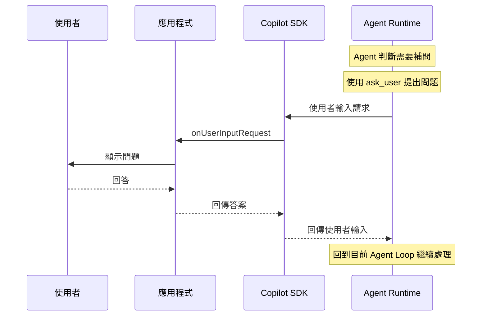
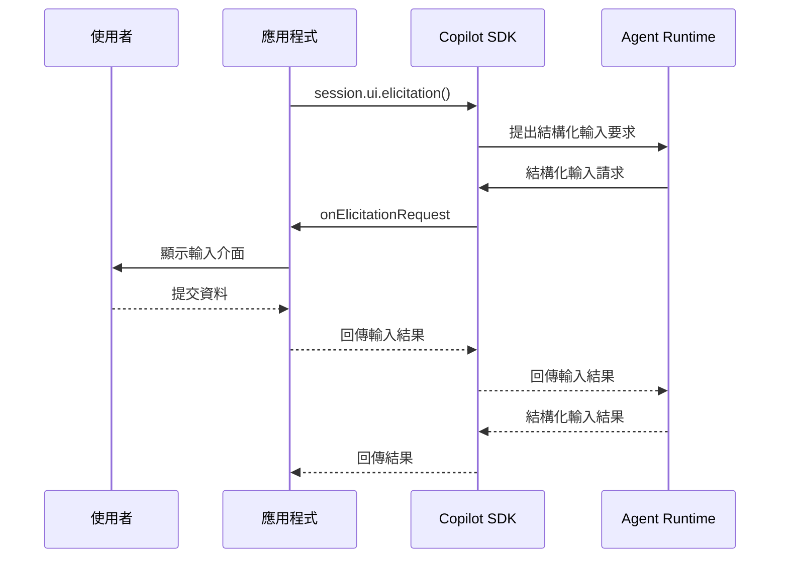
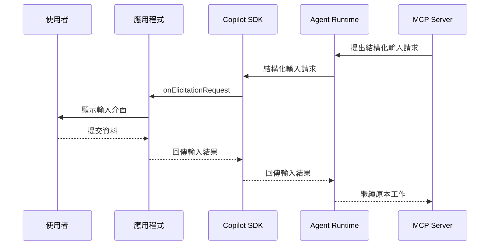

# Day 12 - Agent 與使用者互動：補問與結構化輸入

圖片輸入讓 Agent 能在 Prompt 之外直接取得視覺內容，讓 Session 一開始就能帶著更完整的工作資訊。不過，任務需要的條件仍不一定能預先準備完整；有些資訊只有使用者能夠決定，也可能直到 Agent 開始處理後才發現缺口。

如果這些資訊由 Agent 自行猜測，後續判斷就可能建立在錯誤前提上。Copilot SDK 提供使用者互動機制，讓 Agent 可以在執行期間補問缺少的資訊，或由應用程式主動取得結構化輸入，再將結果帶回目前 Session 繼續處理。

## 為什麼 Agent 需要使用者互動？

Agent 開始工作後，會根據目前 Session 中累積的 Context 持續判斷下一步。不過，Context 再完整，也不代表其中一定包含完成任務需要的所有條件。有些資訊屬於使用者當下的選擇或決策，無法單靠既有資料推導；也有些缺口要等 Agent 實際分析任務後，才會知道還需要進一步確認。

這時，使用者輸入就會成為 Agent 執行流程的一部分。Agent 可以先處理目前已知的資訊，在真正需要額外條件時提出問題；如果應用程式本來就知道下一個步驟需要哪些資料，也可以直接要求使用者提供，再將取得的結果接回目前 Session 繼續工作。

假設使用者提出：

> 請幫我整理這個服務的部署方案。

目前 Context 可能已經包含服務架構與部署限制，但沒有說明目標環境。Agent 如果要根據環境差異調整建議，就還需要知道目標環境是 production、staging 還是 dev。

這時可以讓 Agent 暫時停在目前的工作中，向使用者提出問題：

> 要部署到哪個環境？
>
> 1. production
> 2. staging
> 3. dev

取得回答後，原本的 Agent Loop 就能帶著新的條件繼續推進，不需要重新建立 Session，也不需要讓使用者重新輸入完整需求。

另一種情況是應用程式本來就知道需要哪些資料。假設部署方案需要同時取得部署環境、服務名稱、部署區域與是否先進行試跑，這些欄位具有明確的型別、選項與必填條件。若全部交由 Agent 逐項補問，欄位結構與輸入限制就較難由應用程式統一控制。這類資料更適合由應用程式主動提出結構化輸入要求。

因此，使用者互動可以先分成兩種主要需求：

* **Agent 在執行期間缺少資訊**：由 Agent 主動提出問題，取得回答後繼續目前工作。
* **應用程式需要明確結構的資料**：由應用程式描述需要的欄位與限制，再主動要求使用者提供。

Copilot SDK 也提供對應的承接方式。Agent 主動補問可以透過 **使用者輸入請求（User Input Request）** 交給應用程式處理；需要明確資料結構時，則可以透過 **結構化輸入（Elicitation）** 描述欄位與限制，再取得使用者提供的資料。

## 使用者輸入如何進入 Agent 執行流程

使用者提供的資訊最後都會回到目前 Session，讓原本的工作繼續推進。差異主要在於輸入要求由誰提出，以及應用程式需要在哪個位置承接互動。

依照發起位置，可以先分成三種情況：

* **Agent 主動補問**：Agent 在執行期間發現缺少必要條件，透過內建的 `ask_user` 提出問題，再由 `onUserInputRequest` 讓應用程式取得使用者回答。
* **應用程式主動取得輸入**：應用程式已經知道需要哪些資料，可以透過 `session.ui` 主動發起結構化輸入要求。
* **MCP Server 要求額外資料**：MCP Server 在處理工作時需要使用者補充結構化資料，可以向 Runtime 提出結構化輸入請求，再由應用程式承接。

前一種流程處理 Agent 在工作途中產生的問答；後兩種則透過結構化輸入描述資料需求。接下來分別看這些互動如何進入目前 Session。

### Agent 主動補問缺少的資訊

Agent 在執行期間會持續根據目前 Context 判斷下一步。以前面的部署方案為例，如果目前已經知道服務架構與部署限制，卻還不知道目標環境，Agent 就需要先向使用者取得這項條件，再繼續後面的判斷。

Agent Runtime 提供內建的 `ask_user` 工具，讓 Agent 可以在工作途中提出問題、提供選項，並等待使用者回答。應用程式則透過 `onUserInputRequest` 承接這筆使用者輸入請求，負責將問題呈現給使用者，再把回答交回 Runtime。

建立 Session 時，可以明確開放 `ask_user`，並設定對應的處理函式：

```typescript
const session = await client.createSession({
  model: "auto",
  availableTools: ["builtin:ask_user"],
  onUserInputRequest: async (request) => {
    console.log(request.question);

    return {
      answer: "staging",
      wasFreeform: true,
    };
  },
});
```

`availableTools` 將目前 Session 的工具範圍限制在內建的 `ask_user`；`onUserInputRequest` 則負責承接 Agent 提出的使用者輸入請求。兩者分別處理「Agent 可以使用哪些工具」與「應用程式如何取得使用者回答」。

這段程式先固定回傳 `staging`，用來呈現最基本的互動關係。實際接到 CLI 或 Web 介面時，可以將 `request.question` 與對應選項顯示給使用者，再把取得的回答放進 `answer` 回傳。

整段互動可以表示成：



這條流程中，`ask_user` 負責讓 Agent 發起補問，`onUserInputRequest` 則是應用程式承接互動的位置。Copilot SDK 負責在應用程式與 Agent Runtime 之間傳遞請求與回答；使用者回答後，新資訊會回到目前 Agent Loop，讓後續 Turn 繼續沿用前面累積的工作脈絡。

是否實際提出補問，以及問題與選項如何形成，仍然由 Agent 根據目前任務與 Context 判斷。

| NOTE: |
| :--- |
| Node.js SDK 目前也提供 `askUserVariant: "elicitation"`，可以讓 `ask_user` 改用結構化輸入形式，並透過 `onElicitationRequest` 承接。範例仍沿用 `onUserInputRequest`，以目前 bundled runtime 可以直接驗證的方式說明 Agent 補問流程。這項能力可能隨 SDK 與 Runtime 版本持續調整，實際使用時建議重新確認官方文件與 Release Notes。 |

### 應用程式主動取得結構化輸入

有些資料在 Agent 開始處理前，就已經可以確定需要哪些欄位。假設部署流程需要目標環境與服務名稱，應用程式可以直接透過 `session.ui` 要求使用者提供資料，不必等 Agent 開始工作後再逐項補問。

例如：

```typescript
const result = await session.ui.elicitation({
  message: "請提供部署設定",
  requestedSchema: {
    type: "object",
    properties: {
      environment: {
        type: "string",
        enum: ["production", "staging", "dev"],
      },
      serviceName: {
        type: "string",
      },
    },
    required: ["environment", "serviceName"],
  },
});
```

需要的資料已經由 `requestedSchema` 描述清楚。應用程式透過 Copilot SDK 發起結構化輸入要求後，Runtime 會將要求路由給目前可用的結構化輸入提供者；如果由同一個應用程式提供 `onElicitationRequest`，這筆請求就會回到應用程式，由它實際呈現輸入介面。



除了 `elicitation()`，`session.ui` 也提供 `confirm()`、`select()` 與 `input()`，分別適合是非確認、單選與單一文字輸入。需要多個欄位或較完整的輸入限制時，再使用 Schema 描述整份資料結構。

這種方式適合應用程式已經知道需要哪些資料的流程。輸入內容、欄位限制與發起時機都可以由應用程式明確決定。

| INFO: |
| :--- |
| `session.ui` 是 Copilot SDK 提供的使用者互動介面，建立在結構化輸入能力上。真正使用這些方法前，目前 Session 必須存在可用的結構化輸入提供者，可以透過 `session.capabilities.ui?.elicitation` 確認目前能力是否可用。 |

### MCP Server 的結構化輸入請求

結構化輸入也可能出現在 MCP Server 的工具執行期間。MCP Server 處理到某個步驟後，如果還需要使用者補充資料，可以向 Runtime 提出結構化輸入請求，再由目前 Session 中的提供者承接。

應用程式可以在建立 Session 時提供 `onElicitationRequest`：

```typescript
const session = await client.createSession({
  model: "auto",
  onElicitationRequest: async (context) => {
    console.log(context.message);

    return {
      action: "accept",
      content: {
        environment: "staging",
      },
    };
  },
});
```

收到請求後，應用程式可以根據 `context.message` 與 `context.requestedSchema` 建立對應的 CLI、Web 表單或其他應用程式介面，再將使用者提交的內容回傳。

執行關係可以表示成：



`session.ui.elicitation()` 與 `onElicitationRequest` 位在結構化輸入流程的不同位置。前者由應用程式主動提出輸入要求，後者則讓應用程式承接 Runtime 傳回的請求並將介面呈現給使用者。MCP Server 在執行期間需要額外資料時，也可以透過相同的提供機制取得使用者輸入。

使用者輸入只負責補齊目前工作需要的資訊。如果後續操作會實際存取或修改系統資源，執行許可與資源授權仍然需要由 Permission 與應用程式政策另外判斷。

## 實作：讓 Agent 主動向使用者補問

沿用前面提到的部署方案情境，範例會要求 Agent 整理部署建議，但不預先提供目標環境，讓 Agent 在執行期間透過 `ask_user` 向使用者確認 `production`、`staging` 或 `dev`。

應用程式透過 `onUserInputRequest` 承接這筆補問，將 Agent 提出的問題與選項顯示在終端機，再把使用者回答交回 Agent Runtime。取得目標環境後，Agent 會沿用同一個 Session 的工作脈絡，繼續完成原本的部署方案。

範例只產生部署建議，不執行實際部署，也不加入其他工具，讓觀察重點集中在使用者輸入如何進入 Agent Loop，以及回答如何回到原本的執行流程。

### 準備專案環境

先建立 Node.js 專案並啟用 ES Modules：

```bash
$ mkdir copilot-sdk-user-interaction
$ cd copilot-sdk-user-interaction
$ npm init -y --init-type module
$ mkdir src
```

接著安裝 Copilot SDK 與 TypeScript 執行環境：

```bash
$ npm install @github/copilot-sdk
$ npm install --save-dev @types/node typescript tsx
```

專案中會建立兩支範例程式，完成後的結構如下：

```text
copilot-sdk-user-interaction/
├── src/
│   ├── ask-user.ts
│   └── elicitation.ts
└── package.json
```

`ask-user.ts` 用來觀察 Agent 如何透過 `ask_user` 主動補問缺少的資訊；`elicitation.ts` 則由應用程式主動提出結構化輸入要求，取得部署流程需要的設定。兩個範例共用相同的專案環境，接下來先從 Agent 主動補問開始。

### 建立 Agent 補問程式

建立 `src/ask-user.ts`：

```typescript
import { stdin as input, stdout as output } from "node:process";
import { createInterface } from "node:readline/promises";
import { CopilotClient } from "@github/copilot-sdk";

const readline = createInterface({ input, output });
const client = new CopilotClient();

const session = await client.createSession({
  model: "auto",
  availableTools: ["builtin:ask_user"],
  onUserInputRequest: async (request) => {
    console.log(`\n${request.question}`);

    request.choices?.forEach((choice, index) => {
      console.log(`${index + 1}. ${choice}`);
    });

    while (true) {
      const answer = (await readline.question("> ")).trim();
      const selectedChoice = request.choices?.find(
        (choice, index) => answer === choice || answer === String(index + 1),
      );

      if (selectedChoice) {
        return {
          answer: selectedChoice,
          wasFreeform: false,
        };
      }

      if (request.allowFreeform !== false && answer) {
        return {
          answer,
          wasFreeform: true,
        };
      }

      console.log("請選擇提供的選項。");
    }
  },
});

const response = await session.sendAndWait(
  {
    prompt:
      "請提供這次服務的部署方案建議。" +
      "目前尚未提供目標環境，請務必使用 ask_user，" +
      "詢問要部署到 production、staging 還是 dev。" +
      "取得回答後再整理部署建議。",
  },
  120_000,
);

console.log("\n部署建議：");
console.log(response?.data.content);

await session.disconnect();
await client.stop();
readline.close();
```

這個 Session 只開放內建的 `ask_user`，避免其他工具介入目前範例。Prompt 也明確要求 Agent 在缺少目標環境時先取得使用者回答，再整理部署方案。

### 處理 Agent 的補問請求

前面的 Session 已經透過 `onUserInputRequest` 承接 Agent 的補問。當 Agent 實際使用 `ask_user` 時，Agent Runtime 會將這次使用者輸入請求交給這個處理函式：

```typescript
onUserInputRequest: async (request) => {
  // ...
},
```

應用程式可以從 `UserInputRequest` 取得幾項和目前互動直接相關的資訊：

* **`question`**：Agent 要向使用者提出的問題。
* **`choices`**：可選的預設答案。
* **`allowFreeform`**：是否允許使用者在選項之外自行輸入文字，省略時預設允許。

範例先將問題與選項輸出到終端機：

```typescript
console.log(`\n${request.question}`);

request.choices?.forEach((choice, index) => {
  console.log(`${index + 1}. ${choice}`);
});
```

接著取得使用者輸入，並確認是否選到 Agent 提供的選項：

```typescript
const selectedChoice = request.choices?.find(
  (choice, index) => answer === choice || answer === String(index + 1),
);
```

如果使用者輸入選項文字或對應編號，就回傳：

```typescript
return {
  answer: selectedChoice,
  wasFreeform: false,
};
```

如果沒有選到既有選項，但 `allowFreeform` 允許自由輸入，則將目前文字直接回傳：

```typescript
return {
  answer,
  wasFreeform: true,
};
```

`answer` 是 Agent 後續可以使用的實際回答，`wasFreeform` 則標示這個值來自既有選項，或是使用者自行輸入。

使用者完成回答後，不需要再另外呼叫 `session.send()` 把這段文字當成新的 Prompt。`onUserInputRequest` 回傳結果後，Runtime 會完成目前的使用者輸入請求，再讓 Agent Loop 帶著新的資訊繼續推進。

這段互動也會出現在 Session 事件流中。Agent 提出問題時會產生 `user_input.requested`，完成後則會產生 `user_input.completed`，兩個事件使用相同的 `requestId`。這兩種事件屬於暫時性事件，只在目前執行期間提供，不會寫入 Session 的持久化事件紀錄。

### 執行應用程式

完成程式後執行：

```bash
$ npx tsx src/ask-user.ts
```

如果 Agent 依照目前任務呼叫 `ask_user`，終端機可能出現：

```text
這次要部署到哪個環境？
1. production
2. staging
3. dev
> 2
```

使用者選擇 `2` 後，處理函式會將 `staging` 回傳給 Agent Runtime，再由 Agent 根據這項條件繼續整理部署方案。

實際問題文字、選項內容與後續回答仍然會受到模型判斷影響。執行時主要確認 Agent 是否實際進入 `ask_user` 的使用者輸入流程，以及取得回答後是否沿用原本工作繼續處理。

## 實作：由應用程式取得結構化輸入

前面的範例已經建立 `copilot-sdk-user-interaction` 專案，接下來沿用相同環境，再加入 `src/elicitation.ts`。

應用程式可以先描述部署設定需要的欄位，再透過結構化輸入取得使用者提供的資料。這個範例會取得部署環境、服務名稱、部署區域，以及是否先進行試跑等設定。

### 建立結構化輸入程式

建立 `src/elicitation.ts`：

```typescript
import { stdin as input, stdout as output } from "node:process";
import { createInterface } from "node:readline/promises";
import { CopilotClient, type ElicitationSchema } from "@github/copilot-sdk";

const readline = createInterface({ input, output });
const environments = ["production", "staging", "dev"];
const regions = ["ap-northeast-1", "us-east-1", "eu-west-1"];

const deploymentSchema: ElicitationSchema = {
  type: "object",
  properties: {
    environment: {
      type: "string",
      title: "部署環境",
      enum: environments,
    },
    serviceName: {
      type: "string",
      title: "服務名稱",
      minLength: 1,
    },
    region: {
      type: "string",
      title: "部署區域",
      enum: regions,
    },
    dryRun: {
      type: "boolean",
      title: "先進行試跑",
      default: true,
    },
  },
  required: ["environment", "serviceName", "region"],
};

async function selectValue(
  message: string,
  choices: string[],
): Promise<string> {
  console.log(`\n${message}`);

  choices.forEach((choice, index) => {
    console.log(`${index + 1}. ${choice}`);
  });

  while (true) {
    const answer = (await readline.question("> ")).trim();
    const index = Number(answer) - 1;

    if (choices[index]) {
      return choices[index];
    }

    if (choices.includes(answer)) {
      return answer;
    }

    console.log("請選擇提供的選項。");
  }
}

async function inputRequired(message: string): Promise<string> {
  while (true) {
    const answer = (await readline.question(message)).trim();

    if (answer) {
      return answer;
    }

    console.log("這個欄位不能為空。");
  }
}

const client = new CopilotClient();

const session = await client.createSession({
  model: "auto",
  availableTools: [],
  onElicitationRequest: async (context) => {
    if (context.mode && context.mode !== "form") {
      return { action: "cancel" };
    }

    console.log(`\n${context.message}`);

    const environment = await selectValue("部署環境：", environments);
    const serviceName = await inputRequired("\n服務名稱：");
    const region = await selectValue("部署區域：", regions);
    const dryRunAnswer = (
      await readline.question("\n先進行試跑？(Y/n)：")
    ).trim().toLowerCase();

    return {
      action: "accept",
      content: {
        environment,
        serviceName,
        region,
        dryRun: !["n", "no"].includes(dryRunAnswer),
      },
    };
  },
});

if (!session.capabilities.ui?.elicitation) {
  throw new Error("目前 Session 沒有可用的結構化輸入提供者。");
}

const result = await session.ui.elicitation({
  message: "請提供部署方案需要的設定",
  requestedSchema: deploymentSchema,
});

if (result.action === "accept" && result.content) {
  const response = await session.sendAndWait(
    {
      prompt:
        "請根據以下部署設定整理方案建議，" +
        "不要執行任何實際部署：\n" +
        JSON.stringify(result.content, null, 2),
    },
    120_000,
  );

  console.log("\n部署建議：");
  console.log(response?.data.content);
} else {
  console.log("\n使用者沒有提交部署設定。");
}

await session.disconnect();
await client.stop();
readline.close();
```

這個範例同時包含結構化輸入的發起與承接。`session.ui.elicitation()` 提出輸入要求，`onElicitationRequest` 則將這次要求轉成 CLI 互動，取得使用者輸入後再回傳給 Runtime。

### 取得結構化輸入

結構化輸入主要透過 `requestedSchema` 描述應用程式需要取得的資料。這個 TypeScript 範例使用 Node.js SDK 公開的 `ElicitationSchema` 型別建立 Schema，定義各個欄位的型別、選項與基本限制。

例如部署環境定義為：

```typescript
environment: {
  type: "string",
  title: "部署環境",
  enum: ["production", "staging", "dev"],
},
```

`enum` 將可接受的環境限制為 `production`、`staging` 與 `dev`。服務名稱則使用：

```typescript
serviceName: {
  type: "string",
  title: "服務名稱",
  minLength: 1,
},
```

`minLength: 1` 要求至少提供一個字元。

必要欄位則集中由 `required` 描述：

```typescript
required: ["environment", "serviceName", "region"],
```

`dryRun` 沒有列入 `required`，並設定 `default: true`，讓支援的使用者介面可以採用這項預設值。

使用者完成互動後，結構化輸入結果會透過 `action` 表示最後的處理方式：

* **`accept`**：使用者提交資料，`content` 包含取得的欄位內容。
* **`decline`**：使用者拒絕提供這次要求的資料。
* **`cancel`**：使用者取消目前互動。

Schema 負責描述輸入結構與基本限制。取得資料後，應用程式仍然需要依照自己的資料模型與業務規則判斷內容是否符合後續流程的要求。

### 選擇適合的輸入方式

需要一次取得多個欄位時，可以使用完整的 Schema；如果互動形式比較單純，`session.ui` 也提供幾個較直接的方法：

* **`confirm()`**：取得是 / 否確認。
* **`select()`**：讓使用者從選項中選擇一個值。
* **`input()`**：取得單一文字輸入。
* **`elicitation()`**：透過 Schema 描述多個欄位與輸入限制。

例如只需要確認是否繼續：

```typescript
const confirmed = await session.ui.confirm(
  "是否繼續建立部署方案？",
);
```

只需要選擇部署環境：

```typescript
const environment = await session.ui.select(
  "選擇部署環境",
  ["production", "staging", "dev"],
);
```

只需要取得服務名稱：

```typescript
const serviceName = await session.ui.input(
  "輸入服務名稱",
  {
    minLength: 1,
    maxLength: 50,
  },
);
```

需要一次取得多個欄位與對應限制時，再使用 `session.ui.elicitation()`。

這些方法都需要目前 Session 存在可用的結構化輸入提供者，因此呼叫前可以先確認：

```typescript
session.capabilities.ui?.elicitation
```

當支援結構化輸入的參與者加入或離開 Session 時，目前 Session 是否具備這項能力也會隨之改變。

### 承接結構化輸入請求

前面的 `session.ui` 負責發起輸入要求，真正將要求呈現給使用者，則需要由結構化輸入提供者承接。完整範例在建立 Session 時設定：

```typescript
onElicitationRequest: async (context) => {
  // ...
},
```

`onElicitationRequest` 讓應用程式可以接收 Runtime 傳回的結構化輸入請求。以目前 Node.js SDK 為例，處理函式會取得一個 `ElicitationContext`，其中包含提示訊息、`requestedSchema`、請求模式與來源等資訊。

範例已經知道部署設定需要哪些欄位，因此直接透過 CLI 收集固定資料。實際接到 Web 或桌面應用程式時，則可以根據 `context.requestedSchema` 建立對應的表單，再將使用者輸入整理成結果回傳。

`onElicitationRequest` 不只承接應用程式透過 `session.ui` 發起的要求。Tool 或 MCP Server 在執行期間需要使用者補充結構化資料時，也可以透過相同的提供者機制取得輸入。

這些互動同樣會出現在 Session 事件流中。結構化輸入請求產生時會出現 `elicitation.requested`，完成後則會產生 `elicitation.completed`；這兩種事件目前都屬於暫時性事件，只在執行期間提供。

### 執行應用程式

完成後執行：

```bash
$ npx tsx src/elicitation.ts
```

終端機可能出現：

```text
請提供部署方案需要的設定

部署環境：
1. production
2. staging
3. dev
> 2

服務名稱：orders-api

部署區域：
1. ap-northeast-1
2. us-east-1
3. eu-west-1
> 1

先進行試跑？(Y/n)：
>
```

完成後取得的內容可能是：

```json
{
  "environment": "staging",
  "serviceName": "orders-api",
  "region": "ap-northeast-1",
  "dryRun": true
}
```

應用程式接著將這組設定送進 Session，由 Agent 根據已確認的條件整理部署建議。這次互動的欄位與 Schema 由應用程式事先決定，因此不依賴模型判斷要詢問哪些資料。

## 選擇適合的使用者互動方式

前面幾種互動方式都能讓使用者補充目前工作需要的資訊，但它們介入流程的位置與適用情境不同。實際選擇時，可以先確認互動由哪一端發起，以及需要的資料結構是否已經明確，再決定使用對應的方式：

| 發起端        | 輸入需求         | 建議方式                              |
| ---------- | ------------ | --------------------------------- |
| Agent      | 執行期間發現缺少必要條件 | `ask_user` + `onUserInputRequest` |
| 應用程式       | 是 / 否確認      | `session.ui.confirm()`            |
| 應用程式       | 單選           | `session.ui.select()`             |
| 應用程式       | 單一文字         | `session.ui.input()`              |
| 應用程式       | 多個明確欄位       | `session.ui.elicitation()`        |
| MCP Server | 執行期間需要結構化資料  | `onElicitationRequest`            |

`ask_user` 的問題與選項可以由 Agent 根據當下 Context 形成，適合在工作途中發現資訊不足時主動補問。應用程式如果已經知道需要哪些資料，則可以透過 `session.ui` 選擇合適的輸入方式；需要多個欄位與明確限制時，再使用 Schema 描述完整的資料結構。MCP Server 在執行期間需要使用者補充結構化資料時，也可以由應用程式透過 `onElicitationRequest` 承接這項互動。

這些機制處理的都是目前工作需要補充的資訊。如果 Agent 接下來準備執行某項操作，需要判斷是否允許放行，處理的則是 Permission。使用者選擇 production，只代表目前任務取得了目標環境，並不表示後續部署操作已經取得執行許可；實際的業務政策與資源權限仍然需要由應用程式另外判斷。

## 小結

Agent 開始工作後，仍可能需要使用者補上只有執行期間才能確定的資訊。Copilot SDK 提供使用者輸入請求與結構化輸入，讓這些資訊可以接回目前 Session，繼續原本的工作流程：

* Agent 在資訊不足時，可以透過 `ask_user` 主動向使用者補問，再由應用程式透過 `onUserInputRequest` 承接問題並回傳回答。
* 應用程式如果已經知道需要哪些資料，可以透過 `session.ui` 主動取得輸入；需要多個欄位與明確限制時，則可以利用 Schema 描述資料結構。
* 結構化輸入請求可以由 `onElicitationRequest` 承接，讓應用程式負責呈現輸入介面，也能處理 MCP Server 在執行期間提出的結構化資料需求。
* 使用者互動負責補齊目前任務需要的資訊；工具執行許可與實際資源授權，仍然需要由 Permission 與應用程式政策分別處理。

透過這些互動機制，使用者提供的新資訊可以直接進入既有的 Agent 執行流程，不需要重新建立 Session。Agent 取得必要條件後，就能沿用目前累積的 Context 繼續推進工作。
