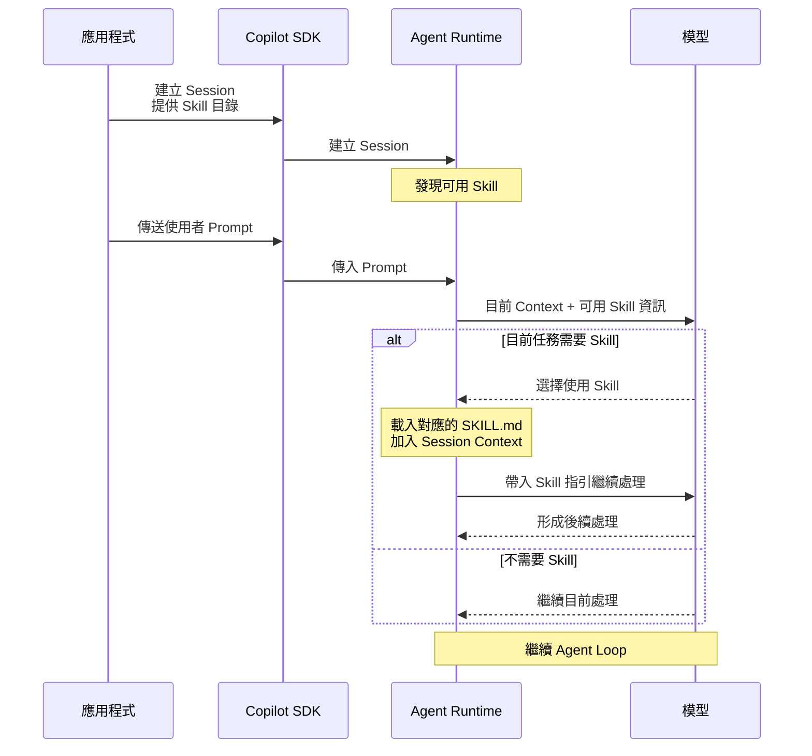

# Day 13 - Skills 實戰：封裝可重用的 Agent 工作方法

透過使用者輸入請求與結構化輸入，Agent 已經可以在資訊不足時向使用者取得必要條件，再帶著補充資料繼續原本的工作。不過，即使完成任務需要的資訊已經齊全，不同類型的工作仍可能需要遵循特定的檢查步驟、判斷方式與輸出規則。

如果這些工作方法每次都重新寫進 Prompt，同一套指引就容易散落在不同功能與工作流程中。Copilot SDK 可以透過 **技能（Skill）** 將這類工作方法獨立管理，讓 Agent 在需要時載入對應指引。

## Skill 如何封裝可重用的工作方法

有些任務雖然每次處理的資料不同，實際採用的工作步驟與判斷原則卻相對穩定。這類內容如果具有明確的適用情境，而且會在不同工作中反覆使用，就適合從單次 Prompt 中抽離，整理成可以重複載入的 Skill。

以 **版本發布準備度審查（Release Readiness Review）** 為例，應用程式可能需要反覆要求 Agent 檢查測試結果、資料遷移（Migration）、回滾（Rollback）與已知風險，再按照一致的判斷方式整理結果。

不同版本實際提供的資料會改變。例如某個版本準備部署到測試環境（staging）時，可能取得以下資訊：

```text
Release: 2026.08.21
Target environment: staging
Automated tests: 128 passed, 0 failed
Migration: required
Migration status: ready
Rollback plan: available
Known risk: refresh token rotation 尚未啟用
Risk disposition: staging 可以接受，production 前必須完成
```

這些內容描述的是目前版本的實際狀態。下一次發布時，測試結果、Migration 狀態與已知風險都可能不同。

比較穩定的是版本發布審查的方法。例如：

1. 確認測試結果。
2. 檢查資料遷移（Migration）是否準備完成。
3. 確認回滾（Rollback）是否可執行。
4. 評估已知風險是否已有明確處置。
5. 根據前面的資訊形成 **可發布（Ready）**、**需要進一步確認（Needs Review）** 或 **阻擋發布（Blocked）** 的判斷。

這些步驟描述的是「版本發布審查應該怎麼進行」，不屬於某一個特定版本。它們和前面的版本資料具有不同的維護週期，適合集中管理，再由不同工作重複使用。

GitHub 將 Skill 定位為可重用的 Prompt 模組。每個 Skill 以自己的目錄保存，核心內容放在 `SKILL.md` 中；當 Skill 被使用時，其中的指引會加入目前的 Session Context，讓 Agent 可以依照這套方法繼續處理工作。

因此，可以先將兩種內容分開：

* **Prompt**：描述目前版本、目標環境與實際執行資料。
* **Skill**：保存版本發布審查可以重複使用的檢查方式、判斷原則與輸出結構。

這樣的分工讓 Skill 專注保存可重用的工作方法，而目前任務的實際資料仍由 Prompt 與既有 Session Context 提供。以這個範例來說，`SKILL.md` 只負責版本發布審查的步驟、判斷原則與輸出方式，版本狀態則來自目前的 Session Context。

如果工作還需要進一步取得外部資料，例如查詢 CI 結果、讀取 Repository 或存取其他系統，就需要再搭配對應的 Tool、MCP 或其他受控能力完成。

| INFO: |
| :--- |
| [Agent Skills](https://agentskills.io/) 最初由 Anthropic 開發，並於 2025 年 10 月公開推出；同年 12 月再發布為支援跨平台使用的開放標準。目前 Agent Skills 規格定義了 `SKILL.md`、目錄結構與相關格式，GitHub Copilot 也支援這套 Skill 格式。Skill 因此不只是 Copilot SDK 專屬的設定方式，也可以作為支援 Agent Skills 系統之間共用的能力封裝格式。 |

## Skill 如何進入 Agent 執行流程

將工作方法整理成 Skill 後，下一個問題是 Agent 如何知道有哪些 Skill 可以使用，以及目前任務是否需要其中某一項能力。

Copilot SDK 的 Session 設定提供 `skillDirectories`，讓應用程式指定自訂 Skill 的來源目錄。Agent Runtime 可以從這些位置發現可用的 Skill；Prompt 進入執行流程後，Agent 再根據目前任務與 Skill 的 `description` 判斷相關性，需要使用時才載入對應的 `SKILL.md`，將其中的工作指引加入 Session Context。

把這段過程放回應用程式、Copilot SDK、Agent Runtime 與模型之間，可以表示成：



應用程式在建立 Session 時提供 Skill 來源，Agent Runtime 負責發現其中可用的 Skill。等使用者 Prompt 進入後，Agent 才根據目前任務判斷是否需要其中某項工作方法；如果需要，對應的 `SKILL.md` 會進入 Session Context，再沿著原本的 Agent Loop 繼續處理。

Skill 不會改變 Agent Loop 的基本結構。模型仍然根據目前的 Session Context 判斷下一步，Agent Runtime 也繼續負責推進 Turn 與協調工具。差別只在於 Skill 被使用後，多了一份目前任務可以遵循的工作指引。

提供 Skill 來源目錄給 Session，也不代表每一則訊息都會使用其中所有 Skill。Agent 仍會依照目前任務判斷是否需要載入；為了讓第一個範例更容易驗證，接下來會在 Prompt 中明確要求使用指定 Skill，減少模型選擇帶來的不確定性。

## 實作：建立第一個 Skill

前面已經整理了 Skill 如何保存可重用的工作方法，以及 Agent 如何在目前任務需要時載入對應指引。接下來透過一個最小範例，把 Skill 目錄、Session 設定與實際使用流程放進同一段程式中。

這個範例沿用固定的版本發布資料，不讀取 Repository、不呼叫外部服務，也不修改任何系統狀態，讓觀察重點集中在 Skill 本身，確認應用程式如何提供 Skill 來源、Agent 如何在需要時載入，以及工作方法如何和目前 Prompt 分開管理。

### 準備專案環境

先建立 Node.js 專案並啟用 ES Modules：

```bash
$ mkdir copilot-sdk-skills
$ cd copilot-sdk-skills
$ npm init -y --init-type module
$ mkdir -p src skills/release-readiness-review
```

接著安裝 Copilot SDK 與 TypeScript 執行環境：

```bash
$ npm install @github/copilot-sdk
$ npm install --save-dev @types/node typescript tsx
```

完成後，專案結構如下：

```text
copilot-sdk-skills/
├── skills/
│   └── release-readiness-review/
│       └── SKILL.md
├── src/
│   └── index.ts
└── package.json
```

每個 Skill 都放在自己的命名目錄中，並以 `SKILL.md` 保存主要指引。這裡使用 `skills/` 作為父目錄，後續也可以在其中加入其他 Skill。

### 建立 `SKILL.md`

建立 `skills/release-readiness-review/SKILL.md`，內容如下：

```markdown
---
name: release-readiness-review
description: 評估版本是否適合部署到目標環境。當任務需要根據測試結果、Migration、Rollback 與已知風險判斷版本發布準備度時使用。
---

# 版本發布準備度審查

只根據目前任務提供的資訊評估版本發布準備度。

依照以下流程進行：

1. 檢查必要資訊是否完整。
   - 確認目標環境已提供。
   - 確認自動化測試結果已提供。
   - 如果需要 Migration，確認 Migration 已準備完成。
   - 確認 Rollback Plan 是否可用。
   - 確認已知風險與對應處置。

2. 檢查阻擋條件。
   - 自動化測試失敗時，判定為 Blocked。
   - 必要的 Migration 尚未準備完成時，判定為 Blocked。
   - Rollback Plan 不可用時，判定為 Blocked。

3. 評估已知風險。
   - 確認每項已知風險對目前目標環境都有明確處置。
   - 如果仍有風險尚未決定，而且沒有其他阻擋條件，判定為 Needs Review。

4. 形成最終判斷。
   - Ready：必要資訊完整、沒有阻擋條件，而且已知風險都有明確處置。
   - Needs Review：沒有阻擋條件，但必要資訊不完整，或仍有風險需要進一步確認。
   - Blocked：至少符合一項阻擋條件。

不要自行補充目前任務沒有提供的版本資訊。

輸出以下內容：

- 判斷：Ready、Needs Review 或 Blocked
- 依據：支持判斷的主要資訊
- 風險：目前已知風險與處置
- 理由：形成判斷的原因
```

`SKILL.md` 建立完成後，可以再從檔案結構理解其中兩個主要部分。YAML Frontmatter 負責提供 Skill 的識別資訊與用途，Markdown 正文則保存真正要提供給 Agent 的工作方法。

這裡使用 `release-readiness-review` 作為 Skill 名稱，也讓它和目錄名稱保持一致。`name` 是技術識別名稱，因此維持符合規格的英文格式；`description` 與 Markdown 正文則使用中文，讓工作方法和目前應用程式的互動語言保持一致。

Agent Skills 規格要求 `SKILL.md` 包含 YAML Frontmatter，其中 `name` 與 `description` 為必要欄位。`name` 需要符合命名限制並與父目錄名稱一致，`description` 則描述 Skill 能做什麼以及何時適合使用；Markdown 正文本身沒有固定格式限制。

範例中的 Ready、Needs Review 與 Blocked 都是這套版本發布審查方法自行定義的判斷結果，用來驗證 Skill 如何封裝可重用的工作規則，不代表 Copilot 對版本發布準備度提供固定的判斷標準。

| NOTE: |
| :--- |
| Copilot SDK 的 Skills 文件目前將 YAML Frontmatter 描述為選用，並允許省略 `name` 時使用目錄名稱；Agent Skills 規格則要求 `name` 與 `description`。範例採用 Agent Skills 規格定義的格式，讓 Skill 維持較好的跨工具相容性。 |

### 建立 Skill 應用程式

`SKILL.md` 準備完成後，還需要透過 Session 將這個 Skill 來源接進 Agent Runtime。建立 `src/index.ts`：

```typescript
import path from "node:path";
import { fileURLToPath } from "node:url";
import { CopilotClient } from "@github/copilot-sdk";

const projectDirectory = path.resolve(
  path.dirname(fileURLToPath(import.meta.url)),
  "..",
);
const skillsDirectory = path.join(projectDirectory, "skills");

const releaseInfo = `Release: 2026.08.21
Target environment: staging
Automated tests: 128 passed, 0 failed
Migration: required
Migration status: ready
Rollback plan: available
Known risk: refresh token rotation 尚未啟用
Risk disposition: staging 可以接受，production 前必須完成`;

const client = new CopilotClient();

const session = await client.createSession({
  model: "auto",
  skillDirectories: [skillsDirectory],
  availableTools: ["builtin:skill"],
});

session.on("skill.invoked", (event) => {
  console.log(`[skill] invoked name=${event.data.name}`);
});

const response = await session.sendAndWait(
  {
    prompt:
      "請使用 release-readiness-review Skill，" +
      "根據以下資料判斷目前版本是否適合部署，" +
      "並只使用提供的資訊完成評估。\n\n" +
      releaseInfo,
  },
  120_000,
);

console.log("\nReview result:");
console.log(response?.data.content);

await session.disconnect();
await client.stop();
```

這份程式沿用前面已經建立的 Session 互動方式，新增的內容主要集中在 Skill 來源、可用工具與使用事件。應用程式先準備 Skill 目錄與固定的版本發布資料，再建立 Session、送出 Prompt，最後等待 Agent 完成審查。

目前 Session 只保留 Runtime 的 `skill` 內建工具，不讓檔案、Shell 或其他外部工具介入，讓後面的觀察集中在 Skill 如何被發現、載入與使用。

### 將 Skill 載入 Session

完整程式建立後，可以先從 Skill 來源看起。範例先取得 `skills/` 的絕對路徑：

```typescript
const skillsDirectory = path.join(projectDirectory, "skills");
```

建立 Session 時，再透過：

```typescript
skillDirectories: [skillsDirectory],
```

指定 Skill 的來源目錄。

這裡可以把 Skill 進入 Session 的過程分成兩個階段理解。`skillDirectories` 先讓 Agent Runtime 知道要從哪些位置發現可用的 Skill，並不代表這些目錄中的所有 `SKILL.md` 都會立即完整加入 Session Context。等 Agent 判斷目前任務需要某項 Skill 時，才會載入對應的 `SKILL.md`，讓其中的工作指引進入目前執行脈絡。

目前 Copilot SDK 文件的 Skill 目錄結構，是讓 `skillDirectories` 指向父目錄，再由 CLI 從它的直接子目錄尋找 `SKILL.md`：

```text
skills/
├── release-readiness-review/
│   └── SKILL.md
└── another-skill/
    └── SKILL.md
```

這樣同一個 Session 可以從一個父目錄發現多個 Skill，應用程式不需要為每一個 `SKILL.md` 分別建立設定。

範例另外設定：

```typescript
availableTools: ["builtin:skill"],
```

這項設定限制目前 Session 可以使用的工具範圍。版本發布資料已經直接放進 Prompt，不需要讀取檔案、執行 Shell 或呼叫其他服務，因此可以排除和目前驗證無關的執行能力。

`skillDirectories` 決定 Agent Runtime 可以從哪些位置發現 Skill，`availableTools` 則控制目前 Session 可以使用哪些工具。前者處理工作方法的來源，後者限制實際執行能力，兩者位在不同的責任層級。

### 定義 Skill 的適用情境

Session 已經知道去哪裡尋找 Skill，下一個問題是 Agent 如何判斷某項 Skill 是否和目前任務有關。這項資訊主要來自 `SKILL.md` 的 `description`：

```yaml
description: 評估版本是否適合部署到目標環境。當任務需要根據測試結果、Migration、Rollback 與已知風險判斷版本發布準備度時使用。
```

這段描述同時說明 Skill 提供什麼工作方法，以及適合在哪些情境使用。當 Skill 數量增加後，清楚的用途邊界也會更加重要。

例如只寫成「協助處理版本發布」，雖然說明了大致領域，卻沒有指出實際負責什麼工作。範例使用的描述則明確包含版本發布準備度、測試結果、Migration、Rollback 與已知風險，也說明適用於判斷版本是否能部署到目標環境。這些資訊能讓 Agent 更容易判斷目前任務是否和這項 Skill 有關。

Skill 名稱則提供穩定的識別方式：

```yaml
name: release-readiness-review
```

範例在 Prompt 中直接要求使用 `release-readiness-review` Skill，降低第一次驗證時「Agent 是否自行判斷需要 Skill」帶來的不確定性。

一般使用情境不需要每一則 Prompt 都明確指定 Skill。只要目前 Session 可以發現這項能力，Agent 就能根據 Prompt 與 Skill 的描述判斷是否需要使用；是否實際選擇某個 Skill，仍然屬於 Agent 執行期間的判斷結果。

### 觀察 Skill 的實際使用

Skill 的用途與適用情境設定完成後，還需要確認 Agent 在實際執行期間是否真的使用了這項能力。Session 提供 `skill.invoked` 事件，讓應用程式可以觀察哪個 Skill 已經進入目前的執行流程：

```typescript
session.on("skill.invoked", (event) => {
  console.log(`[skill] invoked name=${event.data.name}`);
});
```

目前官方事件定義中的 `skill.invoked` 會提供 `name`、`path` 與實際載入的 `content`，也可能包含 `allowedTools` 與 Plugin 來源資訊。範例只輸出 Skill 名稱，就足以確認目前工作使用的是哪項能力。

實際應用通常也不需要把完整 `content` 寫入一般日誌。Skill 可能包含內部工作規則、腳本說明或其他不適合直接保存的內容；如果目的只是追蹤 Agent 使用了哪項能力，記錄名稱與必要的執行關聯資訊即可。

`skill.invoked` 表示 Skill 已經進入目前執行流程，但最後的自然語言回答，以及模型如何根據 Skill 與版本資料組織內容，仍然可能隨模型與 Session Context 而有所不同。

### 執行應用程式

完成 Skill、Session 設定與事件觀察後，就可以執行程式：

```bash
$ npx tsx src/index.ts
```

Skill 正常被目前工作使用時，終端機會先看到對應的 Skill 使用事件，再輸出版本發布審查結果。

實際文字內容可能不同，但可以從回答中觀察 Skill 定義的工作方法，例如先檢查測試、Migration 與 Rollback，再處理已知風險，最後整理判斷、依據、風險與理由。

範例資料中的測試全部通過，Migration 已經準備完成，也有可用的 Rollback Plan；已知風險則明確說明 staging 可以接受。因此，依照 Skill 定義的判斷規則，預期結果會是 `Ready`。

實際驗證時主要確認兩件事：`release-readiness-review` 是否真的進入目前的執行流程，以及最後回答是否依照 Skill 中的工作方法使用提供的版本資料。自然語言的實際表達不需要每次完全相同。

## Skill 的定位與使用邊界

Skill 適合保存只有特定任務需要的詳細工作方法。如果某項規則幾乎適用所有工作，例如 Repository 的共通開發慣例或基本溝通要求，通常更適合放在自訂指引（Custom Instructions）。GitHub 目前也建議將廣泛適用的簡單規則與只有特定任務需要的詳細 Skill 指引分開管理。

Skill 和 Tool / MCP 的責任也不同。Skill 可以要求 Agent「確認目前版本的測試結果」，但如果這項資料沒有出現在 Prompt 或既有 Session Context 中，Skill 本身不會因此取得測試資料。真正需要查詢 CI、讀取 Repository、存取資料庫或呼叫外部服務時，仍然要由 Tool、MCP 或其他可用能力取得實際資訊。

可以將這幾層責任整理成：

* **Prompt**：描述目前要完成的工作與本次輸入。
* **Skill**：提供特定任務可以重複使用的工作方法。
* **Tool / MCP**：提供取得資料或執行操作所需要的實際能力。
* **應用程式**：決定目前 Session 能使用哪些能力，並負責產品本身的身分、授權與業務政策。

Skill 中的自然語言指引也不能取代應用程式的執行控制。即使 Skill 要求 Agent 只處理目前使用者有權限的資料，真正執行 Tool 或存取產品資源時，Handler 與後端服務仍然需要根據已驗證的身分完成 Authorization；需要批准的操作，也仍應交由 Permission 與應用程式政策決定。

Skill 如果進一步使用腳本、額外工具或其他資源，也會擴大需要檢查的能力與信任範圍。載入外部 Skill 前仍應確認實際內容與依賴，並檢查相關操作是否符合目前應用程式的執行政策。

| INFO: |
| :--- |
| Agent Skills 規格也允許 Skill 目錄加入 `scripts/`、`references/`、`assets/` 等額外資源，讓較複雜的工作方法可以搭配腳本、參考資料與其他檔案使用。相關目錄結構與用途可以參考 [Agent Skills Specification](https://agentskills.io/specification)。 |

## 小結

Skill 讓特定任務可以重複使用同一套工作方法，不需要把完整指引持續複製到每一則 Prompt：

* 每個 Skill 都可以透過 `SKILL.md` 保存自己的用途與工作指引，讓工作方法和單次任務輸入分開管理。
* Session 建立時可以透過 `skillDirectories` 提供可發現的 Skill 來源，再由 Agent 根據目前任務選擇需要的能力。
* Skill 的用途與適用情境可以透過 `description` 描述，協助 Agent 判斷目前工作是否需要這項能力。
* 實際執行期間，可以透過 `skill.invoked` 觀察目前工作啟用了哪個 Skill。
* Prompt、Skill 與 Tool / MCP 分別承擔本次輸入、可重用工作方法與實際執行能力，各自維持清楚的責任範圍。

將工作方法從單次 Prompt 中抽離後，同一套指引就能在不同工作中重複使用，也可以獨立調整與驗證。應用程式則繼續決定目前 Session 可以使用哪些 Skill，以及這些工作方法實際能搭配哪些資料與執行能力。
