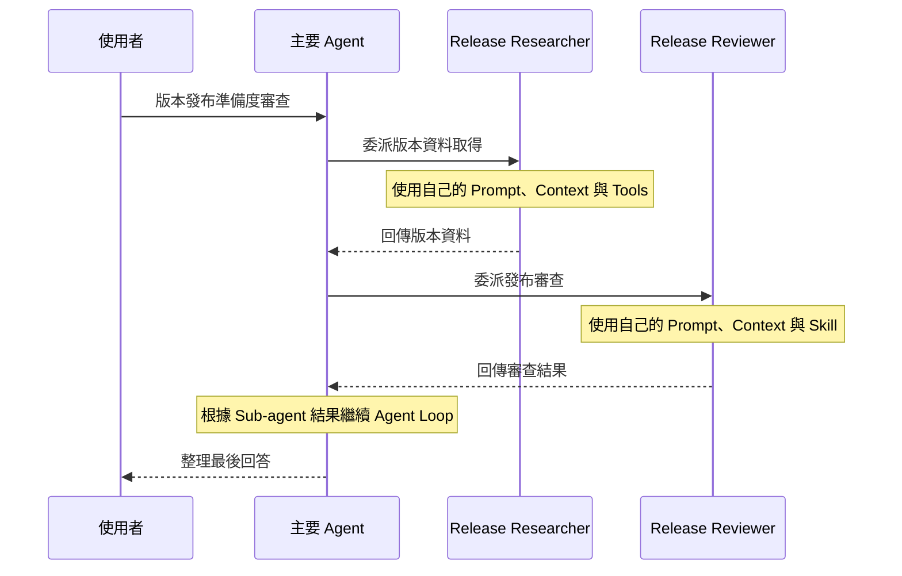

# Day 14 - 自訂 Agent 與 Sub-agent：建立角色分工與能力邊界

Skill 可以將版本發布準備度審查的檢查步驟、判斷原則與輸出格式整理成可重用的工作指引，讓 Prompt 專注描述目前任務需要的資料與條件。當 Agent App 進一步同時處理資料取得、審查判斷與結果整理等不同工作時，除了工作方法如何重用，也需要進一步考慮這些工作是否適合繼續由同一個角色負責。

不同工作可能需要各自的 Prompt、Tools、Skills，甚至 Model。如果所有責任都集中在同一個 Agent 上，角色定位與能力範圍就會逐漸模糊。GitHub Copilot SDK 可以透過 **自訂 Agent（Custom Agent）** 將這些工作拆成不同的專門角色，分別配置需要的工作指引與能力，再由 Agent Runtime 根據目前任務進行委派。

## 從單一 Agent 到多角色協作

以先前建立的版本發布準備度審查為例，版本、目標環境、測試結果、Migration、Rollback 與已知風險都直接放在 Prompt 中，再由 `release-readiness-review` Skill 提供審查方法。不過，實際應用中的版本資訊通常還需要從發布系統、CI 或其他資料來源取得。

當同一個 Agent 同時負責取得資料、套用審查方法與形成最後判斷，工作就開始包含不同性質的責任。一部分需要確認版本資訊、測試結果與已知風險等客觀狀態；另一部分則根據既定方法檢查這些資料，判斷目前版本是否可以發布、需要進一步確認，或應該阻擋發布。

如果這些工作都留在同一個 Agent 中，所有 Prompt、Context 與能力也會集中在同一個執行角色。隨著任務變得更複雜，單一 Agent 不只需要知道如何協調整體工作，也必須同時承擔各項專門任務需要的指引與工具。這時可以進一步將工作拆成多個具有明確責任的角色，再由主要 Agent 負責協調與整合結果。

在目前的版本發布準備度審查中，可以拆成 **版本資料研究角色（Release Researcher）** 與 **發布審查角色（Release Reviewer）**。研究角色負責取得實際資料，不決定版本能否發布；審查角色則根據取得的資料與既有審查方法形成判斷。主要 Agent 不需要自己承擔兩項專門工作，而是負責決定需要哪個角色、傳遞目前工作的必要資訊，並根據回傳結果繼續推進任務。

這種由主要 Agent 協調多個專門角色的方式，可以視為 Multi-agent 協作的基本形式。每個角色聚焦自己的責任，實際被委派後形成 Sub-agent 執行，再將結果交回主要 Agent。自訂 Agent 可以讓這些角色差異反映在幾個面向：

* **責任分工明確**：研究角色取得實際狀態，審查角色負責審查與判斷，各自處理自己的工作範圍。
* **執行脈絡聚焦**：Sub-agent 在自己的工作脈絡中處理被委派的內容，不需要承擔整段工作的所有 Context。
* **能力範圍受控**：研究角色使用查詢版本資料的工具，審查角色使用版本發布準備度審查的 Skill，各自只取得需要的能力。
* **主要角色協調**：主要 Agent 根據目前任務進行委派，再整合各個角色回傳的結果，繼續原本的 Agent Loop。

是否需要建立多個角色，關鍵仍然在於工作之間是否存在實際的責任差異。如果只是讓同一個 Agent 遵循固定的檢查流程，使用 Skill 即可；當不同工作需要自己的 Prompt、Context 或能力範圍時，再拆成自訂 Agent，讓主要 Agent 與 Sub-agent 各自承擔不同責任，會更容易維持清楚的執行邊界。

## 自訂 Agent 如何建立角色分工

Multi-agent 協作要能形成清楚的責任分工，不能只替不同工作取不同的角色名稱，還需要讓每個角色真正擁有自己的工作指引與能力範圍。Copilot SDK 透過自訂 Agent 描述這些專門角色，再由 Agent Runtime 在需要時將工作委派出去。

自訂 Agent 是附加在 Session 上的具名角色設定。建立 Session 時，可以透過 `customAgents` 提供多個角色，每個角色至少需要 `name` 與 `prompt`，再依照工作需求補上角色描述與能力設定。

幾個和角色分工最直接相關的設定包括：

* **`name`**：自訂 Agent 的唯一識別名稱，讓 Runtime 與應用程式辨識不同角色。
* **`displayName`**：提供較容易閱讀的顯示名稱，可以用在事件資訊或使用者介面。
* **`description`**：描述角色適合處理的工作，協助 Runtime 判斷目前任務是否適合交給這個角色。
* **`prompt`**：定義角色執行期間使用的 System Prompt，描述角色應如何處理被委派的工作。
* **`tools`**：指定角色可以使用的工具，限制角色實際取得的操作能力。
* **`skills`**：指定角色啟動時預載的 Skill，提供執行工作需要的方法與指引。
* **`model`**：指定角色執行期間使用的 Model，讓不同角色可以依工作需要使用不同模型。
* **`infer`**：控制 Runtime 是否可以自動選擇這個角色，預設為 `true`。

其中，`description` 用來描述角色適合承接什麼工作，`prompt` 則定義角色真正開始執行後應如何處理。角色之間除了工作方式，也可以透過 `tools` 與 `skills` 取得不同能力，讓角色分工實際反映在 Runtime 可以使用的執行資源上。

以版本發布準備度審查為例，研究角色只需要 `get_release_status` 取得版本狀態；審查角色則不需要資料工具，而是預載既有的 `release-readiness-review` Skill。前者負責取得事實，後者負責依照既定方法形成發布判斷，主要 Agent 則保留協調兩項工作的責任。

`skills` 中指定的 Skill 會從 Session 的 `skillDirectories` 解析，並在 Sub-agent 啟動時預載進角色 Context，不需要再呼叫 `skill` 工具。Sub-agent 也不會自動繼承主要 Agent 的 Skills，需要使用時應在對應角色中明確指定。

自訂 Agent 可以透過 `tools` 限制實際取得的工具。角色只需要特定能力時，應明確列出工具範圍，避免直接取得 Session 中所有可用工具。將這些角色加入 Session 後，只是先建立可以參與協作的角色定義；真正被 Runtime 委派後，才會形成對應的 Sub-agent 執行。

| NOTE: |
| :--- |
| Prompt 中要求角色「不要使用某項工具」只能提供行為指引。如果某項能力不應交給這個角色，應直接從 `tools` 中移除，避免角色在 Runtime 中取得不需要的工具。 |

## 自訂 Agent 如何進入 Agent 執行流程

將自訂 Agent 加入 Session，只代表目前多了一組可以承接專門工作的角色。使用者送入 Session 的訊息仍然會先進入原本的 Agent 執行流程，自訂 Agent 不會因為完成設定就各自開始工作，也不會讓每一則訊息同時交給所有角色處理。

當主要 Agent 判斷目前工作適合交給某個專門角色時，Agent Runtime 可以根據任務內容與自訂 Agent 的角色資訊進行選擇，再將部分工作委派出去。被選中的自訂 Agent 會形成一次 Sub-agent 執行，使用自己的 Prompt、Context 與能力範圍處理被委派的內容。Sub-agent 完成後，結果會回到主要 Agent，再由目前的 Agent Loop 根據新取得的資訊決定後續處理。

以版本發布準備度審查為例，主要 Agent 可以先委派研究角色取得實際版本資料，再將取得的內容交給審查角色形成發布判斷。整段角色協作可以表示成：



圖中呈現的是目前範例的角色委派順序。主要 Agent 先將版本資料取得交給研究角色，取得結果後再委派發布審查角色完成判斷。每次 Sub-agent 完成後，結果都會回到主要 Agent，再由目前的 Agent Loop 繼續處理。

這樣的執行方式也說明了 Multi-agent 協作中的基本分工。主要 Agent 負責協調工作與整合結果，專門角色則只處理被委派的部分，不需要承擔整段任務的所有 Context 與能力。實際是否進行委派，以及委派的次數與執行細節，仍然由 Runtime 根據目前任務與角色設定決定。

自訂 Agent 與 Sub-agent 因此代表不同階段。自訂 Agent 是附加在 Session 上、可以重複使用的角色定義；只有 Runtime 實際將工作委派給這個角色後，才會形成目前這一次 Sub-agent 執行。同一個自訂 Agent 可以在不同工作中再次被使用，每次委派則分別形成自己的執行過程。

## 實作：建立自訂 Agent 的角色分工

接下來沿用既有的版本發布準備度審查專案。原本的 `release-readiness-review` Skill 不需要修改，只需要加入固定資料工具與兩個自訂 Agent，讓資料取得與發布審查分別交給不同角色。

原本的範例將版本資料直接放進 Prompt，調整後改由研究角色透過工具取得。審查角色再使用既有 Skill 根據取得的資料形成審查結果，讓新增的變因集中在角色設定、Sub-agent 委派與能力範圍。

### 準備專案環境

沿用既有的 `copilot-sdk-skills` 專案：

```text
copilot-sdk-skills/
├── skills/
│   └── release-readiness-review/
│       └── SKILL.md
├── src/
│   └── index.ts
└── package.json
```

`release-readiness-review/SKILL.md` 直接沿用既有內容，不需要重新建立。由於範例新增自訂工具，因此再安裝 Zod：

```bash
$ npm install zod
```

其餘 Copilot SDK 與 TypeScript 執行環境都沿用原本專案。

### 建立自訂 Agent 應用程式

更新 `src/index.ts`：

```typescript
import path from "node:path";
import { fileURLToPath } from "node:url";
import { CopilotClient, defineTool } from "@github/copilot-sdk";
import { z } from "zod";

const projectDirectory = path.resolve(path.dirname(fileURLToPath(import.meta.url)), "..");
const skillsDirectory = path.join(projectDirectory, "skills");

const releaseStatus = {
  release: "2026.08.21",
  targetEnvironment: "staging",
  automatedTests: { passed: 128, failed: 0 },
  migration: { required: true, status: "ready" },
  rollbackPlan: "available",
  knownRisk: "refresh token rotation 尚未啟用",
  riskDisposition: "staging 可以接受，production 前必須完成",
};

const getReleaseStatus = defineTool("get_release_status", {
  description: "取得目前版本發布準備度審查需要的固定版本狀態",
  parameters: z.object({}),
  defer: "never",
  skipPermission: true,
  handler: async () => releaseStatus,
});

const client = new CopilotClient();

const session = await client.createSession({
  model: "auto",
  workingDirectory: projectDirectory,
  tools: [getReleaseStatus],
  skillDirectories: [skillsDirectory],
  defaultAgent: {
    excludedTools: ["get_release_status", "skill"],
  },
  customAgents: [
    {
      name: "release-researcher",
      displayName: "Release Researcher",
      description: "取得版本發布準備度審查需要的實際版本狀態。",
      tools: ["get_release_status"],
      prompt:
        "請使用 get_release_status 取得目前版本的實際狀態。" +
        "完整整理取得的資料，不要自行判斷 Ready、Needs Review 或 Blocked。",
    },
    {
      name: "release-reviewer",
      displayName: "Release Reviewer",
      description: "根據版本狀態評估目前版本是否適合部署到目標環境。",
      tools: [],
      skills: ["release-readiness-review"],
      prompt:
        "請根據被委派工作中提供的版本資料完成審查。" +
        "使用預載的版本發布準備度審查方法，" +
        "不要自行補充目前沒有提供的版本資訊。",
    },
  ],
});

session.on((event) => {
  switch (event.type) {
    case "subagent.selected":
      console.log(`[subagent] selected ${event.data.agentDisplayName}`);
      break;
    case "subagent.started":
      console.log(
        `[subagent:${event.data.toolCallId}] started ${event.data.agentDisplayName}`,
      );
      break;
    case "subagent.completed":
      console.log(
        `[subagent:${event.data.toolCallId}] completed ${event.data.agentDisplayName}`,
      );
      break;
    case "subagent.failed":
      console.error(
        `[subagent:${event.data.toolCallId}] failed ` +
          `${event.data.agentDisplayName}: ${event.data.error}`,
      );
      break;
    case "tool.execution_start":
      console.log(
        `[tool:${event.data.toolCallId}] start ${event.data.toolName} ` +
          `agent=${event.agentId ?? "main"}`,
      );
      break;
  }
});

const response = await session.sendAndWait(
  {
    prompt:
      "請完成這次版本發布準備度審查。" +
      "先委派 release-researcher 取得目前版本的實際資料，" +
      "再將取得的資料交給 release-reviewer 完成審查。" +
      "最後整理審查結果與主要理由。" +
      "請只根據這兩個角色取得與判斷的內容回答。",
  },
  120_000,
);

console.log("\nReview result:");
console.log(response?.data.content);

await session.disconnect();
await client.stop();
```

這份程式將資料取得與發布審查分配給不同角色，主要 Agent 則保留協調與整理結果的責任。接下來再拆開其中的工具、角色能力範圍與 Sub-agent 事件，確認這些設定如何反映在實際執行流程中。

### 準備角色需要的工具

原本的範例將版本資料直接保存在 `releaseInfo` 字串中。為了讓研究角色負責取得資料，這裡將同一批固定資料改成應用程式中的物件，再透過 `get_release_status` 提供給研究角色：

```typescript
const getReleaseStatus = defineTool("get_release_status", {
  description: "取得目前版本發布準備度審查需要的固定版本狀態",
  parameters: z.object({}),
  defer: "never",
  skipPermission: true,
  handler: async () => releaseStatus,
});
```

這支工具只回傳應用程式中的固定資料，不連接發布服務、CI 或其他外部系統，也不產生寫入副作用，因此使用 `skipPermission: true`。`defer: "never"` 則讓工具直接提供給取得這項能力的角色，不把 Tool Search 一起帶進目前範例。

實際服務中，`get_release_status` 可以改成查詢發布系統、CI 或其他正式資料來源；目前維持固定資料，是為了將觀察重點留在角色分工與委派流程。

### 建立版本資料研究與發布審查角色

研究角色只負責取得目前版本狀態：

```typescript
{
  name: "release-researcher",
  displayName: "Release Researcher",
  description: "取得版本發布準備度審查需要的實際版本狀態。",
  tools: ["get_release_status"],
  prompt:
    "請使用 get_release_status 取得目前版本的實際狀態。" +
    "完整整理取得的資料，不要自行判斷 Ready、Needs Review 或 Blocked。",
}
```

這個角色沒有配置 `skills`，需要的只有版本資料，不負責套用發布審查方法。

審查角色則使用不同的能力：

```typescript
{
  name: "release-reviewer",
  displayName: "Release Reviewer",
  description: "根據版本狀態評估目前版本是否適合部署到目標環境。",
  tools: [],
  skills: ["release-readiness-review"],
  prompt:
    "請根據被委派工作中提供的版本資料完成審查。" +
    "使用預載的版本發布準備度審查方法，" +
    "不要自行補充目前沒有提供的版本資訊。",
}
```

`tools: []` 代表審查角色沒有額外工具可以使用；`skills` 則將 `release-readiness-review` 預載進角色 Context。審查角色不需要自己查詢版本狀態，也不需要透過 `skill` 工具另外載入審查方法。

研究角色因此負責「取得事實」，審查角色則負責「根據方法形成判斷」。兩個角色的差異同時反映在 Prompt 與實際取得的能力中。

### 限制主要 Agent 的工具範圍

版本資料工具與 Skill 都不需要直接交給主要 Agent。範例透過：

```typescript
defaultAgent: {
  excludedTools: ["get_release_status", "skill"],
},
```

將 `get_release_status` 與內建的 `skill` 工具從主要 Agent 的工具清單中移除。

`get_release_status` 仍然註冊在 Session，因此可以由明確列出這支工具的研究角色使用。`release-readiness-review` 則透過 `skills` 直接預載到審查角色，不依賴 `skill` 工具。

這樣可以讓主要 Agent 保留協調責任：需要實際版本資料時委派研究角色，需要套用正式審查方法時則委派審查角色，而不直接取得兩邊的專門能力。

### 觀察 Sub-agent 執行事件

自訂 Agent 實際被使用後，目前 Session 會收到對應的 Sub-agent 生命週期事件。這個範例主要觀察：

```text
subagent.selected
subagent.started
subagent.completed
subagent.failed
```

`subagent.selected` 表示 Runtime 選擇某個自訂 Agent 處理目前工作；`subagent.started` 表示 Sub-agent 已經開始執行。正常完成時會收到 `subagent.completed`，失敗則會收到 `subagent.failed`。

其中，`subagent.started`、`subagent.completed` 與 `subagent.failed` 都會提供 `toolCallId`，可以串起同一次 Sub-agent 執行：

```typescript
case "subagent.started":
  console.log(
    `[subagent:${event.data.toolCallId}] started ${event.data.agentDisplayName}`,
  );
  break;

case "subagent.completed":
  console.log(
    `[subagent:${event.data.toolCallId}] completed ${event.data.agentDisplayName}`,
  );
  break;
```

Sub-agent 執行期間產生的其他 Session 事件也會進入目前 Session 的事件流，並在事件外框帶有 `agentId`。範例因此也在 `tool.execution_start` 中輸出這個欄位：

```typescript
case "tool.execution_start":
  console.log(
    `[tool:${event.data.toolCallId}] start ${event.data.toolName} ` +
      `agent=${event.agentId ?? "main"}`,
  );
  break;
```

當 `get_release_status` 由研究角色執行時，就能利用事件來源確認工具呼叫發生在 Sub-agent 的執行範圍中。

自訂 Agent 沒有另外建立一套事件機制。角色選擇、Sub-agent 生命週期與其中產生的工具事件仍然沿用既有 Session event stream，應用程式可以在同一條事件流中觀察整段工作。

### 執行應用程式

完成設定後，執行：

```bash
$ npx tsx src/index.ts
```

實際的事件數量、順序與自然語言回答可能依 Runtime 執行結果不同。以下節錄和角色分工最相關的輸出：

```text
[tool:<tool-call-id>] start task agent=main
[subagent:<tool-call-id>] started Release Researcher
[tool:<tool-call-id>] start get_release_status agent=<agent-id>
[subagent:<tool-call-id>] completed Release Researcher
[tool:<tool-call-id>] start task agent=main
[subagent:<tool-call-id>] started Release Reviewer
[subagent:<tool-call-id>] completed Release Reviewer

Review result:

Ready

目前版本適合部署到 staging。自動化測試全部通過，
Migration 與 Rollback Plan 已準備完成，
已知風險也有明確的後續處置。
```

從這段執行結果可以看到，主要 Agent 先委派研究角色，`get_release_status` 也確實在研究角色的執行範圍中呼叫；研究工作完成後，再委派發布審查角色形成判斷。依照目前固定資料，最後得到 `Ready`。

## 自訂 Agent 的角色與能力邊界

前面的範例將版本發布準備度審查拆成三層責任。主要 Agent 負責協調，研究角色取得實際資料，審查角色則使用既有 Skill 形成審查結果。角色分工建立之後，還需要進一步確認每個角色實際可以取得哪些能力，避免原本已經拆開的責任又因工具或工作方法的共用而重新混在一起。

自訂 Agent 的能力範圍不只由單一角色的設定決定。Session 會先建立整體可用能力，主要 Agent 與各個自訂 Agent 再根據自己的設定取得其中需要的部分。幾個和目前範例直接相關的設定可以整理如下：

| 設定位置                         | 作用範圍       | 用途                     |
| ---------------------------- | ---------- | ---------------------- |
| Session `availableTools`     | 整個 Session | 只讓指定工具進入 Session 的可用能力 |
| Session `excludedTools`      | 整個 Session | 將指定工具排除在所有 Agent 之外    |
| `defaultAgent.excludedTools` | 主要 Agent   | 將特定工具保留給 Sub-agent 使用  |
| `customAgents[].tools`       | 單一自訂 Agent | 限制角色可以取得哪些工具           |
| `customAgents[].skills`      | 單一自訂 Agent | 預載角色需要的工作方法            |

Session-level 的 `availableTools` 與 `excludedTools` 會先決定整個 Session 可以使用哪些工具，再由 `defaultAgent.excludedTools` 進一步縮小主要 Agent 的工具範圍。如果某支工具已經在 Session 層被排除，自訂 Agent 即使將它列入自己的 `tools`，也無法重新取得。

`skills` 處理的是另一個層次的能力。它不提供外部操作，而是將指定的工作方法預載到角色 Context。在目前的角色配置中，研究角色只有資料取得工具，審查角色則預載 `release-readiness-review`，也維持既有的分工：Tool 提供實際資訊，Skill 提供處理資訊的方法。

是否需要建立自訂 Agent，可以從實際責任判斷：

* **重用工作方法**：如果只需要讓相同角色遵循固定的檢查流程，使用 Skill 即可。
* **拆分工作責任**：如果不同工作需要自己的 Prompt、Context、Tools 或 Skills，可以考慮建立自訂 Agent。
* **提供執行能力**：如果只是需要查詢資料或執行一項應用程式能力，直接使用自訂工具即可。
* **接入外部服務**：如果工具由獨立程序或服務維護，則可以透過 MCP 接入，不需要因此另外建立角色。

角色名稱本身不需要成為拆分理由。如果兩個角色最後使用完全相同的工作方式與能力，而且沒有實際的責任差異，維持單一 Agent 通常會更容易理解與維護。

自訂 Agent 的工具範圍與 Sub-agent 的 Context 隔離，只限制 Runtime 中角色可以取得的能力與工作脈絡，不能取代應用程式本身的存取控制。真正讀取或操作應用程式管理的資料與資源時，仍應根據已驗證的使用者身分與權限判斷是否允許。

## 小結

自訂 Agent 讓同一個 Session 可以依照工作責任拆成不同角色，再由 Agent Runtime 根據目前任務進行委派。角色之間除了 Prompt 不同，也可以分別配置需要的 Tools、Skills 與 Model，讓工作方式與能力範圍跟著責任一起拆開：

* 自訂 Agent 定義可以重複使用的專門角色，實際被委派後才形成一次 Sub-agent 執行。
* Sub-agent 在自己的 Context 與能力範圍中處理工作，完成後再將結果交回主要 Agent。
* `customAgents[].tools`、`customAgents[].skills` 與 `defaultAgent.excludedTools` 可以進一步控制不同角色實際取得的能力。
* Sub-agent 的生命週期與工具執行仍然沿用目前 Session 的事件流，應用程式可以在同一套事件機制中持續觀察。

Skill 著重保存可重用的工作方法，自訂 Agent 則進一步處理角色本身的責任、執行脈絡與能力範圍。當一段 Agent 工作開始出現明確的角色差異時，自訂 Agent 就能把這些差異直接反映在 Runtime 的執行流程中。
