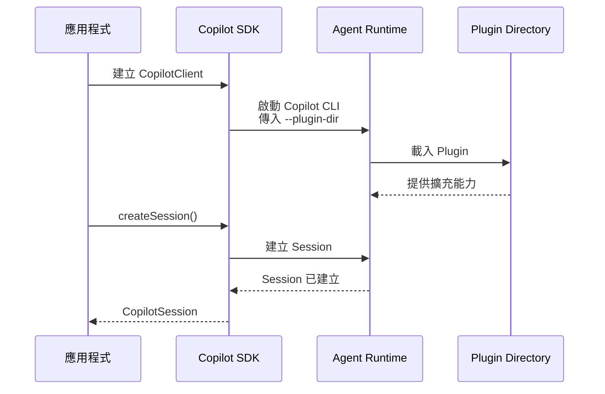

# Day 15 - Plugin Directories：封裝與交付 Agent 擴充能力

自訂 Agent 讓不同角色可以擁有自己的工作指引與能力範圍，再由 Agent Runtime 根據任務進行委派。當 Agent App 持續加入 Skill、MCP、自訂 Agent 與其他擴充後，這些能力也開始形成彼此相關的組合。如果每個應用程式都分別維護角色、工作方法與整合設定，相同能力要提供給不同專案或執行環境時，就容易出現重複設定與版本不一致的問題。

GitHub Copilot 提供 **Plugin Directory**，讓彼此相關的 Agent 擴充能力可以整理成同一個 Plugin，作為可以重複載入與交付的能力單位。當 Agent 能力開始跨越單一應用程式，如何將這些擴充集中管理並維持一致，也就成為新的工程問題。

## 什麼是 Plugin？

**Plugin** 是一組可以一起載入與交付的 Agent 擴充能力，**Plugin Directory** 則是保存這些能力的目錄。Plugin 可以組合 Skill、MCP Server，以及 GitHub Copilot 支援的自訂 Agent、Hook 與其他擴充，再由 Runtime 載入其中的能力。

前面的文章大多直接透過 Session 設定加入這些能力。例如 `skillDirectories` 指定 Skill 來源、`customAgents` 提供自訂 Agent，`mcpServers` 則接入 MCP Server。這些設定由應用程式在建立 Session 時直接組裝，適合處理和目前工作流程緊密相關的能力。

當幾項相關能力開始需要一起維護時，就可以進一步用 Plugin 將它們整理成獨立的能力單位。角色、工作方法與其他整合設定可以脫離單一 Session 設定，由不同應用程式重複載入；進入 Runtime 後，各項能力仍然沿用原本的執行方式。自訂 Agent 仍然可以形成 Sub-agent，Skill 也繼續提供特定任務需要的工作方法。

從能力與應用程式之間的關係來看，可以先分成兩類：

* **應用程式專屬能力**：例如目前系統提供的資料來源、自訂工具與依賴產品流程的整合設定，通常會隨應用程式本身的需求與執行環境改變。
* **可獨立重用的能力**：例如特定角色、工作方法或一組彼此相關的 Agent 設定，較適合脫離單一應用程式，集中維護並提供給不同使用端載入。

前一類通常需要保留在應用程式中，因為它們和實際資料、執行環境或產品流程直接相關；後一類如果開始形成穩定的能力組合，就可以考慮整理成 Plugin，讓不同應用程式沿用相同的角色與工作方式。

| INFO: |
| :--- |
| GitHub 於 2026 年 8 月推出 **Agent Plugins 1.0**，讓 Agent Skill、MCP Server 與其他擴充能力可以整理進同一個 Plugin，並在 VS Code、Copilot CLI、GitHub Copilot SDK 與 Copilot app 等支援端共用。這套格式主要用來降低不同 Agent Client 各自維護目錄結構與 Manifest 的重複成本。 |

## Plugin 如何封裝 Agent 擴充能力

Plugin 以目錄作為基本單位，根目錄使用 `plugin.json` 描述 Plugin 的基本資訊，再依照擴充能力的類型放到對應位置。

例如，同時包含自訂 Agent 與 Skill 的 Plugin，可以整理成：

```text
example-plugin/
├── plugin.json
├── skills/
│   └── example-skill/
│       └── SKILL.md
└── com.github.copilot/
    └── agents/
        └── example-agent.agent.md
```

`plugin.json` 描述整個 Plugin，`skills/` 放置可以跨支援端共用的 Skill，`com.github.copilot/agents/` 則保存 Copilot 專屬的自訂 Agent。其他擴充也有各自的設定位置，例如 Hook、MCP Server 與 LSP；Plugin 只需要包含目前這套能力真正使用的部分。

整理進 Plugin 後，各項擴充原本的責任不會改變。自訂 Agent 仍然描述角色與能力範圍，Skill 繼續保存可重用的工作方法，MCP Server 提供外部工具與資料來源，Hook 則在對應的執行階段介入處理。Plugin 增加的是共同的封裝與交付邊界，讓彼此相關的能力可以一起維護與載入。

Plugin 提供的擴充也可以和建立 Session 時直接提供的能力一起使用。和目前工作或應用程式直接相關的工具與設定，可以繼續由 Session 提供；適合獨立維護與重複交付的能力，則可以整理成 Plugin。

## Plugin 如何進入 Agent Runtime

前面透過 `skillDirectories`、`customAgents` 或 `mcpServers` 加入能力時，設定是在建立 Session 時交給 Runtime。Plugin Directory 則會在 Runtime 啟動階段載入，之後透過這個 Client 建立的 Session 都能使用 Plugin 提供的擴充。

要讓 Runtime 載入指定的 Plugin Directory，可以使用 `--plugin-dir` 啟動參數。透過 `RuntimeConnection.forStdio()` 建立連線時，應用程式可以在 SDK 啟動 Copilot CLI 時一併傳入這個參數：

```typescript
import { CopilotClient, RuntimeConnection } from "@github/copilot-sdk";

const client = new CopilotClient({
  connection: RuntimeConnection.forStdio({
    args: ["--plugin-dir", pluginDirectory],
  }),
});
```

使用這種方式後，SDK 啟動 Copilot CLI 時會帶入指定的 Plugin Directory，Runtime 會先載入其中的能力，後續再建立 Session。

整體載入順序可以表示成：



這個流程的重點在於 Plugin 先進入目前的 Runtime，Session 才在相同 Runtime 中建立。因此，後續透過這個 Client 建立的 Session 就能使用 Plugin 已經提供的擴充能力。

`--plugin-dir` 可以重複指定，因此同一個 Runtime 可以載入多個 Plugin。這些 Plugin 不需要先安裝到使用者環境，只作用在目前使用這組參數啟動的 CLI 程序，也讓應用程式可以在 Runtime 啟動設定中明確指定需要載入的 Plugin。

| NOTE: |
| :--- |
| `RuntimeConnection.forStdio()` 由 SDK 負責啟動 Copilot CLI，因此可以透過 `args` 傳入 `--plugin-dir`。如果使用 `RuntimeConnection.forUri()` 連接已經執行中的 External Runtime，SDK 不會替既有程序補上這個啟動參數，需要在啟動 External Runtime 時指定 Plugin Directory。 |

## 實作：將發布審查能力整理成 Plugin

前面已經確認 Plugin 可以將可重用的 Agent 擴充能力整理成獨立的載入單位。接下來把這個做法套回前面建立的版本發布準備度審查，將 `release-readiness-review` Skill 與 `release-reviewer` 整理進同一個 Plugin。

整體角色分工與工作流程維持不變，主要調整的是 Reviewer 與 Skill 的封裝與載入方式。

### 調整專案結構

沿用既有專案，不需要重新建立 Node.js 環境，也不需要安裝新的 npm 套件。為了讓專案名稱和目前的 Plugin 實作內容一致，這裡將專案調整為 `copilot-sdk-plugins`。

先建立 Plugin 需要的目錄：

```bash
$ mkdir -p plugins/release-readiness/com.github.copilot/agents
$ mkdir -p plugins/release-readiness/skills
```

接著將原本的 Skill 移進 Plugin：

```bash
$ mv skills/release-readiness-review plugins/release-readiness/skills/
```

`SKILL.md` 的內容直接沿用，不需要修改。完成後的專案結構如下：

```text
copilot-sdk-plugins/
├── plugins/
│   └── release-readiness/
│       ├── plugin.json
│       ├── skills/
│       │   └── release-readiness-review/
│       │       └── SKILL.md
│       └── com.github.copilot/
│           └── agents/
│               └── release-reviewer.agent.md
├── src/
│   └── index.ts
└── package.json
```

調整後，發布審查角色與工作方法會跟著 `release-readiness` Plugin 一起維護，其他應用程式能力則維持原本的位置。

### 建立 Plugin Directory

先建立 `plugins/release-readiness/plugin.json`：

```json
{
  "$schema": "https://agent-plugins.org/schemas/1.0.0/plugin.schema.json",
  "name": "release-readiness",
  "description": "版本發布準備度審查能力",
  "version": "1.0.0"
}
```

`plugin.json` 主要用來宣告 Plugin 格式與描述基本資訊：

* **`$schema`**：指定 Agent Plugins 1.0 的 Manifest Schema。
* **`name`**：Plugin 的識別名稱。
* **`description`**：描述 Plugin 提供的能力與用途。
* **`version`**：記錄 Plugin 的版本。

Agent Plugins 1.0 的可攜式 Skill 固定從 `skills/` 發現，不在 Manifest 內另行設定路徑。自訂 Agent 屬於 Copilot 專屬擴充，因此放在 `com.github.copilot/agents/`；其他支援 Agent Plugins 1.0 的 Client 可以忽略這個 Namespace。

接著建立：

```text
plugins/release-readiness/com.github.copilot/agents/release-reviewer.agent.md
```

內容如下：

```markdown
---
name: Release Reviewer
description: 根據版本狀態評估目前版本是否適合部署到目標環境。
tools: []
skills:
  - release-readiness-review
---

你是版本發布準備度審查角色。

請根據被委派工作中提供的版本資料完成審查。
使用預載的 release-readiness-review Skill 作為審查方法。

不要自行取得版本資料，也不要補充目前沒有提供的資訊。
```

`release-reviewer` 維持原本的角色責任，只負責審查已經取得的版本資料，不需要讀取檔案、執行 Shell 或呼叫其他工具，因此 `tools` 設為空陣列。

`skills` 指定這個角色啟動時需要預載的 Skill。Sub-agent 啟動後，`release-readiness-review` 的內容會直接加入這個 Sub-agent 的 Context，不需要再透過 `skill` 工具載入。Sub-agent 也不會自動繼承父層 Agent 的 Skill，因此角色需要的工作方法應明確指定。

原本透過 `customAgents[].skills` 建立相同關係，現在則把 Reviewer 與 Skill 一起放進 Plugin，由 Plugin 保存這項能力組合。

### 更新應用程式

Plugin 準備完成後，更新 `src/index.ts`：

```typescript
import path from "node:path";
import { fileURLToPath } from "node:url";
import {
  CopilotClient,
  defineTool,
  RuntimeConnection,
} from "@github/copilot-sdk";
import { z } from "zod";

const projectDirectory = path.resolve(
  path.dirname(fileURLToPath(import.meta.url)),
  "..",
);
const pluginDirectory = path.join(
  projectDirectory,
  "plugins",
  "release-readiness",
);

const releaseStatus = {
  release: "2026.08.21",
  targetEnvironment: "staging",
  automatedTests: { passed: 128, failed: 0 },
  migration: { required: true, status: "ready" },
  rollbackPlan: "available",
  knownRisk: "refresh token rotation 尚未啟用",
  riskDisposition: "staging 可以接受，production 前必須完成",
};

const getReleaseStatus = defineTool("get_release_status", {
  description: "取得目前版本發布準備度審查需要的固定版本狀態",
  parameters: z.object({}),
  defer: "never",
  skipPermission: true,
  handler: async () => releaseStatus,
});

const client = new CopilotClient({
  connection: RuntimeConnection.forStdio({
    args: ["--plugin-dir", pluginDirectory],
  }),
});

const session = await client.createSession({
  model: "auto",
  tools: [getReleaseStatus],
  defaultAgent: { excludedTools: ["get_release_status", "skill"] },
  customAgents: [
    {
      name: "release-researcher",
      displayName: "Release Researcher",
      description: "取得版本發布準備度審查需要的實際版本狀態。",
      tools: ["get_release_status"],
      prompt:
        "請使用 get_release_status 取得目前版本的實際狀態。" +
        "完整整理取得的資料，不要自行判斷 Ready、Needs Review 或 Blocked。",
    },
  ],
});

const plugins = await session.rpc.plugins.list();
const releasePlugin = plugins.plugins.find(
  (plugin) => plugin.name === "release-readiness",
);

if (!releasePlugin?.enabled) {
  throw new Error("release-readiness Plugin 未成功載入。");
}

const skills = await session.rpc.skills.list();
const reviewSkill = skills.skills.find(
  (skill) => skill.name === "release-readiness-review",
);

if (!reviewSkill?.enabled) {
  throw new Error("release-readiness-review Skill 未成功載入。");
}

console.log(`[plugin] ${releasePlugin.name} loaded`);

session.on((event) => {
  switch (event.type) {
    case "subagent.started":
      console.log(
        `[subagent:${event.data.toolCallId}] started ${event.data.agentDisplayName}`,
      );
      break;
    case "subagent.completed":
      console.log(
        `[subagent:${event.data.toolCallId}] completed ${event.data.agentDisplayName}`,
      );
      break;
    case "subagent.failed":
      console.error(
        `[subagent:${event.data.toolCallId}] failed ` +
          `${event.data.agentDisplayName}: ${event.data.error}`,
      );
      break;
    case "tool.execution_start":
      console.log(
        `[tool:${event.data.toolCallId}] start ${event.data.toolName} ` +
          `agent=${event.agentId ?? "main"}`,
      );
      break;
  }
});

const response = await session.sendAndWait(
  {
    prompt:
      "請完成這次版本發布準備度審查。" +
      "先委派 release-researcher 取得目前版本的實際資料，" +
      "再將取得的資料交給 release-reviewer 完成審查。" +
      "最後整理審查結果與主要理由。" +
      "請只根據這兩個角色取得與判斷的內容回答。",
  },
  120_000,
);

console.log("\n審查結果：");
console.log(response?.data.content);

await session.disconnect();
await client.stop();
```

調整成 Plugin 後，固定版本資料、`get_release_status` 與 `release-researcher` 都維持原本的責任。Session 不再需要 `skillDirectories`，`customAgents` 也只保留 `release-researcher`；`release-reviewer` 與它需要的 Skill 已經改由 `release-readiness` Plugin 提供。

在應用程式程式碼中，主要新增的是 Client 的 Plugin 載入設定：

```typescript
const client = new CopilotClient({
  connection: RuntimeConnection.forStdio({
    args: ["--plugin-dir", pluginDirectory],
  }),
});
```

`args` 會在 SDK 啟動 Copilot CLI 時傳入 Plugin Directory。應用程式不再分別指定 Reviewer 與 Skill 的來源，只需要讓 Runtime 載入整個 Plugin。原本的角色分工沒有改變，改變的是審查能力的封裝與載入位置。

### 確認 Plugin 載入與執行

Plugin Directory 指向正確位置，不代表 Runtime 一定已經成功載入其中的內容。範例先透過：

```typescript
const plugins = await session.rpc.plugins.list();
```

取得目前 Runtime 的 Plugin，再確認 `release-readiness` 已經啟用。接著使用：

```typescript
const skills = await session.rpc.skills.list();
```

確認 `release-readiness-review` 對目前 Session 可用。

這兩項檢查分別確認 Plugin 已經載入，以及其中的 Skill 已經進入目前 Session 的可用能力，比依賴模型最後是否產生特定文字更適合驗證載入結果。

| NOTE: |
| :--- |
| `session.rpc.plugins.*` 與 `session.rpc.skills.*` 屬於較接近 Runtime 的低階 RPC 介面。這裡使用它們確認目前版本的 Plugin 與 Skill 載入狀態，不應直接將這些 SDK / Runtime 型別與回傳結構延伸成產品自己的 API Contract。 |

真正執行任務後，原本的 Sub-agent 事件仍然可以用來觀察角色委派。研究角色執行時，可能看到：

```text
[subagent:<tool-call-id>] started Release Researcher
[tool:<tool-call-id>] start get_release_status agent=<agent-id>
[subagent:<tool-call-id>] completed Release Researcher
```

主要 Agent 取得版本資料後，再將工作交給 Plugin 提供的 `release-reviewer`：

```text
[subagent:<tool-call-id>] started Release Reviewer
[subagent:<tool-call-id>] completed Release Reviewer
```

`release-reviewer` 已經透過 `skills` 指定 `release-readiness-review`，因此 Skill 會在這個 Sub-agent 啟動時預載進 Context，不需要額外產生 `skill` 工具呼叫。

整個驗證可以分成三個層級：

* **Plugin 是否載入**：透過 `plugins.list()` 確認 `release-readiness`。
* **Plugin 中的 Skill 是否可用**：透過 `skills.list()` 確認 `release-readiness-review`。
* **Plugin 中的 Agent 是否執行**：透過 `subagent.started` 與 `subagent.completed` 觀察 `Release Reviewer`。

這些資訊分別驗證能力是否已經進入 Runtime，以及是否真正參與目前工作。最後的自然語言回答仍然受到模型判斷影響，不需要期待固定內容。

### 執行應用程式

完成調整後執行：

```bash
$ npx tsx src/index.ts
```

如果 Plugin 正常載入，而且 Agent 依照目前任務完成角色委派，可能看到類似：

```text
[plugin] release-readiness loaded
[subagent:<tool-call-id>] started Release Researcher
[tool:<tool-call-id>] start get_release_status agent=<agent-id>
[subagent:<tool-call-id>] completed Release Researcher
[subagent:<tool-call-id>] started Release Reviewer
[subagent:<tool-call-id>] completed Release Reviewer

審查結果：
Ready

目前版本適合部署到 staging。
自動化測試全部通過，Migration 與 Rollback Plan 已準備完成，
已知風險也有明確的後續處置。
```

實際的 `toolCallId`、`agentId`、事件數量與回答文字會依模型與 Runtime 執行結果而不同。執行時主要確認研究角色仍然使用應用程式提供的資料工具，發布審查角色則已經改由 Plugin 提供。

這樣就能確認 Reviewer 與 Skill 的來源已經改成 Plugin，而原本的角色協作流程仍能繼續運作。

## Plugin 的載入與能力邊界

把 `release-reviewer` 與 `release-readiness-review` 移進 Plugin 後，可以更清楚看出哪些設定適合一起交付，哪些內容仍然應該留在應用程式。

Reviewer 與 Skill 描述的是相對穩定的發布審查方式。無論某個使用端從 CI、發布平台或其他資料來源取得版本狀態，這套審查方法都可以維持相同，因此適合一起版本化與重複使用。

`releaseStatus` 與 `get_release_status` 則仍然和應用程式的資料來源綁在一起。自訂工具的 Handler 執行在 SDK Client 所在的應用程式程序；正式系統中，它可能需要呼叫內部發布平台、CI 或資料庫。這些資料取得責任仍然需要由應用程式處理。

`release-researcher` 目前也留在應用程式中，因為這個角色直接服務目前的資料取得方式。如果未來不同應用程式都採用一致的發布資料介面，而且研究角色本身也形成穩定的重用能力，再將它整理進 Plugin 即可。

三個層次可以整理如下：

* **Plugin**：封裝可以跨應用程式重用的角色、工作方法與其他相關擴充。
* **Agent Runtime**：載入 Plugin，並將其中能力與 Session 直接提供的能力一起放進 Agent 執行流程。
* **應用程式**：管理實際資料來源、自訂工具 Handler，以及目前工作的產品流程與相關控制。

Plugin 的來源也會影響執行環境能否穩定重現。Runtime 除了透過 `--plugin-dir` 載入應用程式明確指定的 Plugin，也可能發現已經安裝在使用者環境中的 Plugin。這些持久安裝的 Plugin 會成為執行環境的一部分，而 `--plugin-dir` 則只作用在目前 CLI 程序。

如果 CI、Headless Server 或其他環境需要固定 Plugin 集合，可以在 Runtime 環境設定：

```bash
$ export COPILOT_PLUGIN_DIR_ONLY=true
```

啟用後，Runtime 會停止其他 Plugin 自動探索，只載入透過 `--plugin-dir` 明確指定的 Plugin。這可以避免相同程式因為不同主機原本安裝的 Plugin 不同，而取得不一致的 Agent 能力。

這樣的邊界讓 Plugin 專注在可重用能力的封裝與交付，應用程式則繼續掌握和目前產品與執行環境直接相關的部分。

## 小結

自訂 Agent 已經讓版本發布準備度審查形成明確的角色分工，Plugin Directory 則進一步把其中可以獨立重用的發布審查角色與 Skill 整理成同一個能力單位：

* 彼此相關的自訂 Agent、Skill 與其他擴充可以整理進同一個 Plugin，形成可以重複載入與交付的能力單位。
* 不同類型的擴充透過固定目錄結構整理後，可以跟著同一個 Plugin 一起版本化與維護。
* Runtime 啟動時可以透過 `--plugin-dir` 載入指定 Plugin，後續 Session 再同時使用 Plugin 與應用程式直接提供的能力。
* Plugin 與 Skill 的載入狀態可以透過 `plugins.list()` 與 `skills.list()` 確認，Sub-agent 事件則能進一步觀察 Plugin 中的角色是否真正參與執行。
* 適合跨應用程式重用的角色與工作方法可以放進 Plugin；和實際資料來源與產品流程直接相關的能力則繼續由應用程式管理。

當同一套 Agent 能力需要進入不同專案或執行環境時，Plugin Directory 提供了更清楚的維護與交付邊界，也讓應用程式可以保留目前工作真正需要的組裝與控制責任。
