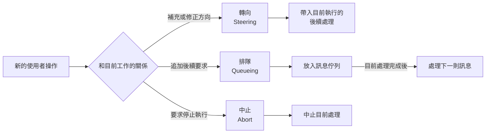
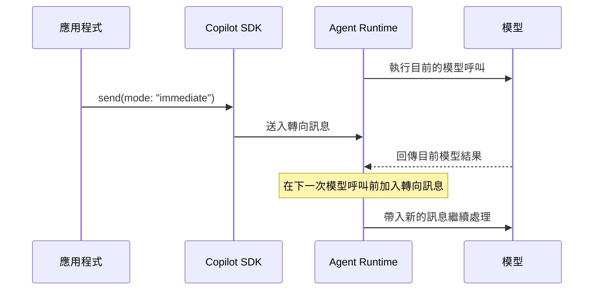
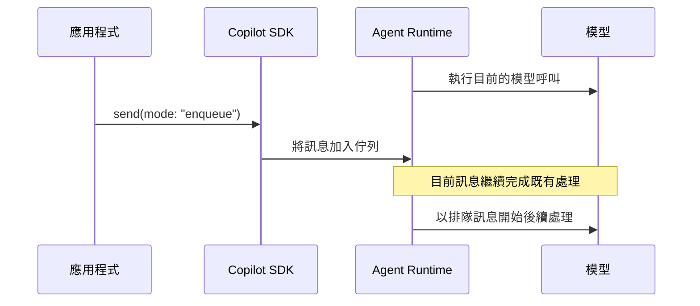
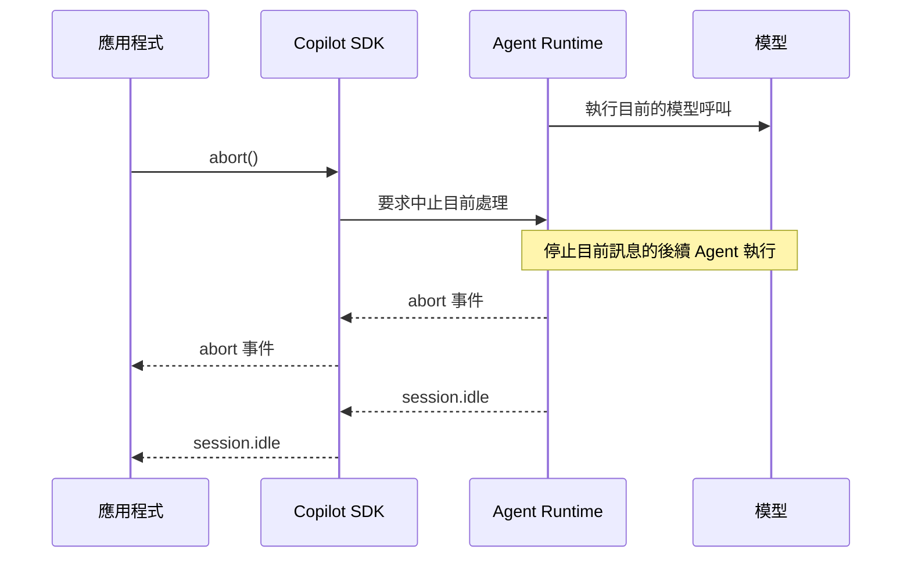

# Day 16 - 執行中互動：轉向、排隊與中止

前面的實作已經逐步建立 Agent 執行任務需要的互動與擴充能力。從這一篇開始，我們把觀察重點延伸到執行期間，進一步處理 Agent 已經開始工作之後，使用者與應用程式還能如何介入目前的執行流程。

Agent 開始工作後，使用者不一定會一路等待結果產生。分析進行到一半，可能需要補充條件、修正方向，也可能想到新的工作，但不希望影響正在進行的處理，甚至直接決定目前工作已經沒有繼續的必要。這些操作仍然發生在同一個 Session 中，但和目前工作的關係並不相同，需要先判斷它要改變現在的處理、留待後續執行，還是直接停止目前工作。

## 執行中的新操作如何影響目前工作？

一般多輪互動中，使用者通常會等 Agent 完成目前回應，再送出下一則訊息。但當一項工作需要經過多個 Turn、工具呼叫或較長時間的處理，使用者可能在目前工作尚未結束前補充新的要求，也可能直接透過介面要求停止執行。

這時應用程式需要先確認新的操作和正在進行的工作有什麼關係，再決定要如何交給 Runtime 處理。執行期間的新操作大致可以分成三種：

* **轉向（Steering）**：在 Agent 執行期間送入新的訊息，讓補充條件或方向修正嘗試影響目前正在進行的工作。
* **排隊（Queueing）**：將新的訊息排入等待佇列，保留目前工作的執行方向，等前面的訊息處理完成後再繼續執行。
* **中止（Abort）**：停止目前正在處理的訊息，不再讓 Agent 繼續這段執行。

轉向與排隊都會產生新的使用者訊息，只是訊息進入目前執行流程的方式不同；中止則屬於執行控制，不需要另外建立一則自然語言訊息。

從 Session 的執行流程來看，這三種操作可以整理成：



其中，轉向與排隊都是透過新的使用者訊息介入 Session，主要差異在於訊息如何進入目前的執行流程；中止則不會新增訊息，而是直接控制正在進行的處理。

## 執行中訊息的處理流程

執行期間收到新的使用者操作後，應用程式需要依照它和目前工作的關係，決定要讓新的要求介入後續處理、留待目前工作完成後再執行，或直接停止正在進行的工作。這三種處理方式可以先整理如下：

| 操作 | SDK 對應              | 主要行為                    |
| -- | ------------------- | ----------------------- |
| 轉向 | `mode: "immediate"` | 嘗試將新的訊息帶入目前執行的後續處理      |
| 排隊 | `mode: "enqueue"`   | 將新的訊息留在佇列，等目前訊息處理完成後再處理 |
| 中止 | `session.abort()`   | 中止目前正在處理的訊息             |

接下來分別看看三種操作如何進入 Session 的執行流程，以及各自需要留意的行為。

### `immediate`：讓新訊息介入目前執行

當 Agent 還在執行目前工作，但使用者希望補充新的條件或修正接下來的方向時，新訊息就需要盡可能進入目前的處理流程，而不是等整段工作結束後才開始處理。這種情況可以使用 `immediate`：

```typescript
await session.send({
  prompt: "先聚焦登入流程，其他部分簡短帶過。",
  mode: "immediate",
});
```

從執行時序來看，新的訊息會在目前工作尚未結束時送進 Runtime，並在下一次模型呼叫前嘗試加入目前的對話脈絡：



當 Session 正在處理工作時，Runtime 會將這則訊息放進轉向處理流程，並在後續模型呼叫前加入目前的對話脈絡，讓 Agent 根據補上的資訊調整接下來的判斷。

`immediate` 的重點是讓新的訊息盡可能影響目前執行的後續處理，不代表會立即中斷已經開始的工作。實際能從哪個位置開始影響 Agent，仍然會受到當下執行進度影響；如果目前處理在轉向訊息實際被使用前就已經結束，尚未處理的訊息則會留待後續處理。

### `enqueue`：將新訊息留待後續處理

如果新的要求是在 Agent 執行期間提出，但不需要改變目前工作的方向，就可以先讓目前處理繼續，再將新的訊息留待後續執行。這種情況可以使用 `enqueue`：

```typescript
await session.send({
  prompt: "分析完成後，再整理目前的測試缺口。",
  mode: "enqueue",
});
```

和轉向不同，排隊訊息不會介入目前正在進行的工作，而是先等待目前訊息完成既有處理，再開始自己的執行流程：



新的使用者訊息會先留在訊息佇列，等目前的處理完成後，再依照排入順序繼續執行。Runtime 開始處理這則訊息時，仍然會沿用目前 Session 已經累積的對話脈絡。

`enqueue` 適合將新的要求安排在目前工作之後，而不介入正在進行的處理。它也是預設的訊息傳遞模式，因此省略 `mode` 時會採用相同行為。

### `abort()`：中止目前正在處理的訊息

如果使用者已經不需要目前的結果，或目前工作已經沒有繼續的必要，再加入新的訊息就不一定合適。這種情況可以直接中止正在進行的處理：

```typescript
await session.abort();
```

中止和前兩種方式不同，它不會再送入一則新的使用者訊息，而是要求 Runtime 停止目前訊息的後續 Agent 執行：



`abort()` 控制的是 Runtime 中正在進行的處理，不需要另外對模型送出新的使用者訊息。它和 `immediate`、`enqueue` 的差異在於，前兩者都是將新的訊息送進 Session，中止則直接改變目前執行的狀態。

`abort()` 不會刪除 Session，因此後續仍然可以在相同 Session 中繼續接受新的操作。已經完成的外部操作也不會因為中止而自動回滾。

轉向與排隊的差異主要出現在 Session 還有工作正在執行時。如果目前沒有執行中的工作，`immediate` 與 `enqueue` 都會直接開始處理新的訊息。要實際觀察兩者的差異，應用程式需要在第一則訊息送出後繼續接收使用者操作，而不是一路等待 Agent 完成。

## 實作：建立可轉向、排隊與中止的互動流程

接下來建立一個互動式 CLI。Agent 會分析三個固定的應用程式模組，實際資料由自訂工具提供，不讀取檔案、不呼叫外部 API，也不修改任何系統狀態，讓觀察重點集中在執行期間的訊息控制。

程式啟動後不會立即開始 Agent 工作。使用者先輸入 `/start` 啟動分析，再於執行期間輸入 `/steer`、`/queue` 或 `/abort`，觀察不同操作如何影響目前工作。

### 準備專案環境

先建立 Node.js 專案並啟用 ES Modules：

```bash
$ mkdir copilot-sdk-execution-control
$ cd copilot-sdk-execution-control
$ npm init -y --init-type module
$ mkdir src
```

安裝 Copilot SDK、Zod 與 TypeScript 執行環境：

```bash
$ npm install @github/copilot-sdk zod
$ npm install --save-dev @types/node typescript tsx
```

範例只建立一支 `inspect_module` 自訂工具。工具接受模組名稱，再回傳程式內準備好的固定資料，讓觀察重點集中在執行中的訊息控制。

### 建立執行中互動程式

建立 `src/index.ts`：

```typescript
import { stdin as input, stdout as output } from "node:process";
import { createInterface } from "node:readline/promises";
import { CopilotClient, defineTool } from "@github/copilot-sdk";
import { z } from "zod";

const moduleRecords = {
  authentication: {
    summary: "Authentication uses access tokens and refresh tokens.",
    risks: [
      "Refresh token rotation is not implemented.",
      "Several authentication failures share the same error response.",
    ],
    tests: ["Login success", "Invalid password", "Expired access token"],
  },
  payment: {
    summary: "Payment requests are submitted through a synchronous service.",
    risks: [
      "Retry requests do not use an idempotency key.",
      "External gateway timeout handling is incomplete.",
    ],
    tests: ["Successful payment", "Gateway rejection"],
  },
  notification: {
    summary: "Notifications are dispatched through an asynchronous worker.",
    risks: [
      "Failed notifications use a fixed retry delay.",
      "Permanent failures are not separated from temporary failures.",
    ],
    tests: ["Email delivery", "Temporary provider failure"],
  },
} as const;

const inspectModule = defineTool("inspect_module", {
  description: "Return fixed analysis data for a sample application module",
  parameters: z.object({
    module: z.enum(["authentication", "payment", "notification"]),
  }),
  defer: "never",
  skipPermission: true,
  handler: async ({ module }) => ({
    module,
    ...moduleRecords[module],
  }),
});

const readline = createInterface({ input, output });

const client = new CopilotClient();

const session = await client.createSession({
  model: "auto",
  tools: [inspectModule],
  availableTools: ["custom:inspect_module"],
});

session.on("tool.execution_start", (event) => {
  console.log(
    `\n[tool:${event.data.toolCallId}] start ${event.data.toolName}`,
  );
});

session.on("tool.execution_complete", (event) => {
  console.log(
    `\n[tool:${event.data.toolCallId}] complete success=${event.data.success}`,
  );
});

session.on("assistant.message", (event) => {
  const content = event.data.content.trim();

  if (content) {
    console.log(`\n[assistant]\n${content}`);
  }
});

session.on("abort", (event) => {
  console.log(`\n[abort] reason=${event.data.reason}`);
});

session.on("session.idle", (event) => {
  console.log(
    event.data.aborted
      ? "\n[session] idle aborted=true"
      : "\n[session] idle",
  );
});

session.on("session.error", (event) => {
  console.error(`\n[session:error] ${event.data.message}`);
});

console.log(`
可以輸入：

/start          開始分析
/steer <訊息>   修正目前工作方向
/queue <訊息>   安排後續工作
/abort          中止目前工作
/exit           結束範例程式
`);

while (true) {
  const command = (await readline.question("> ")).trim();

  if (!command) {
    continue;
  }

  if (command === "/exit") {
    break;
  }

  if (command === "/start") {
    const messageId = await session.send({
      prompt:
        "請分析 authentication、payment 與 notification 三個模組。" +
        "請務必使用 inspect_module 取得各模組的實際資料，" +
        "再整理目前最值得優先改善的三個問題與原因。",
    });

    console.log(`[message:${messageId}] submitted`);
    continue;
  }

  if (command === "/abort") {
    await session.abort();
    continue;
  }

  if (command.startsWith("/steer ")) {
    const prompt = command.slice("/steer ".length).trim();

    if (!prompt) {
      continue;
    }

    const steeringMessageId = await session.send({
      prompt,
      mode: "immediate",
    });

    console.log(`[steer:${steeringMessageId}] submitted`);
    continue;
  }

  if (command.startsWith("/queue ")) {
    const prompt = command.slice("/queue ".length).trim();

    if (!prompt) {
      continue;
    }

    const queuedMessageId = await session.send({
      prompt,
      mode: "enqueue",
    });

    console.log(`[queue:${queuedMessageId}] submitted`);
    continue;
  }

  console.log("請使用 /start、/steer、/queue、/abort 或 /exit。");
}

readline.close();

await session.disconnect();
await client.stop();
```

範例程式先建立 Session 與事件監聽，再進入 CLI 輸入迴圈。輸入 `/start` 後，應用程式才會透過 `send()` 啟動第一項工作；Agent 執行期間，後續指令再分別轉成轉向、排隊或中止。

這裡只保留觀察執行中互動需要的事件。工具事件可以確認目前有哪些工具正在執行，`assistant.message` 顯示 Agent 形成的回答，`abort` 與 `session.idle` 則反映中止與目前處理停止的狀態。

### 使用 `send()` 啟動工作

程式收到 `/start` 後，會透過：

```typescript
const messageId = await session.send({
  prompt:
    "請分析 authentication、payment 與 notification 三個模組。" +
    "請務必使用 inspect_module 取得各模組的實際資料，" +
    "再整理目前最值得優先改善的三個問題與原因。",
});
```

將第一則訊息送進 Session。

`send()` 會在訊息提交後回傳 Message ID，不需要等到 Session 再次進入 idle。應用程式因此可以繼續處理 CLI 輸入，在 Agent 工作期間接收新的操作。

前面的範例多半使用 `sendAndWait()`，因為當時只需要等待目前處理完成並取得結果。這次需要在 Agent 工作期間持續接受新的使用者操作，因此改用 `send()`，讓訊息提交與等待工作完成分開處理。

`send()` 回傳的 Message ID 只用來識別送入 Session 的訊息，不代表 Agent 已經完成處理。Agent 何時停止目前工作，仍然需要根據 Session 的事件與狀態判斷。

### 使用轉向修正目前方向

Agent 開始工作後，可以輸入：

```text
> /steer 先聚焦 authentication，其他模組只需要簡短帶過
```

應用程式會將後面的文字取出，再送出：

```typescript
await session.send({
  prompt: "先聚焦 authentication，其他模組只需要簡短帶過。",
  mode: "immediate",
});
```

`mode: "immediate"` 對應轉向。Runtime 會將新的使用者訊息放進轉向處理流程，並在後續模型呼叫前加入目前的對話脈絡，讓 Agent 根據補上的資訊調整接下來的處理。

轉向不代表同步中斷目前正在執行的工作。假設模型已經決定呼叫 `inspect_module`，而工具正在執行，新的轉向訊息不會撤銷這次已經開始的工具呼叫；工具仍會先完成，再讓新的訊息影響後續模型判斷。

因此，轉向適合處理短而明確的方向修正。它表達的是目前工作仍然繼續，但後續處理需要依照新的條件調整方向。

如果目前這段處理在轉向訊息實際被使用前就已經結束，Runtime 會將尚未處理的訊息移到一般佇列，後續再進行處理。因此，`immediate` 表達的是盡可能介入目前執行，不能理解成可以在任意時間點強制中斷 Runtime。

### 使用排隊安排後續工作

如果使用者希望目前工作照常完成，只是追加下一項工作，可以輸入：

```text
> /queue 完成後，再整理目前的測試缺口
```

應用程式會送出：

```typescript
await session.send({
  prompt: "完成後，再整理目前的測試缺口。",
  mode: "enqueue",
});
```

Session 還在處理目前工作時，`mode: "enqueue"` 會將這則訊息保留在訊息佇列。等前面的處理完成後，Runtime 再依照排入順序取得等待中的訊息繼續處理。`enqueue` 也是預設的訊息傳遞模式，因此省略 `mode` 時會採用相同行為。

佇列中保存的仍然是一則使用者訊息。等 Runtime 開始處理後，它會沿用同一個 Session 已經累積的工作脈絡，新的要求也可能依照 Agent 判斷經過一個或多個 Turn。

因此，排隊適合在目前工作照常完成後，再處理後續新增的要求，也能避免彼此獨立的工作反覆改變正在進行的執行方向。

### 使用 `abort()` 中止目前執行

如果目前工作已經沒有繼續的必要，可以直接輸入：

```text
> /abort
```

這項操作不需要另外產生一則使用者訊息，應用程式直接呼叫：

```typescript
await session.abort();
```

目前 Node.js SDK 將 `abort()` 定義為中止 Session 中正在處理的訊息。中止不會刪除 Session，因此後續仍然可以在相同工作階段繼續互動。

Runtime 進入中止流程時，可以透過 `abort` 事件取得相關資訊：

```typescript
session.on("abort", (event) => {
  console.log(`[abort] reason=${event.data.reason}`);
});
```

後續 `session.idle` 的 `aborted` 欄位則可以反映前一段處理是否因中止而停止：

```typescript
session.on("session.idle", (event) => {
  console.log(event.data.aborted);
});
```

中止控制的是目前 Agent 執行，已經完成的外部操作不會因此自動回滾。假設工具已經寫入資料庫、送出 HTTP Request 或完成其他具有副作用的工作，後續即使中止 Agent，這些結果仍然存在，需要由應用程式依照自己的系統設計決定是否補償。

`abort()` 和 `sendAndWait()` 的 Timeout 也處理不同問題。`sendAndWait()` 的 Timeout 只限制應用程式願意等待 `session.idle` 多久，不會中止 Runtime 中仍在進行的 Agent 工作。需要真正停止目前處理時，仍然要使用對應的中止機制。

### 執行應用程式

完成 `src/index.ts` 後執行：

```bash
$ npx tsx src/index.ts
```

程式啟動後會先等待使用者輸入。輸入：

```text
> /start
```

才會開始分析三個固定模組。Agent 開始工作後，可以再依照要觀察的行為輸入不同指令。

測試轉向時，可以輸入：

```text
> /steer 先聚焦 authentication，其他模組只需要簡短帶過
```

主要觀察 Agent 後續處理是否納入新的分析方向。如果訊息送出時工具已經開始執行，這次工具呼叫仍可能先完成，再由後續模型處理新的條件。

測試排隊時，可以輸入：

```text
> /queue 完成後，再整理目前的測試缺口
```

主要觀察目前分析是否先完成，再開始處理排入佇列的要求。

測試中止時，可以輸入：

```text
> /abort
```

主要觀察 `abort` 與後續 `session.idle`，確認目前處理是否進入中止流程。

實際可操作的時間會受到模型判斷、工具呼叫方式與執行環境影響，工具呼叫數量、順序與自然語言回答也不會固定。這個範例要驗證的是，Session 忙碌期間收到新的操作後，Runtime 如何依照不同方式處理使用者意圖。

| TIP: |
| :--- |
| 建議每次重新輸入 `/start` 建立一段新的工作，再只測試轉向、排隊或中止其中一種。如果目前任務很快完成，可以換成需要較多步驟的測試工作，再觀察執行期間的控制行為。 |

## 轉向、排隊與中止的使用情境與限制

實際選擇控制方式時，可以先確認新的使用者要求和目前工作的關係：

| 使用者意圖             | 適合的操作 | 需要留意的限制                        |
| ----------------- | ----- | ------------------------------ |
| 補充條件或修正目前方向       | 轉向    | 只能盡可能影響後續處理，已開始或已完成的操作不會因此撤銷   |
| 目前工作照常完成，再處理另一項要求 | 排隊    | 處理的是 Session 中的訊息排隊，不提供持久化工作佇列 |
| 目前工作已經沒有繼續的必要     | 中止    | 中止目前正在處理的訊息，不會自動回滾既有副作用        |

一般新增的工作可以維持預設的排隊方式，讓目前執行先完成；只有新的資訊確實需要修改正在進行的方向時，再使用轉向。短時間持續加入多筆轉向訊息，可能讓目前脈絡反覆改變；如果工作方向已經明顯不同，中止目前執行後重新提出完整要求，通常更容易維持清楚的工作脈絡。

這三種能力控制的是 Runtime 中的訊息與 Agent 執行。當工具已經接觸資料庫、外部 API 或其他具有副作用的系統，應用程式仍然需要管理自己的工作狀態與補償策略；排隊也只描述 Session 中訊息的等待順序，不能直接取代正式後端服務需要的持久化佇列、重試與執行協調機制。

## 小結

Agent 開始工作後，應用程式仍然需要處理執行期間出現的新要求，並依照它和目前工作的關係，決定要調整後續方向、留待之後處理，或直接停止目前執行：

* 需要補充條件或修正目前方向時，可以透過 `immediate` 將新的訊息帶入目前執行的後續處理，讓 Agent 依照新的條件繼續工作。
* 希望目前工作照常完成，再追加後續要求時，可以透過 `enqueue` 將新的訊息留在佇列，等目前處理完成後再依序執行。
* 目前工作已經沒有繼續的必要時，可以透過 `abort()` 中止正在處理的訊息，但已經完成的外部操作不會因此自動回滾。
* 執行中互動需要讓應用程式在訊息送入 Session 後繼續接受新的操作，因此可以使用 `send()` 將訊息提交與等待工作完成分開處理。

轉向、排隊與中止處理的是 Agent Runtime 中的訊息與執行控制。應用程式自己的工作狀態、持久化排程，以及已經產生的外部副作用，仍然需要依照實際系統需求另外管理。
