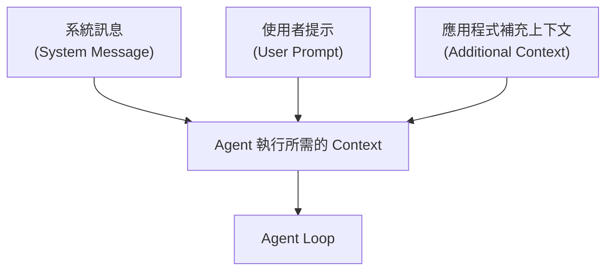
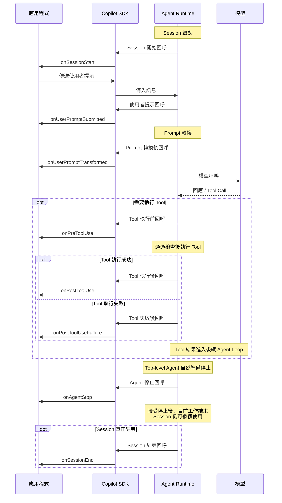
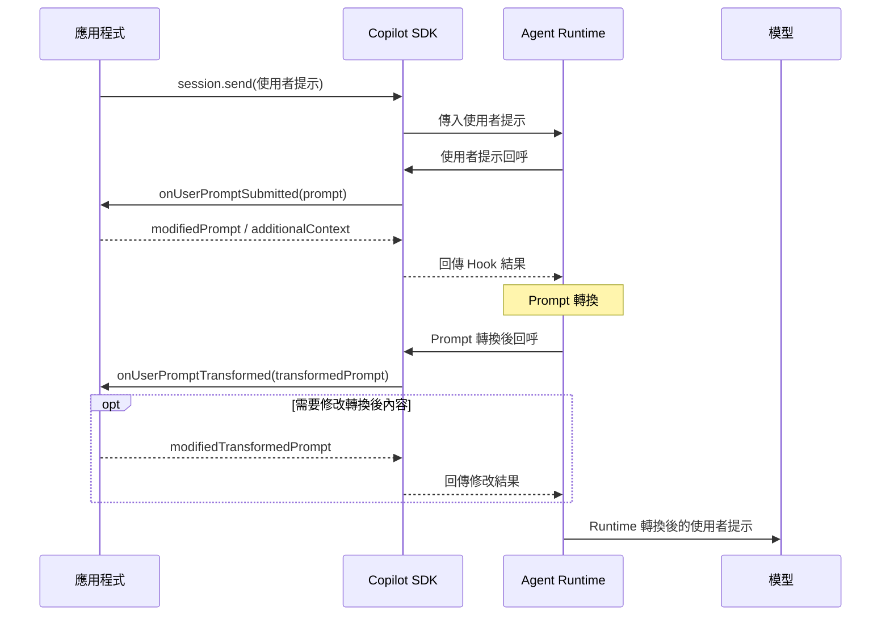

# Day 17 - Agent 輸入控管：系統訊息與 Prompt 前處理

Agent 開始工作後，使用者已經可以透過轉向修正目前方向、利用排隊安排後續工作，或直接中止正在進行的處理。不過，當一則使用者提示進入 Agent 執行流程時，應用程式還可能需要加入整個 Session 都應遵循的指引，或根據目前狀態補充這次工作需要的資訊。

這些資訊具有不同的生命週期。有些需要在整個 Session 中持續存在，有些只和目前這則提示有關，也可能需要在訊息處理期間進一步調整。如何區分這些輸入，以及在適當的執行位置加入或修改內容，會直接影響 Agent 最後取得的工作脈絡。

## Agent 執行時會取得哪些輸入？

應用程式呼叫 `session.send()` 或 `sendAndWait()` 時，最直接看到的是目前送出的使用者提示。不過，Agent 處理目前工作時，還會受到 Session 已經建立的基礎指引，以及應用程式在訊息處理期間補充的 Context 影響。

先從應用程式可以直接提供或影響的三層資訊來理解：



三種資訊分別承擔不同責任：

* **系統訊息（System Message）**：描述整個 Session 都需要維持的基礎行為與工作原則。
* **使用者提示（User Prompt）**：描述目前這一次要處理的工作，每一則訊息可以有不同的任務內容。
* **應用程式補充上下文（Additional Context）**：由應用程式根據目前工作準備的背景資訊，例如服務、執行環境或應用程式狀態。

這幾層資訊都會影響 Agent 處理目前工作的脈絡，但生命週期與來源不同。先把它們分開，後續才能判斷哪些資訊應該固定在 Session，哪些需要隨每一則訊息動態加入。

## 使用系統訊息定義 Session 基礎行為

如果一項指引需要在整個 Session 中持續存在，就不需要在每一則使用者提示重複附帶。建立 Session 時，可以透過 `systemMessage` 將應用程式自己的基礎指引加入系統訊息。

例如，工程審查 Session 可以設定：

```typescript
const session = await client.createSession({
  model: "auto",
  systemMessage: {
    content: [
      "你是內部工程審查 Agent。",
      "只根據目前對話與提供的 Context 判斷。",
      "將觀察與改善建議分開整理。",
      "資訊不足時不要自行補足系統細節。",
    ].join("\n"),
  },
});
```

Copilot SDK 的 `systemMessage` 提供三種模式：

* **`append`**：預設模式。將應用程式提供的 `content` 附加在 SDK 管理的系統訊息後方，保留既有的環境 Context、Tool 指引與安全限制。
* **`customize`**：調整 SDK 管理的系統訊息中特定區段，適合需要修改部分既有指引，同時保留其他內容的情境。
* **`replace`**：完整取代 SDK 管理的系統訊息內容，由應用程式自行提供整份內容。

一般應用如果只是希望加入自己的工作規則，保留預設的 `append` 即可。只有確實需要調整既有系統訊息時，再依需求使用 `customize` 或 `replace`。

系統訊息適合保存相對穩定的基礎指引。如果某項資訊會隨目前請求、使用者操作或應用程式狀態改變，就不適合全部固定寫進系統訊息。這類資訊需要在 Agent 執行到特定階段時，再由應用程式補充或調整，而 Copilot SDK 提供的 **Hooks**，就是用來建立這些執行期間介入點的機制。

| NOTE: |
| :--- |
| `mode: "replace"` 會完整取代 SDK 管理的系統訊息內容，也會移除其中原本提供的安全限制與預設行為。使用這種模式時，應用程式需要自行承擔完整系統訊息的設計與維護責任。 |

## Hooks 在 Agent 執行流程中的位置

Agent Runtime 在處理一段工作時，會經過使用者提示進入、Prompt 轉換、Tool 執行與 Agent 停止等不同階段。Hooks 提供一組預先定義的介入點，讓應用程式可以在這些階段執行自己的處理邏輯，並依照不同 Hook 支援的能力觀察、補充或調整目前流程。

建立或恢復 Session 時，應用程式可以註冊需要的 Hook 處理函式（Handler）。Runtime 執行到對應位置後，會將目前資訊交給處理函式，再依照該 Hook 支援的回傳結果繼續後續流程。

對照前面已經建立的 Agent 執行流程，可以從幾個主要介入位置理解：



這張圖只呈現各個 Hook 在主要執行流程中的位置。實際上，Tool 執行前的 Hook 可以決定是否允許操作，Agent 自然準備停止時也可能透過 `onAgentStop` 要求繼續工作；這些控制行為會在後續對應的執行階段再進一步拆解。

從介入的位置來看，可以先將這些 Hook 分成幾類：

* **Prompt 處理**：`onUserPromptSubmitted` 介入使用者送出的 Prompt；Runtime 完成 Prompt 轉換後，`onUserPromptTransformed` 可以再觀察或調整轉換後的內容。
* **Tool 執行**：`onPreToolUse` 位於 Tool 執行前，`onPostToolUse` 與 `onPostToolUseFailure` 則分別處理 Tool 執行成功與失敗後的結果。
* **Session 與 Agent 生命週期**：`onSessionStart`、`onAgentStop` 與 `onSessionEnd` 分別對應 Session 啟動、Agent 自然停止與 Session 結束。
* **執行錯誤**：Runtime 執行期間發生錯誤時，可以透過 `onErrorOccurred` 介入錯誤處理。

Hooks 提供的是執行流程中的介入位置，但每一個 Hook 可以取得的資料與能影響的行為並不相同。實作時需要先確認希望介入哪個階段，再選擇對應的 Hook。

## Prompt Hooks 如何處理使用者提示

前面先從整體執行流程建立了 Hooks 的位置。回到本篇關注的輸入階段，和目前使用者提示直接相關的主要介入點是 `onUserPromptSubmitted` 與 `onUserPromptTransformed`。兩者分別位於使用者提示送入 Runtime，以及 Runtime 完成 Prompt 轉換之後，能取得的內容與適合處理的工作也有所不同。

### `onUserPromptSubmitted`：處理每一則使用者提示

`onUserPromptSubmitted` 會在使用者送出訊息時觸發。處理函式可以取得目前的 `prompt`，再依照這次工作需要調整使用者提示，或加入應用程式準備的 Context。

目前可以回傳幾個和輸入處理直接相關的欄位：

* **`modifiedPrompt`**：使用新的 Prompt 取代目前的使用者提示。
* **`additionalContext`**：加入應用程式提供的額外 Context。
* **`suppressOutput`**：抑制這次處理對應的 Assistant 回應輸出。

如果沒有需要調整，處理函式可以直接結束，讓 Runtime 沿用原本內容繼續處理。

假設應用程式提供簡短的 `/review` 輸入格式：

```text
/review 請檢查 refresh token rotation 的設計
```

可以在建立 Session 時透過 `onUserPromptSubmitted` 將它展開成 Agent 實際要處理的工作描述：

```typescript
const session = await client.createSession({
  model: "auto",
  hooks: {
    onUserPromptSubmitted: async (input) => {
      if (!input.prompt.startsWith("/review ")) {
        return;
      }

      const target = input.prompt.slice("/review ".length).trim();

      return {
        modifiedPrompt:
          `請審查以下工程問題，整理觀察、風險與改善建議：\n${target}`,
      };
    },
  },
});
```

另一種情況是使用者提示本身已經很清楚，只缺應用程式掌握的背景。這時可以保留原始文字，由應用程式準備目前工作的 Context，再透過 `additionalContext` 回傳：

```typescript
const reviewContext = {
  service: "authentication-api",
  environment: "staging",
};

const session = await client.createSession({
  model: "auto",
  hooks: {
    onUserPromptSubmitted: async () => ({
      additionalContext: [
        `服務：${reviewContext.service}`,
        `環境：${reviewContext.environment}`,
      ].join("\n"),
    }),
  },
});
```

這裡的服務與環境來自應用程式自己的狀態。實際應用中，也可能來自目前請求、Session 相關的工作狀態、設定資料，或應用程式先前已經取得的資訊。Hook 的責任是把這些背景交給 Runtime，並不會自行知道目前服務或環境是什麼。

`modifiedPrompt` 與 `additionalContext` 處理的問題也不同。前者適合真正需要改變目前任務表達方式的情境；後者可以保留使用者提示，再補充 Agent 完成目前工作需要的資訊。如果只是增加背景，優先使用 `additionalContext`，可以避免不必要地改寫使用者原本的要求。

完成這一層處理後，Runtime 還會進一步轉換目前的使用者提示，接著進入另一個 Prompt Hook。

### `onUserPromptTransformed`：處理 Runtime 轉換後的使用者提示

`onUserPromptTransformed` 發生在 Runtime 完成目前 Prompt 的轉換之後、轉換後的內容送給模型並保存到 Session 歷史紀錄之前。這個 Hook 的 `prompt` 是經過前面 `onUserPromptSubmitted` 處理後的使用者提示；`transformedPrompt` 則是 Runtime 轉換後準備交給模型的使用者提示內容。

如果只是希望觀察 Runtime 最後形成的內容，可以直接讀取 `transformedPrompt`：

```typescript
const session = await client.createSession({
  hooks: {
    onUserPromptTransformed: async (input) => {
      console.log(input.transformedPrompt);
    },
  },
});
```

需要進一步調整時，可以回傳：

```typescript
return {
  modifiedTransformedPrompt: "<Runtime 轉換後的使用者提示>",
};
```

`modifiedTransformedPrompt` 會取代準備送往模型並保存到 Session 歷史紀錄的使用者提示內容；原本顯示給使用者的 Prompt 不會因此改變，之後恢復 Session 時也會沿用已經保存的修改結果。

兩個 Prompt Hook 位於使用者提示處理的不同階段。把應用程式、Copilot SDK、Agent Runtime 與模型之間的互動放在一起，可以更清楚看出兩個介入點的先後關係：



`onUserPromptSubmitted` 適合處理應用程式直接掌握的使用者提示，例如展開應用程式自己的輸入格式或補充目前工作背景；`onUserPromptTransformed` 則適合需要觀察或修改 Runtime 轉換後內容的情境。

一般的 Prompt 範本展開與工作背景補充，使用 `onUserPromptSubmitted` 已經足以處理；如果需求進一步涉及 Runtime 轉換後的內容，再使用 `onUserPromptTransformed` 介入即可。

| NOTE: |
| :--- |
| `transformedPrompt` 描述的是 Runtime 轉換後準備送給模型的 **使用者提示內容**，不等於這次模型呼叫取得的全部 Context。系統訊息、Session 歷史紀錄與其他執行資訊仍然位於各自的執行層級，因此不應把 `transformedPrompt` 視為完整的模型輸入。 |

## 實作：建立 Agent 輸入前處理流程

接著使用一個工程審查情境，把 Session 層的系統訊息與兩個 Prompt Hook 放進同一個執行流程。

整個 Session 都需要遵循相同的審查原則，因此放進系統訊息；目前的服務、環境與工作流程則由應用程式掌握，每次 `/review` 請求進入時再透過 `additionalContext` 補上。`onUserPromptSubmitted` 負責轉換目前的使用者提示並補充工作背景，`onUserPromptTransformed` 則只觀察 Runtime 轉換後的內容，不再次修改 Prompt。

範例不加入 Tool、MCP 或其他執行能力，讓觀察重點集中在輸入處理流程。

### 準備專案環境

先建立 Node.js 專案並啟用 ES Modules：

```bash
$ mkdir copilot-sdk-input-control
$ cd copilot-sdk-input-control
$ npm init -y --init-type module
$ mkdir src
```

安裝 Copilot SDK 與 TypeScript 執行環境：

```bash
$ npm install @github/copilot-sdk
$ npm install --save-dev @types/node typescript tsx
```

環境準備完成後，就可以把系統訊息與兩個 Prompt Hook 放進同一個輸入處理流程。

### 建立輸入前處理程式

建立 `src/index.ts`：

```typescript
import { CopilotClient } from "@github/copilot-sdk";

const REVIEW_PREFIX = "/review ";

const reviewContext = {
  service: "authentication-api",
  environment: "staging",
  workflow: "engineering-design-review",
};

const client = new CopilotClient();

const session = await client.createSession({
  model: "auto",
  availableTools: [],
  systemMessage: {
    content: [
      "你是內部工程審查 Agent。",
      "只根據目前對話與提供的 Context 判斷。",
      "將觀察、風險與改善建議分開整理。",
      "資訊不足時不要自行補足系統細節。",
    ].join("\n"),
  },
  hooks: {
    onUserPromptSubmitted: async (input) => {
      if (!input.prompt.startsWith(REVIEW_PREFIX)) {
        return;
      }

      const target = input.prompt.slice(REVIEW_PREFIX.length).trim();

      console.log("[onUserPromptSubmitted] 原始 Prompt：");
      console.log(input.prompt);

      return {
        modifiedPrompt: [
          "請審查以下工程問題。",
          "請整理有資訊支持的觀察、風險與改善建議。",
          "",
          target,
        ].join("\n"),
        additionalContext: [
          `服務：${reviewContext.service}`,
          `環境：${reviewContext.environment}`,
          `工作流程：${reviewContext.workflow}`,
        ].join("\n"),
      };
    },
    onUserPromptTransformed: async (input) => {
      console.log("\n[onUserPromptTransformed] Prompt：");
      console.log(input.prompt);
      console.log("\n[onUserPromptTransformed] 轉換後內容：");
      console.log(input.transformedPrompt);
    },
  },
});

const response = await session.sendAndWait(
  {
    prompt:
      "/review 請檢查 refresh token rotation 尚未實作可能帶來的風險。" +
      "目前 access token 會過期，refresh token 可用來換發新的 access token。",
  },
  120_000,
);

console.log("\n審查結果：");
console.log(response?.data.content);

await session.disconnect();
await client.stop();
```

這份程式把前面三種輸入來源放進同一次執行。系統訊息保存 Session 的工程審查原則，使用者提示描述目前要分析的問題，`reviewContext` 則提供應用程式掌握的工作背景；兩個 Prompt Hook 再分別處理訊息進入 Runtime 後的不同階段。

`availableTools: []` 讓目前 Session 不使用 Tool，避免加入其他資料來源，也比較容易觀察 Prompt 與 Context 的處理結果。

### 將固定工作原則放在系統訊息

範例在建立 Session 時提供：

```typescript
systemMessage: {
  content: [
    "你是內部工程審查 Agent。",
    "只根據目前對話與提供的 Context 判斷。",
    "將觀察、風險與改善建議分開整理。",
    "資訊不足時不要自行補足系統細節。",
  ].join("\n"),
},
```

這幾項規則都不屬於某一個特定審查問題。無論後續要求分析登入流程、錯誤處理或資料一致性，Agent 都應維持相同的工作方式，因此適合放在 Session 層的系統訊息。

這裡省略 `mode`，沿用預設的 `append`，讓應用程式指引附加在 SDK 管理的系統訊息後方。使用者提示因此可以集中描述目前真正要處理的工作，不需要在每一則訊息重新附帶相同規則。

### 轉換目前的使用者提示

`onUserPromptSubmitted` 收到目前輸入後，先確認是否符合範例使用的 `/review` 格式：

```typescript
if (!input.prompt.startsWith(REVIEW_PREFIX)) {
  return;
}
```

不符合時不回傳 Hook 結果，讓原始 Prompt 繼續處理；符合 `/review` 時，再取出實際的任務內容：

```typescript
const target = input.prompt.slice(REVIEW_PREFIX.length).trim();
```

接著利用 `modifiedPrompt` 將應用程式提供的簡短輸入格式轉換成 Agent 實際要處理的工作描述：

```typescript
modifiedPrompt: [
  "請審查以下工程問題。",
  "請整理有資訊支持的觀察、風險與改善建議。",
  "",
  target,
].join("\n"),
```

範例同時記錄這次 Hook 收到的原始使用者提示，方便稍後和 `onUserPromptTransformed` 取得的內容比較。

`/review` 只是用來穩定呈現 Prompt 轉換流程。實際應用也可以根據目前的路由、功能模式或應用程式狀態，決定要套用哪一種 Prompt 範本。`modifiedPrompt` 只改變目前這一則使用者提示，後續有新的訊息送入 Session 時，Hook 會針對新的輸入重新執行。

### 補充目前工作的動態 Context

工程審查除了使用者描述的問題，應用程式還掌握目前工作的服務、環境與工作流程：

```typescript
const reviewContext = {
  service: "authentication-api",
  environment: "staging",
  workflow: "engineering-design-review",
};
```

這些資訊可能來自目前請求、應用程式中的工作狀態、設定資料，或其他已經取得的資料。由於它們會隨目前工作改變，因此沒有固定放進系統訊息。

當 `/review` 訊息進入時，再透過：

```typescript
additionalContext: [
  `服務：${reviewContext.service}`,
  `環境：${reviewContext.environment}`,
  `工作流程：${reviewContext.workflow}`,
].join("\n"),
```

將這些背景交給 Runtime。

這樣可以保留資訊來源的邊界。使用者提示描述使用者真正提出的工程問題；服務、環境等應用程式狀態則由應用程式準備，再以補充 Context 的方式加入目前工作。

`modifiedPrompt` 與 `additionalContext` 可以像這個範例一樣同時使用。前者整理目前任務的表達方式，後者補充應用程式已知背景；若使用者提示本身不需要調整，只回傳 `additionalContext` 即可。

### 觀察 Runtime 轉換後的使用者提示

`onUserPromptSubmitted` 完成後，Runtime 會繼續處理目前訊息。進入 `onUserPromptTransformed` 時，`input.prompt` 已經是前一個 Prompt Hook 處理後的使用者提示，因此可以用來確認 `modifiedPrompt` 是否已經生效；`input.transformedPrompt` 則是 Runtime 轉換後準備交給模型的內容。

範例只將兩者輸出：

```typescript
onUserPromptTransformed: async (input) => {
  console.log(
    `\n[onUserPromptTransformed] Prompt：\n${input.prompt}`,
  );
  console.log(
    `\n[onUserPromptTransformed] 轉換後內容：\n${input.transformedPrompt}`,
  );
},
```

這裡刻意不回傳 `modifiedTransformedPrompt`。目前只需要確認兩個 Hook 的先後關係，以及 Runtime 轉換後形成的內容，不需要再增加第二次 Prompt 修改。`onUserPromptSubmitted` 負責應用程式自己的輸入轉換，`onUserPromptTransformed` 則作為後續觀察點。

`additionalContext` 與 `transformedPrompt` 也不需要建立固定的文字對應。範例不要求 `additionalContext` 一定原樣出現在 `transformedPrompt` 中；應用程式補充的工作背景是否實際被 Agent 使用，可以再從最後的審查結果觀察。

### 執行應用程式

完成程式後執行：

```bash
$ npx tsx src/index.ts
```

終端機首先會看到 `onUserPromptSubmitted` 收到的原始輸入，例如：

```text
[onUserPromptSubmitted] 原始 Prompt：
/review 請檢查 refresh token rotation 尚未實作可能帶來的風險。目前 access token 會過期，refresh token 可用來換發新的 access token。
```

接著 `onUserPromptTransformed` 會輸出前一個 Hook 處理後的 `prompt`，以及 Runtime 轉換後的 `transformedPrompt`。實際轉換結果會受到目前 Runtime 與執行情況影響，因此不需要期待固定文字。最後才會輸出 Agent 的工程審查結果。

執行時主要確認兩個 Prompt Hook 是否依序被觸發，以及 Agent 是否能使用轉換後的 Prompt、`additionalContext` 與系統訊息提供的資訊。實際自然語言回答會依模型與執行情況而不同，不需要期待固定文字。

## Prompt Hooks 的適用情境與限制

Prompt Hooks 適合處理和目前這則訊息直接相關，而且需要在 Agent 開始處理前完成的工作。前面的範例利用 `/review` 展開應用程式自己的輸入格式，再補上目前服務與環境，就是其中一種情境。

實際使用時，可以將幾類需求放在 Prompt Hook：

* **展開應用程式自己的輸入格式**：斜線指令、表單輸入或其他簡化格式，可以透過 `modifiedPrompt` 轉換成 Agent 後續使用的任務描述。
* **補充目前工作的背景**：目前服務、環境、功能模式或其他應用程式已知資訊，可以透過 `additionalContext` 加入，不需要改寫使用者原本的提示。
* **觀察或調整 Runtime 轉換後的內容**：如果需要取得 Runtime 轉換後準備交給模型的使用者提示，或確實需要修改這一層內容，可以使用 `onUserPromptTransformed`。
* **進行輕量的輸入整理**：例如遮罩部分內容、截斷過長的 Prompt、記錄這次輸入，或套用 Prompt 範本，都可以在 `onUserPromptSubmitted` 處理。

使用 `onUserPromptSubmitted` 時，仍應保留原本的使用者意圖。如果只是增加背景資訊，優先使用 `additionalContext`，通常比直接重寫 Prompt 更容易維持這層邊界。這個 Hook 會在每一則使用者訊息執行，因此處理函式也不適合加入不必要的耗時工作。

`onUserPromptTransformed` 的介入位置更靠近模型輸入。它可以透過 `modifiedTransformedPrompt` 改變準備交給模型的使用者提示內容，但只能修改內容，不能用來阻擋或直接處理目前這個 Turn。

兩個 Prompt Hook 都發生在訊息已經送入 Session 之後。如果應用程式規則要求某項輸入完全不能進入 Runtime，仍應在呼叫 `session.send()` 或 `sendAndWait()` 前完成檢查與拒絕。這類必須強制執行的限制應放在 Runtime 之前，而不是交給 Prompt Hook 處理。

## 小結

Agent 處理使用者提示時，應用程式可以依照資訊的生命週期與執行位置，決定哪些內容應該維持在整個 Session，哪些需要隨目前訊息動態加入或調整：

* 整個 Session 都需要維持的基礎工作指引，可以透過 `systemMessage` 提供；一般情況下使用預設的 `append`，就能在保留 SDK 管理內容的同時加入應用程式規則。
* 每一則使用者提示進入 Runtime 後，可以透過 `onUserPromptSubmitted` 調整目前任務的表達方式，或使用 `additionalContext` 補充應用程式掌握的工作背景。
* Runtime 完成 Prompt 轉換後，可以透過 `onUserPromptTransformed` 觀察或調整準備送給模型並保存到 Session 歷史紀錄的使用者提示內容。
* Prompt Hooks 都發生在訊息送入 Session 之後；如果某項輸入依照應用程式規則完全不能進入 Runtime，仍應在呼叫 `session.send()` 或 `sendAndWait()` 前完成檢查與拒絕。

系統訊息處理 Session 範圍的穩定指引，Prompt Hooks 則介入每一則訊息的不同處理階段。把這些資訊來源與執行位置分開，可以讓 Agent 取得需要的工作脈絡，同時保留應用程式對輸入邊界的控制。
