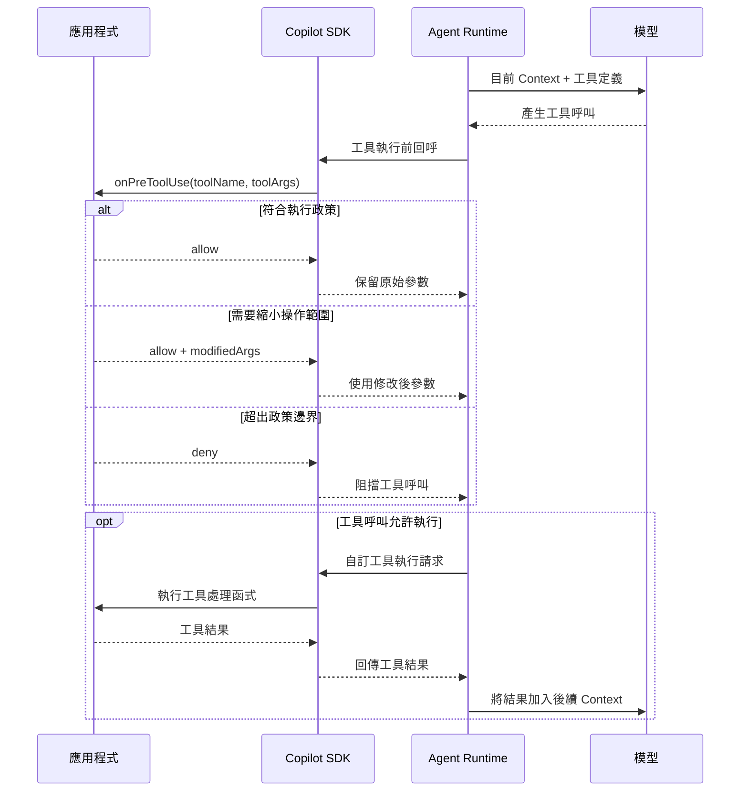

# Day 18 - 工具執行前控管：參數驗證與政策判斷

系統訊息與 Prompt Hooks 讓應用程式可以整理 Agent 開始處理前取得的工作脈絡，也能在每一則使用者提示進入 Agent Loop 前調整內容與補充 Context。當這些輸入開始被模型使用後，Agent 可能進一步呼叫工具，讓模型產生的參數真正進入資料查詢、服務操作或其他執行流程。

工具參數符合既有介面，只代表資料結構與基本條件符合預期，實際操作仍可能超出目前工作流程允許的範圍。當工具開始接觸實際資源，應用程式還需要根據當下的執行情境判斷這次操作是否合理，避免模型產生的工具呼叫直接成為系統真正執行的內容。

## 如何處理工具參數的執行限制？

工具可以接受哪些參數，通常會在定義能力時先描述清楚。不過，這些條件描述的是工具本身能夠處理的輸入，不一定等同目前工作實際允許使用的範圍。同一支工具可能被不同工作流程共用，每個流程也可能根據環境、資源或產品政策套用更嚴格的限制。

假設應用程式提供一支 `query_service_logs` 工具，讓 Agent 可以查詢服務日誌。這支工具本身支援 staging 與 production，也允許查詢最近 24 小時、一次最多取得 1000 筆日誌。

如果目前的 Session 只是讓開發者分析 staging 環境中的問題，工作流程實際允許的範圍可以更小，例如只能查詢 staging，而且單次最多取得最近 60 分鐘、100 筆日誌。

這時模型可能產生以下工具參數：

```json
{
  "service": "checkout-api",
  "environment": "staging",
  "windowMinutes": 180,
  "limit": 500
}
```

這組參數對 `query_service_logs` 本身完全合法。`environment` 是工具支援的環境，`windowMinutes` 與 `limit` 也都落在工具定義允許的範圍；但它超過目前工作流程允許的查詢範圍。

應用程式可以將時間與資料量縮小：

```json
{
  "service": "checkout-api",
  "environment": "staging",
  "windowMinutes": 60,
  "limit": 100
}
```

查詢的仍然是同一個服務與環境，只是實際取得的資料受到目前工作政策限制，因此原本的工作仍然可以繼續。

如果模型改成要求：

```json
{
  "service": "checkout-api",
  "environment": "production",
  "windowMinutes": 30,
  "limit": 50
}
```

這組參數同樣符合工具定義，但 `production` 已經超出目前 Session 允許的環境。如果自動把它換成 `staging`，工具實際查詢的資料來源就會改變，後續 Agent 也可能把取得的結果誤認為 production 資料。這種情況更適合直接拒絕工具呼叫。

因此，工具參數需要處理兩個不同層次的問題：

* **參數驗證**：確認欄位、型別與基本值域符合工具定義。
* **執行政策**：確認這組合法參數在目前工作流程中是否允許真正執行。

工具參數定義描述能力本身可以接受的輸入範圍；應用程式的執行政策則根據目前工作進一步收斂真正允許的操作。也因此，同一組參數可能對工具本身合法，卻不一定符合目前工作的執行條件。

## 工具執行前的介入點

當工具本身可以接受的參數範圍，和目前工作實際允許的操作範圍不同時，應用程式就需要在工具真正執行前取得這次呼叫的內容，完成驗證與政策判斷。這個介入位置必須發生在模型已經形成工具呼叫之後，同時又要早於工具處理函式真正接觸資料或執行操作。

Copilot SDK 提供 `onPreToolUse` Hook，讓應用程式在這個階段取得工具名稱與參數，再決定保留原始呼叫、縮小允許的操作範圍，或直接阻擋這次執行。沿用前面自訂工具已經建立的執行關係，整體位置可以表示如下：



模型根據目前 Context 與工具定義產生工具呼叫後，Agent Runtime 會先透過 Copilot SDK 觸發 `onPreToolUse`。應用程式可以在這個位置檢查實際呼叫內容；通過檢查後，工具才會繼續進入原本的執行流程。

### `onPreToolUse`：控制工具執行前的處理

建立或恢復 Session 時，可以在 `hooks` 中註冊 `onPreToolUse`。當 Agent Runtime 準備執行工具時，這個 Hook 會先取得目前的工具名稱與參數，讓應用程式在真正執行前進行檢查：

```typescript
const session = await client.createSession({
  model: "auto",
  hooks: {
    onPreToolUse: async (input) => {
      console.log(input.toolName);
      console.log(input.toolArgs);

      return {
        permissionDecision: "allow",
      };
    },
  },
});
```

`toolName` 用來辨識目前準備執行的工具，`toolArgs` 則包含這次工具呼叫準備使用的參數。以 Node.js SDK 為例，`toolArgs` 的型別為 `unknown`，因此應用程式如果要根據其中的欄位進行判斷，仍然需要先完成執行期驗證，再使用其中的資料。

檢查完成後，可以透過 `permissionDecision` 決定這次工具呼叫如何處理：

* **`allow`**：允許工具繼續執行。
* **`deny`**：阻擋這次工具呼叫。
* **`ask`**：要求進一步進行權限確認。

如果工具本身可以執行，只是部分參數超出目前允許的範圍，可以在允許呼叫的同時透過 `modifiedArgs` 提供調整後的參數：

```typescript
return {
  permissionDecision: "allow",
  modifiedArgs: {
    ...validatedArgs,
    limit: 100,
  },
};
```

後續工具會使用修改後的參數繼續執行。如果這次操作已經超出目前工作的政策邊界，則可以直接拒絕：

```typescript
return {
  permissionDecision: "deny",
  permissionDecisionReason: "目前工作不允許這項操作。",
};
```

沒有需要介入時，Hook 也可以不回傳結果，讓工具沿用原本流程。實際進行政策判斷時，重點仍然是先確認工具參數符合預期，再根據目前工作的限制決定保留、調整或拒絕這次操作。

接下來就把參數驗證與執行政策放進同一個完整範例，觀察模型產生的工具呼叫如何在真正執行前經過這層控管。

## 實作：建立工具執行前控管流程

接下來建立一支 `query_service_logs` 自訂工具，查詢程式內準備好的固定服務日誌。工具不連接實際的日誌平台或其他外部服務，也沒有寫入副作用，讓觀察重點集中在工具呼叫產生後，參數如何經過驗證與政策判斷。

### 準備專案環境

先建立 Node.js 專案並啟用 ES Modules：

```bash
$ mkdir copilot-sdk-pre-tool-policy
$ cd copilot-sdk-pre-tool-policy
$ npm init -y --init-type module
$ mkdir src
```

接著安裝 Copilot SDK、Zod 與 TypeScript 執行環境：

```bash
$ npm install @github/copilot-sdk zod
$ npm install --save-dev @types/node typescript tsx
```

這次只有一支自訂工具，日誌資料也全部保存在程式中，不需要另外準備資料庫或其他服務。

### 建立工具執行前控管程式

建立 `src/index.ts`：

```typescript
import { CopilotClient, defineTool } from "@github/copilot-sdk";
import { z } from "zod";

const LOG_TOOL_NAME = "query_service_logs";
const MAX_WINDOW_MINUTES = 60;
const MAX_LOG_LIMIT = 100;

const logQuerySchema = z.object({
  service: z.enum(["authentication-api", "checkout-api"]),
  environment: z.enum(["staging", "production"]),
  windowMinutes: z.number().int().min(5).max(1440),
  limit: z.number().int().min(1).max(1000),
});

type LogQuery = z.infer<typeof logQuerySchema>;

type LogPolicyResult =
  | { kind: "allow" }
  | { kind: "modify"; args: LogQuery }
  | { kind: "deny"; reason: string };

const logRecords = [
  {
    service: "checkout-api",
    environment: "staging",
    minutesAgo: 5,
    level: "error",
    message: "Payment gateway timeout",
  },
  {
    service: "checkout-api",
    environment: "staging",
    minutesAgo: 20,
    level: "warn",
    message: "Retry count exceeded threshold",
  },
  {
    service: "checkout-api",
    environment: "staging",
    minutesAgo: 50,
    level: "info",
    message: "Payment worker recovered",
  },
  {
    service: "checkout-api",
    environment: "staging",
    minutesAgo: 120,
    level: "error",
    message: "Payment gateway unavailable",
  },
  {
    service: "checkout-api",
    environment: "production",
    minutesAgo: 10,
    level: "error",
    message: "Production payment gateway timeout",
  },
  {
    service: "authentication-api",
    environment: "staging",
    minutesAgo: 15,
    level: "warn",
    message: "Refresh token reuse detected",
  },
] as const;

function evaluateLogPolicy(args: LogQuery): LogPolicyResult {
  if (args.environment === "production") {
    return {
      kind: "deny",
      reason: "目前 Agent 工作流程不允許查詢 production 日誌。",
    };
  }

  const effectiveArgs: LogQuery = {
    ...args,
    windowMinutes: Math.min(args.windowMinutes, MAX_WINDOW_MINUTES),
    limit: Math.min(args.limit, MAX_LOG_LIMIT),
  };

  if (
    effectiveArgs.windowMinutes !== args.windowMinutes ||
    effectiveArgs.limit !== args.limit
  ) {
    return { kind: "modify", args: effectiveArgs };
  }

  return { kind: "allow" };
}

const queryServiceLogs = defineTool(LOG_TOOL_NAME, {
  description: "Query fixed sample logs for a service and environment",
  parameters: logQuerySchema,
  defer: "never",
  skipPermission: true,
  handler: async ({ service, environment, windowMinutes, limit }) => {
    console.log(
      `[handler] service=${service} environment=${environment} windowMinutes=${windowMinutes} limit=${limit}`,
    );

    const records = logRecords
      .filter(
        (record) =>
          record.service === service &&
          record.environment === environment &&
          record.minutesAgo <= windowMinutes,
      )
      .slice(0, limit);

    return {
      service,
      environment,
      windowMinutes,
      limit,
      returned: records.length,
      records,
    };
  },
});

const client = new CopilotClient();

const session = await client.createSession({
  model: "auto",
  tools: [queryServiceLogs],
  availableTools: [`custom:${LOG_TOOL_NAME}`],
  hooks: {
    onPreToolUse: async (input) => {
      if (input.toolName !== LOG_TOOL_NAME) {
        return {
          permissionDecision: "deny",
          permissionDecisionReason: `工具 '${input.toolName}' 不在目前允許的執行政策中。`,
        };
      }

      const parsed = logQuerySchema.safeParse(input.toolArgs);

      if (!parsed.success) {
        console.log("[policy] denied: invalid arguments");

        return {
          permissionDecision: "deny",
          permissionDecisionReason:
            "query_service_logs 的參數格式不符合預期。",
        };
      }

      const policy = evaluateLogPolicy(parsed.data);

      if (policy.kind === "deny") {
        console.log(`[policy] denied: ${policy.reason}`);

        return {
          permissionDecision: "deny",
          permissionDecisionReason: policy.reason,
        };
      }

      if (policy.kind === "modify") {
        console.log(
          `[policy] modified windowMinutes=${policy.args.windowMinutes} limit=${policy.args.limit}`,
        );

        return {
          permissionDecision: "allow",
          modifiedArgs: policy.args,
        };
      }

      console.log("[policy] allowed");

      return { permissionDecision: "allow" };
    },
  },
});

const limitedResponse = await session.sendAndWait(
  {
    prompt:
      "請務必使用 query_service_logs 工具查詢 checkout-api 的 staging 日誌。" +
      "呼叫工具時請使用 environment=staging、windowMinutes=180、limit=500，" +
      "不要自行縮小參數；最後只根據工具實際回傳的日誌整理問題。",
  },
  120_000,
);

console.log("\nStaging query:");
console.log(limitedResponse?.data.content);

const deniedResponse = await session.sendAndWait(
  {
    prompt:
      "請務必使用 query_service_logs 工具查詢 checkout-api 的 production 日誌。" +
      "呼叫工具時請使用 environment=production、windowMinutes=30、limit=50。" +
      "如果工具被拒絕，直接說明目前無法執行查詢，不要改成其他環境或再次呼叫工具。",
  },
  120_000,
);

console.log("\nProduction query:");
console.log(deniedResponse?.data.content);

await session.disconnect();
await client.stop();
```

這支自訂工具使用 `skipPermission: true`，因為工具處理函式只查詢程式內的固定資料，不會接觸真實服務，也沒有外部副作用。範例因此不另外進入工具權限確認流程，把觀察重點留在每一筆工具呼叫如何經過 `onPreToolUse` 的執行政策。

`availableTools` 也只開放目前定義的自訂工具，避免其他工具進入這次測試。即使模型產生了符合工具介面的呼叫，真正執行前仍然需要經過參數驗證與目前工作流程的政策判斷。

### 先驗證工具參數

`query_service_logs` 使用 `logQuerySchema` 描述工具本身接受的參數。`environment` 可以是 `staging` 或 `production`，`windowMinutes` 允許 5 到 1440，`limit` 則允許 1 到 1000。這些條件描述的是工具能力本身可以接受的輸入範圍。

`onPreToolUse` 收到工具呼叫後，首先確認工具名稱：

```typescript
if (input.toolName !== LOG_TOOL_NAME) {
  return {
    permissionDecision: "deny",
    permissionDecisionReason: `工具 '${input.toolName}' 不在目前允許的執行政策中。`,
  };
}
```

目前 Session 雖然已經透過 `availableTools` 將能力限制在 `query_service_logs`，Hook 仍然只處理自己明確認識的工具，讓後續政策判斷維持在預期的輸入範圍內。

接著再驗證 `toolArgs`：

```typescript
const parsed = logQuerySchema.safeParse(input.toolArgs);
```

以 Node.js SDK 為例，`onPreToolUse` 的 `toolArgs` 型別為 `unknown`。如果直接使用型別斷言：

```typescript
const args = input.toolArgs as LogQuery;
```

TypeScript 只會在靜態型別上將資料視為 `LogQuery`，執行期間並沒有真的確認內容。範例因此直接重用自訂工具原本的 Zod Schema，驗證成功後再將 `parsed.data` 交給後續政策函式處理。

這樣也不需要另外維護第二份參數規格。工具定義與 Hook 使用相同的 Schema，避免兩邊對欄位與基本值域產生不同假設。

Agent 產生的工具呼叫應視為不可信輸入。模型可以根據工具定義產生結構化參數，但應用程式真正準備根據這些資料執行判斷時，仍然需要完成自己的輸入驗證。

### 套用應用程式的執行政策

參數通過驗證後，只代表它符合 `query_service_logs` 本身的介面，接下來才判斷目前工作流程是否允許這組操作。

範例設定三項政策：

* **`production`**：目前工作流程不允許查詢，直接拒絕。
* **`windowMinutes`**：超過 60 時，縮小成 60。
* **`limit`**：超過 100 時，縮小成 100。

這些限制刻意沒有寫進工具的 Zod Schema。工具本身仍然支援更大的查詢範圍，也可能被其他工作流程共用；目前 Session 能使用多少範圍，則交由應用程式政策決定。

參數驗證完成後，資料會交給：

```typescript
const policy = evaluateLogPolicy(parsed.data);
```

`evaluateLogPolicy()` 是應用程式自己的函式，不屬於 Copilot SDK。它只接收已驗證的 `LogQuery`，再根據目前工作流程回傳三種結果：

```typescript
type LogPolicyResult =
  | { kind: "allow" }
  | { kind: "modify"; args: LogQuery }
  | { kind: "deny"; reason: string };
```

`evaluateLogPolicy()` 集中處理應用程式的規則，`onPreToolUse` 再將判斷結果轉成 Copilot SDK 支援的控制方式。正式系統的政策可能隨工作類型、產品設定或資源狀態改變，將這部分與 Hook 分開，也比較容易針對不同參數組合建立單元測試。

### 縮小允許的操作範圍

第一則測試對應前面 staging 的情境。Prompt 明確要求模型使用 `staging` 環境，並將 `windowMinutes` 設為 180、`limit` 設為 500。這些參數都落在工具本身可以接受的範圍，但超過目前工作流程允許的 60 分鐘與 100 筆。

`evaluateLogPolicy()` 先計算真正允許執行的參數：

```typescript
const effectiveArgs: LogQuery = {
  ...args,
  windowMinutes: Math.min(args.windowMinutes, MAX_WINDOW_MINUTES),
  limit: Math.min(args.limit, MAX_LOG_LIMIT),
};
```

如果參數受到調整，就回傳修改後的內容：

```typescript
return { kind: "modify", args: effectiveArgs };
```

Hook 再透過 `modifiedArgs` 將這組參數交給後續工具執行：

```typescript
return {
  permissionDecision: "allow",
  modifiedArgs: policy.args,
};
```

真正進入 `query_service_logs` 工具處理函式時，`environment` 仍然是 `staging`，但 `windowMinutes` 會變成 60，`limit` 則變成 100。原本要求查詢的仍然是 `checkout-api` staging 日誌，應用程式只縮小可以取得的時間與資料量，沒有改變目標服務與環境。

如果修改只是將同一項操作限制在允許範圍內，不會改變原本工作的核心語意，就適合透過 `modifiedArgs` 收斂後繼續執行。由於 `modifiedArgs` 會成為真正交給工具的輸入，修改後的內容仍應符合工具原本預期的參數結構。

### 拒絕超出政策邊界的操作

第二則測試則對應前面 production 的情境。這次 `windowMinutes` 為 30、`limit` 為 50，真正超出政策邊界的是目標環境。

政策函式會直接回傳：

```typescript
return {
  kind: "deny",
  reason: "目前 Agent 工作流程不允許查詢 production 日誌。",
};
```

Hook 再將結果轉成：

```typescript
return {
  permissionDecision: "deny",
  permissionDecisionReason: policy.reason,
};
```

這筆工具呼叫會在真正進入工具處理函式前被阻擋，因此不會讀取範例中的 production 日誌。

如果改用 `modifiedArgs` 將 `environment` 換成 `staging`，實際查詢的環境就和原本要求不同。後續模型如果把 staging 結果當成 production 資料解讀，反而會建立錯誤的工作前提。

因此，當參數代表目標環境、資源、身分或操作類型時，不適合只是為了讓流程繼續而自行替換成另一個值。這類超出政策邊界的操作，更適合明確拒絕。

### 執行應用程式

完成程式後執行：

```bash
$ npx tsx src/index.ts
```

第一則 staging 查詢進入 `onPreToolUse` 後，原本的 180 分鐘與 500 筆會被執行政策縮小。終端機可能看到：

```text
[policy] modified windowMinutes=60 limit=100
[handler] service=checkout-api environment=staging windowMinutes=60 limit=100
```

工具處理函式最後收到 60 與 100，代表 `modifiedArgs` 已經成為實際工具輸入。

第二則 production 查詢則會看到：

```text
[policy] denied: 目前 Agent 工作流程不允許查詢 production 日誌。
```

此時不會再出現對應的 `[handler]` Log，表示工具處理函式沒有執行。

實際的自然語言回答、Turn 數量與工具呼叫次數仍然會受到模型判斷影響。執行時主要確認工具呼叫是否進入 `onPreToolUse`，需要限制時工具處理函式是否取得修改後的參數，以及超出政策邊界時工具處理函式是否沒有真正執行。

## 工具執行前控管的適用情境與限制

`onPreToolUse` 適合處理和單次工具呼叫直接相關，而且能在工具真正執行前確定的限制。例如目前允許查詢哪些環境、最多取得多少資料、可以操作哪些資源，或特定參數是否符合目前工作政策。應用程式可以根據實際工具呼叫與目前狀態完成判斷，再決定保留、調整或拒絕這次操作。

進入正式應用後，還需要把這一層執行政策和其他控制責任分開理解：

* **工具參數定義**：負責描述工具接受哪些欄位、型別與基本值域。
* **執行政策控管**：透過 `onPreToolUse` 檢查實際產生的工具呼叫，並套用目前工作的執行限制。
* **工具權限確認**：處理需要批准的工具操作；如果需要交由使用者確認，可以使用 `ask` 進入對應的確認流程。
* **應用程式授權**：確認目前已驗證的使用者或服務身分，是否真的有權存取目標資源。

這些層次可以共同作用，但不能互相取代。一筆工具呼叫通過 `onPreToolUse`，不代表目前使用者已經取得對應資源的存取權。真正連接資料庫、內部 API 或其他產品資源時，工具處理函式或底層服務仍然需要根據目前身分、Tenant 與資源執行授權檢查。

同樣地，在 Prompt 中要求 Agent「不要查詢 production」或「一次最多取得 100 筆」，可以作為模型的行為指引，但不能取代應用程式真正執行的政策檢查。需要確定成立的限制，仍然應該落在程式可以控制的邊界上。

`onPreToolUse` 位於每一次工具呼叫的執行路徑上，Hook 的處理時間也會直接影響工具開始執行前的等待。政策判斷應盡量保持快速且可預期；如果正式系統需要查詢外部政策服務，也應明確處理逾時、服務失敗或無法判斷時的結果。

## 小結

工具執行前控管讓應用程式可以在模型形成工具呼叫後、真正進入工具處理函式前，檢查實際參數與目前工作的執行政策，再決定這次操作應該保留、調整或拒絕：

* 工具參數定義描述能力本身可以接受的欄位、型別與基本值域，目前工作真正允許的範圍則由應用程式政策進一步決定。
* 工具執行前的政策判斷可以透過 `onPreToolUse` 檢查實際產生的工具呼叫，確認這次操作是否符合目前工作的執行限制。
* 可以在不改變操作目標的前提下收斂的範圍，例如查詢時間或資料筆數，可以透過 `modifiedArgs` 調整後繼續執行。
* 超出資源、環境或其他政策邊界，或調整後會改變原本操作語意的呼叫，應在工具真正執行前拒絕。

參數驗證處理的是工具介面能接受哪些輸入，執行政策則進一步判斷這次呼叫在目前工作情境中能否真正執行。工具本身可以維持通用的能力範圍，再由應用程式依照 Session、環境與工作需求收斂實際允許的操作，讓模型產生的工具呼叫在進入實際系統前仍然保留明確的控制邊界。
