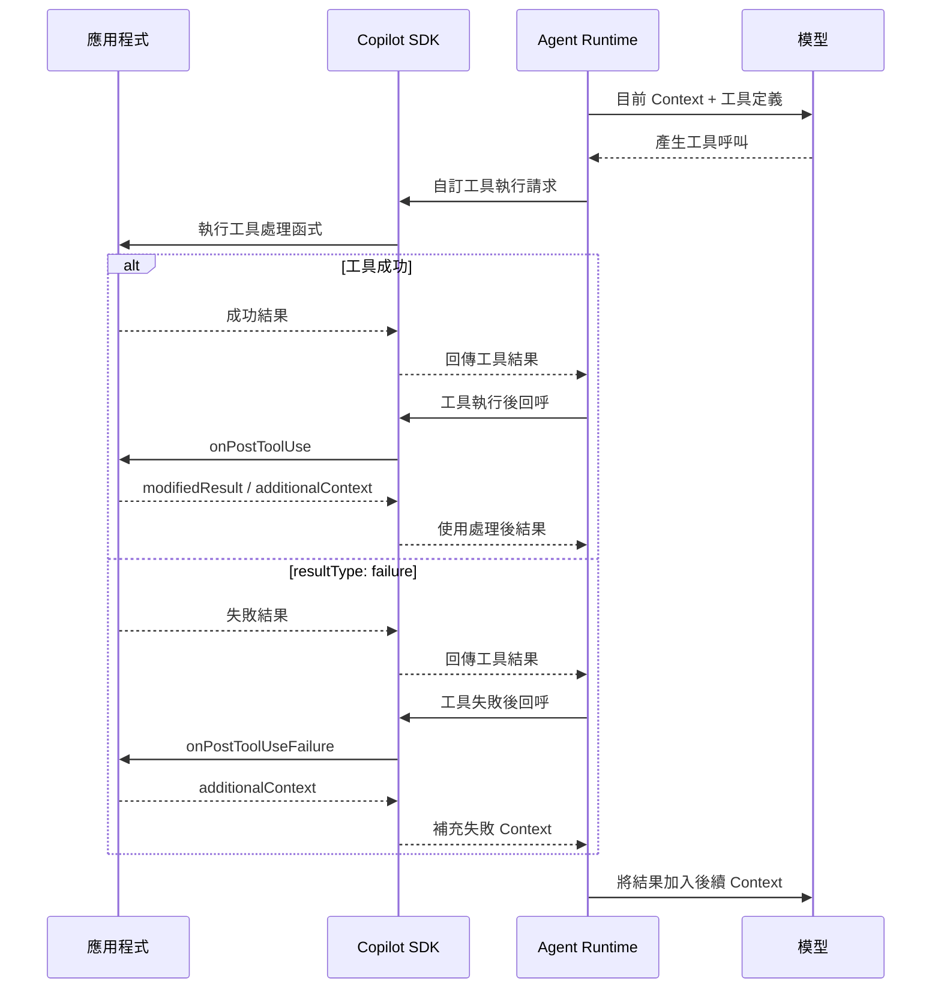

# Day 19 - 工具執行後處理：結果轉換與失敗引導

工具呼叫在真正執行前，應用程式可以先檢查參數與目前的執行政策，再決定這次操作是否允許執行。通過這些檢查後，工具才會真正執行，取得的結果也會回到 Agent Loop，成為後續判斷的一部分。

工具成功完成，不代表回傳結果就適合直接交給 Agent。結果中可能包含目前工作不需要的資訊，也可能缺少正確解讀所需的背景；如果工具執行失敗，Agent 同樣需要知道這次失敗對目前工作代表什麼。Copilot SDK 提供工具執行後的介入機制，讓應用程式可以在結果進入後續模型處理前進一步整理與補充。

## 為什麼工具結果還需要進一步處理？

工具完成執行後，Runtime 會將結果帶回 Agent Loop，讓模型根據新取得的資訊繼續判斷。不過，工具通常依照原本系統或服務的資料介面設計，回傳內容未必完全符合目前 Agent 工作需要的資訊範圍。結果可能同時包含業務資料、追蹤資訊與其他技術欄位，其中只有一部分真正需要進入後續模型處理。

除了資料範圍，結果的語意也可能需要進一步說明。同一份資料在原本系統中有明確定義，模型卻不一定知道它代表即時狀態、累計結果，還是某個特定觀測區間。如果直接把原始結果交回 Agent，後續判斷可能混入不必要的資訊，或對資料形成超出原本範圍的解讀。

假設應用程式提供 `get_service_health` 工具，用來取得服務目前的健康狀態。監控系統可能回傳：

```json
{
  "service": "checkout-api",
  "status": "degraded",
  "errorRate": 0.07,
  "activeIncidents": 2,
  "observedAt": "2026-08-23T01:30:00Z",
  "collectorNode": "monitoring-node-07",
  "traceId": "trace-8f4a21",
  "metricSource": "service-health-v3"
}
```

`collectorNode`、`traceId` 與 `metricSource` 對監控系統自己的追蹤與除錯可能有用途，但 Agent 目前只需要整理服務狀態、錯誤率與未結事件。這些內部追蹤資訊沒有必要全部進入後續模型 Context。

應用程式可以將真正需要的內容整理成：

```json
{
  "service": "checkout-api",
  "status": "degraded",
  "errorRate": 0.07,
  "activeIncidents": 2,
  "observedAt": "2026-08-23T01:30:00Z"
}
```

另一種情況則不需要修改資料本身。這份健康狀態只是某一個時間點的狀態快照，`degraded` 代表目前觀測到的狀態，不足以直接推論服務長時間都處於異常。此時可以保留原本的業務資料，再補充 Agent 應如何解讀這份結果。

如果監控後端服務暫時無法取得資料，情況又不同。Agent 不能因為沒有拿到健康狀態，就把服務判斷成正常；這時已經沒有成功結果可以整理，而是需要讓後續 Agent Loop 正確理解工具失敗的意義。

工具執行完成後，可以先從兩條路徑理解後續處理。成功結果可能需要縮減資料範圍，或補充正確解讀所需的背景；工具無法正常完成時，則需要讓後續 Agent Loop 理解這次失敗代表的狀態。

## 工具執行後的介入點

模型根據目前 Context 與工具定義產生工具呼叫後，Agent Runtime 會透過 Copilot SDK 將自訂工具執行請求交給應用程式中的處理函式。工具形成成功結果後，Runtime 可以觸發 `onPostToolUse`；如果形成 `resultType: "failure"`，則會進入 `onPostToolUseFailure`，讓應用程式在結果進入後續模型處理前進一步整理或補充 Context。

沿用前面已經建立的工具執行關係，完整流程可以表示成：



`onPreToolUse` 發生在工具真正執行前，可以檢查工具呼叫並決定是否允許執行，以及真正要使用的參數。工具完成後，`onPostToolUse` 與 `onPostToolUseFailure` 則分別承接成功結果與 `failure` 路徑，最後再將處理後的工具結果與補充 Context 帶入後續模型處理。

這項時間點差異也形成重要的責任邊界。工具執行後的 Hook 可以改變 Agent 後續取得的結果，卻不能回頭撤銷工具已經完成的操作。如果工具已經寫入資料庫、呼叫外部 API 或改變其他系統狀態，修改工具結果不會將這些副作用一起回滾。

### `onPostToolUse`：處理成功的工具結果

工具成功完成後，結果就準備回到後續 Agent Loop。不過，在真正交給模型繼續處理前，應用程式可能還需要整理資料內容，或補充模型正確解讀這份結果需要的背景。`onPostToolUse` 提供的就是成功路徑上的介入位置。

建立 Session 時，可以在 `hooks` 中註冊對應的處理函式。例如只針對 `get_service_health` 調整成功結果：

```typescript
const session = await client.createSession({
  model: "auto",
  hooks: {
    onPostToolUse: async (input) => {
      if (input.toolName !== "get_service_health") {
        return;
      }

      return {
        modifiedResult: {
          resultType: "success",
          textResultForLlm: "<整理後的工具結果>",
        },
        additionalContext: "這份資料只代表目前觀測時間點。",
      };
    },
  },
});
```

以 Node.js SDK 為例，`onPostToolUse` 只在工具成功執行後觸發。處理函式可以取得工具名稱、實際參數與完整的 `ToolResultObject`，再依照目前工作需要決定是否調整結果或補充 Context。

成功路徑中，應用程式主要會使用兩項輸出：

* **`modifiedResult`**：使用新的 `ToolResultObject` 取代原本的成功結果。
* **`additionalContext`**：在工具結果之外加入額外 Context，協助 Agent 解讀目前資料。

如果結果內容本身需要改變，例如移除不需要的內部欄位、縮減資料量或整理結構，可以使用 `modifiedResult`。如果資料本身沒有問題，只需要補充它的意義或適用範圍，則可以保留原始結果並使用 `additionalContext`。

### `onPostToolUseFailure`：處理工具執行失敗

工具無法正常完成時，已經沒有成功結果可以進一步整理。這時應用程式需要處理的重點，會轉成讓 Agent 知道這次失敗代表什麼，以及後續判斷不應建立在哪些不存在的資料上。`onPostToolUseFailure` 提供的就是失敗路徑上的介入位置。

同樣可以在 Session 的 `hooks` 中註冊失敗處理。例如監控資料無法取得時，補充後續 Agent Loop 應遵循的判斷方式：

```typescript
const session = await client.createSession({
  model: "auto",
  hooks: {
    onPostToolUseFailure: async (input) => {
      if (input.toolName !== "get_service_health") {
        return;
      }

      return {
        additionalContext:
          "目前沒有取得有效的服務健康狀態。" +
          "不要將缺少監控資料解讀為服務正常。",
      };
    },
  },
});
```

工具最後形成 `resultType: "failure"` 時，會進入 `onPostToolUseFailure`。以 Node.js SDK 為例，處理函式可以取得工具名稱、原始參數與這次失敗的 `error`，但不會取得成功路徑中的完整 `ToolResultObject`。

目前 `onPostToolUseFailure` 可以回傳的控制資訊只有：

* **`additionalContext`**：在工具失敗後加入額外 Context，協助 Agent 理解這次失敗對後續工作的影響。

這段 Context 會加入後續模型處理，讓 Agent 知道應如何理解這次失敗。它不能修改原本的失敗結果，也不會因為加入重試建議就自動建立確定性的重試流程。

| NOTE: |
| :--- |
| 目前 `onPostToolUseFailure` 只會由 `resultType: "failure"` 觸發。`ToolResultObject` 還支援 `"rejected"`、`"denied"` 與 `"timeout"` 等其他結果類型，但這些狀態目前不會進入這個 Hook。 |

## 實作：建立工具執行後處理流程

接下來建立一支固定資料的 `get_service_health` 自訂工具，分別驗證成功與失敗兩條工具執行後處理路徑。

範例提供兩個固定的服務情境：

* **`checkout-api`**：成功取得服務狀態，但原始結果包含目前 Agent 工作不需要的監控資訊，用來觀察 `onPostToolUse` 如何整理結果並補充解讀 Context。
* **`inventory-api`**：模擬監控後端服務暫時無法取得服務狀態，直接回傳失敗結果，用來觀察 `onPostToolUseFailure` 如何補充失敗後的 Context。

工具只使用程式內固定資料，不連接真正的監控平台，也沒有外部副作用，讓觀察重點集中在工具結果形成後的處理流程。

### 準備專案環境

先建立 Node.js 專案並啟用 ES Modules：

```bash
$ mkdir copilot-sdk-post-tool-processing
$ cd copilot-sdk-post-tool-processing
$ npm init -y --init-type module
$ mkdir src
```

安裝 Copilot SDK、Zod 與 TypeScript 執行環境：

```bash
$ npm install @github/copilot-sdk zod
$ npm install --save-dev @types/node typescript tsx
```

這次只有一支自訂工具，服務健康資料也全部保存在程式中，不需要另外準備監控平台、資料庫或其他外部服務。

### 建立工具執行後處理程式

建立 `src/index.ts`：

```typescript
import {
  CopilotClient,
  defineTool,
  type ToolResultObject,
} from "@github/copilot-sdk";
import { z } from "zod";

const SERVICE_HEALTH_TOOL = "get_service_health";

const serviceHealthSchema = z.object({
  service: z.string(),
  status: z.enum(["healthy", "degraded"]),
  errorRate: z.number(),
  activeIncidents: z.number(),
  observedAt: z.string(),
  collectorNode: z.string(),
  traceId: z.string(),
  metricSource: z.string(),
});

const checkoutHealth = {
  service: "checkout-api",
  status: "degraded",
  errorRate: 0.07,
  activeIncidents: 2,
  observedAt: "2026-08-23T01:30:00Z",
  collectorNode: "monitoring-node-07",
  traceId: "trace-8f4a21",
  metricSource: "service-health-v3",
} as const;

const getServiceHealth = defineTool(SERVICE_HEALTH_TOOL, {
  description: "Return fixed sample health data for a supported service",
  parameters: z.object({
    service: z.enum(["checkout-api", "inventory-api"]),
  }),
  defer: "never",
  skipPermission: true,
  handler: async ({ service }): Promise<ToolResultObject> => {
    if (service === "inventory-api") {
      return {
        resultType: "failure",
        textResultForLlm: "目前無法取得 inventory-api 的即時健康狀態。",
        error: "監控後端服務目前無法使用",
      };
    }

    return {
      resultType: "success",
      textResultForLlm: JSON.stringify(checkoutHealth),
    };
  },
});

const client = new CopilotClient();

const session = await client.createSession({
  model: "auto",
  tools: [getServiceHealth],
  availableTools: [`custom:${SERVICE_HEALTH_TOOL}`],
  hooks: {
    onPostToolUse: async (input) => {
      if (input.toolName !== SERVICE_HEALTH_TOOL) {
        return;
      }

      const parsed = serviceHealthSchema.safeParse(
        JSON.parse(input.toolResult.textResultForLlm),
      );

      if (!parsed.success) {
        return;
      }

      const {
        service,
        status,
        errorRate,
        activeIncidents,
        observedAt,
      } = parsed.data;

      console.log(`[post-tool] success service=${service}`);

      return {
        modifiedResult: {
          resultType: "success",
          textResultForLlm: JSON.stringify({
            service,
            status,
            errorRate,
            activeIncidents,
            observedAt,
          }),
        },
        additionalContext:
          "這份健康狀態是目前時間點的監控資料。" +
          "請根據實際觀測結果說明目前狀態，" +
          "不要據此推論未提供的長期可用性。",
      };
    },

    onPostToolUseFailure: async (input) => {
      if (input.toolName !== SERVICE_HEALTH_TOOL) {
        return;
      }

      console.log(`[post-tool] failure error=${input.error}`);

      return {
        additionalContext:
          "目前無法取得服務的即時健康狀態。" +
          "不要把缺少監控資料解讀為服務正常，" +
          "也不要自行補足沒有取得的服務狀態。",
      };
    },
  },
});

const successResponse = await session.sendAndWait(
  {
    prompt:
      "請務必使用 get_service_health 查詢 checkout-api，" +
      "再根據工具實際提供的資料整理目前服務狀態；" +
      "不要補充工具沒有提供的資訊。",
  },
  120_000,
);

console.log("\ncheckout-api:");
console.log(successResponse?.data.content);

const failureResponse = await session.sendAndWait(
  {
    prompt:
      "請務必使用 get_service_health 查詢 inventory-api，" +
      "再說明目前能否判斷服務健康狀態；" +
      "不要根據既有知識推測。",
  },
  120_000,
);

console.log("\ninventory-api:");
console.log(failureResponse?.data.content);

await session.disconnect();
await client.stop();
```

這個範例先建立固定資料工具，再將 `onPostToolUse` 與 `onPostToolUseFailure` 加入 Session。後面的兩次 `sendAndWait()` 分別查詢 `checkout-api` 與 `inventory-api`，讓相同的工具介面可以進入成功與失敗兩條結果處理路徑。

工具處理函式直接使用 `ToolResultObject` 表達兩種結果。`checkout-api` 回傳成功結果，讓 `onPostToolUse` 進一步整理內容；`inventory-api` 則固定形成失敗結果，交由 `onPostToolUseFailure` 補充後續 Context。這樣可以穩定觀察兩個 Hook 的差異，不需要另外引入處理函式拋出例外後的錯誤轉換行為。

### 整理成功的工具結果

`checkout-api` 形成成功的 `ToolResultObject` 後，`onPostToolUse` 可以取得其中的完整工具結果。範例先將 `textResultForLlm` 轉回物件，再透過 Schema 確認資料符合預期：

```typescript
const parsed = serviceHealthSchema.safeParse(
  JSON.parse(input.toolResult.textResultForLlm),
);
```

這裡的資料由範例自己的工具固定產生，因此可以預期是合法 JSON。實際工具如果串接外部服務，仍應在適合的責任位置確認外部回應符合應用程式預期，再決定哪些資訊可以交給 Agent。

驗證成功後，範例只保留目前工作需要的欄位，再透過 `modifiedResult` 建立新的成功結果：

```typescript
const {
  service,
  status,
  errorRate,
  activeIncidents,
  observedAt,
} = parsed.data;

return {
  modifiedResult: {
    resultType: "success",
    textResultForLlm: JSON.stringify({
      service,
      status,
      errorRate,
      activeIncidents,
      observedAt,
    }),
  },
  // ...
};
```

原本的 `collectorNode`、`traceId` 與 `metricSource` 不再出現在替換後的工具結果，Agent 後續處理也就不需要接收這些內部追蹤資訊。

`modifiedResult` 取代的是完整的 `ToolResultObject`。如果原始結果還有其他目前工作需要保留的資訊，應用程式需要依實際需求一併帶入新的結果。

結果縮減也不能作為資料授權機制。如果某項資料本來就不允許目前使用者取得，更適合在資料來源、自訂工具處理函式或工具執行前的政策階段阻止存取，而不是先取得完整敏感資料，再期待工具執行後的 Hook 將它移除。

### 補充結果的解讀背景

成功結果的資料內容本身可能沒有問題，只是還缺少模型正確解讀資料需要的背景。範例在 `modifiedResult` 之外，同時透過 `additionalContext` 補充：

```typescript
additionalContext:
  "這份健康狀態是目前時間點的監控資料。" +
  "請根據實際觀測結果說明目前狀態，" +
  "不要據此推論未提供的長期可用性。",
```

這段內容沒有改變實際監控資料，只說明這份資料代表目前觀測時間點，不能延伸成長時間的服務可用性結論。

當資料內容本身需要調整時，可以使用 `modifiedResult`；如果資料本身不需要修改，只缺少正確解讀所需的背景，則可以使用 `additionalContext`。兩者也可以像範例一樣同時使用，先整理真正需要的結果，再補充這份結果的使用方式。

`additionalContext` 最後仍然會進入模型 Context，屬於提供給 Agent 的解讀與行為指引。需要由系統確定執行的資料限制、授權政策或其他業務規則，仍然要由應用程式自己的邏輯完成。

### 引導工具失敗後的判斷

第二則 Prompt 要求查詢 `inventory-api`。工具處理函式直接形成固定的失敗結果：

```typescript
return {
  resultType: "failure",
  textResultForLlm: "目前無法取得 inventory-api 的即時健康狀態。",
  error: "監控後端服務目前無法使用",
};
```

`resultType: "failure"` 會讓這次工具執行進入失敗路徑，不會觸發成功時使用的 `onPostToolUse`，而是進入 `onPostToolUseFailure`。

處理函式可以從 `input.error` 取得這次失敗的錯誤資訊，但拿不到成功 Hook 使用的完整 `toolResult`。目前真正能影響後續模型處理的是 `additionalContext`：

```typescript
return {
  additionalContext:
    "目前無法取得服務的即時健康狀態。" +
    "不要把缺少監控資料解讀為服務正常，" +
    "也不要自行補足沒有取得的服務狀態。",
};
```

這段 Context 讓 Agent 知道「無法取得資料」和「服務健康」是兩種不同狀態。工具沒有成功取得監控資料，因此目前無法據此判斷服務是否正常。

工具執行失敗後的 Hook 可以提供這類後續指引，但它不會把失敗自動轉成成功，也不會建立確定性的重試機制。即使 `additionalContext` 要求不要再次呼叫相同工具，這仍然屬於提供給模型的行為指引；如果應用程式要求單一操作只能嘗試固定次數，仍應由應用程式狀態、工具政策或其他確定性機制限制。

### 執行應用程式

完成程式後執行：

```bash
$ npx tsx src/index.ts
```

程式會依序送出兩則訊息。第一則要求查詢 `checkout-api`，工具成功後會進入 `onPostToolUse`，應用程式縮減原始結果並補充健康狀態的解讀背景；第二則查詢 `inventory-api`，工具形成失敗結果後則會進入 `onPostToolUseFailure`，再由應用程式補充這次失敗對後續判斷的影響。

執行期間可以從終端機紀錄確認兩條路徑是否觸發：

```text
[post-tool] success service=checkout-api
[post-tool] failure error=監控後端服務目前無法使用
```

最後兩次 `sendAndWait()` 都會輸出 Agent 根據各自工具結果繼續處理後形成的回答。成功路徑應只根據整理後的健康狀態形成結論；失敗路徑則應反映目前無法取得即時監控資料，因此不能據此判定 `inventory-api` 是否健康。

實際的自然語言回答與 Agent 是否產生額外 Turn 仍會受到模型判斷影響。這個範例主要確認成功結果會進入 `onPostToolUse`，`resultType: "failure"` 會進入 `onPostToolUseFailure`，以及兩個 Hook 提供的結果與 Context 能夠繼續進入後續 Agent Loop。

## 工具執行後處理的適用情境與限制

前面的範例分別處理了成功結果的整理與工具失敗後的引導。放到實際應用中，工具執行後的 Hook 主要負責控制哪些資訊要進入後續 Agent Loop，以及模型應如何理解這些結果；已經完成的工具操作與其他 Runtime 錯誤，則需要留在各自的責任範圍處理。

常見的使用情境包括：

* **縮減或轉換結果**：移除目前任務不需要的欄位，或將系統回應整理成 Agent 更容易使用的資料結構。
* **補充解讀 Context**：保留原本結果，再說明資料的來源、時效性或使用限制。
* **提供失敗引導**：工具無法完成時，補充這次失敗對目前工作的影響，避免 Agent 根據缺少的資料自行形成結論。

這層處理仍有幾個責任邊界。工具執行後的 Hook 發生時，操作已經完成，因此只能改變 Agent 後續取得的結果，無法回滾已經產生的外部副作用。工具若可能修改實際系統，執行許可仍應在 Permission 與執行前政策中處理。

工具執行結果也應正確表達實際語意。查詢成功但沒有符合條件的資料，仍然可以是成功結果；只有工具本身無法正常完成時，才適合形成失敗結果。

另外，`onPostToolUseFailure` 處理的是工具形成 `"failure"` 結果後的介入點，和 Runtime 的一般錯誤處理屬於不同範圍。Copilot SDK 另有 `onErrorOccurred` 處理 Runtime 執行期間的錯誤，這類錯誤恢復與重試控制不屬於工具結果轉換本身的責任。

## 小結

工具執行完成後，產生的結果會成為 Agent 後續判斷的一部分。工具執行後的 Hook 讓應用程式可以進一步整理成功結果，或在工具失敗後補充後續判斷需要的 Context：

* 成功完成的工具執行可以透過 `onPostToolUse` 介入，並使用 `modifiedResult` 調整 Agent 實際取得的結果。
* 結果本身不需要修改時，可以利用 `additionalContext` 補充 Agent 正確解讀資料所需的背景。
* 工具形成 `resultType: "failure"` 時，可以透過 `onPostToolUseFailure` 補充這次失敗對後續判斷的影響。
* 工具執行後的 Hook 改變的是結果如何進入後續處理，無法撤銷已經完成的外部副作用。

工具執行前後的介入點分別處理不同責任。執行前可以檢查參數與政策，執行後則整理結果與失敗語意，讓真正進入後續 Agent Loop 的資訊仍然維持應用程式需要的控制邊界。
