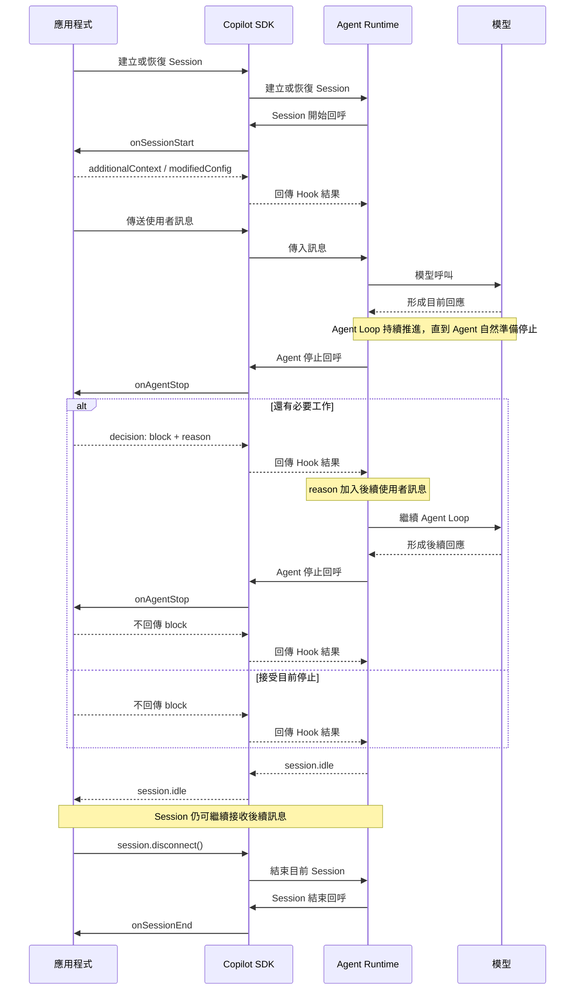

# Day 20 - Session 生命週期：初始化、停止判斷與結束處理

使用者提示與工具執行階段的 Hooks，已經讓應用程式可以在 Agent 工作期間整理輸入、控制工具執行，並處理工具完成後的結果。這些介入點大多圍繞某一則輸入或某一次工具呼叫，處理的是 Agent 執行過程中的特定階段。

當一段工作跨越多次互動與多個 Turn，應用程式還需要處理更長範圍的狀態，例如 Session 建立或恢復時要準備哪些共用 Context、Agent 自然準備停止時是否仍有必要工作，以及 Session 真正結束後如何完成紀錄與資源收尾。Copilot SDK 提供對應的生命週期 Hooks，讓這些處理可以放在整段 Session 的開始、停止判斷與結束位置。

## Session 生命週期需要處理什麼？

Session 可以持續經過多次互動，每一則訊息又可能包含數個 Turn 與工具執行。有些狀態因此會跨越單一 Prompt 或 Tool Call 存在，例如整段工作共用的背景、應用程式追蹤的狀態，以及最後是否已經符合完成條件。

Session 層級通常需要處理三個不同階段的問題：

* **初始化工作階段**：Session 建立或恢復時，準備整段工作共用的 Context，並初始化應用程式需要持續追蹤的狀態，例如開始時間或完成條件。
* **確認 Agent 是否可以停止**：Agent 自然準備停止時，應用程式可以再確認必要驗證、政策檢查或其他確定性條件是否已經成立。
* **處理 Session 結束**：整段工作階段真正結束後，完成最後紀錄、計算執行時間，並釋放目前 Session 持有的暫存狀態與資源。

這三個階段也代表不同的生命週期邊界。Agent 完成目前工作，不代表 Session 已經結束；Session 仍然可以繼續接收後續訊息。只有當整個工作階段真正進入結束流程時，才需要處理 Session 層級的最後收尾。

## Session 生命週期的介入點

前面將 Session 生命週期拆成工作階段初始化、Agent 自然停止與 Session 結束三個階段。應用程式要在這些位置加入自己的處理邏輯，需要由 Agent Runtime 在執行流程到達對應階段時，將目前狀態交回應用程式處理，再根據處理結果繼續後面的流程。

Copilot SDK 提供 `onSessionStart`、`onAgentStop` 與 `onSessionEnd` 三個生命週期 Hook，分別對應 Session 開始、Agent 自然準備停止，以及 Session 真正結束。把它們放回一次完整的 Session 執行，可以更清楚看出各個介入點之間的關係：



Session 建立或恢復時，Runtime 會先透過 `onSessionStart` 讓應用程式準備整段工作需要的 Context 與狀態。後續 Agent Loop 持續推進，直到 Agent 自然準備停止，再進入 `onAgentStop`。如果應用程式仍有必要工作尚未完成，可以要求 Agent 繼續；接受目前的停止狀態後，Session 才會進入 `session.idle`。

`session.idle` 代表目前這一輪 Agent 工作已經停止，Session 本身仍然存在，也可以繼續接收後續訊息。等應用程式真正結束這段工作階段時，才會進一步觸發 `onSessionEnd` 完成最後的收尾。

因此，Agent 自然停止、`session.idle` 與 Session 結束位在不同的生命週期位置。`session.abort()` 則屬於另一條執行控制路徑，用來中止目前正在處理的訊息，不會經過 `onAgentStop` 的自然停止判斷。

### `onSessionStart`：準備工作階段

`onSessionStart` 會在 Session 開始時觸發，應用程式可以利用這個位置準備目前 Session 需要的 Context，或初始化自己要追蹤的 Session 範圍狀態。

建立 Session 時，可以在 `hooks` 中加入處理函式：

```typescript
const session = await client.createSession({
  hooks: {
    onSessionStart: async (input, invocation) => {
      console.log(
        `[session:${invocation.sessionId}] start source=${input.source}`,
      );

      return {
        additionalContext:
          "目前正在進行 staging 環境的版本發布準備度審查。",
      };
    },
  },
});
```

處理函式會取得目前生命週期資訊與 Hook Invocation。以 Node.js SDK 為例，`SessionStartHookInput` 提供 `source` 與 `initialPrompt`，而 `invocation.sessionId` 則可以辨識目前是哪一段 Session。

其中 `source` 目前可能是 `startup`、`resume` 或 `new`，可以用來辨識這次 Session 開始的來源。範例另外透過 `additionalContext` 加入整段工作共用的發布審查背景，讓後續 Agent 執行可以使用這項資訊。

這類 Context 只需要在工作階段開始時準備一次，不必在每一則使用者提示重新組合。

`onSessionStart` 也可以透過 `modifiedConfig` 調整 Session 設定。如果目前只需要準備工作背景或應用程式狀態，使用 `additionalContext` 搭配應用程式自己的狀態即可。

### `onAgentStop`：判斷 Agent 是否可以停止

`onAgentStop` 會在 Agent 自然到達停止點時執行。此時 Agent 已經準備結束目前工作，但 Session 仍然維持作用中。

如果應用程式接受目前的停止狀態，不需要回傳任何結果。若還有必要工作尚未完成，可以回傳 `decision: "block"`，要求 Agent 繼續處理：

```typescript
onAgentStop: async (input) => {
  if (input.stopHookActive) {
    return;
  }

  return {
    decision: "block",
    reason:
      "請先納入應用程式的最終驗證結果，再整理最後結論。",
  };
},
```

Runtime 會將 `reason` 作為後續使用者訊息排入執行流程，再讓 Agent 繼續工作。後續再次自然準備停止時，`stopHookActive` 會反映前一次 `onAgentStop` 已經要求 Agent 繼續，因此範例可以直接放行，避免同一個 Hook 持續回傳 `block`。

這段程式主要用來說明 `decision`、`reason` 與 `stopHookActive` 之間的關係。正式應用程式仍然需要自己的完成條件，不能只依賴 `stopHookActive` 決定是否接受停止。例如必要驗證是否完成、政策檢查是否已有結果，或工作要求的狀態是否成立，都應由應用程式使用可以確認的資料判斷。

Runtime 本身也會限制連續的 `block` 決策，避免 Hook 持續要求 Agent 工作而形成無限制的執行循環。後面的完整範例會進一步加入應用程式自己的最終驗證狀態，示範如何將確定性條件與 Agent 的停止流程接在一起。

| NOTE: |
| :--- |
| `onAgentStop` 目前處理的是 Top-level Agent 的自然停止；Sub-agent 有自己的停止生命週期，中止與執行錯誤也屬於不同執行路徑。 |

### `onSessionEnd`：處理 Session 結束

Agent 完成目前工作並進入 `session.idle` 後，Session 仍然可以接收新的訊息。當整個工作階段真正進入結束流程時，才會觸發 `onSessionEnd`。

應用程式可以在這個位置取得 Session 最後的結束資訊：

```typescript
onSessionEnd: async (input, invocation) => {
  console.log(
    `[session:${invocation.sessionId}] end reason=${input.reason}`,
  );
},
```

以 Node.js SDK 為例，`SessionEndHookInput` 提供 `reason`、`finalMessage` 與 `error`。其中 `reason` 描述 Session 最後進入結束流程的原因，目前可能包含以下值：

* **`complete`**：Session 正常完成。
* **`error`**：Session 因錯誤進入結束流程。
* **`abort`**：Session 因中止進入結束流程。
* **`timeout`**：Session 因逾時進入結束流程。
* **`user_exit`**：使用者主動結束 Session。

`finalMessage` 可以取得結束時的最後訊息，`error` 則提供結束流程相關的錯誤資訊。應用程式可以依照實際需要使用這些資料完成最後紀錄、更新自己的工作狀態，或釋放目前 Session 持有的資源。

其中 `abort` 與 `timeout` 是 Session 結束原因，不能直接等同 `session.abort()` 或 `sendAndWait()` 的逾時。`session.abort()` 控制的是目前正在處理的訊息；`sendAndWait()` 的逾時則只限制應用程式願意等待 `session.idle` 多久。

這個位置處理的是整段 Session 的最後收尾。實際資源如果還具有自己的生命週期，仍然需要由應用程式負責正確釋放，而不能只依賴 Hook 本身完成所有清理工作。

## 執行錯誤的介入點

前面的三個 Hook 對應 Session 開始、Agent 自然停止與 Session 結束。Agent 工作持續進行時，如果模型呼叫、工具執行、系統處理或使用者輸入發生錯誤，則屬於另一條執行錯誤處理路徑。

Copilot SDK 提供 `onErrorOccurred`，讓應用程式在 Session 執行發生錯誤時取得錯誤內容與發生位置，再依照錯誤性質決定是否需要改變 Runtime 原本的處理方式：

```typescript
const session = await client.createSession({
  hooks: {
    onErrorOccurred: async (input, invocation) => {
      console.error(
        `[session:${invocation.sessionId}] ` +
          `error context=${input.errorContext} recoverable=${input.recoverable}`,
      );

      if (
        input.errorContext === "model_call" &&
        input.recoverable
      ) {
        return {
          errorHandling: "retry",
          retryCount: 2,
        };
      }

      return;
    },
  },
});
```

`errorContext` 用來辨識錯誤發生的位置，目前可能是 `model_call`、`tool_execution`、`system` 或 `user_input`；`recoverable` 則表示這次錯誤是否具有恢復的可能性。

需要介入時，應用程式可以透過 `errorHandling` 指定後續處理方式：

* **`retry`**：重新嘗試目前操作，可以搭配 `retryCount` 限制重試次數。
* **`skip`**：略過目前發生錯誤的操作，繼續後續處理。
* **`abort`**：中止目前執行。

如果不需要改變 Runtime 原本的錯誤處理，可以不回傳結果。`onErrorOccurred` 也可以透過 `userNotification` 提供要呈現給使用者的訊息，或使用 `suppressOutput` 控制錯誤輸出是否顯示。

錯誤是否適合重試仍然需要根據實際情境判斷。`recoverable` 提供 Runtime 對這次錯誤是否可能恢復的資訊，但應用程式仍應考慮操作本身是否具備安全重試條件。例如已經產生外部副作用的工具操作，不能只因錯誤被標示為可恢復，就直接假設可以再次執行。

`onErrorOccurred` 和 `onAgentStop` 處理的是不同情況。`onAgentStop` 發生在 Top-level Agent 自然準備停止時；`onErrorOccurred` 則處理 Session 執行期間發生的錯誤。如果錯誤最後使整個 Session 進入結束流程，再由 `onSessionEnd` 的 `reason` 描述最後的結束原因。

## 實作：建立 Session 生命週期控制流程

接下來建立一個版本發布準備度審查範例，把 Session 初始化、Agent 自然停止判斷與 Session 結束放進同一段執行流程。

範例使用固定的版本狀態，不讀取程式碼庫、不呼叫外部服務，也不執行真正的部署。Session 開始時，應用程式會加入版本資訊並建立生命週期狀態；Agent 第一次自然準備停止時，再執行固定的最終發布檢查，要求 Agent 將結果納入最後回答。等工作完成並結束 Session 後，`onSessionEnd` 負責記錄工作時間並清除生命週期狀態。

### 準備專案環境

先建立 Node.js 專案並啟用 ES Modules：

```bash
$ mkdir copilot-sdk-session-lifecycle
$ cd copilot-sdk-session-lifecycle
$ npm init -y --init-type module
$ mkdir src
```

安裝 Copilot SDK 與 TypeScript 執行環境：

```bash
$ npm install @github/copilot-sdk
$ npm install --save-dev @types/node typescript tsx
```

這個範例不使用 Tool，版本資料也全部保存在程式中，不需要另外準備資料庫或其他服務。

### 建立 Session 生命週期控制程式

建立 `src/index.ts`：

```typescript
import { CopilotClient } from "@github/copilot-sdk";

type FinalValidation = {
  approved: boolean;
  summary: string;
};

type LifecycleState = {
  startedAt: Date;
  finalValidation?: FinalValidation;
};

const releaseStatus = {
  version: "2026.08.23",
  targetEnvironment: "staging",
  tests: {
    passed: 128,
    failed: 0,
  },
  migrationReady: true,
  rollbackAvailable: true,
  risk: {
    description: "Refresh Token 輪替尚未啟用。",
    acceptedForTarget: true,
    requirement: "production 前必須完成。",
  },
};

const lifecycleStates = new Map<string, LifecycleState>();

function buildReleaseContext(): string {
  return [
    `Release: ${releaseStatus.version}`,
    `Target environment: ${releaseStatus.targetEnvironment}`,
    `Automated tests: ${releaseStatus.tests.passed} passed, ${releaseStatus.tests.failed} failed`,
    `Migration ready: ${releaseStatus.migrationReady}`,
    `Rollback available: ${releaseStatus.rollbackAvailable}`,
    `Known risk: ${releaseStatus.risk.description}`,
    `Risk accepted for target: ${releaseStatus.risk.acceptedForTarget}`,
    `Risk requirement: ${releaseStatus.risk.requirement}`,
  ].join("\n");
}

function runFinalValidation(): FinalValidation {
  const approved =
    releaseStatus.tests.failed === 0 &&
    releaseStatus.migrationReady &&
    releaseStatus.rollbackAvailable &&
    releaseStatus.risk.acceptedForTarget;

  return {
    approved,
    summary: approved
      ? `staging 可以進行；${releaseStatus.risk.description} ${releaseStatus.risk.requirement}`
      : "目前仍有條件阻擋 staging 發布。",
  };
}

let resolveSessionEnd!: () => void;

const sessionEndCompleted = new Promise<void>((resolve) => {
  resolveSessionEnd = resolve;
});

const client = new CopilotClient();

const session = await client.createSession({
  model: "auto",
  availableTools: [],
  hooks: {
    onSessionStart: async (input, invocation) => {
      lifecycleStates.set(invocation.sessionId, {
        startedAt: input.timestamp,
      });

      console.log(
        `[session:${invocation.sessionId}] start source=${input.source}`,
      );

      return {
        additionalContext: [
          "目前正在進行版本發布準備度審查。",
          buildReleaseContext(),
          "請先根據目前資料形成判斷。",
          "如果應用程式在停止前提供最終驗證結果，請將它納入最後結論。",
        ].join("\n"),
      };
    },

    onAgentStop: async (input, invocation) => {
      const state = lifecycleStates.get(invocation.sessionId);

      if (!state) return;

      console.log(
        `[session:${invocation.sessionId}] ` +
          `agent stop reason=${input.stopReason ?? "unknown"} ` +
          `active=${input.stopHookActive === true}`,
      );

      if (input.stopHookActive || state.finalValidation) return;

      const finalValidation = runFinalValidation();
      state.finalValidation = finalValidation;

      console.log(
        `[session:${invocation.sessionId}] ` +
          `final validation approved=${finalValidation.approved}`,
      );

      return {
        decision: "block",
        reason: [
          "應用程式已完成最終發布檢查。",
          `結果：${finalValidation.approved ? "通過" : "阻擋"}`,
          `說明：${finalValidation.summary}`,
          "請將這項結果納入最後回答，再結束目前工作。",
        ].join("\n"),
      };
    },

    onSessionEnd: async (input, invocation) => {
      const state = lifecycleStates.get(invocation.sessionId);
      const durationMs = state
        ? input.timestamp.getTime() - state.startedAt.getTime()
        : undefined;

      console.log(
        `[session:${invocation.sessionId}] ` +
          `end reason=${input.reason} ` +
          `durationMs=${durationMs ?? "unknown"}`,
      );

      lifecycleStates.delete(invocation.sessionId);
      resolveSessionEnd();
    },
  },
});

const response = await session.sendAndWait(
  {
    prompt:
      "請判斷目前版本是否適合進入 staging，整理主要依據與仍需注意的風險。",
  },
  120_000,
);

console.log("\n模型回應：");
console.log(response?.data.content);

await session.disconnect();
await sessionEndCompleted;
await client.stop();
```

範例程式把三個生命週期 Hook 與應用程式狀態放進同一段 Session。接下來依照實際執行順序，拆解每個階段負責的工作。

### 初始化 Session 狀態

Session 開始時，程式先建立目前工作階段使用的生命週期狀態：

```typescript
lifecycleStates.set(invocation.sessionId, {
  startedAt: input.timestamp,
});
```

`lifecycleStates` 是應用程式自己的狀態。範例先保存開始時間，後續 `onAgentStop` 與 `onSessionEnd` 都可以根據相同的 Session ID 取得目前工作階段的資料。

接著透過 `additionalContext` 加入版本狀態：

```typescript
return {
  additionalContext: [
    "目前正在進行版本發布準備度審查。",
    buildReleaseContext(),
    "請先根據目前資料形成判斷。",
    "如果應用程式在停止前提供最終驗證結果，請將它納入最後結論。",
  ].join("\n"),
};
```

這些資料是整段版本發布審查共同使用的背景，因此在 Session 開始時準備一次即可，不需要把相同資訊重複放進後續每一則使用者提示。

範例另外使用 `input.timestamp` 記錄開始時間。以 Node.js SDK 為例，Hook 公開介面的 `timestamp` 會以 `Date` 提供，因此後面可以直接用來計算執行時間。

這裡的 `Map` 只用於保存範例中的生命週期狀態。正式服務如果需要讓工作跨越應用程式程序生命週期，或由多個應用程式執行個體共同處理，就不能只依賴程序內記憶體。

### 檢查 Agent 是否可以停止

Agent 根據目前 Context 完成處理並自然準備停止時，`onAgentStop` 會先取得目前 Session 的應用程式狀態：

```typescript
const state = lifecycleStates.get(invocation.sessionId);

if (!state) return;
```

接著確認是否已經進入前一次 `block` 所形成的續行流程，或應用程式自己的最終驗證是否已經完成：

```typescript
if (input.stopHookActive || state.finalValidation) return;
```

第一次進入 `onAgentStop` 時，最終驗證尚未執行，因此程式會呼叫：

```typescript
const finalValidation = runFinalValidation();
state.finalValidation = finalValidation;
```

`runFinalValidation()` 是一般 TypeScript 程式邏輯，根據固定的版本狀態檢查測試、Migration、Rollback 與目前風險是否符合 staging 的條件：

```typescript
const approved =
  releaseStatus.tests.failed === 0 &&
  releaseStatus.migrationReady &&
  releaseStatus.rollbackAvailable &&
  releaseStatus.risk.acceptedForTarget;
```

這項結果由應用程式確定，不需要讓 Agent 自行判斷最終驗證是否已經完成。

完成檢查後，再透過 `onAgentStop` 要求 Agent 把驗證結果納入後續處理：

```typescript
return {
  decision: "block",
  reason: [
    "應用程式已完成最終發布檢查。",
    `結果：${finalValidation.approved ? "通過" : "阻擋"}`,
    `說明：${finalValidation.summary}`,
    "請將這項結果納入最後回答，再結束目前工作。",
  ].join("\n"),
};
```

Runtime 會將這段 `reason` 作為後續使用者訊息排入執行流程，再讓 Agent 繼續工作。後續再次自然準備停止時，應用程式狀態已經保存 `finalValidation`，`stopHookActive` 也會反映目前的續行狀態，因此 Hook 可以正常放行。

這裡由應用程式掌握確定性的完成條件，`reason` 則負責把還需要處理的內容帶回 Agent。兩者分開後，就不需要依賴模型自行宣稱某項驗證是否已經完成。

### 處理 Session 結束與狀態清理

Agent 完成後續處理並再次自然停止，`sendAndWait()` 會等到 Session 進入 `session.idle` 再結束等待。此時目前的 Agent 工作已經停止，但 Session 本身仍然存在。

範例完成目前工作後，主動呼叫：

```typescript
await session.disconnect();
```

以 Node.js SDK 為例，`session.disconnect()` 會結束目前 SDK 對這個 Session 的使用，並釋放相關記憶體資源；磁碟上保存的 Session 狀態仍可供後續恢復。永久刪除 Session 資料則需要另外呼叫 `client.deleteSession()`。

Session 結束時，`onSessionEnd` 先取得一開始保存的生命週期狀態，再利用 Hook 的時間戳記計算這段工作的執行時間：

```typescript
const durationMs = state
  ? input.timestamp.getTime() - state.startedAt.getTime()
  : undefined;
```

開始與結束時間都來自生命週期 Hook，因此這裡計算的是兩個事件時間點之間的差值，不會混入 `onSessionEnd` Handler 實際開始執行的時間。

完成最後紀錄後，再移除應用程式保存的狀態：

```typescript
lifecycleStates.delete(invocation.sessionId);
```

如果 Session 執行期間還建立暫存檔、鎖定、租約或其他應用程式資源，也應由實際持有這些資源的程式負責釋放。

範例另外建立 `sessionEndCompleted`，讓主流程可以確認 `onSessionEnd` 已經完成：

```typescript
const sessionEndCompleted = new Promise<void>((resolve) => {
  resolveSessionEnd = resolve;
});
```

`onSessionEnd` 完成後會呼叫 `resolveSessionEnd()`，因此主流程可以在 `disconnect()` 後等待清理完成，再停止 Client：

```typescript
await session.disconnect();
await sessionEndCompleted;
await client.stop();
```

這樣不需要加入固定延遲時間猜測 Hook 是否已經執行，也能讓範例中的 Session 結束流程完整收尾。

### 執行應用程式

完成程式後執行：

```bash
$ npx tsx src/index.ts
```

實際自然語言回答與 Turn 數量會受到模型執行情況影響，不需要期待固定結果。執行時主要確認生命週期是否依照預期推進。

終端機可能看到類似：

```text
[session:<session-id>] start source=new
[session:<session-id>] agent stop reason=<stop-reason> active=false
[session:<session-id>] final validation approved=true
[session:<session-id>] agent stop reason=<stop-reason> active=true

模型回應：
...

[session:<session-id>] end reason=<end-reason> durationMs=<duration>
```

第一次 Agent 自然準備停止時，應用程式會執行最終驗證並要求 Agent 繼續；後續再次停止時，驗證狀態已經存在，因此可以正常結束目前工作。

`sendAndWait()` 等待的是 `session.idle`，所以模型回應會在目前 Agent 工作停止後回到應用程式。接著呼叫 `disconnect()`，才會進一步進入 Session 結束與收尾流程。

## Session 生命週期控制的適用情境與限制

前面的範例把三個生命週期 Hook 放進同一段 Session，讓應用程式可以在工作階段開始、Agent 自然停止與 Session 結束時加入自己的處理邏輯。實際使用時，這些介入點仍然只是執行流程的一部分；初始化需要多久、什麼條件才算完成、異常時如何恢復，以及資源如何確實清理，仍然要由應用程式自行管理。

幾個和正式使用直接相關的限制與注意事項，可以整理如下：

* **Session 開始時的處理**：`onSessionStart` 應保持輕量，適合建立應用程式狀態、載入必要 Context 或準備基本執行設定。如果初始化需要等待大量外部工作，Session 開始流程也會跟著受到影響。
* **Agent 自然停止**：`onAgentStop` 需要搭配明確的完成條件使用。`decision: "block"` 可以要求 Agent 繼續處理，但不適合作為無限制重試機制；應用程式仍需要知道什麼條件成立後可以接受停止。
* **執行錯誤與恢復**：`onErrorOccurred` 可以依照錯誤位置與恢復條件調整後續行為，但即使錯誤具有恢復可能性，也不能忽略 Tool 或外部服務已經完成的副作用；是否重試仍應由應用程式根據實際操作語意判斷。
* **Session 結束時的清理**：`onSessionEnd` 適合完成最後紀錄與資源收尾，但清理流程仍應具備冪等性。程序異常終止時，不能假設 Hook 一定有機會完成，重要資源仍需要其他恢復或逾時清理機制。
* **Session 結束與資料保存**：屬於不同責任。結束目前 Session 的使用，不代表已保存的 Session 資料同時被永久刪除；需要保存、恢復或刪除哪些資料，仍應依照實際 Session 生命週期與持久化設計處理。

生命週期與錯誤處理 Hook 提供明確的介入位置，應用程式本身的狀態管理、完成條件、錯誤恢復與資源生命週期仍然由應用程式負責。

## 小結

Session 生命週期涵蓋工作階段開始、Agent 自然停止與 Session 結束等不同位置；執行期間的錯誤則有獨立的介入路徑。這些 Hook 讓應用程式可以在 Agent 工作之外加入自己的初始化、完成條件、錯誤處理與資源收尾邏輯：

* Session 開始時，可以透過 `onSessionStart` 準備整段工作共用的 Context，並初始化應用程式需要追蹤的 Session 範圍狀態。
* Agent 自然準備停止時，`onAgentStop` 讓應用程式再確認必要完成條件是否成立；仍有工作需要處理時，可以要求 Agent 繼續。
* Session 執行發生錯誤時，`onErrorOccurred` 可以根據錯誤位置與恢復條件，決定是否重試、略過或中止目前處理。
* Session 真正結束時，`onSessionEnd` 可以取得最後的結束資訊，用來完成紀錄、更新狀態與釋放目前工作持有的資源。

這些介入點分別處理工作開始、自然停止、執行錯誤與最終收尾，不同狀態之間也有各自的生命週期邊界。區分這些責任後，Agent Runtime 可以持續負責推進 Agent 工作，應用程式則保留對狀態初始化、完成條件、錯誤恢復與資源生命週期的控制。
