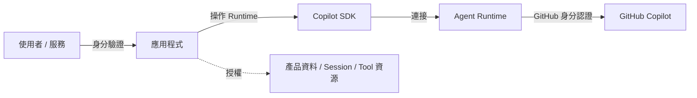

# Day 21 - GitHub 認證：使用者身分與 Server-to-Server 存取

前面的實作已經完成 Agent 執行控制與 Session 生命週期的主要能力。從這一篇開始，系列進入 Agent 服務化與正式部署的階段，觀察重點也會從單一 Agent 執行流程，進一步延伸到後端服務真正需要處理的身分、模型存取、Runtime、狀態保存與多使用者架構等工程問題。

先前大部分範例都執行在開發者自己的環境，許多認證與執行條件可以直接沿用目前主機的狀態。當 Agent 應用程式開始進入後端服務、Worker、CI/CD 或排程工作後，這些原本隱藏在開發環境中的假設就需要重新釐清，才能讓每一段 Agent 工作使用正確的身分與執行條件。

## GitHub 認證決定的是哪一層身分？

Agent 應用程式進入正式服務後，通常會同時存在多種身分與授權關係。使用者登入應用程式時，應用程式需要先確認目前呼叫者是誰；後續讀取資料、操作 Workspace 或恢復既有 Session 時，再根據目前使用者、Tenant 與資源歸屬判斷是否允許執行。

Copilot SDK 使用的 GitHub 認證位在不同層次。它決定的是 Agent Runtime 存取 GitHub Copilot 時要代表哪個 GitHub 身分，不會替應用程式判斷目前呼叫者是否具有產品資源的存取權。

這幾層責任可以分開理解：

* **應用程式身分驗證（Application Authentication）**：確認目前呼叫者是誰，例如登入後取得的使用者或服務身分。
* **應用程式授權（Application Authorization）**：根據使用者、Tenant、角色與資源所有權，判斷目前操作是否允許。
* **GitHub 認證（GitHub Authentication）**：決定 Agent Runtime 存取 GitHub Copilot 時使用的 GitHub 使用者或 Server-to-Server 身分。

整體關係可以表示成：



左側處理的是應用程式中的使用者身分與資源授權，右側則處理 Agent Runtime 存取 GitHub Copilot 時使用的 GitHub 身分。即使 GitHub 認證已經成功，也只能表示 Copilot 請求使用了預期的 GitHub 身分，不能因此判斷目前呼叫者可以存取哪些資料、Session 或 Tool 資源。

將這兩層責任分開後，後續選擇認證方式時就能更清楚判斷認證資訊應該由哪裡提供。根據目前工作的身分來源與執行環境不同，GitHub 認證資訊可能沿用 Runtime 已保存的登入狀態，也可能由 Client、個別 Session 或 Runtime 執行環境明確提供。

## Copilot SDK 的 GitHub 認證路徑

釐清 GitHub 認證與應用程式授權的責任後，下一個問題就是 Runtime 實際要從哪裡取得 GitHub 身分。不同執行情境代表的工作主體不一樣，有時是目前登入的開發者，有時是 Web 應用程式中的使用者，也可能是一段沒有互動式使用者的自動化工作。

因此，GitHub 認證可以依照身分來源與執行環境整理成三條主要路徑：

| 認證路徑              | GitHub 身分來源                                  | 認證資訊主要位置         | 適合情境               |
| ----------------- | -------------------------------------------- | ---------------- | ------------------ |
| 已登入使用者            | Copilot CLI 已完成登入的 GitHub 使用者                | Runtime 已保存的登入資訊 | 個人 CLI、桌面應用程式、開發環境 |
| User Access Token | OAuth 或 GitHub App 授權後取得的使用者認證資訊             | Client 或 Session | Web、SaaS、多使用者應用程式  |
| Server-to-Server  | GitHub Actions 工作流程或 GitHub App Installation | Runtime 執行環境     | CI/CD、排程、組織自動化     |

三條路徑最後都讓 Runtime 取得可以使用的 GitHub 認證資訊，主要差異在於目前工作代表誰、認證資訊由哪裡取得，以及由哪一層提供給 Runtime。

### 沿用已登入的 GitHub 使用者

在個人開發環境、CLI 或桌面應用程式中，Agent 工作通常就是代表目前正在操作電腦的使用者。這類情境不一定需要由應用程式另外管理 GitHub Token，只要 Copilot CLI 已經完成登入，Runtime 就可以沿用保存的使用者認證資訊。

在這類情境下，前面大部分範例都不需要另外提供 GitHub Token，只要直接建立 `CopilotClient`：

```typescript
const client = new CopilotClient();
```

只要 Copilot CLI 已經透過 GitHub OAuth 完成登入並保存目前使用者的認證資訊，SDK 就可以在沒有其他較高優先序認證來源時沿用這份登入狀態，後續直接建立 Session。

這種方式的前提，是目前 Runtime 所在環境與實際執行 Agent 工作的使用者具有一致的身分關係。當程式部署成共享後端服務後，Runtime 所在主機可能保存某位工程師先前登入的認證資訊，目前請求卻來自另一位使用者。此時如果仍然依賴主機上的登入狀態，Copilot 請求使用的 GitHub 身分就可能和產品中的呼叫者產生落差。

因此，多使用者服務通常會改成由應用程式明確取得目前使用者的 GitHub 認證資訊，再將它帶入對應的 Client 或 Session。

### 使用 User Access Token 代表目前使用者

當 Agent 服務需要替不同使用者執行工作時，GitHub 身分就不能再由 Runtime 所在主機的登入狀態決定。Web、SaaS 或內部系統通常已經有自己的登入流程，可以在使用者完成 GitHub 授權後取得 User Access Token，再將這份認證資訊交給目前的 Agent 工作。

應用程式可以透過 GitHub OAuth App 或 GitHub App 完成使用者授權。取得 User Access Token 後，再透過 `gitHubToken` 將它提供給 Copilot SDK：

```typescript
const client = new CopilotClient({
  gitHubToken: userAccessToken,
});
```

透過這個 Client 建立的 Session 就會使用對應的 GitHub 使用者身分。如果一個 Client 固定代表同一位使用者，可以將 Token 放在 Client；如果多位使用者共用同一個 Runtime，也可以將 GitHub 認證資訊縮小到個別 Session，讓每段工作使用對應的使用者身分。

這條路徑讓產品中的使用者與 Copilot 請求使用的 GitHub 身分可以建立明確對應。完整使用時，還需要進一步處理認證資訊來源、登入資訊回退、Client 與 Session 的認證範圍，以及長時間 Session 中 Token 的更新方式，後面的實作會再進一步拆解。

### 使用 Server-to-Server 認證

有些 Agent 工作本身沒有正在操作介面的使用者，例如 CI/CD 在合併變更後自動執行工作、排程定期處理 Repository，或後端服務代表組織執行自動化任務。這些情境不需要依賴某一位正在操作介面的使用者，也不適合將某位開發者或使用者的 GitHub Token 長期放在執行環境中。

GitHub Actions 可以直接使用工作流程執行期間提供的短效認證資訊。其他後端服務或 CI 環境則可以透過 GitHub App Installation 取得 Installation Access Token，讓 Agent 工作使用明確的自動化認證來源。

以 SDK 啟動 Runtime 的 GitHub App 情境為例，可以將這份認證資訊提供給 Runtime 執行環境：

```typescript
const client = new CopilotClient({
  env: {
    ...process.env,
    COPILOT_GITHUB_TOKEN: installationToken,
  },
});
```

這條路徑和 User Access Token 的處理方式不同。User Access Token 可以由 Client 或個別 Session 提供，用來代表目前使用者；GitHub App Installation Access Token 則屬於 Runtime 的 Server-to-Server 認證來源，需要由 Runtime 執行環境取得，不能直接當成 `gitHubToken` 使用。

| INFO: |
| :--- |
| GitHub Actions 與 GitHub App Installation 的 Copilot SDK Server-to-Server 認證條件，可以參考 GitHub 官方文件 [Server-to-server authentication for the Copilot SDK](https://docs.github.com/en/copilot/how-tos/copilot-sdk/auth/server-to-server-tokens)。 |

## 實作：使用 User Access Token 代表目前使用者

User Access Token 適合讓 Agent 工作使用目前使用者的 GitHub 身分。接下來透過一個最小範例，確認應用程式取得 Token 後，如何將認證資訊交給 Copilot SDK，再由 Runtime 使用對應的 GitHub 身分完成模型請求。

範例假設 GitHub OAuth 或 GitHub App User Authorization 已經完成，不另外實作登入、Callback 與 Token 交換流程。Session 也不開放任何 Tool 或其他 Agent 能力，讓觀察重點集中在 GitHub 認證本身。

### 準備專案環境

先建立 Node.js 專案：

```bash
$ mkdir copilot-sdk-github-auth
$ cd copilot-sdk-github-auth
$ npm init -y --init-type module
$ mkdir src
```

接著安裝 Copilot SDK 與 TypeScript 執行環境：

```bash
$ npm install @github/copilot-sdk
$ npm install --save-dev @types/node typescript tsx
```

完成本篇三個範例後，專案結構如下：

```text
copilot-sdk-github-auth/
├── .github/
│   └── workflows/
│       └── copilot-sdk.yml
├── src/
│   ├── user-token.ts
│   ├── actions.ts
│   └── github-app.ts
└── package.json
```

`user-token.ts` 驗證 User Access Token；`actions.ts` 與工作流程設定用來驗證 GitHub Actions 的 Server-to-Server 認證；`github-app.ts` 則處理 GitHub App Installation 的認證路徑。

先準備應用程式已經取得的 User Access Token：

```bash
$ export USER_GITHUB_TOKEN="<user-access-token>"
```

`USER_GITHUB_TOKEN` 只是這個範例自己的環境變數名稱。後面的程式會取得這個值，再透過 SDK 的 `gitHubToken` 明確提供給 Runtime。

實際 Web 應用仍然需要處理 OAuth 授權、Callback、`state` 驗證、Token 交換，以及 User Access Token 的保存、更新與撤銷。這些流程由應用程式自己的身分驗證機制負責，Copilot SDK 使用的是應用程式最後提供的 GitHub 認證資訊。

| INFO: |
| :--- |
| Web 應用中的 User Access Token 通常會透過 GitHub OAuth App 或 GitHub App 的授權流程取得。以 GitHub App 為例，Web Application Flow 會先將使用者導向 GitHub 完成授權，再由應用程式透過 Callback 收到一次性的授權碼，最後交換成 User Access Token。本篇直接從已經取得 Token 的位置開始，不另外展開完整 OAuth 流程。詳細步驟可以參考 GitHub 官方文件 [Generating a user access token for a GitHub App](https://docs.github.com/en/apps/creating-github-apps/authenticating-with-a-github-app/generating-a-user-access-token-for-a-github-app)。 |

### 將使用者認證資訊交給 Copilot SDK

建立 `src/user-token.ts`：

```typescript
import { CopilotClient } from "@github/copilot-sdk";

const userAccessToken = process.env.USER_GITHUB_TOKEN;

if (!userAccessToken) {
  throw new Error("USER_GITHUB_TOKEN is required");
}

const client = new CopilotClient({
  gitHubToken: userAccessToken,
  useLoggedInUser: false,
});

const session = await client.createSession({
  model: "auto",
  availableTools: [],
});

const response = await session.sendAndWait(
  {
    prompt: "請用三點說明 GitHub Copilot SDK 適合整合進哪些應用程式。",
  },
  120_000,
);

console.log(response?.data.content);

await session.disconnect();
await client.stop();
```

整體 Session 流程和前面的範例沒有改變，真正影響 GitHub 身分的是建立 Client 時加入的 `gitHubToken`：

```typescript
const client = new CopilotClient({
  gitHubToken: userAccessToken,
  useLoggedInUser: false,
});
```

`gitHubToken` 明確指定這個 Client 使用哪一份 User Access Token。透過它建立的 Session，後續 Copilot 請求就會使用對應的 GitHub 使用者身分。

目前 Node.js SDK 在提供 `gitHubToken` 時，`useLoggedInUser` 預設即為 `false`。範例仍然明確寫出這項設定，讓認證來源與登入資訊回退的行為更容易辨識。

`useLoggedInUser: false` 會停用 Copilot CLI 已保存的使用者認證資訊，以及 GitHub CLI 登入資訊的自動回退。因此，這個範例缺少有效的 User Access Token 時不會改用開發主機上的既有登入狀態。

### Client 與 Session 的認證範圍

前面的完整範例將 `gitHubToken` 放在 `CopilotClient`，代表後續透過這個 Client 建立的 Session 都會使用相同的 GitHub 使用者身分。這種方式適合一個 Client 固定代表同一位使用者，例如桌面應用程式，或後端服務為每位使用者維護獨立 Client 的架構。

如果多位使用者共用同一個 Runtime，可以進一步將認證資訊縮小到個別 Session：

```typescript
const client = new CopilotClient({
  useLoggedInUser: false,
});

const session = await client.createSession({
  model: "auto",
  gitHubToken: userAccessToken,
  availableTools: [],
});
```

這時同一個 Runtime 可以存在多個 Session，每段 Session 分別使用自己的 User Access Token。對生命週期較短，或應用程式在建立 Session 時已經持有有效 Token 的工作來說，直接提供 Session-level `gitHubToken` 就能讓 GitHub 身分維持在目前工作的範圍。

如果應用程式使用的 User Access Token 會過期或需要定期輪替，而 Session 本身可能持續存在較長時間，就還需要處理 Session 執行期間的 Token 更新。這種情況可以使用 Session-level `gitHubTokenProvider`，讓 Runtime 在需要 GitHub 認證資訊時向應用程式取得目前有效的 Token。

以下假設應用程式已經提供自己的 `acquireGitHubToken()`，負責從 OAuth、Token Storage 或其他認證機制取得目前有效的 User Access Token。這個函式屬於應用程式實作，不是 Copilot SDK 提供的 API：

```typescript
const client = new CopilotClient({
  useLoggedInUser: false,
});

const session = await client.createSession({
  model: "auto",
  gitHubTokenProvider: async ({ host, sessionId, reason }) => {
    const token = await acquireGitHubToken({
      host,
      sessionId,
      reason,
    });

    return {
      kind: "token",
      accessToken: token.value,
      expiresIn: token.secondsRemaining,
    };
  },
  availableTools: [],
});
```

`gitHubTokenProvider` 將 Session 使用的 GitHub 身分與固定 Token 值分開。Provider 可以根據目前 GitHub Host、Session ID 與 Token 取得原因，回傳目前仍然有效的 User Access Token。

其中 `expiresIn` 表示這份 Token 還剩多少有效秒數。Runtime 在建立或恢復 Session 時會先取得 Token；後續需要 GitHub 認證，而且目前 Token 已經需要更新時，則可以再次透過 Provider 取得新的值。

這讓長時間存在的 Session 不需要一直綁定建立當下取得的靜態 Token。實際如何保存 Refresh Token、如何向 GitHub 交換新的 Access Token，以及 Token 無法更新時應如何處理，仍然屬於應用程式自己的認證責任。

Session 不能同時設定靜態 `gitHubToken` 與 `gitHubTokenProvider`，應依目前 Token 的生命週期選擇其中一種方式。無論使用哪一種，這裡處理的都只是 Copilot 請求使用的 GitHub 身分，不能取代產品自己的 Session 歸屬與資源授權。

| NOTE: |
| :--- |
| `gitHubTokenProvider` 處理的是使用者型 GitHub Token 的 Session 認證與更新，不適用於 GitHub App Installation Access Token。Installation Access Token 仍然需要使用 Server-to-Server 的 Runtime 認證路徑。 |

### 執行應用程式

完成 `src/user-token.ts` 後執行：

```bash
$ npx tsx src/user-token.ts
```

如果 User Access Token 有效，而且目前使用者具有可用的 Copilot 存取資格，程式會建立 Session 並輸出模型回應。

這個範例主要確認兩件事。第一，Copilot 請求使用的是應用程式明確提供的 User Access Token；第二，當範例沒有取得這份 Token 時，應用程式會直接停止，不再依賴開發主機上的個人登入狀態。

## 實作：使用 Server-to-Server 身分執行 Agent

User Access Token 適合讓 Agent 工作代表目前使用者，但 CI/CD、排程或後端自動化通常沒有一位正在操作介面的使用者。這類工作需要改由執行環境提供 Server-to-Server 認證資訊。

接下來沿用前面建立的 `copilot-sdk-github-auth` 專案，分別驗證 GitHub Actions 與 GitHub App Installation 兩條路徑。兩個範例都不另外加入 Tool 或其他 Agent 能力，只觀察 Runtime 如何取得自動化工作需要的 GitHub 認證資訊。

### 在 GitHub Actions 中使用工作流程認證

GitHub Actions 執行期間會提供目前工作流程使用的短效 Token，因此應用程式不需要另外保存某位使用者的長期認證資訊。

先建立 `src/actions.ts`：

```typescript
import { CopilotClient } from "@github/copilot-sdk";

const client = new CopilotClient({
  useLoggedInUser: false,
});

const session = await client.createSession({
  model: "auto",
  availableTools: [],
});

const response = await session.sendAndWait(
  {
    prompt: "請用三點整理在 CI/CD 中執行 Agent 工作需要注意的工程問題。",
  },
  120_000,
);

console.log(response?.data.content);

await session.disconnect();
await client.stop();
```

程式本身沒有直接設定 Token。`useLoggedInUser: false` 只停用 Copilot CLI 與 GitHub CLI 已保存的使用者登入回退，不會阻止 Runtime 使用執行環境明確提供的認證資訊。

接著建立 `.github/workflows/copilot-sdk.yml`：

```yaml
name: Copilot SDK

on:
  workflow_dispatch:

permissions:
  contents: read
  copilot-requests: write

jobs:
  run:
    runs-on: ubuntu-latest
    steps:
      - uses: actions/checkout@v6
      - uses: actions/setup-node@v4
        with:
          node-version: 22
      - run: npm ci
      - run: npx tsx src/actions.ts
        env:
          GITHUB_TOKEN: ${{ secrets.GITHUB_TOKEN }}
```

工作流程將 GitHub Actions 產生的內建 Token 以 `GITHUB_TOKEN` 提供給目前執行環境。對組織所屬的 Repository 而言，工作流程還需要授予 `copilot-requests: write`，組織也必須允許 Copilot CLI 的相關用量計入組織。

符合這些條件後，每次工作流程執行都可以使用當次產生的短效認證資訊完成 Copilot 請求，不需要另外準備某位使用者的 Personal Access Token。

這條路徑也維持了自動化工作的認證邊界。工作流程使用自己的執行身分，Agent 工作不需要借用部署主機上某位工程師留下的登入資訊。

### 使用 GitHub App 進行 Server-to-Server 認證

GitHub Actions 以外的後端服務、Worker 或其他 CI 系統，也可以透過 GitHub App Installation 取得 Server-to-Server 認證資訊。

目前 GitHub App 需要具備 **Copilot Requests** Repository 權限。應用程式取得 Installation Access Token 後，就可以將這份短效認證資訊提供給 Agent Runtime，讓後續 Copilot 請求使用對應的 GitHub App Installation 身分。

先將 Token 提供給目前執行環境：

```bash
$ export INSTALLATION_TOKEN="<installation-access-token>"
```

這裡先將 Installation Access Token 視為應用程式已經準備完成的認證資訊。後面的實作只處理這份 Token 如何交給 Agent Runtime，不再展開 GitHub App 本身的認證流程，讓觀察重點維持在 Copilot SDK 的 Server-to-Server 認證路徑。

| INFO: |
| :--- |
| Installation Access Token 需要先透過 GitHub App Private Key 建立 JWT，再向 GitHub API 交換取得。這屬於 GitHub App 本身的認證流程，因此本篇直接從已經取得 Installation Access Token 的位置開始。完整步驟可以參考 GitHub 官方文件 [Generating an installation access token for a GitHub App](https://docs.github.com/en/apps/creating-github-apps/authenticating-with-a-github-app/generating-an-installation-access-token-for-a-github-app)。 |

### 將 Server-to-Server 認證資訊交給 Runtime

取得 Installation Access Token 後，接下來要處理的是這份認證資訊應該放在哪一層。和前面的 User Access Token 不同，Installation Access Token 不會透過 Session 的 `gitHubToken` 提供，而是需要進入 Runtime 的 Server-to-Server 認證路徑。

建立 `src/github-app.ts`：

```typescript
import { CopilotClient } from "@github/copilot-sdk";

const installationToken = process.env.INSTALLATION_TOKEN;

if (!installationToken) {
  throw new Error("INSTALLATION_TOKEN is required");
}

const client = new CopilotClient({
  env: {
    ...process.env,
    COPILOT_GITHUB_TOKEN: installationToken,
  },
  useLoggedInUser: false,
});

const session = await client.createSession({
  model: "auto",
  availableTools: [],
});

const response = await session.sendAndWait(
  {
    prompt: "請用三點整理自動化 Agent 工作需要注意的執行條件。",
  },
  120_000,
);

console.log(response?.data.content);

await session.disconnect();
await client.stop();
```

範例先從 `INSTALLATION_TOKEN` 取得應用程式已經準備好的 Installation Access Token，再透過 Client 的 `env` 將它以 `COPILOT_GITHUB_TOKEN` 提供給 SDK 啟動的 Runtime 程序：

```typescript
const client = new CopilotClient({
  env: {
    ...process.env,
    COPILOT_GITHUB_TOKEN: installationToken,
  },
  useLoggedInUser: false,
});
```

Node.js SDK 的 `env` 用來設定 SDK 啟動的 Runtime 程序可以取得哪些環境變數；沒有提供時，則沿用目前應用程式程序的環境。

`COPILOT_GITHUB_TOKEN` 是 Runtime 的 Server-to-Server 認證來源。Installation Access Token 代表 GitHub App Installation，因此不能直接放進 Client 或 Session 的 `gitHubToken`，也不使用前面的 `gitHubTokenProvider`。

這裡使用的是 SDK 自行啟動 Runtime 的情境，因此應用程式可以在建立 Client 時提供 Runtime 所需的環境設定。如果連接的是已經獨立執行的 Runtime，應用程式端就無法再透過 Client 修改既有程序的環境；認證資訊需要由 Runtime 自己的部署環境準備。

這個差異和 Runtime 實際由誰啟動有關，後續介紹 Runtime 執行架構時會再完整拆解。這裡只需要掌握 Server-to-Server 認證資訊最終必須進入實際執行 Agent Runtime 的環境。

### 執行應用程式

GitHub Actions 範例需要先將程式與工作流程提交到組織所屬的 Repository，再從 Actions 手動觸發對應工作流程。如果 Repository 權限與組織政策都符合條件，工作流程就會使用當次執行提供的短效 Token 完成 Copilot 請求。

GitHub App 範例則可以在準備好 Installation Access Token 後執行：

```bash
$ npx tsx src/github-app.ts
```

如果 Installation Access Token、GitHub App 權限與組織設定正確，Runtime 就會使用 GitHub App Installation 的認證資訊建立 Session 並完成請求。

兩個 Server-to-Server 範例的認證來源不同，但共同點都是由自動化工作的執行環境提供 GitHub 認證資訊，不依賴某位使用者已經保存的登入狀態。

| NOTE: |
| :--- |
| GitHub App Installation Access Token 目前一小時後到期，需要在到期前重新取得。SDK 自行啟動 Runtime 時，需要以新的認證環境重新啟動 Client；已獨立執行的 Runtime 則需要重新啟動 Runtime，才能取得新的 Token。 |

## GitHub 認證與應用程式授權

前面的 User Access Token 與 Server-to-Server 認證，處理的是 Agent Runtime 存取 GitHub Copilot 時使用哪個 GitHub 身分。回到 Agent 服務本身，應用程式的身分驗證與資源授權仍然需要獨立處理。

假設使用者已經完成應用程式登入，並準備操作一段既有 Session。服務仍然需要確認這段 Session 是否屬於目前使用者，以及目前身分是否具有對應資源的存取權。即使 User Access Token 有效，也不能將 Session ID 視為產品資源的存取權證明。

相同原則也適用於 Agent 使用的業務能力。當自訂工具讀取產品資料、修改資源或呼叫外部服務時，工具處理函式仍然需要根據已驗證的使用者、Tenant 與資源權限完成授權判斷。Tool Call、Prompt、Permission approval 或 GitHub 認證資訊，都不能取代應用程式授權。

因此，正式服務可以維持兩層清楚的責任分工：

* **GitHub 認證**：決定 Agent Runtime 存取 GitHub Copilot 時使用的 GitHub 使用者或 Server-to-Server 身分。
* **應用程式身分驗證與授權**：確認目前呼叫者是誰，並判斷可以操作哪些 Session、資料與業務資源。

將兩層責任分開後，GitHub 認證方式可以依照執行環境調整，而產品本身的 Session 歸屬與資源授權模型也不需要綁定特定的 Token 或 GitHub 身分。

## 小結

Agent 應用程式進入後端服務與自動化環境後，GitHub 身分就不能再只依賴開發主機目前保存的登入狀態。Copilot SDK 提供不同的認證路徑，讓應用程式可以依照目前工作的身分來源與執行環境，明確決定 Runtime 要使用哪一份 GitHub 認證資訊：

* 本機 CLI、桌面應用程式與開發環境，可以沿用 Copilot CLI 已經保存的 GitHub 使用者登入資訊。
* Web、SaaS 與多使用者服務可以使用 User Access Token，並依 Client、Session 與 Token 生命週期決定認證資訊的提供範圍；需要輪替 Token 時，也可以由 Session 在執行期間重新取得有效的認證資訊。
* CI/CD、排程與其他自動化工作可以使用 Server-to-Server 認證，讓 GitHub Actions 或 GitHub App Installation 的認證資訊進入實際執行 Agent 的 Runtime 環境。
* GitHub 認證只決定 Agent Runtime 存取 GitHub Copilot 時使用的 GitHub 身分；目前使用者可以操作哪些 Session、資料與業務資源，仍然由應用程式自己的身分驗證與授權機制決定。

將 GitHub 身分、Runtime 認證與應用程式授權分開管理後，不同執行環境就能選擇適合的認證方式，同時維持產品資源與 Agent 執行之間清楚的責任邊界。
