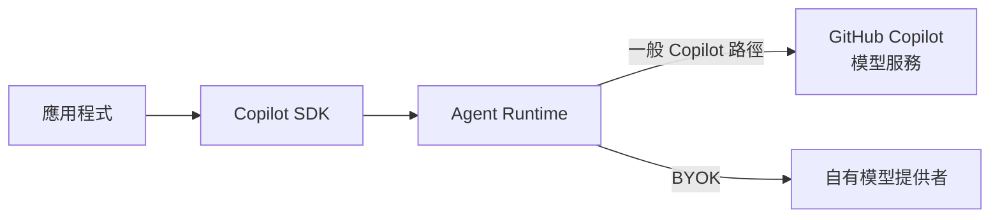
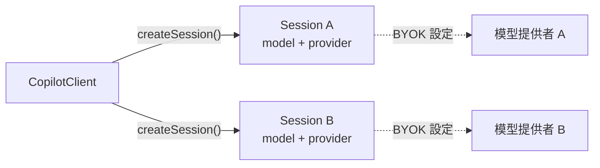

# Day 22 - BYOK 實戰：接入自有模型提供者

GitHub 認證讓應用程式可以明確決定 Agent Runtime 透過哪一個 GitHub 身分存取 GitHub Copilot。不過，正式服務使用的模型不一定都由 GitHub Copilot 提供。實際的服務環境可能已經透過 Microsoft Foundry、OpenAI、Anthropic 或內部 AI Gateway 存取模型，也可能使用 LiteLLM、vLLM 等相容服務，希望 Agent 延續既有的模型存取路徑、認證方式與用量管理。

GitHub Copilot SDK 提供 **BYOK（Bring Your Own Key）** 機制，讓 Session 可以指定自己的模型提供者。應用程式仍然透過 Copilot SDK 建立 Session，Agent Runtime 也持續負責 Agent Loop 與工具協調；模型請求則改由 Runtime 根據 Session 設定，使用指定的模型提供者、模型與認證資訊。這樣可以保留既有的 Agent 執行流程，同時讓模型存取方式依照實際服務環境獨立配置。

## 為什麼 Agent 服務會需要 BYOK？

前面的範例主要聚焦 Agent 執行本身，因此模型存取大多直接沿用 GitHub Copilot。當應用程式進入實際服務環境後，模型通常已經有既定的存取方式、認證來源與管理邊界，這時就需要進一步決定 Agent Runtime 是否也要沿用相同的模型基礎架構。

前面的範例大多使用：

```typescript
const session = await client.createSession({
  model: "auto",
});
```

這種方式由 GitHub Copilot 處理模型存取。應用程式建立 Session 後，可以沿用既有的 GitHub Copilot 認證與模型服務完成後續模型請求。

當模型存取已經有自己的基礎架構時，常見情境包括：

* **沿用既有模型平台**：組織已經統一透過 Microsoft Foundry 或內部 AI Gateway 管理模型，希望 Agent 工作使用相同的存取路徑與治理方式。
* **沿用既有模型提供者**：系統原本已經使用 OpenAI 或 Anthropic，希望 Agent 的模型流量、認證與用量繼續由既有帳號管理。
* **接入自架或相容服務**：模型部署在 LiteLLM、vLLM、Ollama 或其他提供 OpenAI 相容 API 的環境中，希望直接使用現有的模型服務。

這些情境的共同點，是希望保留 Copilot Agent Runtime，同時將模型請求交給既有的模型服務。目前 BYOK 支援 OpenAI、Azure OpenAI、Anthropic，以及 Ollama、LiteLLM、vLLM 等 OpenAI 相容端點。使用 BYOK 時，模型請求可以繞過 GitHub Copilot 認證，也不需要 GitHub Copilot 訂閱，模型用量與費用則由實際的模型提供者承接。

因此，BYOK 帶來的變化不只在於 API Key 改由應用程式提供。模型從哪裡取得、使用哪個模型 ID、端點如何連線、認證資訊怎麼管理，以及後續的速率限制與用量，都會跟著模型存取路徑一起改變。

## BYOK 下的模型存取路徑

如果只從 `provider` 設定來看，可能會以為 BYOK 代表應用程式改成直接呼叫模型 API，Copilot Agent Runtime 因此退出執行流程。實際上，應用程式、Copilot SDK 與 Agent Runtime 之間的基本關係沒有因此改變。

兩種模型存取方式可以先整理成：



一般 Copilot 路徑中，Runtime 透過 GitHub Copilot 取得模型能力；BYOK 則讓 Runtime 根據 Session 提供的模型提供者設定，將模型請求送往指定的模型服務。

模型存取路徑改變後，Session 與 Agent Runtime 原本負責的工作仍然存在。應用程式繼續建立 Session、送出訊息與接收事件；Agent Runtime 也繼續推進 Agent Loop、協調工具，並將模型結果帶回目前的執行流程。前面建立的 Streaming、Tool、Permission 與 Hooks 等能力，仍然沿用相同的 Agent 執行架構。

差異集中在模型存取這一層。使用 BYOK 後，應用程式需要知道實際要使用哪個模型、模型提供者的端點位置，以及 Runtime 應使用什麼認證資訊與 API 格式連接它。模型可用範圍、速率限制與用量也改由實際的模型提供者決定。

| NOTE: |
| :--- |
| BYOK 處理的是模型存取方式。應用程式如果另外使用需要 GitHub 身分的 GitHub API 或其他能力，仍需要依照對應功能的認證方式提供 GitHub 身分。模型提供者的認證資訊也不能取代應用程式本身的身分驗證（Authentication）與授權（Authorization）。 |

## BYOK 的模型與連線設定

BYOK 的模型與模型提供者設定放在 Session。應用程式仍然先建立 `CopilotClient`，由 Client 負責啟動或連接 Agent Runtime；建立 Session 時，再透過 `model` 與 `provider` 指定這段工作實際使用的模型服務。

例如：

```typescript
const client = new CopilotClient();

const session = await client.createSession({
  model: "<model-id>",
  provider: {
    type: "openai",
    baseUrl: "<model-provider-url>",
    apiKey: "<api-key>",
  },
});
```

這裡的 `CopilotClient` 沒有固定模型或模型提供者，真正的 BYOK 設定是在建立 Session 時提供。這也表示模型存取方式不需要成為整個 Client 的固定條件，同一個 Client 可以建立多個 Session，再依照各自工作的需要提供不同的模型與模型提供者設定。



圖中的虛線表示 Session 保存的 BYOK 設定關係；實際模型請求仍然由 Agent Runtime 依照這些設定送往對應的模型提供者。

因此，`CopilotClient` 負責啟動或連接 Runtime 並建立 Session，BYOK 的模型與 Provider 則由各自的 Session 決定。

建立 BYOK Session 時，可以再從幾個面向理解模型與連線設定：

* **模型**：指定 Runtime 實際要使用的模型。
* **模型提供者與端點**：決定 Runtime 要使用哪一種模型提供者 API，以及模型服務位於哪裡。
* **模型 API 格式**：在 OpenAI / Azure 模型提供者中決定使用 Chat Completions 或 Responses API。
* **模型服務認證**：提供 Runtime 存取模型服務需要的 API Key、Bearer Token 或動態 Token。

這些設定共同描述 Runtime 要使用哪個模型，以及要如何連接實際的模型服務。接下來再分別拆解各項設定在 BYOK 中負責的工作。

### 指定模型與模型提供者

前面使用 GitHub Copilot 模型服務時，可以透過：

```typescript
model: "auto"
```

讓 Copilot 處理模型選擇。使用自訂模型提供者時，目前 SDK 要求明確提供模型 ID：

```typescript
model: "<model-id>"
```

Runtime 無法假設自訂端點實際提供哪些模型，因此 BYOK Session 必須指定 `model`。這個模型 ID 應以模型提供者實際部署或公開的名稱為準，而不是固定使用 Copilot 模型清單中的名稱。

模型確定後，還需要告訴 Runtime 目前使用哪一種類型的模型提供者。`provider.type` 主要支援 `"openai"`、`"azure"` 與 `"anthropic"`。

其中，`"openai"` 除了 OpenAI API，也適用於提供 OpenAI 相容 API 的服務，例如 Ollama、LiteLLM 與 vLLM；`"azure"` 用於 Azure OpenAI 原生端點；`"anthropic"` 則使用 Anthropic 的 API 格式。

例如使用 OpenAI 相容模型服務時，可以設定：

```typescript
provider: {
  type: "openai",
  // ...
}
```

`type` 決定 Runtime 要用哪一套模型提供者 API 與模型服務溝通，因此不能只根據模型部署在哪個平台判斷。實際使用哪個 `type`，還需要搭配模型服務提供的端點形式一起確認。

### 設定端點與模型 API 格式

模型提供者類型確定後，`baseUrl` 用來指定 Runtime 實際要連接的模型服務位置。不同 Provider 對端點形式的要求可能不同，其中 Microsoft Foundry 與 Azure OpenAI 特別容易因端點格式產生差異。

如果使用 Azure OpenAI 原生端點：

```text
https://my-resource.openai.azure.com
```

應使用：

```typescript
provider: {
  type: "azure",
  baseUrl: "https://my-resource.openai.azure.com",
}
```

這種模式的 `baseUrl` 只提供主機位置，後續 API 路徑由 Runtime 組合。

如果 Microsoft Foundry 提供的是包含 `/openai/v1/` 的 OpenAI 相容端點：

```text
https://my-resource.openai.azure.com/openai/v1/
```

則應使用：

```typescript
provider: {
  type: "openai",
  baseUrl:
    "https://my-resource.openai.azure.com/openai/v1/",
}
```

同樣位於 Microsoft Foundry 或 Azure OpenAI 的模型，也可能因端點形式不同而使用不同的 `type`。因此，模型提供者類型與端點應一起確認，不能只根據服務部署的平台決定。

OpenAI 與 Azure 模型提供者還可以透過 `wireApi` 決定 Runtime 使用哪種模型 API 格式：

```typescript
provider: {
  type: "openai",
  baseUrl,
  wireApi: "completions",
}
```

目前 `"completions"` 是預設值，使用 Chat Completions API，模型相容範圍較廣；`"responses"` 則使用 Responses API。例如模型服務需要 Responses API 時，可以設定：

```typescript
provider: {
  type: "openai",
  baseUrl,
  wireApi: "responses",
}
```

實際使用哪一種 API 格式，應以模型提供者端點與模型支援的方式為準，而不是只根據模型 ID 推測。Anthropic 使用自己的 Messages API，不受 `wireApi` 設定影響。

### 提供模型服務認證

找到模型服務後，Runtime 還需要對應的認證資訊才能送出模型請求。最直接的方式是提供 API Key：

```typescript
provider: {
  type: "openai",
  baseUrl,
  apiKey,
}
```

如果模型提供者使用 Bearer Token，也可以透過 `bearerToken` 提供目前已經取得的 Token。這是一個靜態 Token，SDK 不會自動更新；Token 到期後，後續模型請求就會失敗。

正式服務如果使用 Microsoft Entra ID、受控識別（Managed Identity）或其他短效認證資訊，可以改用 `bearerTokenProvider`：

```typescript
provider: {
  type: "openai",
  baseUrl,
  bearerTokenProvider: async () => {
    return await acquireBearerToken();
  },
}
```

Runtime 在發出模型提供者請求前，會透過這個回呼函式向應用程式取得目前有效的 Token。Runtime 本身不負責 Token 快取，因此實際的身分來源、Token 存取範圍、快取與更新邏輯，仍然由回呼函式所使用的身分驗證函式庫負責。

如果同時提供多種模型提供者認證資訊，目前 `bearerTokenProvider` 的優先序最高，其次為靜態 `bearerToken`，最後才是 `apiKey`。一般應用不需要同時設定多種方式，只要依照模型提供者的認證機制選擇明確的來源即可。

| NOTE: |
| :--- |
| 目前 Node.js SDK 將 `bearerTokenProvider` 相關介面標示為 Experimental。正式服務如果依賴動態 Bearer Token，升級 Copilot SDK 或 Runtime 時應重新確認最新型別與執行行為。 |

模型、Provider、端點、API 格式與認證資訊組合起來後，Runtime 就具備連接指定模型服務所需的條件。實際建立 BYOK Session 時，應用程式只需要依照目前模型服務的部署方式提供對應設定。

## 實作：透過 OpenAI 相容端點建立 BYOK Session

接下來建立一個最小的 BYOK 範例，讓 Agent Runtime 透過 OpenAI 相容端點完成模型請求。

OpenAI 相容端點除了 OpenAI，也可以來自 LiteLLM、vLLM、Ollama 或應用程式既有的 AI Gateway。範例假設目前端點需要 API Key，並由執行環境明確提供端點、認證資訊與模型 ID，避免程式綁定特定模型提供者或固定模型名稱。

為了讓觀察重點集中在 BYOK，Session 不開放任何 Tool，也不加入 MCP、Streaming 或其他 Agent 能力。

### 準備專案環境

先建立 Node.js 專案並啟用 ES Modules：

```bash
$ mkdir copilot-sdk-byok
$ cd copilot-sdk-byok
$ npm init -y --init-type module
$ mkdir src
```

接著安裝 Copilot SDK 與 TypeScript 執行環境：

```bash
$ npm install @github/copilot-sdk
$ npm install --save-dev @types/node typescript tsx
```

再準備模型服務需要的設定：

```bash
$ export MODEL_BASE_URL="https://api.openai.com/v1"
$ export MODEL_API_KEY="<api-key>"
$ export MODEL_ID="<model-id>"
```

`MODEL_BASE_URL`、`MODEL_API_KEY` 與 `MODEL_ID` 都是這個範例自己的環境變數名稱。若改用 LiteLLM、vLLM 或其他 OpenAI 相容端點，只需要換成實際模型服務提供的設定。

模型 ID 不固定寫在程式中。BYOK 能使用哪些模型取決於目前模型提供者實際部署或允許使用的模型，由執行環境明確提供，可以避免範例長期依賴某個特定時間點的模型名稱。

### 建立 BYOK Session

建立 `src/index.ts`：

```typescript
import { CopilotClient } from "@github/copilot-sdk";

const baseUrl = process.env.MODEL_BASE_URL;
const apiKey = process.env.MODEL_API_KEY;
const model = process.env.MODEL_ID;

if (!baseUrl || !apiKey || !model) {
  throw new Error(
    "MODEL_BASE_URL、MODEL_API_KEY 與 MODEL_ID 都必須提供。",
  );
}

const client = new CopilotClient();

const session = await client.createSession({
  model,
  provider: {
    type: "openai",
    baseUrl,
    apiKey,
  },
  availableTools: [],
});

const response = await session.sendAndWait(
  {
    prompt:
      "請用三點說明 Agent 應用進入正式服務後，" +
      "需要處理哪些工程問題。",
  },
  120_000,
);

console.log(response?.data.content);

await session.disconnect();
await client.stop();
```

整體流程仍然沿用前面建立 Session 的方式。應用程式建立 `CopilotClient`，透過 `createSession()` 建立工作階段，再使用 `sendAndWait()` 將 Prompt 送進 Agent Runtime。

和一般 Session 相比，真正讓模型存取改走 BYOK 的，是建立 Session 時提供的 `model` 與 `provider`。

### 設定模型存取方式

完整範例先從執行環境取得模型 ID：

```typescript
const model = process.env.MODEL_ID;
```

建立 Session 時再明確指定：

```typescript
const session = await client.createSession({
  model,
  // ...
});
```

使用 BYOK 後，Runtime 不會替自訂模型提供者選擇模型，因此這個 ID 必須對應到目前端點實際提供的模型。

模型服務的連線方式則放在 `provider`：

```typescript
provider: {
  type: "openai",
  baseUrl,
  apiKey,
},
```

`type: "openai"` 表示目前端點使用 OpenAI 相容 API；`baseUrl` 指向實際模型服務，`apiKey` 則提供模型請求需要的認證資訊。

範例沒有另外設定 `wireApi`，因此沿用目前預設的 `"completions"`。如果實際的模型提供者或模型需要 Responses API，可以改成：

```typescript
provider: {
  type: "openai",
  baseUrl,
  apiKey,
  wireApi: "responses",
},
```

使用哪一種 API 格式，應以實際模型服務支援的方式為準，而不是只根據模型 ID 推測。

`availableTools: []` 則將目前 Session 的工具範圍設為空。這和 BYOK 本身沒有直接關係，只是避免其他 Agent 能力介入，讓範例集中確認模型提供者的連線與模型請求。

### 執行應用程式

完成程式後執行：

```bash
$ npx tsx src/index.ts
```

如果 `MODEL_BASE_URL`、`MODEL_API_KEY` 與 `MODEL_ID` 都符合目前模型提供者的設定，Agent Runtime 就會透過指定的 OpenAI 相容端點完成模型請求，再將 Assistant 回應交回 Session。

實際回答內容會受到目前使用的模型影響，不需要期待固定文字。這裡主要確認 BYOK Session 能以應用程式指定的模型與模型提供者完成一輪 Agent 執行。

## BYOK 之後的模型存取責任

將模型存取改成 BYOK 後，Agent Runtime 仍然負責 Session 與 Agent 執行，但原本由 GitHub Copilot 模型服務承接的一部分責任，會轉移到應用程式與實際的模型提供者。

正式服務需要進一步處理幾項模型存取責任：

* **模型選擇與相容性**：應用程式需要知道目前端點實際提供哪些模型 ID，並確認選用的模型與 Agent 工作需要的能力及模型 API 格式相容。如果工作需要 Tool Calling、Streaming 或其他特定模型能力，模型與端點也需要支援對應功能。
* **模型提供者認證資訊**：API Key、Bearer Token 或短效身分憑證需要納入既有的機密資訊與身分管理流程。使用動態 Token 時，SDK 可以在模型請求前回呼應用程式，Token 的取得、快取與更新仍由實際的身分驗證機制負責。
* **模型提供者的可用性與限制**：BYOK Session 受到實際模型提供者的模型可用性、速率限制與配額約束，不再沿用 GitHub Copilot 模型服務的相同限制。
* **用量與計費**：模型用量與費用由實際的模型提供者追蹤與計算，不使用 GitHub Copilot 託管模型的計費方式。Agent 服務如果還需要限制單一使用者、租戶或工作可以消耗多少模型資源，仍然需要建立自己的用量政策。

這些變化集中在模型存取層。BYOK 不會改變應用程式原本的身分驗證、授權或租戶邊界，也不代表模型提供者的認證資訊可以直接作為應用程式使用者身分。應用程式仍然要先確認目前呼叫者與資源權限，再決定要替這段工作建立什麼 Session，以及允許它使用哪些能力。

## 小結

Agent 應用程式改用 BYOK 後，仍然可以沿用既有的 Session 與 Agent Runtime 執行方式，只是模型存取改由應用程式指定的模型提供者承接。建立 BYOK Session 時，需要進一步掌握模型、連線、認證與使用限制等設定：

* BYOK 改變的是 Runtime 存取模型的路徑，Agent Loop、工具協調與其他 Session 執行機制仍然由 Agent Runtime 負責。
* 模型與模型提供者設定屬於 Session 層級，應用程式可以依照每段工作的需求指定模型、端點與模型 API 格式。
* 模型服務可以使用 API Key、靜態 Bearer Token 或動態取得的短效 Token 完成認證，相關憑證與生命週期仍需要由應用程式妥善管理。
* 模型可用性、速率限制、配額與用量會跟隨實際的模型提供者；應用程式本身的身分驗證、授權與租戶邊界則維持原有責任。

將 Agent 執行與模型存取分開管理後，應用程式就能依照實際服務環境選擇適合的模型提供者，同時維持 Agent Runtime、模型服務與應用程式權限之間清楚的責任邊界。
