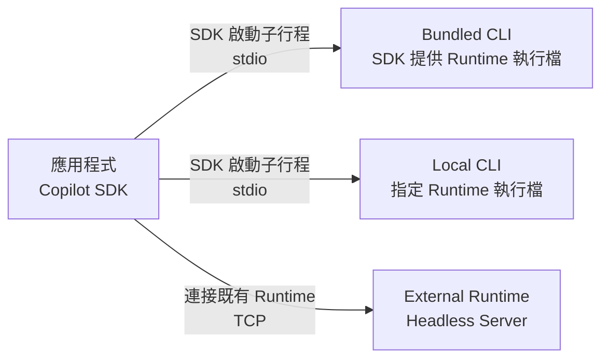

# Day 23 - Copilot Runtime 執行架構：連線方式與部署邊界

前面的實作大多集中在 Agent 本身的能力與執行流程，Copilot Runtime 的啟動與連線則交由 SDK 處理，因此開發時通常不需要特別關心 Runtime 如何啟動、在哪裡執行，以及它和應用程式之間如何建立連線。對本機工具或一般應用程式來說，這樣的預設方式已經能涵蓋多數需求。

當 Agent 應用程式進一步部署到後端服務、Worker 或其他長時間執行的環境，Runtime 本身也會成為部署架構的一部分。Runtime 由誰啟動與維護、應用程式如何與它建立連線，以及兩者是否需要分開部署，都會直接影響版本管理、行程生命週期與部署邊界的設計。

## Runtime 的執行方式為什麼會影響部署架構？

到目前為止，Copilot Runtime 大多隱藏在 SDK 提供的操作介面後面。應用程式透過 SDK 建立 Client 與 Session，就能開始處理 Agent 工作，不需要另外管理 Runtime 的執行檔、行程生命週期或連線方式。因此，前面的實作可以把重點放在 Session、Tool 與 Agent 執行流程本身。

例如，前面的範例大多直接建立 `CopilotClient`，後續就能透過它建立 Session 並開始使用 Agent：

```typescript
const client = new CopilotClient();
```

當 Runtime 跟著應用程式一起執行時，這些管理細節大多由 SDK 處理。等應用程式開始以服務形式部署，就需要進一步確認幾個問題：

* **Runtime 執行檔**：使用 SDK 提供的相容版本，還是由部署環境準備指定的 Copilot CLI。
* **Runtime 生命週期**：Runtime 跟著 SDK Client 建立與停止，還是由外部環境獨立維護。
* **Runtime 執行位置**：Runtime 和應用程式位於同一台主機，還是分別部署在不同 Container 或執行環境。
* **Runtime 連線方式**：SDK 透過本機行程通訊，還是連接已經存在的 Runtime。
* **Runtime 執行環境**：工作目錄、環境設定與 Runtime 所需資源位於哪一個執行環境。

這些問題可以先從 Runtime 的生命週期由誰管理，以及 SDK 如何與 Runtime 建立連線兩個面向理解。前者影響行程與部署責任的劃分，後者則決定應用程式如何連接並使用 Runtime。

## Copilot Runtime 的主要執行方式

從 Runtime 的管理方式來看，可以先從 **Bundled CLI、Local CLI 與 External Runtime** 三種情境理解執行檔來源、行程生命週期與部署邊界的差異。



Bundled CLI 與 Local CLI 都由 SDK 建立 Runtime 子行程，主要差異在執行檔由誰提供。External Runtime 則將 Runtime 行程的生命週期拆出應用程式，由部署環境先啟動 Headless Server，再讓 SDK 連接既有 Runtime。

三種方式可以整理如下：

| 面向          | Bundled CLI         | Local CLI       | External Runtime          |
| ----------- | ------------------- | --------------- | ------------------------- |
| Runtime 執行檔 | SDK 提供              | 應用程式或部署環境指定     | Runtime 部署環境提供            |
| Runtime 啟動者 | SDK                 | SDK             | 外部部署環境                    |
| 典型連線方式      | stdio               | stdio           | TCP                       |
| 行程生命週期      | 跟隨 SDK Client       | 跟隨 SDK Client   | 與應用程式分離                   |
| 版本相容責任      | SDK 管理              | 使用方負責           | Runtime 部署端負責             |
| 適合情境        | 一般應用、CLI、桌面應用程式、PoC | 需要指定 CLI 執行檔或版本 | 後端服務、Worker、獨立 Runtime 服務 |

這三種方式主要差在 Runtime 執行檔與行程生命週期由誰負責。Bundled CLI 將兩者交給 SDK 管理；Local CLI 保留 SDK 管理 Runtime 行程的方式，但改由使用方指定執行檔；External Runtime 則將 Runtime 行程交給部署環境獨立維護。選擇執行方式時，可以先從這層管理責任開始判斷。

### Bundled CLI：由 SDK 管理相容 Runtime

Bundled CLI 是 Node.js SDK 的預設使用方式。SDK 會透過對應平台套件提供相容的 Runtime，因此建立 Client 時不需要另外指定執行檔路徑：

```typescript
const client = new CopilotClient();
```

在這種模式下，SDK 會使用隨附的 Runtime 建立子行程，再透過 stdio 通訊。Runtime 執行檔與 SDK 的相容版本一起管理，應用程式不需要另外確認主機是否已經安裝指定版本的 Copilot CLI。

Runtime 的行程生命週期也由 SDK 管理。如果應用程式不需要讓 Runtime 和自己的部署生命週期分開，Bundled CLI 可以維持較單純的執行環境，也省去額外管理 Runtime 執行檔與版本相容性的工作。

### Local CLI：自行指定 Runtime 執行檔

有些執行環境需要自行控制 Copilot CLI，例如部署主機已經預先安裝指定版本，或發布流程希望明確管理 Runtime 執行檔。這時可以改用 Local CLI，將要使用的執行檔路徑交給 Runtime 連線設定：

```typescript
const client = new CopilotClient({
  connection: RuntimeConnection.forStdio({
    path: "/usr/local/bin/copilot",
  }),
});
```

Runtime 仍然由 SDK 啟動，也一樣透過 stdio 和應用程式通訊。Bundled CLI 由 SDK 提供相容的 Runtime，Local CLI 則改由使用方指定執行檔路徑，並自行確保它與目前 SDK 相容。

因此，Local CLI 並沒有把 Runtime 的行程生命週期拆出應用程式。這種方式適合需要固定 CLI 版本、使用系統既有安裝，或部署環境有自己的 Runtime 發布流程；如果沒有這類需求，Bundled CLI 通常可以減少額外的版本管理工作。

### External Runtime：將 Runtime 生命週期拆出應用程式

Bundled CLI 與 Local CLI 都讓 Runtime 跟著 SDK Client 建立。如果後端服務或 Worker 希望 Runtime 長時間存在，或者應用程式與 Runtime 需要位於不同 Container，就可以將 Runtime 改成獨立的 Headless Server。

先由部署環境啟動 Copilot Runtime：

```bash
$ copilot --headless --port 4321
```

應用程式再透過 `RuntimeConnection.forUri()` 連接已經存在的 Runtime：

```typescript
const client = new CopilotClient({
  connection: RuntimeConnection.forUri("localhost:4321"),
});
```

這時 SDK 只負責連接已經運作中的 Headless Server，不會另外建立 Runtime 子行程。透過 TCP 連線後，應用程式與 Runtime 可以維持各自的執行環境，適合 Web 後端、API、微服務與背景 Worker 等服務情境。

Runtime 與應用程式分開管理後，執行檔版本、行程啟停、環境設定與 Storage 都由 Runtime 所在的部署環境負責。SDK Client 只負責連接與操作既有 Runtime，因此 Client 結束後，External Runtime 仍可以繼續運作。

Headless Server 預設只接受本機回環位址（loopback）的連線。如果 Runtime 與應用程式位於不同主機或 Container，需要透過 `--host` 綁定其他位址，並搭配 Private Network、Firewall、Reverse Proxy 或其他存取控制，避免直接將 Runtime 端點暴露到不受控的網路。

| NOTE: |
| :--- |
| External Runtime 將 Runtime 行程拆成獨立服務，也表示應用程式本機的工作目錄、環境變數與檔案系統不能直接視為 Runtime 的執行環境。需要由 Runtime 使用的檔案、Plugin、MCP Server 或其他資源，都要依照實際部署位置重新確認可存取範圍。 |

## 實作：切換 Copilot Runtime 連線方式

理解 Bundled CLI、Local CLI 與 External Runtime 的差異後，接著用同一個應用程式實際切換三種模式。

三種方式共用相同的 Session 與 Prompt，程式只切換 `CopilotClient` 取得 Runtime 的方式。這樣可以把觀察重點集中在 Runtime 連線與行程生命週期，不需要為每種模式重新建立一套 Agent 執行流程。

### 準備專案環境

先建立 Node.js 專案並啟用 ES Modules：

```bash
$ mkdir copilot-sdk-runtime-connections
$ cd copilot-sdk-runtime-connections
$ npm init -y --init-type module
$ mkdir src
```

安裝 Copilot SDK 與 TypeScript 執行環境：

```bash
$ npm install @github/copilot-sdk
$ npm install --save-dev @types/node typescript tsx
```

這個範例只需要建立 `src/index.ts`。程式會透過 `RUNTIME_MODE` 切換三種執行方式，`bundled` 使用 SDK 預設 Runtime，`local` 使用指定的 Copilot CLI 執行檔，`external` 則連接已經啟動的 External Runtime。

這裡只驗證 Runtime 的連線方式，不另外加入 Tool、MCP 或其他 Agent 能力，讓三種模式之間的差異集中在 Runtime 如何啟動、連接與管理。

### 建立 Runtime 連線程式

專案環境準備完成後，建立 `src/index.ts`。程式會先根據 `RUNTIME_MODE` 建立對應的 `CopilotClient`，再沿用相同的 Session 與訊息互動流程。

```typescript
import { CopilotClient, RuntimeConnection } from "@github/copilot-sdk";

type RuntimeMode = "bundled" | "local" | "external";

function getRuntimeMode(): RuntimeMode {
  const mode = process.env.RUNTIME_MODE ?? "bundled";

  if (mode === "bundled" || mode === "local" || mode === "external") {
    return mode;
  }

  throw new Error(`不支援的 RUNTIME_MODE: ${mode}`);
}

function createClient(mode: RuntimeMode): CopilotClient {
  if (mode === "bundled") {
    return new CopilotClient();
  }

  if (mode === "local") {
    const cliPath = process.env.LOCAL_COPILOT_PATH;

    if (!cliPath) {
      throw new Error("LOCAL_COPILOT_PATH is required");
    }

    return new CopilotClient({
      connection: RuntimeConnection.forStdio({ path: cliPath }),
    });
  }

  const runtimeUrl = process.env.COPILOT_RUNTIME_URL ?? "localhost:4321";

  return new CopilotClient({
    connection: RuntimeConnection.forUri(runtimeUrl),
  });
}

const mode = getRuntimeMode();
const client = createClient(mode);

console.log(`[runtime] mode=${mode}`);

const session = await client.createSession({
  model: "auto",
  availableTools: [],
});

const response = await session.sendAndWait(
  {
    prompt: "請用三點說明 Copilot Runtime 在後端 Agent 服務中的主要責任。",
  },
  120_000,
);

console.log(response?.data.content);

await session.disconnect();
await client.stop();
```

完整程式可以分成兩個部分。前半段根據目前的執行模式建立 Client，後半段則共用 Session 建立、訊息傳送與資源清理流程。接著再分別看三種連線設定的差異。

### 切換 Runtime 連線方式

Bundled 模式直接建立 Client：

```typescript
return new CopilotClient();
```

沒有指定 `connection` 時，一般預設情況下，Node.js SDK 會透過 stdio 啟動 SDK 管理的 Bundled Runtime。

Local 模式則明確指定 Runtime 執行檔：

```typescript
return new CopilotClient({
  connection: RuntimeConnection.forStdio({ path: cliPath }),
});
```

通訊方式仍然是 stdio，只是 Runtime 執行檔改成 `LOCAL_COPILOT_PATH` 指定的位置。Runtime 行程仍然由 SDK 建立，應用程式則多了執行檔與版本相容性的管理責任。

External 模式使用：

```typescript
return new CopilotClient({
  connection: RuntimeConnection.forUri(runtimeUrl),
});
```

這裡會連接 `COPILOT_RUNTIME_URL` 指向的既有 Headless Server。Runtime 行程由外部部署環境管理，SDK Client 負責建立連線。

三個分支都只處理 Client 如何取得 Runtime，因此後續 Session 操作可以共用同一套程式。

### 建立 Session 並送出訊息

Runtime 連線準備完成後，後面的 Agent 操作就不需要區分目前是哪一種模式：

```typescript
const session = await client.createSession({
  model: "auto",
  availableTools: [],
});
```

建立 Session 時，SDK 會確保 Client 已經完成 Runtime 啟動或連線，因此這個範例不需要另外呼叫 `client.start()`。

Session 建立完成後，訊息傳送方式也相同：

```typescript
const response = await session.sendAndWait(
  {
    prompt:
      "請用三點說明 Copilot Runtime 在後端 Agent 服務中的主要責任。",
  },
  120_000,
);
```

無論 Runtime 由 SDK 建立，或透過 `forUri()` 連接既有 Server，`CopilotSession` 的操作方式都不需要跟著改變。應用程式仍然透過相同的 Session API 操作 Agent。

完成後維持原本的資源清理方式：

```typescript
await session.disconnect();
await client.stop();
```

Bundled 與 Local Runtime 都由目前 Client 管理，因此 `client.stop()` 會處理對應的 Runtime 子行程。External Runtime 擁有自己的行程生命週期，Client 結束時不會連帶停止；已經保存在 Runtime 資料目錄中的 Session 狀態也不會因為停止 Client 而刪除。

### 執行應用程式

先執行最單純的 Bundled 模式：

```bash
$ npx tsx src/index.ts
```

沒有提供 `RUNTIME_MODE` 時，範例預設使用 `bundled`。如果環境設定正確，SDK 會使用 Bundled Runtime 建立 Session，最後輸出模型回應。

接著測試 Local CLI。先確認目前要使用的 Copilot CLI 路徑，再執行：

```bash
$ RUNTIME_MODE=local LOCAL_COPILOT_PATH="/usr/local/bin/copilot" npx tsx src/index.ts
```

這次應用程式會使用指定的 CLI 執行檔，但 Runtime 仍然由 SDK 建立。

External Runtime 則需要先在另一個 Terminal 啟動 Headless Server：

```bash
$ copilot --headless --port 4321
```

保持 Runtime 執行，再啟動應用程式：

```bash
$ RUNTIME_MODE=external COPILOT_RUNTIME_URL="localhost:4321" npx tsx src/index.ts
```

如果連線成功，應用程式一樣會建立 Session 並完成相同 Prompt。程式結束後，前面的 Headless Runtime 仍然持續執行，因為它的行程生命週期不屬於這個 SDK Client。

三種模式雖然使用不同的 Runtime 連線方式，後續的應用層流程仍然相同。`CopilotClient` 取得 Runtime 後，應用程式都會沿用相同方式建立 Session、呼叫 `sendAndWait()` 並取得 Agent 回應。

實際的自然語言回答會依模型與目前執行結果而不同。執行時主要確認 Bundled Runtime 能由 SDK 自動準備、Local CLI 能使用指定執行檔，以及 External 模式可以連接已經存在的 Headless Runtime。

## Copilot Runtime 執行方式的選擇

Bundled CLI、Local CLI 與 External Runtime 都可以提供相同的 Session 與 Agent 執行能力。選擇時更重要的是確認應用程式希望承擔哪些 Runtime 管理責任。

* **Bundled CLI**：適合不需要獨立管理 Runtime 的一般應用、CLI、桌面應用程式或 PoC。SDK 同時管理相容 Runtime 執行檔與行程生命週期，部署需要處理的項目較少。
* **Local CLI**：適合需要明確指定 Copilot CLI 執行檔或版本的環境。Runtime 生命週期仍然可以交給 SDK，但執行檔發布與相容性改由使用方管理。
* **External Runtime**：適合後端服務、Worker，或需要讓 Runtime 和應用程式具有不同生命週期的服務。Runtime 可以獨立部署並長時間存在，行程、版本、執行環境與網路邊界也需要由部署端明確管理。

通訊方式描述的是應用程式如何與 Runtime 交換資料。對服務架構來說，更需要確認 Runtime 行程由誰管理，以及 Runtime 是否需要形成獨立的部署邊界。

如果 Runtime 可以跟著應用程式一起啟停，Bundled CLI 通常已經足夠。需要自行控制特定 Runtime 執行檔時，可以改用 Local CLI；Runtime 需要長時間存在、獨立部署，或和後端服務分開管理時，再採用 External Runtime。

## 小結

當 Copilot Runtime 進入服務部署架構後，應用程式除了透過 SDK 建立與操作 Session，也需要進一步確認 Runtime 的執行檔、行程生命週期與連線方式由哪一層負責。Bundled CLI、Local CLI 與 External Runtime 分別對應不同的管理方式：

* Bundled CLI 由 SDK 提供相容的 Runtime，並管理 Runtime 子行程，適合不需要另外維護 Runtime 的使用情境。
* Local CLI 仍由 SDK 管理 Runtime 行程，但執行檔來源與版本相容性改由使用方負責。
* External Runtime 將 Runtime 行程交給部署環境獨立維護，SDK Client 負責連接與操作已經存在的 Runtime。
* Runtime 與應用程式分開部署後，執行環境、Storage 與網路存取也需要依照 Runtime 實際所在的位置重新確認。

將 Runtime 的管理責任與 Agent 執行流程分開理解後，應用程式就能維持相同的 Session 操作方式，再依照實際部署需求決定 Runtime 的執行位置與生命週期，同時維持清楚的部署邊界。
