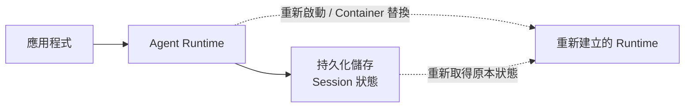
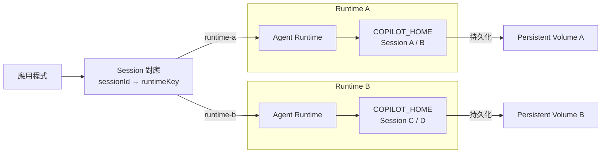
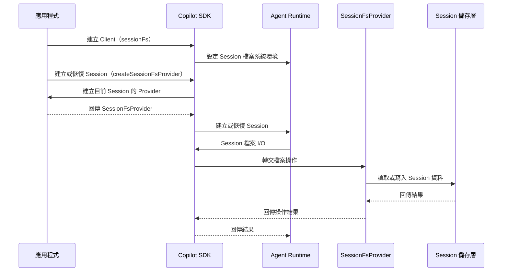

# Day 24 - Session 持久化：狀態保存與儲存架構

Copilot Runtime 進入後端服務後，執行環境本身也開始具有自己的生命週期。Runtime 可能隨著應用程式重新部署，也可能以獨立的 Container 或伺服器長時間執行；無論採用哪一種方式，行程重新啟動、Container 被替換或主機故障，都可能讓原本行程中的執行狀態與資源消失。

Session 承載的工作不一定會跟著這些部署事件一起結束。使用者可能稍後回來延續前面的分析，後端服務也可能需要在重新部署後繼續既有工作。要支援這類情境，就需要把 Runtime 的生命週期和 Session 狀態分開，進一步確認哪些資料需要保存、Runtime 從哪裡取得這些資料，以及正式部署時應該如何安排 Session 的儲存位置。

## Session 為什麼需要持久化？

同一個 Session 可以累積多輪對話與 Agent 工作脈絡，只要後續訊息持續進入相同 Session，Runtime 就能沿用已經建立的內容。不過，這套執行方式還有一項重要前提：負責處理工作的 Runtime 必須仍然能取得原本的 Session 狀態。

在本機開發時，Runtime 通常和應用程式一起執行，這項條件不太容易被注意。進入正式部署後，Runtime 行程與 Container 都可能被重新建立。如果 Session 狀態只存在原本的執行環境，一旦這個環境消失，新的 Runtime 即使知道原本的 Session ID，也沒有實際的工作內容可以延續。

可以先把 Runtime 與 Session 狀態的生命週期分開理解：



Runtime 負責實際推進 Agent Loop，持久化儲存則保留這段工作已經累積的 Session 狀態。兩者具有不同的生命週期後，Runtime 可以因部署需求重新建立，而原本的工作脈絡仍然能留在後續 Runtime 可以取得的位置。

Copilot SDK 支援 Session 持久化，讓工作可以跨越 Runtime 重新啟動、Container 遷移或不同 Client 實例延續。需要後續再次取得的工作，可以在建立 Session 時明確指定 `sessionId`，再由應用程式保存這個識別資訊：

```typescript
const session = await client.createSession({
  sessionId: "incident-review-001",
  model: "auto",
});
```

`sessionId` 負責識別這段 Session，但它本身並不包含對話、工具結果或其他工作內容。真正讓工作可以延續的，是這個 ID 對應的持久化 Session 狀態仍然存在，而且後續 Runtime 能夠重新取得。

因此，Session 持久化處理的核心問題，是讓 Agent 已經形成的工作狀態不必綁定目前這一個 Runtime 行程。

## Session 持久化的狀態與儲存邊界

Session 要能跨越 Runtime 的生命週期，首先需要釐清哪些內容真正屬於 Session 狀態。持久化並不是將整個 Runtime 行程保存下來，應用程式、Runtime 與目前執行環境仍然各自管理不同的資訊。

Session 持久化可以保留對話歷史、已形成的工具呼叫結果、Agent 規劃狀態與 Session 產物；模型提供者的 API Key 與工具在應用程式行程中的記憶體狀態則不會一起保存。放回應用程式架構，可以先分成三個範圍：

* **應用程式紀錄**：描述應用程式如何找到這段工作，例如應用程式中的工作識別資訊、使用者或 Tenant，以及它和 Runtime Session ID 的對應關係。這些資料屬於應用程式自己的資料模型，不會因為 Runtime 保存 Session 狀態就自動形成。
* **Runtime Session 狀態**：保存 Agent 已經形成的工作脈絡，包括對話歷史、持久化的工具呼叫結果、規劃狀態與 Session 產物，讓 Runtime 後續可以重新取得原本工作的內容。
* **執行期依賴**：存在於目前執行環境中的能力，例如應用程式中的自訂工具處理函式、回呼函式、工具的記憶體狀態，以及模型服務認證資訊。這些內容不會因為 Session 狀態被保存，就自動出現在新的行程中。

以 BYOK 為例，模型提供者的 API Key 不會寫入 Session 持久化資料；自訂工具先前形成的呼叫結果可以成為 Session 工作脈絡的一部分，但真正負責執行工具的 JavaScript 處理函式仍然存在於目前 Node.js 行程。原本行程結束後，這些記憶體中的執行能力也會一起消失。

Session 持久化因此只負責保留可以延續 Agent 工作的 Runtime 狀態；應用程式自己的資料與行程內執行能力，仍然依照各自的生命週期管理。

釐清哪些資訊屬於持久化 Session 狀態後，下一個問題就是 Runtime 實際將這些資料保存在哪裡。使用 Runtime 自身的檔案系統時，持久化的 Session 狀態會保存在 `COPILOT_HOME` 下的：

```text
session-state/<session-id>/
```

使用預設資料位置時，可以看到類似以下結構：

```text
~/.copilot/
└── session-state/
    └── incident-review-001/
        ├── checkpoints/
        ├── plan.md
        └── files/
```

`checkpoints/` 保存 Session 狀態快照；Agent 具有規劃狀態或產生 Session 產物時，也可能形成對應的規劃與檔案資料。實際存在的內容仍然會依目前 Session 的執行情況而不同。

理解這個儲存結構時，需要把識別資訊和真正保存的工作內容分開：

* **Session ID**：用來識別哪一段 Session，讓 Runtime 知道後續要尋找哪一份工作狀態。
* **Session 狀態**：保存這段 Session 已經累積的工作內容，例如對話歷史、工具呼叫結果、規劃狀態與 Session 產物。

Session ID 只負責識別工作，真正的內容仍然存在 Session 儲存中。如果只有 Session ID，對應的持久化資料已經不存在，後續 Runtime 仍然沒有原本的工作狀態可以取得。

以 Node.js SDK 為例，`CopilotClient` 可以透過 `baseDirectory` 指定 SDK 管理的 Runtime 使用哪一個 Copilot 資料目錄：

```typescript
const client = new CopilotClient({
  baseDirectory: runtimeDirectory,
});
```

假設 `runtimeDirectory` 指向專案中的 `runtime-data/`，這個 Runtime 使用的 Session 狀態就會放在：

```text
runtime-data/
└── session-state/
    └── <session-id>/
```

`baseDirectory` 控制的是 SDK 啟動 Runtime 使用的整體 `COPILOT_HOME`，不只是單一 Session 的檔案位置。多個 Runtime 實例同時存在時，原則上應各自使用自己的資料目錄；如果部署架構有意讓不同 Runtime 存取相同 Session 狀態，則需要另外規劃共享儲存。

在 Node.js SDK 中，如果應用程式透過 `RuntimeConnection.forUri()` 連接已經存在的 External Runtime，Client 就不再負責建立這個 Runtime 行程。這種情況下，Client 的 `baseDirectory` 會被忽略，Session 狀態的實際儲存位置需要由 External Runtime 所在的部署環境設定。

| NOTE: |
| :--- |
| 在 Runtime 使用自身檔案系統保存 Session 狀態時，`COPILOT_HOME/session-state/{sessionId}` 是 Session 狀態的儲存位置，但其中 `checkpoints/`、`plan.md` 與其他檔案仍屬於 Runtime 的持久化實作，內容可能隨版本與執行情況改變。應用程式應透過 Copilot SDK 操作 Session，不應直接依賴這些內部檔案格式建立對外 API Contract。 |

## 正式部署中的 Session 儲存架構

前面確認了 Session 狀態實際保存的位置，但正式部署真正需要處理的是這些資料能否跨越 Runtime 的生命週期持續存在。

如果 Runtime 執行在 Container 中，而 Session 狀態只存在 Container 的暫時性檔案系統，Container 被替換後，這些資料也會一起消失。新的 Runtime 行程即使取得相同 Session ID，仍然沒有原本的工作狀態可以延續。因此，部署架構需要替 Session 狀態安排具有持久性的儲存位置，或將 Session 的檔案存取交由應用程式管理。

### 使用 Runtime 的持久化檔案系統

Runtime 原本就會透過自己的檔案系統保存 Session 狀態，因此正式部署最直接的做法，是讓 `COPILOT_HOME` 對應的 Session 儲存位置具備持久性。在 Container 環境中，可以將這個位置掛載到 Persistent Volume，讓 Runtime 被重新部署或替換後，新的行程仍然能取得原本的 Session 狀態。

只有一個 Runtime 時，只要重新建立的 Runtime 能再次掛載原本的持久化儲存，這個關係相對單純。Runtime 數量增加後，還需要進一步知道每段 Session 的狀態實際位於哪一個儲存範圍。

例如 Runtime A 與 Runtime B 各自使用獨立的 `COPILOT_HOME` 與 Persistent Volume，建立在 Runtime A 的 Session 狀態只會存在 Volume A。後續即使 Runtime B 收到相同的 Session ID，也無法從自己的 Volume B 找到這份資料。



這種配置下，應用程式可以另外保存 Session 與 Runtime 儲存範圍的對應關係，例如：

```text
incident-review-001 → runtime-a
incident-review-002 → runtime-b
```

這裡的 `runtimeKey` 是應用程式用來識別一組 Runtime 與持久化儲存關係的穩定識別，不需要直接等同於某個作業系統行程。Runtime A 即使因為部署而重新建立，只要新的 Runtime 仍然代表相同的 `runtime-a`，並重新掛載 Volume A，就能再次取得其中保存的 Session 狀態。

如果採用 Runtime 自身的檔案系統管理 Session，這種「Runtime 儲存範圍 + 專屬持久化儲存」是相對容易理解的做法。應用程式需要保留 Session 所屬的儲存位置，後續工作才能送到能夠取得這份狀態的 Runtime。

部署架構也可以有意讓多個 Runtime 共用同一套持久化儲存。這時不同 Runtime 都可能取得相同的 Session 狀態，不需要再把資料固定在某一個 Runtime 的專屬 Volume。不過，共享儲存只解決狀態能否被取得，同一 Session 的並行操作仍然需要由應用程式協調。

如果服務希望 Runtime 能更自由地重新建立或水平擴縮，而不希望 Session 狀態綁定特定 Runtime 的檔案系統，則可以進一步考慮把 Session 檔案 I/O 交給應用程式管理。

### 透過 `sessionFs` 接入應用程式儲存

如果 Session 檔案不適合直接由 Runtime 的本機檔案系統保存，Copilot SDK 也提供自訂 Session 檔案系統的能力，讓 Session 範圍的檔案 I/O 可以交由應用程式提供的檔案系統 Provider 處理。這種方式適合 Runtime 本機磁碟屬於暫時性資源、Session 狀態需要放進其他持久化儲存，或應用程式需要依照 Tenant 控制儲存範圍等情境。

以 Node.js SDK 為例，這項能力由 Client 層的 `sessionFs` 與每段 Session 對應的 `SessionFsProvider` 配合完成。`sessionFs` 描述 Runtime 使用的檔案系統環境；建立或恢復 Session 時，應用程式再透過 `createSessionFsProvider` 提供這段 Session 實際使用的 Provider。

Client 可以先設定 Session 檔案系統的基本環境：

```typescript
const client = new CopilotClient({
  sessionFs: {
    initialCwd: "/workspace",
    sessionStatePath: "/session-state",
    conventions: "posix",
  },
});
```

`initialCwd` 描述 Session 檔案系統的初始工作目錄，`sessionStatePath` 指定 Session 狀態在這套檔案系統中的位置，`conventions` 則決定路徑採用 Windows 或 POSIX 規則。

這些設定只描述 Runtime 看見的檔案系統環境，並沒有建立真正的儲存後端。當應用程式建立或恢復 Session 時，還需要在 Session 設定中提供 `createSessionFsProvider`。SDK 會呼叫這個回呼函式，取得目前 Session 對應的 `SessionFsProvider`，再由 Provider 承接實際的檔案操作。

整個關係可以用時序圖理解：



圖中呈現的是公開設定與儲存責任之間的概念流程，不代表 Runtime 與 Provider 之間實際的內部通訊協定。以目前 Node.js SDK 的實作來看，SDK 會在內部將 `SessionFsProvider` 轉接成 Runtime 可以使用的 Session 檔案系統介面，應用程式不需要依賴其中的轉接方式或通訊細節。

`SessionFsProvider` 才真正承接 Session 檔案的讀寫行為，後方可以接到應用程式管理的 Session 儲存層。不同 Session 可以取得不同的 Provider，因此應用程式也能依照 Session 或 Tenant 決定實際的儲存範圍。

`sessionFs` 解決的是 Session 檔案 I/O 如何離開 Runtime 本機磁碟。實際資料保存在哪裡、不同 Session 或 Tenant 如何隔離、資料需要保留多久，以及儲存失敗時如何處理，仍然由 `SessionFsProvider` 與應用程式的儲存設計負責。只設定 `sessionFs`，並不會自動建立物件儲存或其他持久化後端。

因此，如果 Runtime 與持久化儲存具有穩定對應，可以繼續使用 `baseDirectory` 搭配 Persistent Volume；如果希望 Runtime 與 Session 儲存進一步分離，讓 Session 資料由應用程式統一管理，則可以評估透過 `sessionFs` 接入對應的 Session 儲存層。

| INFO: |
| :--- |
| `sessionFs` 涉及較完整的自訂儲存實作。需要進一步建立 `SessionFsProvider` 時，可以參考 GitHub Copilot SDK 的 [Multi-tenancy](https://docs.github.com/en/copilot/how-tos/copilot-sdk/setup/multi-tenancy) 文件，了解 `sessionFs`、`baseDirectory` 與每個 Session 對應的檔案系統 Provider 如何配合；也可以搭配官方 [Server Sample](https://github.com/github/copilot-sdk-server-sample)，觀察應用程式如何接入自訂 Storage Provider。 |

## 實作：驗證 Session 持久化儲存

前面的儲存架構可以進一步縮小成兩個最小範例。第一個範例讓 Runtime 繼續管理自己的檔案系統，只透過 `baseDirectory` 指定資料位置；第二個範例則啟用 `sessionFs`，透過應用程式提供的 `SessionFsProvider` 保存 Session 檔案。

兩個範例都使用固定 Prompt、不開放工具，也只確認 Session 狀態是否被保存。Session 如何在新的 Runtime 中重新載入，則留到恢復流程再處理。

### 準備專案環境

先建立 Node.js 專案：

```bash
$ mkdir copilot-sdk-session-persistence
$ cd copilot-sdk-session-persistence
$ npm init -y --init-type module
$ mkdir -p src runtime-data app-data
```

接著安裝 Copilot SDK 與 TypeScript 執行環境：

```bash
$ npm install @github/copilot-sdk
$ npm install --save-dev @types/node typescript tsx
```

完成後，專案會使用以下檔案：

```text
copilot-sdk-session-persistence/
├── app-data/
├── runtime-data/
├── src/
│   ├── base-directory.ts
│   ├── local-session-fs-provider.ts
│   └── session-fs.ts
└── package.json
```

`runtime-data/` 用來觀察 Runtime 自己保存的 Session 狀態；`app-data/` 則作為第二個範例中由應用程式管理的 Session 儲存位置。

### 使用 `baseDirectory` 保存 Session 狀態

先建立 `src/base-directory.ts`：

```typescript
import { readdir } from "node:fs/promises";
import path from "node:path";
import { fileURLToPath } from "node:url";
import { CopilotClient } from "@github/copilot-sdk";

const SESSION_ID = "incident-review-runtime";

const projectDirectory = path.resolve(
  path.dirname(fileURLToPath(import.meta.url)),
  "..",
);
const runtimeDirectory = path.join(projectDirectory, "runtime-data");

const client = new CopilotClient({
  baseDirectory: runtimeDirectory,
});

const session = await client.createSession({
  sessionId: SESSION_ID,
  model: "auto",
  availableTools: [],
  infiniteSessions: {
    enabled: true,
  },
});

if (!session.workspacePath) {
  throw new Error("目前 Session 沒有可用的 workspace。");
}

const workspacePath = session.workspacePath;

console.log(`[session] created ${session.sessionId}`);

const response = await session.sendAndWait(
  {
    prompt:
      "請根據以下固定資訊整理目前 Incident 摘要：" +
      "服務為 checkout-api，環境為 staging，" +
      "目前狀態為 degraded，主要問題是 Payment gateway timeout。",
  },
  120_000,
);

console.log("\nIncident 摘要：");
console.log(response?.data.content);

await session.disconnect();
await client.stop();

const entries = await readdir(workspacePath);

console.log("\nRuntime 保存的 Session 狀態：");
console.log(workspacePath);

for (const entry of entries) {
  console.log(`- ${entry}`);
}
```

這個範例使用 Node.js SDK 的 `baseDirectory`，將 SDK 管理的 Runtime 資料目錄改到專案中的 `runtime-data/`。固定的 `sessionId` 則讓這段 Session 有明確的識別資訊：

```typescript
const client = new CopilotClient({
  baseDirectory: runtimeDirectory,
});

const session = await client.createSession({
  sessionId: SESSION_ID,
  model: "auto",
  availableTools: [],
  infiniteSessions: {
    enabled: true,
  },
});
```

範例明確啟用 Infinite Sessions，讓程式可以透過 Node.js SDK 提供的 `session.workspacePath` 取得目前 Session workspace。完成互動後，先中斷 Session 並停止 SDK 管理的 Runtime：

```typescript
await session.disconnect();
await client.stop();
```

接著再讀取先前取得的 `workspacePath`。這一步不解析其中任何 Runtime 內部檔案，只確認 Runtime 行程結束後，對應的 Session workspace 仍然存在於 `runtime-data/`。

執行後可以看到類似以下結構：

```text
runtime-data/
└── session-state/
    └── incident-review-runtime/
        ├── checkpoints/
        ├── files/
        └── ...
```

實際內容會依 Runtime 版本與 Session 執行情況而不同。這個範例需要確認的是 Session 狀態由 Runtime 自己管理，`baseDirectory` 只是將 Runtime 使用的資料位置改到明確且可以持久化的目錄。

### 使用 `sessionFs` 接入應用程式儲存

第二個範例改由應用程式提供 `SessionFsProvider`。為了保持範例可以直接執行，同時避免引入外部物件儲存或其他服務，這裡使用 Node.js 檔案系統建立一個最小 Provider，將 Runtime 看見的虛擬路徑映射到 `app-data/`。

先建立 `src/local-session-fs-provider.ts`：

```typescript
import * as fs from "node:fs/promises";
import path from "node:path";
import type { SessionFsProvider } from "@github/copilot-sdk";

export function createLocalSessionFsProvider(
  rootDirectory: string,
): SessionFsProvider {
  const root = path.resolve(rootDirectory);

  const resolvePath = (virtualPath: string) => {
    const normalized = path.posix
      .normalize(`/${virtualPath}`)
      .replace(/^\/+/, "");

    return path.join(root, ...normalized.split("/").filter(Boolean));
  };

  const ensureParentDirectory = async (filePath: string) => {
    await fs.mkdir(path.dirname(filePath), { recursive: true });
  };

  return {
    async readFile(virtualPath) {
      return fs.readFile(resolvePath(virtualPath), "utf8");
    },

    async writeFile(virtualPath, content, mode) {
      const filePath = resolvePath(virtualPath);
      await ensureParentDirectory(filePath);
      await fs.writeFile(filePath, content, {
        encoding: "utf8",
        mode,
      });
    },

    async appendFile(virtualPath, content, mode) {
      const filePath = resolvePath(virtualPath);
      await ensureParentDirectory(filePath);
      await fs.appendFile(filePath, content, {
        encoding: "utf8",
        mode,
      });
    },

    async exists(virtualPath) {
      try {
        await fs.access(resolvePath(virtualPath));
        return true;
      } catch (error) {
        if ((error as NodeJS.ErrnoException).code === "ENOENT") {
          return false;
        }
        throw error;
      }
    },

    async stat(virtualPath) {
      const result = await fs.stat(resolvePath(virtualPath));

      return {
        isFile: result.isFile(),
        isDirectory: result.isDirectory(),
        size: result.size,
        mtime: result.mtime.toISOString(),
        birthtime: result.birthtime.toISOString(),
      };
    },

    async mkdir(virtualPath, recursive, mode) {
      await fs.mkdir(resolvePath(virtualPath), {
        recursive,
        mode,
      });
    },

    async readdir(virtualPath) {
      return fs.readdir(resolvePath(virtualPath));
    },

    async readdirWithTypes(virtualPath) {
      const directoryPath = resolvePath(virtualPath);
      const names = await fs.readdir(directoryPath);

      return Promise.all(
        names.map(async (name) => {
          const result = await fs.stat(path.join(directoryPath, name));

          return {
            name,
            type: result.isDirectory()
              ? ("directory" as const)
              : ("file" as const),
          };
        }),
      );
    },

    async rm(virtualPath, recursive, force) {
      await fs.rm(resolvePath(virtualPath), {
        recursive,
        force,
      });
    },

    async rename(source, destination) {
      const destinationPath = resolvePath(destination);
      await ensureParentDirectory(destinationPath);
      await fs.rename(resolvePath(source), destinationPath);
    },
  };
}
```

`SessionFsProvider` 是 Node.js SDK 提供的型別，需要承接 Runtime 可能使用的 Session 檔案操作。因此即使是最小的本機實作，也需要提供讀取、寫入、目錄、狀態查詢與檔案移動等基本能力。這裡只使用 Node.js 原生檔案系統完成映射，沒有加入 Tenant、遠端儲存或其他正式服務才需要的邏輯。

接著建立 `src/session-fs.ts`：

```typescript
import { readdir } from "node:fs/promises";
import path from "node:path";
import { fileURLToPath } from "node:url";
import { CopilotClient } from "@github/copilot-sdk";
import { createLocalSessionFsProvider } from "./local-session-fs-provider.js";

const SESSION_ID = "incident-review-session-fs";

const projectDirectory = path.resolve(
  path.dirname(fileURLToPath(import.meta.url)),
  "..",
);
const appDataDirectory = path.join(projectDirectory, "app-data");
const sessionDirectory = path.join(appDataDirectory, SESSION_ID);
const sessionStateDirectory = path.join(
  sessionDirectory,
  "session-state",
);

const client = new CopilotClient({
  sessionFs: {
    initialCwd: "/workspace",
    sessionStatePath: "/session-state",
    conventions: "posix",
  },
});

const session = await client.createSession({
  sessionId: SESSION_ID,
  model: "auto",
  availableTools: [],
  infiniteSessions: {
    enabled: true,
  },
  createSessionFsProvider: (currentSession) =>
    createLocalSessionFsProvider(
      path.join(appDataDirectory, currentSession.sessionId),
    ),
});

console.log(`[session] created ${session.sessionId}`);

const response = await session.sendAndWait(
  {
    prompt:
      "請根據以下固定資訊整理目前 Incident 摘要：" +
      "服務為 checkout-api，環境為 staging，" +
      "目前狀態為 degraded，主要問題是 Payment gateway timeout。",
  },
  120_000,
);

console.log("\nIncident 摘要：");
console.log(response?.data.content);

await session.disconnect();
await client.stop();

const entries = await readdir(sessionStateDirectory);

console.log("\n應用程式保存的 Session 狀態：");
console.log(sessionStateDirectory);

for (const entry of entries) {
  console.log(`- ${entry}`);
}
```

這個範例使用 Node.js SDK 的 `sessionFs` 描述 Runtime 看見的 Session 檔案系統：

```typescript
sessionFs: {
  initialCwd: "/workspace",
  sessionStatePath: "/session-state",
  conventions: "posix",
}
```

建立 Session 時，再透過 `createSessionFsProvider` 為目前 Session 建立自己的 `SessionFsProvider`：

```typescript
createSessionFsProvider: (currentSession) =>
  createLocalSessionFsProvider(
    path.join(appDataDirectory, currentSession.sessionId),
  ),
```

因此，不同 Session 可以對應到不同的 `app-data/<session-id>/` 目錄。Runtime 仍然以 `/workspace`、`/session-state` 這類 Session 檔案系統路徑進行操作，但真正的讀寫會由 Provider 映射到應用程式管理的目錄。

完成互動並停止 Runtime 後，可以看到類似以下結構：

```text
app-data/
└── incident-review-session-fs/
    └── session-state/
        ├── checkpoints/
        └── ...
```

實際項目仍然會依 Runtime 版本與 Session 執行情況不同。觀察重點在於，Session 狀態不再直接依賴 Runtime 自己的 `COPILOT_HOME`，而是由應用程式提供的 `SessionFsProvider` 寫入 `app-data/`。

兩個範例的差異可以整理如下：

| 方式              | 儲存設定                        | Session 檔案由誰承接      | 範例資料位置                                    |
| --------------- | --------------------------- | ------------------- | ----------------------------------------- |
| `baseDirectory` | 指定 Runtime 的 `COPILOT_HOME` | Runtime 檔案系統        | `runtime-data/session-state/...`          |
| `sessionFs`     | 設定 Session 檔案系統並提供 Provider | `SessionFsProvider` | `app-data/<session-id>/session-state/...` |

兩種方式都可以讓 Session 狀態跨越目前 Runtime 行程繼續存在，但儲存責任不同。`baseDirectory` 仍然沿用 Runtime 自己的檔案系統模型；`sessionFs` 則讓應用程式接管 Session 檔案操作，正式服務可以再把 Provider 後方換成符合部署需求的 Session 儲存層。

### 執行應用程式

先執行 `baseDirectory` 範例：

```bash
$ npx tsx src/base-directory.ts
```

可以確認 Session 完成工作並停止 Runtime 後，對應的 workspace 仍然存在於 `runtime-data/`。

接著執行 `sessionFs` 範例：

```bash
$ npx tsx src/session-fs.ts
```

這次可以觀察到 Session 狀態出現在 `app-data/incident-review-session-fs/session-state/`，表示 Session 檔案操作已經改由應用程式提供的 Provider 承接。

兩個範例都只驗證持久化資料是否存在，沒有重新載入原本的 Session。新的 Runtime 如何找到既有狀態、透過 Node.js SDK 的 `resumeSession()` 恢復 Session，以及自訂工具、BYOK Provider 等執行能力如何重新建立，屬於 Session 恢復時需要處理的下一層問題。

## Session 持久化的正式服務考量

Session 狀態有了持久化儲存後，Runtime 重新建立時就具備延續既有工作的基礎。不過，正式服務還需要處理另一層問題：哪些使用者可以存取這段 Session、不同工作如何隔離、同一 Session 是否可能被並行操作，以及持久化資料應該保留多久。

這些問題不由 Session 持久化本身決定，而是需要由應用程式建立對應的存取與生命週期管理機制：

* **Session 存取權限**：`sessionId` 只負責識別 Runtime 中的一段工作，不能作為應用程式資源的存取權證明。多使用者服務仍需要保存 Session 與使用者或 Tenant 的歸屬關係，並在恢復、刪除或其他 Session 操作前完成應用程式授權。
* **Session 儲存隔離**：多位使用者或多個 Tenant 共用 Runtime 或儲存層時，需要確保每段 Session 都進入正確的儲存範圍。Session ID 只提供識別，實際的儲存路徑、檔案系統 Provider 與存取政策仍應符合應用程式本身的資料隔離邊界。
* **同一 Session 的並行控制**：Copilot SDK 目前沒有提供內建的 Session 鎖定機制，同一 Session 被並行存取時的行為沒有明確保證。多個 Client、Worker 或 Runtime 可能同時操作相同 Session 時，正式服務仍需要透過鎖定、佇列或其他應用程式機制協調執行順序。
* **Session 狀態生命週期**：暫時停止使用 Session 與永久刪除持久化資料具有不同語意。以 Node.js SDK 為例，`session.disconnect()` 會釋放目前 Session 的記憶體資源並保留持久化資料；工作確定不再需要時，則可以透過 `client.deleteSession(sessionId)` 永久移除對應的 Session 資料。

Session 持久化提供的是可以重新取得工作狀態的基礎，正式服務仍需要由應用程式補上存取控制、資料隔離、並行協調與清理策略。這些機制共同決定一段持久化 Session 能否在多使用者與長時間運行的環境中安全地延續。

| NOTE: |
| :--- |
| 以 Node.js SDK 為例，多使用者或共享 Runtime 的後端服務應使用 `mode: "empty"` 作為 Client 的預設行為策略，避免直接繼承 Copilot CLI 的環境能力與預設行為。由 SDK 啟動 Runtime 時，需要明確提供 `baseDirectory` 或 `sessionFs`；如果透過 `RuntimeConnection.forUri()` 連接 External Runtime，則由外部 Runtime 負責安排持久化儲存。每個 Session 仍需要明確設定 `availableTools`。這項設定處理的是 SDK 的預設能力邊界，不能取代應用程式授權、租戶隔離（Tenant Isolation）或 Session 儲存隔離。 |

## 小結

Session 持久化讓 Agent 已經累積的工作狀態不必綁定目前的 Runtime 行程，正式部署時也需要進一步確認這些狀態由哪一層保存與管理：

* Session ID 負責識別一段工作，真正可以延續的內容來自對應的持久化 Session 狀態。
* Runtime 使用自身檔案系統保存 Session 時，可以搭配 Persistent Volume；以 Node.js SDK 為例，也能透過 `baseDirectory` 明確安排 SDK 管理 Runtime 的 Copilot 資料位置。
* 多個 Runtime 使用獨立儲存時，應用程式還需要保留 Session 與對應儲存範圍的關係；External Runtime 則由 Runtime 所在環境管理自己的持久化資料。
* Copilot SDK 也能讓 Session 檔案 I/O 與 Runtime 本機磁碟分離；以 Node.js SDK 為例，可以透過 `sessionFs` 與 `SessionFsProvider` 接到應用程式管理的 Session 儲存層。
* Session 持久化保存的是 Runtime 可以延續的工作狀態；應用程式紀錄、認證資訊、行程內執行能力，以及存取與並行政策仍然由應用程式管理。

Runtime 可以依照部署需求重新建立，只要持久化的 Session 狀態仍然存在且可被取得，既有的工作脈絡就不會隨單一 Runtime 行程或 Container 結束而消失。
