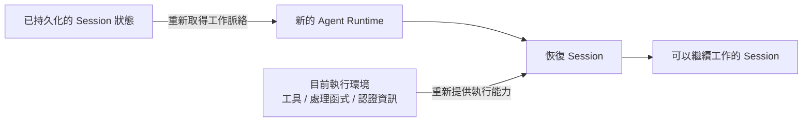
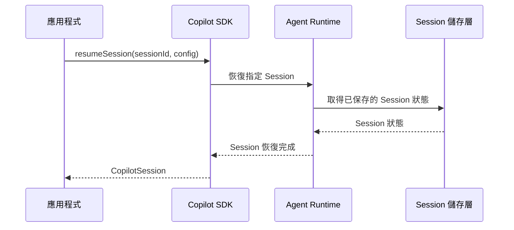

# Day 25 - 恢復 Session：延續工作脈絡與重建執行環境

Session 狀態能夠持久化之後，一段 Agent 工作就不必因目前的 Runtime 行程結束而失去先前累積的內容。Runtime 重新啟動或應用程式重新建立執行環境時，只要原本的 Session 狀態仍然存在，就具備延續這段工作的基礎。不過，保留下來的是 Agent 已經形成的 Session 狀態，原本行程中的 Session 物件、自訂工具處理函式與其他執行期資源仍然會隨行程結束而消失。

因此，恢復 Session 不只需要重新取得先前累積的工作脈絡，也要讓新的執行環境重新具備繼續工作的能力。持久化狀態與執行期依賴如何重新接合，會直接決定 Agent 能否在 Runtime 或應用程式重新啟動後，真正延續原本的工作。

## Session 恢復需要哪些條件？

Session 持久化保存的是 Runtime 後續可以重新取得的狀態，包括已經累積的對話、工具呼叫結果、規劃狀態與 Session 產物。這些內容讓新的 Runtime 可以延續先前已經形成的工作脈絡。

不過，一段 Session 要繼續工作，還需要目前執行環境提供實際的執行能力。以自訂工具為例，先前的工具呼叫與結果可以成為 Session 狀態的一部分，但真正負責執行工具的 JavaScript 處理函式存在於原本的 Node.js 行程中。行程結束後，這個處理函式也會一起消失。

因此，Session 恢復可以先拆成兩個部分：

* **工作脈絡**：由 Runtime 從持久化的 Session 狀態重新取得，延續先前的對話、工具結果與 Agent 執行脈絡。
* **執行能力**：由目前的應用程式與執行環境重新提供，例如自訂工具、權限處理函式、Hooks、MCP、Skills、工作目錄與模型提供者認證。

兩者的關係可以表示成：



新的 Runtime 負責重新取得原本保存的 Session 狀態，應用程式則重新提供目前工作需要的執行能力。如果工作後續還會使用自訂工具、MCP 或其他依賴目前行程的能力，就需要確認新的執行環境仍然具備對應條件。

BYOK 也有相同的責任邊界。模型提供者的 API Key 不會隨 Session 狀態一起持久化，因此恢復 BYOK Session 時，需要由目前執行環境重新取得模型提供者設定與認證資訊，再交給恢復後的 Session 使用。

Copilot SDK 在恢復 Session 時，可以重新提供自訂工具、Hooks、MCP、Skills、工作目錄與模型提供者等執行條件，讓新的應用程式行程重新具備延續原本工作所需的能力。

## Session 恢復的執行流程

當 Session 狀態已經保存在後續 Runtime 可以重新取得的位置後，應用程式就可以使用原本的 Session ID 指定要延續的工作，並在恢復時重新提供目前執行環境需要的設定。

例如，恢復後的工作如果仍然需要使用應用程式提供的自訂工具，可以在同一次 `resumeSession()` 呼叫中重新提供工具與可用範圍：

```typescript
const session = await client.resumeSession(
  "incident-review-recovery",
  {
    tools: [getIncidentStatus],
    availableTools: ["custom:get_incident_status"],
  },
);
```

`resumeSession()` 的第一個參數指定要恢復的 Session，第二個參數則提供恢復後要使用的 Session 設定。Runtime 會根據 Session ID 載入先前保存的狀態，再將目前應用程式提供的執行條件接回這段工作，最後把恢復後的 `CopilotSession` 交回應用程式。

整體流程可以表示成：



Session 能否順利恢復，取決於目前 Runtime 是否能取得 Session ID 對應的持久化資料。Session ID 只負責識別要延續哪一段工作，原本累積的對話與 Agent 狀態仍然來自先前保存的 Session 資料。

這些資料可以保存在 Runtime 使用的持久化檔案系統，也可以透過 `sessionFs` 交由應用程式管理。無論採用哪一種方式，恢復時都需要讓目前 Runtime 能重新取得原本的 Session 狀態。

自訂工具處理函式則屬於目前的應用程式行程，不會隨 Session 狀態一起保存。恢復時由 Runtime 載入原本的工作脈絡，應用程式再重新提供後續執行需要的能力，兩部分重新接合後，Agent 才能在新的執行環境中繼續工作。

## 實作：重新啟動 Runtime 並恢復 Session

接下來延續前一篇的持久化架構，另外建立 `copilot-sdk-session-recovery` 專案，實際讓一段 Session 跨越兩個 Node.js 行程與 Runtime 生命週期繼續工作。獨立的專案目錄可以避免和前一篇的固定 Session 與執行資料互相影響。

我們使用服務事件（Incident）分析作為範例情境，先讓 Agent 取得一組固定的 Incident 狀態並完成初次分析，再停止目前的應用程式與 Runtime。新的行程啟動後，會從相同的持久化資料恢復原本的 Session，並重新提供後續工作需要的自訂工具處理函式。

範例中的 Incident 資料全部保存在程式中，不連接監控平台或外部 API，也不修改任何系統狀態，讓觀察重點集中在工作脈絡與執行能力如何重新接合。

### 準備恢復範例

先建立 Node.js 專案與 Runtime 資料目錄：

```bash
$ mkdir copilot-sdk-session-recovery
$ cd copilot-sdk-session-recovery
$ npm init -y --init-type module
$ mkdir -p src runtime-data
```

完成後會使用以下檔案：

```text
copilot-sdk-session-recovery/
├── runtime-data/
├── src/
│   ├── recovery-tools.ts
│   ├── recovery-create.ts
│   └── recovery-resume.ts
└── package.json
```

安裝 Copilot SDK、Zod 與 TypeScript 執行環境：

```bash
$ npm install @github/copilot-sdk zod
$ npm install --save-dev @types/node typescript tsx
```

`recovery-tools.ts` 保存目前工作需要的固定資料工具；`recovery-create.ts` 建立後續要恢復的 Session；`recovery-resume.ts` 則在新的行程與 Runtime 中重新載入這段工作。

### 建立固定資料工具

先建立 `src/recovery-tools.ts`：

```typescript
import { defineTool } from "@github/copilot-sdk";
import { z } from "zod";

const incidentStatus = {
  service: "checkout-api",
  status: "degraded",
  errorRate: 0.07,
  activeIncidents: 2,
  mitigation: "Traffic shifted to the secondary payment gateway.",
  observedAt: "2026-08-24T01:00:00Z",
};

export const getIncidentStatus = defineTool("get_incident_status", {
  description: "Return the current fixed incident status",
  parameters: z.object({}),
  defer: "never",
  skipPermission: true,
  handler: async () => {
    console.log("[tool] get_incident_status executed");
    return incidentStatus;
  },
});
```

`get_incident_status` 只讀取程式中的固定資料，因此使用 `skipPermission: true` 略過工具權限確認，並透過 `defer: "never"` 讓工具直接提供給目前 Agent。

處理函式另外輸出一行執行紀錄：

```text
[tool] get_incident_status executed
```

後面在第二個 Node.js 行程恢復 Session 後，可以利用這行紀錄確認工具確實由目前行程重新執行，而不只是看到 Session 中先前保存的工具呼叫結果。

### 建立可以恢復的 Session

接著建立 `src/recovery-create.ts`：

```typescript
import path from "node:path";
import { fileURLToPath } from "node:url";
import { CopilotClient } from "@github/copilot-sdk";
import { getIncidentStatus } from "./recovery-tools.js";

const SESSION_ID = "incident-review-recovery";

const projectDirectory = path.resolve(
  path.dirname(fileURLToPath(import.meta.url)),
  "..",
);
const runtimeDirectory = path.join(
  projectDirectory,
  "runtime-data",
);

const client = new CopilotClient({
  mode: "empty",
  baseDirectory: runtimeDirectory,
});

const session = await client.createSession({
  sessionId: SESSION_ID,
  model: "auto",
  tools: [getIncidentStatus],
  availableTools: ["custom:get_incident_status"],
});

console.log(`[session] created ${session.sessionId}`);

const response = await session.sendAndWait(
  {
    prompt:
      "請務必使用 get_incident_status 取得目前 Incident 狀態，" +
      "整理服務狀態、錯誤率、目前未結事件數與緩解措施，" +
      "並說明後續最需要追蹤的指標。",
  },
  120_000,
);

console.log("\nIncident 分析：");
console.log(response?.data.content);

await session.disconnect();
await client.stop();
```

範例使用固定的 `incident-review-recovery` 作為 Session ID，讓後續 Runtime 可以使用相同識別資訊恢復這段工作。

Client 使用 `mode: "empty"` 避免繼承 Copilot CLI 的環境能力，並將 `baseDirectory` 指向專案中的 `runtime-data/`，讓第一個 Runtime 保存的 Session 狀態可以在後面被新的 Runtime 取得。

建立 Session 時加入：

```typescript
tools: [getIncidentStatus],
availableTools: ["custom:get_incident_status"],
```

讓 Agent 可以使用目前應用程式提供的自訂工具。第一次執行工具時，終端機會看到：

```text
[tool] get_incident_status executed
```

Agent 取得固定的 Incident 資料後，再根據這些資訊完成第一輪分析。

目前工作完成後，程式透過：

```typescript
await session.disconnect();
await client.stop();
```

結束目前 Session 物件的使用並停止 SDK 管理的 Runtime。持久化的 Session 狀態仍然保存在 `runtime-data/`，提供下一個行程恢復使用。

這時第一個 Node.js 行程中的 `CopilotSession` 與 `getIncidentStatus` 處理函式都已經不存在，但先前形成的工作脈絡仍然保留在 Session 狀態中。

### 恢復原本的 Session

第一個行程結束後，接著建立 `src/recovery-resume.ts`：

```typescript
import path from "node:path";
import { fileURLToPath } from "node:url";
import { CopilotClient } from "@github/copilot-sdk";
import { getIncidentStatus } from "./recovery-tools.js";

const SESSION_ID = "incident-review-recovery";

const projectDirectory = path.resolve(
  path.dirname(fileURLToPath(import.meta.url)),
  "..",
);
const runtimeDirectory = path.join(
  projectDirectory,
  "runtime-data",
);

const client = new CopilotClient({
  mode: "empty",
  baseDirectory: runtimeDirectory,
});

const session = await client.resumeSession(
  SESSION_ID,
  {
    tools: [getIncidentStatus],
    availableTools: ["custom:get_incident_status"],
  },
);

console.log(`[session] resumed ${session.sessionId}`);

const response = await session.sendAndWait(
  {
    prompt:
      "延續前面的 Incident 分析。" +
      "請再次使用 get_incident_status 取得目前狀態，" +
      "比較它和上一輪取得的資料，並說明狀態是否有變化。",
  },
  120_000,
);

console.log("\n更新後分析：");
console.log(response?.data.content);

await session.disconnect();
await client.stop();
```

第二個行程同樣將 `baseDirectory` 指向 `runtime-data/`，因此新的 Runtime 能夠取得先前保存的 `incident-review-recovery` Session 狀態。

真正進入恢復流程的位置是：

```typescript
const session = await client.resumeSession(
  SESSION_ID,
  {
    tools: [getIncidentStatus],
    availableTools: ["custom:get_incident_status"],
  },
);
```

`resumeSession()` 會要求目前 Runtime 載入指定 Session 已保存的狀態。恢復完成後，後續訊息可以延續先前累積的對話與工具結果，不需要由應用程式重新組合第一輪 Prompt 與 Assistant 回應。

恢復設定中的：

```typescript
tools: [getIncidentStatus],
availableTools: ["custom:get_incident_status"],
```

則負責重新提供目前執行需要的工具能力。第一個 Node.js 行程停止後，原本的 JavaScript 處理函式已經不存在；第二支程式重新載入 `recovery-tools.ts`，才在目前行程中建立新的 `getIncidentStatus` 處理函式。

因此，第二則 Prompt 可以直接要求延續前面的 Incident 分析。前一次工作內容來自恢復後的 Session 脈絡；再次呼叫 `get_incident_status` 時，真正執行操作的則是第二個行程重新建立的處理函式。

| NOTE: |
| :--- |
| 如果 Session 中斷時仍有尚未完成的 Tool Call 或 Permission Request，恢復後是否要繼續這些工作就需要另外決定。Copilot SDK 預設不會延續這些 pending work；需要繼續處理時，可以在恢復 Session 時啟用 `continuePendingWork`。尚未完成的 Permission Request 也會重新提出，讓目前的權限處理函式再次承接。本篇範例先等待第一輪工作完成再進行恢復，讓觀察重點集中在既有工作脈絡與執行能力如何重新接合。 |

### 執行應用程式

先執行建立 Session 的程式：

```bash
$ npx tsx src/recovery-create.ts
```

如果 Agent 按照要求使用自訂工具，終端機會看到類似：

```text
[session] created incident-review-recovery
[tool] get_incident_status executed
```

接著輸出第一輪 Incident 分析。程式完成後，目前的 Session 物件會結束使用，SDK 管理的 Runtime 也會停止，但 Session 狀態仍然保存在 `runtime-data/`。

再啟動新的行程：

```bash
$ npx tsx src/recovery-resume.ts
```

新的 Runtime 會從相同的持久化資料恢復 `incident-review-recovery`。如果 Agent 再次使用工具，終端機會重新看到：

```text
[session] resumed incident-review-recovery
[tool] get_incident_status executed
```

第二次出現的工具紀錄來自新的 Node.js 行程，表示恢復後的 Session 已經使用目前行程重新提供的自訂工具處理函式。

範例中的 Incident 資料刻意維持不變，因此兩次工具呼叫取得的結果應該相同。模型最後如何描述狀態是否改變仍會依實際生成結果而不同，這不是範例要驗證的固定行為。

執行時真正需要確認的是，第二個 Runtime 可以沿用第一個 Runtime 保存的工作脈絡，而且第二個行程重新建立的自訂工具仍然可以參與恢復後的 Agent Loop。這兩項都成立後，原本的 Session 才具備在新的執行環境中繼續工作的條件。

## 恢復工作脈絡與重建執行能力

前面的範例將 Session 恢復需要的資訊分成兩種來源。第一部分是原本已經形成的工作脈絡，第一次執行留下的使用者訊息、Assistant 回應與工具結果由 Runtime 的 Session 持久化機制保存；新的 Runtime 恢復 Session 後，可以繼續使用這些內容。

第二部分屬於目前的執行環境。自訂工具處理函式是範例中最容易觀察的例子，實際應用還可能需要重新提供其他執行條件：

* **自訂工具與工具範圍**：提供目前 Session 後續可以使用的應用程式能力。
* **權限與使用者互動處理函式**：如果後續執行仍可能產生權限請求或使用者輸入，需要由目前可以承接互動的應用程式重新提供。
* **Hooks**：執行前後控管與生命週期的 Hook 處理函式存在於目前行程，需要依照目前工作重新設定。
* **MCP 與 Skills**：Session 後續仍依賴這些能力時，需要確認新的執行環境具有對應的設定與資源。
* **工作目錄與執行資源**：原本工作依賴特定檔案或 Workspace 時，新的 Runtime 仍需要能夠取得對應內容。
* **BYOK 模型提供者**：模型提供者的認證資訊不會保存到 Session 狀態，恢復時需要由目前執行環境重新提供對應設定。

需要重新提供哪些設定，取決於這段工作後續仍然依賴哪些能力。已經形成的工作內容由 Session 狀態負責延續；處理函式、認證資訊與其他行程內資源則應由目前的應用程式重新建立。

這項區分也讓 Session 恢復的責任更清楚。持久化解決 Session 狀態能否跨越 Runtime 生命週期保存，恢復流程則進一步把這些狀態接回目前可以執行工作的環境。

## 正式服務中的恢復邊界

Session 進入正式服務後，恢復流程不只要讓 Runtime 找回原本的工作狀態，還需要和產品本身的身分、資源與執行架構配合。`resumeSession()` 處理的是 Runtime Session 的恢復，其他產品層責任仍然需要由應用程式明確管理：

* **Session 存取權限**：Session ID 只負責識別 Runtime 中的一段工作，不能作為應用程式資源的存取權證明。應用程式需要根據目前使用者、Tenant 與 Session 歸屬完成 Authentication 與 Authorization，再取得對應的 Runtime Session ID。
* **Runtime 與狀態位置**：恢復要求需要進入能夠取得對應 Session 狀態的 Runtime。如果不同 Runtime 使用各自的持久化儲存，只知道 Runtime Session ID 還不足以找到原本的工作，應用程式還需要保存必要的 Runtime 或儲存位置對應。
* **執行協調**：當服務包含多個應用程式實例、Worker 或 Runtime，同一段 Session 要由哪個執行者處理，以及如何避免並行操作互相影響，仍然需要由應用程式負責協調。

這些責任屬於產品層的 Session 模型與服務架構，不會由 Session 恢復機制自動處理。應用程式先確認目前工作是否允許被操作，並將恢復要求送到可以取得原本 Session 狀態的執行環境，再由 Runtime 承接後續的 Agent 工作。

## 小結

Session 恢復讓已經持久化的工作狀態可以重新接回新的執行環境。要讓一段 Agent 工作真正延續，需要同時取得原本的工作脈絡，並重新提供後續執行需要的能力：

* 恢復既有工作時，可以透過 `resumeSession()` 載入已保存的 Session 狀態，讓後續訊息繼續沿用原本的對話與 Agent 工作脈絡。
* Session ID 負責識別要延續的工作階段，真正的工作內容仍然來自目前 Runtime 可以取得的持久化狀態。
* 執行期依賴需要由新的應用程式與執行環境重新提供，包括自訂工具處理函式、Hook 處理函式、權限處理函式與 BYOK 模型提供者設定等能力。
* 尚未完成的工作如果需要在恢復後繼續執行，還需要另外處理 pending work，以及恢復期間相關的執行狀態。

持久化讓 Agent 工作不必綁定單一 Runtime 行程，Session 恢復則把保存下來的狀態重新接回目前的執行環境。工作脈絡由 Runtime 延續，實際執行能力由新的應用程式行程重新建立，兩者共同構成一段可以繼續工作的 Session。
