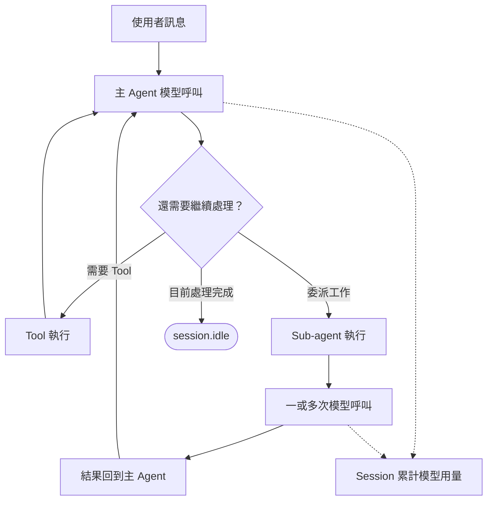
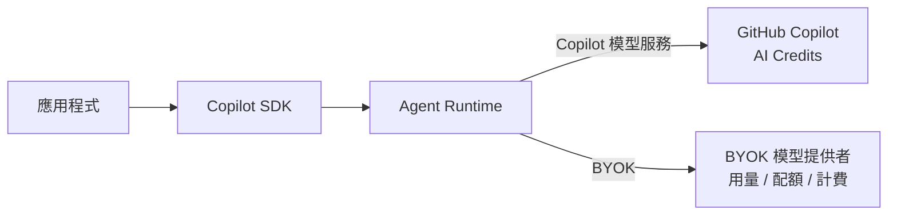
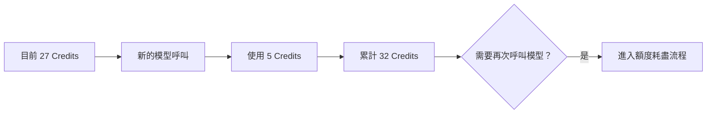

# Day 26 - Session 用量與預算管理：AI Credits 與 Session Limits

Session 能夠恢復之後，一段 Agent 工作就可以跨越應用程式與 Runtime 的生命週期持續進行。隨著同一個 Session 累積更多互動，一則使用者訊息也可能經過多個 Turn，甚至委派 Sub-agent 處理部分任務，模型呼叫與相關資源用量也會在整段工作中持續增加。

正式服務除了需要讓 Session 能夠恢復，也要掌握這段工作實際使用多少模型資源，以及如何替持續執行的 Agent 工作建立合理的預算邊界。Copilot SDK 提供對應的用量觀察與限制機制，讓應用程式可以追蹤模型資源的使用情況，並替 Session 建立預算邊界。

## Session 的模型用量如何累積？

前面介紹 Agent Loop 時已經看過，一則使用者訊息不一定只對應一次模型呼叫。模型可能先根據目前 Context 判斷還需要哪些資訊，再要求執行 Tool；工具結果回到 Agent Loop 後，Runtime 可能進入後續 Turn，重新呼叫模型繼續處理。

如果工作進一步委派給 Sub-agent，Sub-agent 也可能在自己的執行過程中產生多次模型呼叫。Session 累計的模型用量，來自整段執行期間主 Agent 與 Sub-agent 實際發生的模型呼叫：



使用者只送出一則訊息，Runtime 內部仍可能完成多次模型呼叫；如果工作委派給 Sub-agent，Sub-agent 執行期間產生的模型呼叫也會繼續累積。因此，訊息數量無法直接代表模型用量，需要觀察的是整段 Agent 執行實際發生哪些模型呼叫，以及這些呼叫在 Session 中累積了多少資源消耗。

Copilot SDK 提供的用量資訊也對應到不同執行層級。單次模型呼叫、目前 Context Window 與整段 Session 的累計用量，分別回答不同的問題。

## Session 的用量觀察機制

Session 執行期間可以透過事件取得即時用量，也可以主動查詢目前的累計用量。這幾種資訊雖然都和 Token 有關，描述的範圍並不相同。

可以先整理成三個層級：

| 觀察範圍       | 主要介面                             | 描述內容                                |
| ---------- | -------------------------------- | ----------------------------------- |
| 單次模型呼叫     | `assistant.usage`                | 這一次模型呼叫使用的 Token 與模型資訊              |
| 目前 Context | `session.usage_info`             | 現在 Context Window 已經使用多少 Token      |
| 整段 Session | `session.rpc.usage.getMetrics()` | Session 目前累積的 Token 與 AI Credits 用量 |

Copilot SDK 分別透過 Session 事件與 RPC 提供即時用量資訊與 Session 累計狀態。前兩項適合在 Agent 執行期間持續觀察；累計用量則由應用程式在需要時主動取得。

### 單次模型呼叫的用量

單次模型呼叫是最細的用量觀察層級。每次模型 API 呼叫都可以透過 `assistant.usage` 取得對應的用量資訊，包括 Sub-agent 產生的模型呼叫。

```typescript
session.on("assistant.usage", (event) => {
  console.log(
    `[usage] model=${event.data.model} ` +
      `input=${event.data.inputTokens ?? 0} ` +
      `output=${event.data.outputTokens ?? 0}`,
  );
});
```

`model` 表示這次實際使用的模型，`inputTokens` 與 `outputTokens` 則描述這次呼叫消耗與產生的 Token。只要一段 Agent 工作經過多次模型呼叫，就可能收到多筆 `assistant.usage`，可以用來確認 Agent 實際發生多少模型請求，以及每一次呼叫使用多少模型資源。

`assistant.usage` 還提供 `cost`，但這個欄位描述的是該次呼叫使用的 Premium Request 倍率，不能直接視為這次呼叫或整段 Session 使用的 AI Credits。需要取得 Session 累計 AI Credits 時，應使用 Session 層的累計用量。

另外，`assistant.usage` 屬於暫時性事件（ephemeral event），只在執行期間提供，不會在恢復 Session 時重新播放。

### 目前 Context 的使用量

單次模型呼叫描述這一次實際使用多少 Token。除了這項資訊，還需要知道目前模型的 Context Window 已經使用多少空間。

Runtime 會透過 `session.usage_info` 提供目前 Context 的使用情況：

```typescript
session.on("session.usage_info", (event) => {
  console.log(
    `[context] ${event.data.currentTokens}/${event.data.tokenLimit}`,
  );
});
```

主要欄位包括：

* **`currentTokens`**：目前 Context Window 中的 Token 數量。
* **`tokenLimit`**：目前模型可以使用的 Context Window 上限。
* **`messagesLength`**：目前對話中的訊息數量。

這組資訊可以用來觀察 Context 是否逐漸接近模型限制。當對話、工具結果與其他 Context 持續累積時，`currentTokens` 也可能增加，Runtime 後續可能需要進行 Context 壓縮（compaction）。

Context 使用量描述的是目前模型輸入中保留多少內容，和 Session 累計使用多少模型資源屬於不同問題。一段 Session 經過多次模型呼叫後，即使目前 Context 維持在固定大小，前面已經完成的模型呼叫仍然產生了實際用量。

`session.usage_info` 同樣屬於暫時性事件，適合即時反映目前 Context 狀態，不負責保存整段 Session 的累計用量。

### Session 的累計用量

單次模型呼叫與目前 Context 都描述執行中的局部狀態。如果應用程式需要知道整段 Session 到目前為止一共使用多少模型資源，就需要取得 Session 層的累計用量。

可以主動呼叫：

```typescript
const metrics = await session.rpc.usage.getMetrics();
```

這裡主要會用到三組資訊：

* **`totalNanoAiu`**：Session 累計的 AI 用量，以 nano-AI unit 表示。
* **`totalPremiumRequestCost`**：套用倍率後累計的 Premium Request 計量值。
* **`modelMetrics`**：依模型整理的累計 Token 與 AI 用量。

`session.rpc.usage.getMetrics()` 會聚合目前 Session 的模型用量，包括主 Agent 與 Sub-agent 產生的模型呼叫，因此不需要由應用程式自行將每一筆 `assistant.usage` 累加成 Session 總量。

目前 Copilot SDK 的用量範例會將 `totalNanoAiu` 除以 `1e9`，以 AI Credits 顯示：

```typescript
const metrics = await session.rpc.usage.getMetrics();
const aiCredits = (metrics.totalNanoAiu ?? 0) / 1e9;

console.log(`AI Credits: ${aiCredits.toFixed(6)}`);
```

`assistant.usage` 適合在模型呼叫發生時即時觀察，`session.rpc.usage.getMetrics()` 則提供目前的 Session 累計狀態。如果只需要取得目前 Session 的累計值，就不需要自行保存每筆事件再重新加總。

| NOTE: |
| :--- |
| `session.rpc.usage.getMetrics()` 目前在 Copilot SDK 產生的 RPC 介面中標示為 Experimental。Copilot SDK 的用量範例依 nano 單位將 `totalNanoAiu` 除以 `1e9` 顯示 AI Credits，但實際 AI Credits 與 Premium Request 的計量仍應以 GitHub Copilot 的計費規則為準。正式服務如果依賴這項 RPC，升級 SDK 或 Copilot Runtime 時應重新確認型別與行為。 |

## AI Credits、BYOK 與計量邊界

前面的用量資訊描述 Runtime 如何觀察模型使用情況。進入成本與預算管理後，還需要區分模型存取方式，因為相同的輸入、輸出 Token 最後可能由不同的計量系統負責。

使用 GitHub Copilot 模型服務時，模型用量會進入 GitHub Copilot 的計量與 AI Credits；正式服務如果採用 BYOK，模型請求仍然由 Agent Runtime 發出，但實際用量、配額、速率限制與計費則由指定的模型提供者負責。

### GitHub Copilot 的 AI Credits

GitHub Copilot 目前採用以用量為基礎的計費方式，互動成本會受到模型與實際使用 Token 數量影響。不同模型與 Token 類型可能具有不同價格，因此相同的 Token 數量不一定產生相同的 AI Credits。

Token 描述模型實際處理多少資料，AI Credits 則將這些用量轉成 GitHub Copilot 的計量單位。實際模型與輸入、輸出、快取 Token 的價格仍應以目前 GitHub Copilot 的計價資訊為準。

| NOTE: |
| :--- |
| GitHub 自 2026 年 6 月 1 日起將 Copilot 主要計費方式由 Premium Request 改為依模型與 Token 用量計費。部分既有年度 Copilot Pro / Pro+ 訂閱仍可能暫時沿用舊有 Premium Request 計量，因此 Copilot SDK 目前仍保留 `cost`、`totalPremiumRequestCost` 等相關欄位。 |

對使用 GitHub Copilot 計量的 Session 而言，`assistant.usage` 可以觀察每一次模型呼叫的 Token；需要確認整段工作累積多少 Copilot 模型資源時，可以再取得 Session 的累計 AI Credits。Session Limits 也建立在這個 AI Credits 預算模型上。

### BYOK 下的模型用量與計費

正式服務也可能沿用前面介紹過的 BYOK，讓 Agent Runtime 使用組織既有的 OpenAI、Azure OpenAI、Anthropic 或其他 OpenAI 相容模型服務。

BYOK 不會改變應用程式、Copilot SDK、Agent Runtime 與 Session 的基本執行模型。差異主要落在模型請求最後送到哪個模型提供者，以及模型存取的認證、配額與計費由哪一層負責。



BYOK Session 仍然可以利用 Session 事件觀察 Runtime 回報的模型呼叫與 Context 使用情況。`assistant.usage` 用來取得模型呼叫的 Token，`session.usage_info` 則反映目前 Context Window 的使用程度。

這些 Runtime 執行資訊不能取代模型提供者的帳務資料。BYOK 的用量追蹤由模型提供者負責，速率限制也依模型提供者的規則處理；BYOK 模型使用量不會計入 GitHub Copilot 的 Premium Request 配額。

正式服務採用 BYOK 時，可以把用量管理分成三個責任範圍：

* **Runtime 用量觀察**：掌握 Agent 實際經過哪些模型呼叫、使用多少 Token，以及 Context Window 的變化。
* **模型提供者的用量與帳務**：由實際模型服務或組織使用的 AI Gateway 負責用量、配額、速率限制與計費。
* **應用程式預算政策**：將模型使用和使用者、Workspace、Tenant、Application Run 或工作類型建立關聯，再依照服務需要決定配額與預算限制。

兩種模型存取方式可以整理如下：

| 比較面向           | GitHub Copilot            | BYOK                   |
| -------------- | ------------------------- | ---------------------- |
| 模型呼叫觀察         | Copilot SDK Session 事件    | Copilot SDK Session 事件 |
| Context 使用程度   | `session.usage_info`      | `session.usage_info`   |
| 實際模型計量         | GitHub Copilot AI Credits | 模型提供者的用量／計費            |
| 配額／速率限制        | GitHub Copilot 的方案與計量機制   | 模型提供者的限制               |
| Session／應用程式預算 | Session Limits 與應用程式政策    | 模型提供者限制與應用程式政策         |

這個區分也代表 `totalNanoAiu` 或 Session Limits 不應直接被解讀成 BYOK 模型提供者的實際帳單。Runtime 可以提供 Agent 執行相關的模型用量資訊，正式成本仍應以實際模型提供者或組織 AI Gateway 的計量結果為準。

## Session Limits 的預算限制機制

如果 Session 使用 GitHub Copilot 的 AI Credits 計量，掌握目前累計用量後，就可以利用 Session Limits 建立 Runtime 層的預算限制。

應用程式可以在建立 Session 時透過 `sessionLimits` 設定 AI Credits 上限：

```typescript
const session = await client.createSession({
  model: "auto",
  sessionLimits: {
    maxAiCredits: 30,
  },
});
```

`maxAiCredits` 描述目前 Session **計量區間（current accounting window）**可以使用的 AI Credits 上限。Session Limits 採用**軟性上限（Soft Cap）**，Runtime 會在模型呼叫完成後才檢查實際用量，因此單次呼叫可能使累計值超過設定上限，限制再作用於下一次模型呼叫。

恢復 Session 時也可以提供 Session Limits：

```typescript
const session = await client.resumeSession(sessionId, {
  sessionLimits: {
    maxAiCredits: 30,
  },
});
```

建立與恢復 Session 都可以套用目前的預算設定。`maxAiCredits` 描述目前計量區間的軟性上限，但計量區間的完整重設條件目前沒有公開定義，因此不應把它直接等同於整個 Session 生命週期，也不應假設恢復 Session 就會重新開始計算。

### AI Credits 軟性上限的行為

Session Limits 的一項重要特性，是 AI Credits 累計用量可能超過設定值。

假設目前 Session 已經使用 27 AI Credits，而上限設定為 30。下一次模型呼叫實際又使用 5 AI Credits，這次呼叫仍然可能完整完成，使累計用量來到 32 AI Credits：



Runtime 會在模型呼叫完成後檢查實際用量，不會在目前的模型回應生成到某個 Token 時直接切斷。因此，超過上限後的限制會作用在後續模型呼叫。

| NOTE: |
| :--- |
| Session Limits 可以替 Agent 工作建立預算邊界，但不能當成絕對不超支的硬性成本保證。如果服務需要更嚴格的成本控制，仍需要由應用程式建立額外政策。 |

### Session 額度耗盡流程

當 Session 已經達到 AI Credits 上限，而且 Agent 還需要繼續進行模型呼叫時，Runtime 會進入額度耗盡流程。

應用程式可以觀察 `session_limits_exhausted.requested` 與 `session_limits_exhausted.completed`。其中，`session_limits_exhausted.requested` 表示目前 Session 需要新的預算決策，事件會提供：

* **`requestId`**：這次額度耗盡請求的識別碼，回覆 Runtime 時需要使用相同 ID。
* **`maxAiCredits`**：目前計量區間設定的 AI Credits 上限。
* **`usedAiCredits`**：目前計量區間已經使用的 AI Credits。

額度耗盡請求完成後，`session_limits_exhausted.completed` 會記錄最後的處理方式。目前 `response.action` 可以是 `add`、`set`、`unset` 或 `cancel`，分別代表增加額度、設定新的絕對上限、移除限制，或不調整目前限制。

例如，應用程式決定不增加目前 Session 的預算，可以回覆：

```typescript
await session.rpc.ui.handlePendingSessionLimitsExhausted({
  requestId,
  response: {
    action: "cancel",
  },
});
```

處理完成後，Runtime 會送出 `session_limits_exhausted.completed`，讓應用程式確認最後採取的處理方式。

Runtime 負責追蹤目前用量並提出額度耗盡要求；是否允許增加預算，則由應用程式自己的預算政策或使用者操作決定。

## 實作：觀察 Session 用量與預算邊界

接下來透過同一個專案建立兩個執行入口，分別觀察 GitHub Copilot 與 BYOK 的模型用量。兩者都會使用 Session 事件取得模型呼叫與 Context 資訊，但後續的計量與預算責任不同。

GitHub Copilot 入口會完整觀察 AI Credits、Session Limits 與額度耗盡流程；BYOK 入口則聚焦 Runtime 提供的 Token 與 Context 資訊，實際成本仍由模型提供者計量。

### 準備專案環境

先建立 Node.js 專案並啟用 ES Modules：

```bash
$ mkdir copilot-sdk-session-budget
$ cd copilot-sdk-session-budget
$ npm init -y --init-type module
$ mkdir src
```

接著安裝 Copilot SDK 與 TypeScript 執行環境：

```bash
$ npm install @github/copilot-sdk
$ npm install --save-dev @types/node typescript tsx
```

完成後，專案結構如下：

```text
copilot-sdk-session-budget/
├── src/
│   ├── copilot.ts
│   └── byok.ts
└── package.json
```

`copilot.ts` 使用 GitHub Copilot 的模型計量方式，觀察 Session 累計 AI Credits 與 Session Limits；`byok.ts` 則使用自有模型提供者，保留 Runtime 層的模型呼叫與 Context 觀察。

### 建立 GitHub Copilot 用量與預算程式

先建立 `src/copilot.ts`：

```typescript
import { CopilotClient } from "@github/copilot-sdk";

const MAX_AI_CREDITS = 30;

const client = new CopilotClient();

const session = await client.createSession({
  model: "auto",
  streaming: true,
  availableTools: [],
  sessionLimits: {
    maxAiCredits: MAX_AI_CREDITS,
  },
});

session.on("assistant.usage", (event) => {
  console.log(
    `[usage] model=${event.data.model} ` +
      `input=${event.data.inputTokens ?? 0} ` +
      `output=${event.data.outputTokens ?? 0}`,
  );
});

session.on("session.usage_info", (event) => {
  console.log(
    `[context] ${event.data.currentTokens}/${event.data.tokenLimit}`,
  );
});

session.on("session_limits_exhausted.requested", (event) => {
  console.log(
    `[budget] exhausted used=${event.data.usedAiCredits} ` +
      `max=${event.data.maxAiCredits}`,
  );

  void session.rpc.ui.handlePendingSessionLimitsExhausted({
    requestId: event.data.requestId,
    response: {
      action: "cancel",
    },
  });
});

session.on("session_limits_exhausted.completed", (event) => {
  console.log(`[budget] completed action=${event.data.response.action}`);
});

const prompts = [
  "請用三點整理長時間 Agent 工作需要注意的模型資源使用問題。",
  "延續前面的內容，再整理成後端服務可以使用的檢查清單。",
];

for (const prompt of prompts) {
  const response = await session.sendAndWait({ prompt }, 120_000);

  console.log("\n模型回應：");
  console.log(response?.data.content);

  const metrics = await session.rpc.usage.getMetrics();
  const aiCredits = (metrics.totalNanoAiu ?? 0) / 1e9;

  console.log(`[session] aiCredits=${aiCredits.toFixed(6)}`);
}

await session.disconnect();
await client.stop();
```

建立 Session 時設定 `streaming: true`，讓應用程式可以接收 `assistant.usage` 與 `session.usage_info` 等即時用量事件。

`availableTools: []` 不向 Agent 開放 Tool，避免其他能力介入這次觀察。Session 的預算上限則透過：

```typescript
sessionLimits: {
  maxAiCredits: MAX_AI_CREDITS,
},
```

設定為 30 AI Credits。這個數字只用於示範，正式服務仍應依照工作類型、模型使用方式與自己的預算政策決定限制。

### 觀察單次與累計模型用量

`assistant.usage` 會提供每次模型 API 呼叫使用的模型與 Token：

```typescript
session.on("assistant.usage", (event) => {
  console.log(
    `[usage] model=${event.data.model} ` +
      `input=${event.data.inputTokens ?? 0} ` +
      `output=${event.data.outputTokens ?? 0}`,
  );
});
```

如果其中一則訊息經過多個模型呼叫，就會看到多筆用量資訊。

`session.usage_info` 則反映目前 Context Window 的使用程度：

```typescript
session.on("session.usage_info", (event) => {
  console.log(
    `[context] ${event.data.currentTokens}/${event.data.tokenLimit}`,
  );
});
```

第二則 Prompt 會延續第一輪的 Session Context，因此可以觀察 Context Token 如何隨互動改變。

每則訊息完成後，再取得目前 Session 的累計用量：

```typescript
const metrics = await session.rpc.usage.getMetrics();
const aiCredits = (metrics.totalNanoAiu ?? 0) / 1e9;
```

這裡取得的是 Runtime 已經聚合的累計狀態，不需要把前面收到的每筆 `assistant.usage` 自行加總。三種資訊分別對應單次模型呼叫、目前 Context 與整段 Session 的模型用量。

### 處理 Session 額度耗盡

如果目前 Session 達到設定的 AI Credits 上限，而且 Runtime 還需要進行新的模型呼叫，就可能收到 `session_limits_exhausted.requested`。

範例取得事件中的 `requestId` 後，回覆目前的額度耗盡請求：

```typescript
void session.rpc.ui.handlePendingSessionLimitsExhausted({
  requestId: event.data.requestId,
  response: {
    action: "cancel",
  },
});
```

這次選擇 `cancel`，代表應用程式不增加目前的 AI Credits 上限。Runtime 完成處理後，還會送出 `session_limits_exhausted.completed`，讓應用程式確認最後採取的處理方式。

正式服務不一定固定使用 `cancel`。互動式應用程式可以讓使用者決定是否增加預算；批次工作或後端 Worker 則可以根據工作類型與自己的預算政策決定是否繼續。Runtime 提供額度耗盡流程，預算決策仍然留在應用程式。

### 建立 BYOK 用量觀察程式

接著建立另一個入口 `src/byok.ts`。這裡沿用前面 BYOK 已經建立的 OpenAI 相容模型設定，只保留目前觀察模型用量需要的欄位：

```typescript
import { CopilotClient } from "@github/copilot-sdk";

const baseUrl = process.env.MODEL_BASE_URL;
const apiKey = process.env.MODEL_API_KEY;
const modelId = process.env.MODEL_ID;

if (!baseUrl || !apiKey || !modelId) {
  throw new Error(
    "MODEL_BASE_URL, MODEL_API_KEY and MODEL_ID are required",
  );
}

const client = new CopilotClient();

const session = await client.createSession({
  model: modelId,
  provider: {
    type: "openai",
    baseUrl,
    apiKey,
  },
  streaming: true,
  availableTools: [],
});

session.on("assistant.usage", (event) => {
  console.log(
    `[usage] model=${event.data.model} ` +
      `input=${event.data.inputTokens ?? 0} ` +
      `output=${event.data.outputTokens ?? 0}`,
  );
});

session.on("session.usage_info", (event) => {
  console.log(
    `[context] ${event.data.currentTokens}/${event.data.tokenLimit}`,
  );
});

const response = await session.sendAndWait(
  {
    prompt:
      "請用三點整理長時間 Agent 工作需要注意的模型資源使用問題。",
  },
  120_000,
);

console.log("\n模型回應：");
console.log(response?.data.content);

await session.disconnect();
await client.stop();
```

BYOK 必須明確指定 `model`，`provider` 則描述 Runtime 要連接的模型服務與認證方式。這裡使用 OpenAI 相容端點作為範例，其他模型提供者仍應沿用前面 BYOK 已經建立的對應設定。

和 `copilot.ts` 相同，這個 Session 仍然設定 `streaming: true`，並訂閱 `assistant.usage` 與 `session.usage_info`。兩個入口使用相同的事件介面，觀察 Runtime 回報的模型呼叫與 Context 使用資訊。

不同之處在於，`byok.ts` 不使用 AI Credits 與 Session Limits 表示模型提供者的實際成本限制。BYOK 的用量、配額、速率限制與計費仍由實際模型提供者負責。

### 執行應用程式

先執行 GitHub Copilot 入口：

```bash
$ npx tsx src/copilot.ts
```

終端機可能看到：

```text
[context] ...
[usage] model=... input=... output=...

模型回應：
...

[session] aiCredits=...
```

第二則訊息完成後，再次取得累計用量，可以觀察 AI Credits 是否繼續增加。

實際的模型、Token 數量與 AI Credits 都會受到目前可用模型、Context 與模型輸出影響，不應期待固定數值。範例設定的 30 AI Credits 也不保證兩則 Prompt 一定會觸發額度耗盡。

如果執行期間沒有看到 `[budget] exhausted ...`，並不代表 Session Limits 沒有生效，只表示這次工作尚未達到限制。若要專門驗證額度耗盡流程，可以在隔離的測試環境中針對這項情境進行驗證，再根據 Runtime 實際回報結果確認；不應把固定的 Prompt 次數或文字長度當成穩定測試條件。

接著準備 BYOK 模型提供者設定：

```bash
$ export MODEL_BASE_URL="https://<model-provider>/v1"
$ export MODEL_API_KEY="<api-key>"
$ export MODEL_ID="<model-id>"
```

再執行：

```bash
$ npx tsx src/byok.ts
```

終端機同樣可能看到：

```text
[context] ...
[usage] model=... input=... output=...

模型回應：
...
```

兩個入口都透過 Session 事件觀察模型呼叫與 Context 使用資訊。GitHub Copilot 入口另外可以觀察 Session 累計 AI Credits，並利用 Session Limits 建立預算邊界；BYOK 則由模型提供者負責實際用量、配額、速率限制與計費。

執行結果不需要比較兩邊的 Token 數字高低。模型、模型提供者與實際生成內容都可能不同，這裡要確認的是兩條模型存取路徑各自能觀察哪些資訊，以及後續的計量與預算責任落在哪一層。

## Session 用量與預算的責任邊界

前面的兩個入口雖然採用不同的模型存取方式，但 Runtime 層的模型用量觀察方式仍然相同。後續差異主要落在累計計量與預算控制，GitHub Copilot 會使用 AI Credits 與 Session Limits，BYOK 則由模型提供者負責實際用量、配額與計費。

Runtime 層主要掌握 Agent 實際如何使用模型。`assistant.usage` 提供單次模型呼叫的 Token，`session.usage_info` 描述目前 Context Window；使用 GitHub Copilot 計量時，`session.rpc.usage.getMetrics()` 還可以取得整段 Session 累積的 AI Credits 與 Token 資訊。

這些即時事件與累計狀態也具有不同的保存方式。`assistant.usage` 與 `session.usage_info` 都屬於暫時性事件，Session 恢復後不會重新播放先前的即時資訊；Runtime 另外會保存 `session.usage_checkpoint`，作為恢復 Session 時重建累計計量狀態的持久化 Checkpoint。

幾種資訊分別承擔不同責任：

* **單次模型呼叫**：`assistant.usage` 提供模型與 Token 用量，用於即時執行觀測。
* **目前 Context**：`session.usage_info` 反映 Context Window 使用程度。
* **Session 累計用量**：使用 GitHub Copilot 計量時，`session.rpc.usage.getMetrics()` 提供目前累積的 Token 與 AI Credits。
* **累計計量狀態保存**：`session.usage_checkpoint` 由 Runtime 保存，讓 Session 恢復後可以重建目前的計量狀態。
* **Copilot 預算邊界**：Session Limits 以 AI Credits 對目前計量區間建立軟性上限。
* **BYOK 用量與計費**：模型提供者或 AI Gateway 負責實際用量、配額、速率限制與計費。
* **應用程式預算政策**：應用程式將模型用量與使用者、Workspace、Tenant、Application Run 或其他應用程式資源建立關聯，再決定實際的配額與預算。

Session Limits 處理的是目前 Session 計量區間的 AI Credits 預算邊界，不能取代服務整體的成本管理。即使使用 GitHub Copilot，帳號或組織層仍然可能有自己的額度與預算設定；使用 BYOK 時，模型提供者也會另外具有自己的帳務與配額機制。

如果 Tool 還會呼叫外部 API、資料庫、搜尋服務或其他付費資源，這些成本不會因為設定 Session Limits 而自動受到控制。應用程式仍需要依照服務架構，將模型與其他資源用量關聯到 Application Session、Application Run、使用者或 Tenant，再建立對應的配額、速率限制與預算政策。

## 小結

Session 持續累積互動後，模型資源也會隨 Agent Loop 中的模型呼叫逐步增加。要管理這些用量，需要先區分 Runtime 的執行觀察、GitHub Copilot 的 AI Credits 與 BYOK 模型提供者的實際計量，再建立對應的預算邊界：

* 單次模型呼叫可以透過 `assistant.usage` 觀察實際使用的模型與輸入、輸出 Token，掌握 Agent 執行期間發生的模型請求。
* 目前 Context Window 的使用程度可以透過 `session.usage_info` 取得，這項資訊描述目前保留多少 Context，和整段工作已經消耗多少模型資源屬於不同層級。
* 使用 GitHub Copilot 計量時，可以透過 `session.rpc.usage.getMetrics()` 取得 Session 累計 Token 與 AI Credits，並利用 Session Limits 對目前計量區間建立軟性上限。
* 採用 BYOK 時，Runtime 的 Token 與 Context 資訊仍可用於執行觀測，實際用量、配額、速率限制與計費則由模型提供者負責。
* 不論模型來自 GitHub Copilot 或 BYOK，使用者、Workspace、Tenant、Application Run 與其他應用程式資源的配額與預算，都需要由應用程式建立自己的關聯與政策。

將 Runtime 用量觀察、Copilot AI Credits、BYOK 模型提供者計量與應用程式預算政策分開後，各層責任會更清楚。Agent Runtime 提供模型執行期間的用量資訊，GitHub Copilot 透過 AI Credits 與 Session Limits 建立 Session 預算邊界，BYOK 則由模型提供者負責計量與配額。最終允許一段工作使用多少資源，仍由應用程式的資源模型與預算政策決定。
