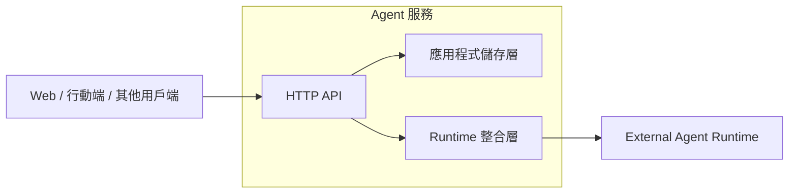
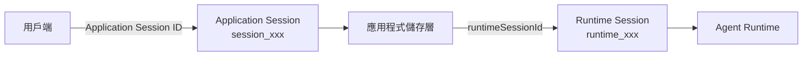
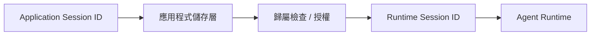
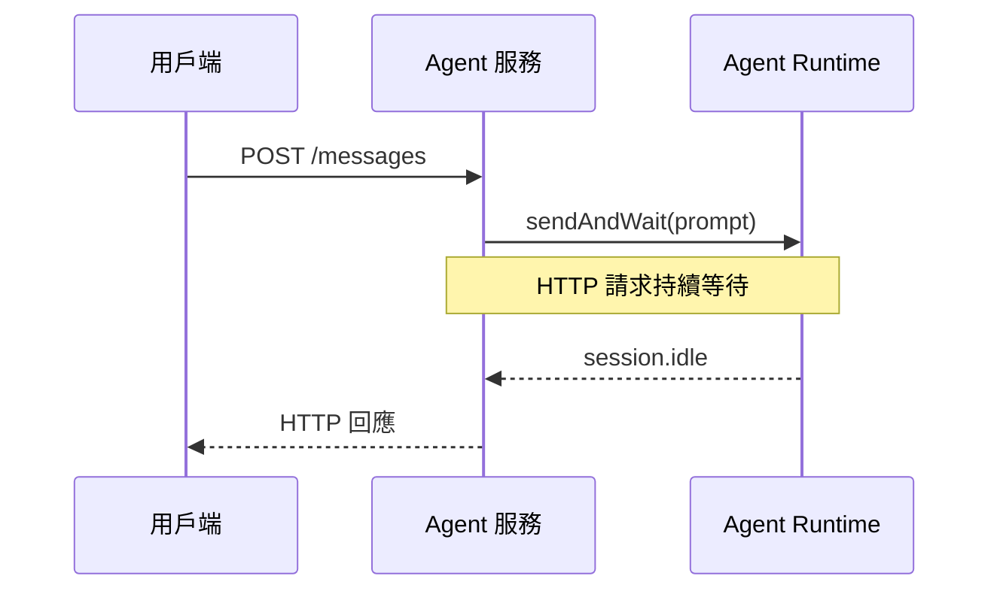

# Day 27 - Agent 服務設計：Session 模型與服務邊界

當 Session 已經能在後端環境中建立、恢復並持續操作後，Agent 工作就能跨越應用程式與 Runtime 的生命週期延續。不過，當這些能力進一步提供給 Web、行動端或其他系統使用時，用戶端不會直接操作 SDK 建立的 Session 物件，也不適合直接依賴 Copilot SDK 的資料模型與 Runtime 資源。

這時需要在 Copilot SDK 外面建立一層 Agent 服務，將應用程式管理的工作階段、使用者存取權與 Runtime Session 分開管理。用戶端應該使用哪一個 Session ID？收到請求後又該如何確認目前使用者可以操作這段工作？這些問題會決定 Agent 能力進入後端服務後的基本邊界。

## Agent 服務需要處理哪些問題？

當 Agent 能力只在單一應用程式中運作時，Session 的操作關係相對單純。程式建立 Session 後，可以持續持有對應的物件，後續互動也都沿著同一段執行流程進行。當這套能力改成由後端服務提供後，每一筆請求都可能來自不同時間、不同連線，甚至不同應用程式實例，原本隱含在程式中的 Session 關係就需要被明確保存與辨識。

前面的範例大多直接在程式中建立 Session：

```typescript
const session = await client.createSession({
  model,
  provider,
});
```

後續再透過同一個 `CopilotSession` 送出訊息：

```typescript
await session.sendAndWait({
  prompt: "請分析目前的系統設計。",
});
```

在 CLI、桌面工具或單一後端流程中，程式可以直接持有 Session 物件，並持續操作同一段 Agent 工作，不需要另外處理應用程式資源與 Runtime Session 之間的對應。

當使用方式改成 Web、行動端或其他系統透過 HTTP 呼叫後端服務時，用戶端不再直接操作 Copilot SDK，而是先經過 Agent 服務，再由服務連接 Agent Runtime。每一筆 HTTP 請求都需要重新辨識要操作的工作，此時如果只把 Runtime Session ID 交給用戶端，仍然無法完整處理應用程式層需要負責的幾個問題：

* **服務資源識別**：用戶端需要一個穩定的 ID 表示目前工作，不應直接依賴 Runtime 的資料模型。
* **Session 歸屬**：服務需要知道這段工作屬於哪一位使用者，才能判斷目前呼叫者是否具有存取權。
* **Runtime 對應**：Application Session 需要保存對應的 Runtime Session，才能延續原本的 Agent 工作。
* **API 契約**：SDK 與 Runtime 型別可能隨版本演進，對外 API 應只暴露用戶端真正需要的欄位。

假設用戶端直接送入 Runtime Session ID：

```http
POST /api/chat
Content-Type: application/json
```

```json
{
  "sessionId": "runtime_123",
  "message": "請繼續前面的分析。"
}
```

Agent 服務如果直接根據這個 ID 恢復 Runtime Session：

```typescript
await client.resumeSession("runtime_123");
```

只能確認 Runtime 是否能找到這段 Session。至於目前呼叫者是誰、這段工作屬於誰，以及目前操作是否允許，仍然需要由應用程式判斷。

因此，Agent 服務需要在 Runtime Session 外面建立自己的應用程式資料模型，用來保存工作識別、Session 歸屬與 Runtime 對應關係，再由這一層決定後續請求可以操作哪一段 Agent 工作。

## Agent 服務的基本架構

將 Session 能力整理成後端服務後，除了應用程式自己的 Session 模型，還需要進一步劃分 HTTP API、應用程式狀態與 Runtime 操作各自負責的範圍。Runtime 的執行方式也會成為服務架構的一部分，需要決定它的行程生命週期、版本與儲存環境要跟著 Agent 服務管理，還是由部署環境獨立維護。

如果希望 Runtime 能長時間獨立執行，並將行程啟停、版本與儲存環境和 Agent 服務分開管理，就適合採用 External Runtime。Copilot CLI 可以透過 Headless Server 獨立執行，Agent 服務則使用 Express 提供 HTTP API，再透過 `RuntimeConnection.forUri()` 連接已經運作中的 Runtime。這樣可以讓 Agent 服務專注處理使用者身分、Application Session 與請求流程，Runtime 則持續負責 Runtime Session 與 Agent 執行。

整體架構可以整理如下：



各個元件在這套架構中承擔不同責任：

* **用戶端**：操作 Agent 服務提供的 Session API，不需要知道 Copilot SDK 或 Runtime 的連線方式。
* **Agent 服務**：承接目前請求的使用者身分、執行授權，並協調 Application Session 與 Runtime 操作。
* **應用程式儲存層**：保存 Application Session、歸屬關係，以及 Runtime Session 的內部對應。
* **Runtime 整合層**：集中管理 Copilot SDK Client、BYOK 模型提供者與 Runtime Session 操作。
* **Agent Runtime**：維護 Runtime Session 狀態，並持續推進 Agent 執行流程。

在多使用者或共用 Runtime 的情境中，應以 `mode: "empty"` 作為基準，關閉 CLI 環境中的預設能力，再由應用程式明確決定每一段 Session 可以使用哪些 Tools、MCP Servers、Skills 與 Workspace。這樣可以讓能力範圍與存取邊界維持在 Agent 服務的控制之下。

當 Agent 能力進一步作為服務提供時，模型提供者、端點與認證資訊通常也會由服務端集中管理，而不直接交給用戶端。BYOK 很適合這類服務架構，讓 Agent Runtime 可以使用組織既有的模型提供者或 AI Gateway，同時將模型存取與應用程式本身的身分驗證、授權分開處理。

因此，本系列後續的 Agent 服務範例統一採用 BYOK，讓模型存取維持在服務端管理的範圍內，也讓後續討論 Session、執行流程與服務架構時，可以沿用一致的模型存取邊界。

| NOTE: |
| :--- |
| Agent 服務不限定只能使用 BYOK，也可以依照實際需求使用 GitHub Copilot 的認證與模型服務。本系列採用 BYOK 是服務端範例的實作選擇，不代表正式服務都必須使用相同方式。 |

## Application Session 與 Runtime Session 的責任邊界

Agent 服務收到後續請求時，需要先知道用戶端正在操作哪一段應用程式工作，再找到真正承載 Agent 工作脈絡的 Runtime Session。這兩種狀態雖然都以 Session 表示，實際負責的問題並不相同。

Runtime Session 保存的是 Agent 執行需要的對話、Context 與 Runtime 狀態；應用程式端則還需要管理用戶端使用的資源識別、Session 歸屬，以及後續可能加入的名稱、狀態或其他應用程式資訊。如果直接讓 Runtime Session 同時承擔這些責任，對外 API 就會開始依賴 Runtime 的識別方式與資料模型。

因此，Agent 服務另外建立一層 **Application Session**，將應用程式管理的工作階段與 Runtime Session 分開：

* **Application Session**：應用程式管理的持續工作階段，保存 Application Session ID、擁有者，以及 Runtime Session 的內部對應。
* **Runtime Session**：Agent Runtime 中的工作階段，保存 Agent 執行需要的對話、Context 與 Runtime 狀態。

在這個服務模型中，Application Session 與 Runtime Session 先維持一對一關係：



用戶端只需要知道 Application Session ID。例如建立 Session 後，服務可能回傳：

```json
{
  "id": "session_...",
  "createdAt": "2026-08-24T09:00:00.000Z"
}
```

服務內部則另外保存擁有者與 Runtime Session 的對應。後續請求先利用 Application Session ID 找回對應的 Application Session，完成授權後，才取得 Runtime Session ID 操作 Agent Runtime。

這樣可以讓兩層 Session 各自維持自己的資料責任。未來應用程式需要加入名稱、狀態或其他中繼資料，可以直接擴充 Application Session；Runtime Session 的 SDK 型別與資料結構則不需要因此進入對外 API 契約。

### Application Session 的資料模型

確定兩層 Session 的責任後，Application Session 只需要保存這個 Agent 服務用來辨識工作、判斷歸屬，以及找到 Runtime Session 所需的基本資訊：

```typescript
export type ApplicationSession = {
  id: string;
  ownerId: string;
  runtimeSessionId: string;
  createdAt: string;
};
```

幾個欄位分別處理不同問題：

* **`id`**：提供給用戶端的 Application Session ID。
* **`ownerId`**：記錄這段應用程式工作的擁有者，用於應用程式授權。
* **`runtimeSessionId`**：Agent 服務內部用來找到 Runtime Session 的識別資訊。
* **`createdAt`**：Application Session 的建立時間。

Application 與 Runtime 使用不同的識別碼。Application Session 採用 `session_<uuid>`，Runtime Session 則使用 `runtime_<uuid>`。應用程式在建立 Application Session 時同時產生兩個 ID，再保存兩者的對應關係；`runtimeSessionId` 不需要回傳給用戶端。

| NOTE: |
| :--- |
| `ApplicationSession` 是這個 Agent 服務採用的應用程式資料模型，不是 Copilot SDK 提供的型別。Copilot SDK 提供的是 `CopilotSession`、Session ID 與相關 Runtime API；Application Session 要保存哪些欄位，仍應依應用程式自己的需求設計。 |

### Session 歸屬與 Runtime 操作

Application Session 除了建立應用程式與 Runtime 之間的對應，也提供 Agent 服務判斷資源歸屬的位置。後續請求不能只因為帶入一個有效的 Session ID，就直接進入 Runtime 操作；服務仍然需要先確認呼叫者是否有權存取這段工作。

因此，Runtime 操作可以維持固定的處理順序：



假設使用者要求操作 `session_123`，Agent 服務會先從應用程式儲存層取得 Application Session，再確認：

```typescript
session.ownerId === currentUser.id
```

只有通過這項檢查後，才讀取 `runtimeSessionId` 並交給 Runtime 整合層操作。

Application Session ID 與 Runtime Session ID 都只負責識別對應的工作資源，不能取代應用程式授權。身分驗證、授權與 Session 歸屬留在 Agent 服務中處理；通過這層檢查後，Runtime 才承接實際的 Agent 工作。

## Agent 服務的 Session API

Application Session 建立了應用程式與 Runtime Session 之間的資源邊界後，用戶端後續的操作也應維持在這一層資源上。建立、查詢或繼續一段 Agent 工作時，用戶端只需要使用 Application Session ID；Runtime Session 的識別資訊與操作方式則留在 Agent 服務內部。

依照這項資源邊界，Session API 可以先涵蓋三個基本操作：

| Method | API                                 | 用途                       |
| ------ | ----------------------------------- | ------------------------ |
| `POST` | `/api/sessions`                     | 建立新的 Application Session |
| `GET`  | `/api/sessions/:sessionId`          | 取得指定 Session             |
| `POST` | `/api/sessions/:sessionId/messages` | 在既有 Session 中送出訊息        |

建立 Session 時，Agent 服務會建立 Application Session 與對應的 Runtime Session，完成後只將用戶端需要的 Session 資訊回傳。後續查詢或送出訊息時，服務先利用 Application Session ID 找到應用程式紀錄並完成歸屬檢查，再取得內部保存的 Runtime Session ID 執行實際操作。

查詢 Session 時，用戶端只需要提供 Application Session ID：

```http
GET /api/sessions/session_123
```

送出訊息時也維持相同的資源邊界：

```http
POST /api/sessions/session_123/messages
Content-Type: application/json
```

```json
{
  "message": "請用三點整理 Agent 服務需要注意的工程問題。"
}
```

訊息流程可以先採用同步設計，讓 HTTP 請求等待 Agent 完成這次工作後再回傳結果。這種方式適合執行時間較短的互動，整體請求與回應關係也比較單純。

不過，同一個 Application Session 如果同時收到多筆訊息，就可能讓多個請求一起操作相同的 Runtime Session。即使先採同步流程，Agent 服務仍需要限制同一段工作在尚未完成時再次接受新的訊息，讓 Application Session 與 Runtime Session 之間維持明確的執行關係。

當 Agent 工作時間進一步拉長，HTTP 請求與 Runtime 執行的生命週期就可能不再一致。這時除了 Session 本身，還需要進一步考慮如何表示與追蹤其中每一次實際執行的工作。

## 實作：建立最小 Agent 服務

完成 Session 模型與 API 邊界後，接著將這些設計放進一個可以實際執行的 Express 服務，確認用戶端如何只透過 Application Session 操作 Agent 工作。

實作使用 External Runtime 與 OpenAI 相容的 BYOK 模型提供者，不加入 Custom Tool、MCP、Hooks 或其他 Agent 能力，讓觀察重點集中在 Application Session、Session 歸屬與 Runtime 對應關係。

### 準備專案環境

先建立 Node.js 專案：

```bash
$ mkdir copilot-sdk-agent-service
$ cd copilot-sdk-agent-service
$ npm init -y --init-type module
$ mkdir src
```

安裝 Copilot SDK、Express 與 TypeScript 執行環境：

```bash
$ npm install @github/copilot-sdk express
$ npm install --save-dev @types/express @types/node typescript tsx
```

完成後，專案結構如下：

```text
copilot-sdk-agent-service/
├── src/
│   ├── types.ts
│   ├── store.ts
│   ├── runtime.ts
│   └── server.ts
└── package.json
```

四個檔案分別負責：

* **`types.ts`**：定義 Application Session。
* **`store.ts`**：保存 Application Session 與 Session 歸屬。
* **`runtime.ts`**：管理 Copilot SDK、BYOK 模型提供者與 Runtime Session。
* **`server.ts`**：提供 Session HTTP API。

先啟動 External Runtime：

```bash
$ copilot --headless --port 4321
```

接著準備 BYOK 模型提供者所需的設定：

```bash
$ export COPILOT_RUNTIME_URL="localhost:4321"
$ export MODEL_BASE_URL="https://<model-provider>/v1"
$ export MODEL_API_KEY="<api-key>"
$ export MODEL_ID="<model-id>"
```

這裡延續 BYOK 已經建立的 OpenAI 相容模型提供者設定，並假設端點使用 API Key 認證與預設的 Chat Completions API。`MODEL_BASE_URL`、`MODEL_API_KEY` 與 `MODEL_ID` 都由服務端執行環境提供，不會保存進 Application Session。

### 定義 Application Session

先建立 `src/types.ts`：

```typescript
export type ApplicationSession = {
  id: string;
  ownerId: string;
  runtimeSessionId: string;
  createdAt: string;
};
```

這個型別只保存 Application Session 與 Runtime Session 建立對應所需要的基本資訊。模型名稱、模型提供者位置與 API Key 都不屬於 Application Session，會由 Runtime 整合層從服務端執行環境取得。

### 建立 Session Store

接著建立 `src/store.ts`：

```typescript
import { randomUUID } from "node:crypto";
import type { ApplicationSession } from "./types.js";

const sessions = new Map<string, ApplicationSession>();

function createId(prefix: string): string {
  return `${prefix}_${randomUUID()}`;
}

export function createApplicationSession(ownerId: string): ApplicationSession {
  const session: ApplicationSession = {
    id: createId("session"),
    ownerId,
    runtimeSessionId: createId("runtime"),
    createdAt: new Date().toISOString(),
  };

  sessions.set(session.id, session);
  return session;
}

export function getOwnedSession(
  sessionId: string,
  ownerId: string,
): ApplicationSession | undefined {
  const session = sessions.get(sessionId);
  return session?.ownerId === ownerId ? session : undefined;
}

export function deleteApplicationSession(sessionId: string): void {
  sessions.delete(sessionId);
}
```

`createApplicationSession()` 同時產生 Application Session ID 與 Runtime Session ID，建立兩層 Session 的明確對應關係。

`getOwnedSession()` 則將 Session 查詢與最基本的歸屬檢查放在同一個位置。Session 不存在與擁有者不符合都回傳 `undefined`，HTTP 處理函式只會取得目前使用者有權操作的 Application Session，也不需要向外透露另一位使用者的 Session 是否存在。

Session Store 使用程序內 `Map`，只適合單一應用程式實例的範例。正式服務如果需要讓多個應用程式實例或重新啟動後的程序取得相同 Application Session，應用程式狀態必須放到可以共享與持久保存的儲存系統。這裡先維持最小實作，讓焦點留在 Session 模型本身。

### 建立 Runtime 整合層

接著建立 `src/runtime.ts`：

```typescript
import {
  CopilotClient,
  RuntimeConnection,
  type CopilotSession,
  type ProviderConfig,
} from "@github/copilot-sdk";
import type { ApplicationSession } from "./types.js";

const runtimeUrl = process.env.COPILOT_RUNTIME_URL ?? "localhost:4321";
const model = process.env.MODEL_ID;
const baseUrl = process.env.MODEL_BASE_URL;
const apiKey = process.env.MODEL_API_KEY;

if (!model || !baseUrl || !apiKey) {
  throw new Error("MODEL_ID、MODEL_BASE_URL 與 MODEL_API_KEY 都必須提供。");
}

const provider: ProviderConfig = {
  type: "openai",
  baseUrl,
  apiKey,
};

const client = new CopilotClient({
  connection: RuntimeConnection.forUri(runtimeUrl),
  mode: "empty",
});

const runtimeSessions = new Map<string, CopilotSession>();

export async function createRuntimeSession(
  session: ApplicationSession,
): Promise<void> {
  const runtimeSession = await client.createSession({
    sessionId: session.runtimeSessionId,
    model,
    provider,
    availableTools: [],
  });

  runtimeSessions.set(session.runtimeSessionId, runtimeSession);
}

async function getRuntimeSession(
  runtimeSessionId: string,
): Promise<CopilotSession> {
  const current = runtimeSessions.get(runtimeSessionId);

  if (current) {
    return current;
  }

  const resumed = await client.resumeSession(runtimeSessionId, {
    model,
    provider,
    availableTools: [],
  });

  runtimeSessions.set(runtimeSessionId, resumed);
  return resumed;
}

export async function sendMessage(
  runtimeSessionId: string,
  prompt: string,
): Promise<string | null> {
  const session = await getRuntimeSession(runtimeSessionId);
  const response = await session.sendAndWait({ prompt }, 120_000);
  return response?.data.content ?? null;
}
```

Runtime 整合層將 Copilot SDK 操作與 HTTP API 分開。`server.ts` 不需要知道 Runtime 的連線方式，也不需要在每一支 API 中重複建立模型提供者設定。

Client 以 `RuntimeConnection.forUri()` 連接 External Runtime，並使用 `mode: "empty"`；Session 也將 `availableTools` 設為空陣列，因此不開放檔案、Shell 或其他 Tool。

建立 Runtime Session 後，`runtimeSessions` 會保存這個程序已經取得的 `CopilotSession` 物件。應用程式儲存層保存的是 Application Session 與 `runtimeSessionId` 的應用程式資料；這裡保存的則是應用程式實例中的執行期物件，兩者具有不同的生命週期。

如果 Runtime 整合層沒有現成的 `CopilotSession` 物件，就可以利用 `runtimeSessionId` 透過 `resumeSession()` 重新取得原本的 Runtime Session。BYOK 的模型提供者設定也會在 Resume 時重新提供；API Key 不會持久化到 Session state，因此恢復 BYOK Session 時必須再次提供有效的模型提供者認證資訊。

Application Session 仍然只保存在記憶體，因此完整的應用程式程序重新啟動不在這個範例的驗證範圍。這裡保留 Runtime Session 的 Resume 路徑，主要是讓 Runtime 操作集中在同一層，並區分可以保存的 Runtime Session ID 與只存在程序中的 `CopilotSession` 物件。

### 建立 Session API

最後建立 `src/server.ts`：

```typescript
import express from "express";
import {
  createApplicationSession,
  deleteApplicationSession,
  getOwnedSession,
} from "./store.js";
import { createRuntimeSession, sendMessage } from "./runtime.js";
import type { ApplicationSession } from "./types.js";

const app = express();
app.use(express.json());

const port = Number.parseInt(process.env.PORT ?? "3000", 10);
const currentUser = { id: "demo-user" };
const activeMessageSessions = new Set<string>();

function toSessionResponse(session: ApplicationSession) {
  return {
    id: session.id,
    createdAt: session.createdAt,
  };
}

app.post("/api/sessions", async (_req, res) => {
  const session = createApplicationSession(currentUser.id);

  try {
    await createRuntimeSession(session);
    res.status(201).json(toSessionResponse(session));
  } catch (error) {
    deleteApplicationSession(session.id);
    console.error(error);
    res.status(502).json({ error: "Unable to create Runtime Session" });
  }
});

app.get("/api/sessions/:sessionId", (req, res) => {
  const session = getOwnedSession(req.params.sessionId, currentUser.id);

  if (!session) {
    res.status(404).json({ error: "Session not found" });
    return;
  }

  res.json(toSessionResponse(session));
});

app.post("/api/sessions/:sessionId/messages", async (req, res) => {
  const message =
    typeof req.body.message === "string" ? req.body.message.trim() : "";

  if (!message) {
    res.status(400).json({ error: "message is required" });
    return;
  }

  const session = getOwnedSession(req.params.sessionId, currentUser.id);

  if (!session) {
    res.status(404).json({ error: "Session not found" });
    return;
  }

  if (activeMessageSessions.has(session.id)) {
    res.status(409).json({
      error: "Session is already processing a message",
    });
    return;
  }

  activeMessageSessions.add(session.id);

  try {
    const content = await sendMessage(session.runtimeSessionId, message);
    res.json({ sessionId: session.id, content });
  } catch (error) {
    console.error(error);
    res.status(502).json({ error: "Unable to execute Agent request" });
  } finally {
    activeMessageSessions.delete(session.id);
  }
});

app.listen(port, () => {
  console.log(`Agent service listening on http://localhost:${port}`);
});
```

範例假設應用程式身分驗證已經由前置流程完成，因此使用固定的 `demo-user` 代表目前登入者。實際 Web 或內部服務可以從已驗證的 Token、登入 Session 或既有身分驗證機制取得目前使用者身分。這層應用程式身分決定呼叫者可以操作哪些 Application Session，Runtime 使用的 BYOK 模型提供者則負責模型存取，兩者位於不同的責任範圍。

建立 Session 時，程式先建立 Application Session，再建立對應的 Runtime Session。如果 Runtime Session 建立失敗，剛才建立的應用程式紀錄會一起移除，避免儲存層留下一筆沒有 Runtime 對應的 Application Session。

成功後只回傳 `id` 與 `createdAt`。`ownerId`、`runtimeSessionId`、模型提供者位置與 API Key 都留在 Agent 服務內部。後續查詢與傳送訊息也會先透過 `getOwnedSession()` 完成 Session 歸屬檢查，再接觸 Runtime。

訊息 API 另外使用 `activeMessageSessions` 記錄應用程式實例中正在等待同步結果的 Application Session。如果相同 Session 已經有一筆訊息請求尚未結束，新的請求會回傳 `409 Conflict`，避免兩筆同步 HTTP 請求直接同時進入相同 Runtime Session。

這項防護只存在於目前程序，也只涵蓋 HTTP 處理函式仍在等待的期間。它不等同完整的 Session 並行控制，無法協調不同應用程式實例，也不能在 HTTP 等待已經結束後繼續代表 Runtime 的實際執行狀態。

| NOTE: |
| :--- |
| 固定的 `demo-user` 只用來表示身分驗證完成後取得的目前使用者。正式服務不能信任用戶端自行提供的使用者 ID，而應從已驗證的 Token、登入 Session 或既有身分機制建立目前請求的使用者身分。 |

### 執行應用程式

確認 External Runtime、BYOK 模型提供者與環境變數都已經準備完成後，啟動 Agent 服務：

```bash
$ npx tsx src/server.ts
```

如果啟動成功，終端機會顯示 Agent 服務已經監聽 `http://localhost:3000`。

先建立 Application Session：

```bash
$ curl -X POST http://localhost:3000/api/sessions
```

回應可能如下：

```json
{
  "id": "session_<uuid>",
  "createdAt": "2026-08-24T09:00:00.000Z"
}
```

複製實際取得的 Application Session ID，再查詢 Session：

```bash
$ curl http://localhost:3000/api/sessions/session_<uuid>
```

接著送出訊息：

```bash
$ curl -X POST \
  -H "Content-Type: application/json" \
  -d '{"message":"請用三點整理 Agent 服務需要注意的工程問題。"}' \
  http://localhost:3000/api/sessions/session_<uuid>/messages
```

如果 Runtime 與模型提供者都能正常處理，回應會包含 Application Session ID 與 Agent 回應：

```json
{
  "sessionId": "session_<uuid>",
  "content": "..."
}
```

實際的自然語言內容會依使用的模型與執行結果而不同。執行時主要確認用戶端從建立 Session 到後續傳送訊息都只使用 Application Session ID。Agent 服務會先透過應用程式儲存層找到這段 Session 並完成歸屬檢查，再利用內部保存的 `runtimeSessionId` 操作 Runtime；模型存取則繼續由服務端設定的 BYOK 模型提供者負責。

## 同步訊息流程的適用情境與限制

前面的 Session API 先採用同步訊息流程，讓用戶端送出要求後，由 Agent 服務等待 Runtime 完成目前工作，再將結果回傳。對執行時間較短的互動來說，這種設計可以維持清楚的請求與回應關係，也不需要另外建立執行狀態或事件串流。

不過，HTTP 請求與 Agent 執行具有不同的生命週期。當工作時間拉長、經過更多 Turn，或加入 Tool 執行後，就不能再假設 Agent 一定能在原本的 HTTP 請求期間完成。

`/messages` API 會直接呼叫：

```typescript
await session.sendAndWait({ prompt }, 120_000);
```

這裡將等待時間設定為 120 秒。Node.js SDK 如果省略第二個參數，`sendAndWait()` 目前預設等待 60 秒；它會等待 Session 進入 `session.idle`。如果等待期間先收到 `session.error`，或等待時間到達，則會拋出錯誤。這項逾時只控制呼叫端等待多久，不會中止仍在 Runtime 執行的 Agent 工作。

同步流程可以表示如下：



正常情況下，Agent 工作讓 Session 回到 idle 後，HTTP 處理函式才將結果回傳給用戶端。不過，使用者關閉頁面、Reverse Proxy 或 Load Balancer 結束連線，或 `sendAndWait()` 先發生逾時，都只代表呼叫端停止等待，不能據此判斷 Runtime 中的工作已經停止。

`activeMessageSessions` 因此只能提供有限的同步請求防護。它可以避免單一應用程式實例在前一筆請求仍等待時，再接受另一筆相同 Session 的訊息；但如果等待先因逾時結束，Runtime 工作仍可能繼續，而且不同應用程式實例之間也無法共享這個程序內狀態。

當 Agent 執行需要跨越單次 HTTP 請求的生命週期，或應用程式需要獨立追蹤每一次執行時，就需要進一步將持續存在的 Session 與其中一次實際執行的工作分開管理。

## 小結

將 Copilot SDK 放進後端服務後，應用程式需要在 Runtime Session 外面建立自己的工作模型，讓 Session 歸屬、對外 API 契約與 Agent 執行各自維持清楚的責任：

* Application Session 表示應用程式管理的持續工作階段，保存 Application Session ID、擁有者與 Runtime Session 的對應關係。
* Runtime Session 承載 Agent 執行需要的工作脈絡與狀態，不直接成為對外 API 的資源模型。
* Agent 服務會先根據使用者身分完成 Session 歸屬檢查與授權，再取得內部的 Runtime Session ID 執行後續操作。
* Runtime 整合層集中管理 Copilot SDK、External Runtime 與 BYOK 模型提供者，讓 Runtime 操作與模型認證資訊維持在服務端。
* 對外 API 只提供用戶端真正需要的資料，SDK 與 Runtime 的型別及識別資訊則留在服務內部。

透過這些分工，Application Session 可以維持應用程式自己的資料與存取邊界，Runtime Session 則專注承載 Agent 工作。兩者分開管理後，Agent 能力也就有了進一步擴充成後端服務所需要的基本架構。
