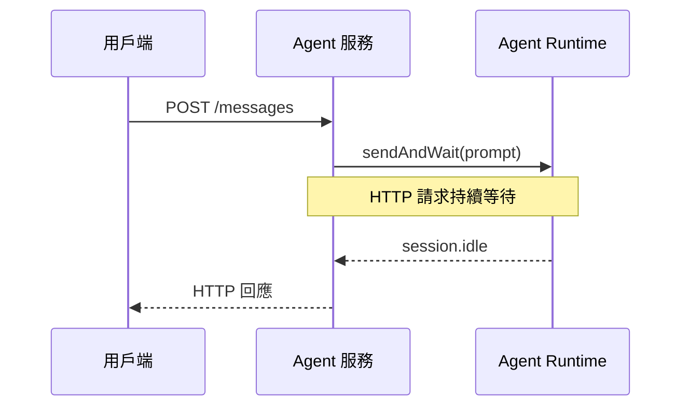
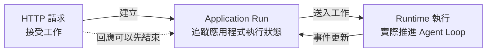
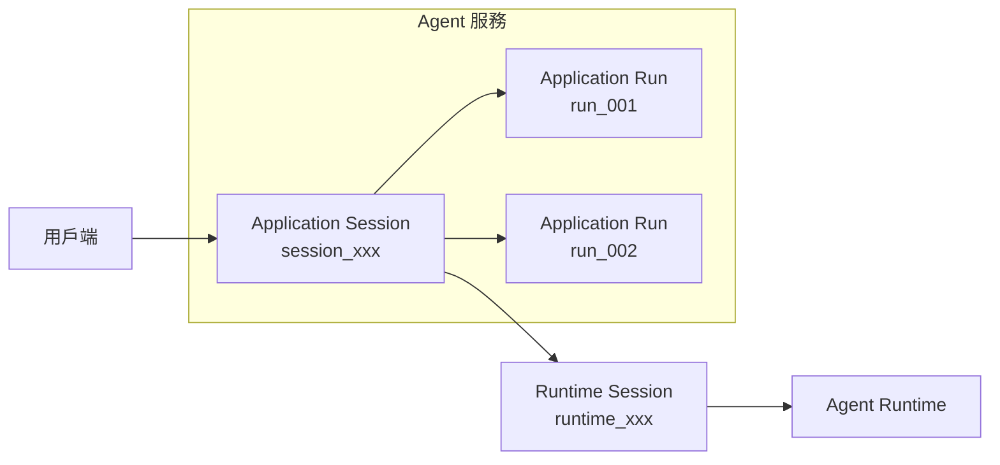
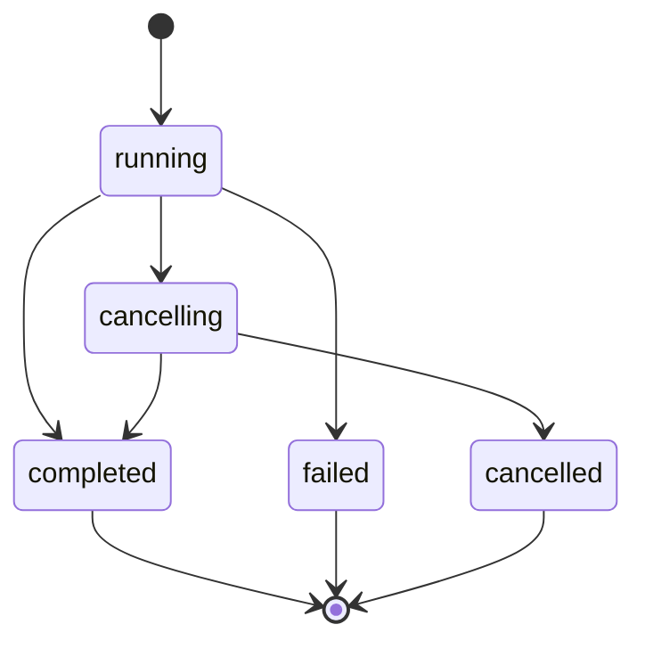
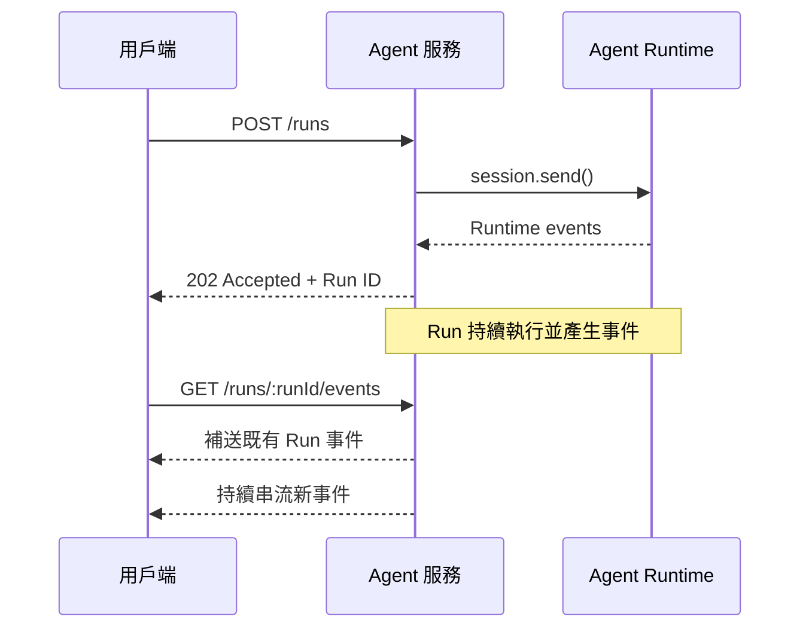

# Day 28 - 長任務執行設計：Application Run、事件串流與取消

前面的 Agent 服務已經把應用程式中的工作階段與 Agent Runtime 分開管理，用戶端可以透過自己的 Application Session ID 持續操作同一段工作。不過，目前每一次訊息處理仍然會讓 HTTP 請求一路等待 Agent 完成。當工作需要經過更多 Turn、模型處理時間逐漸拉長，甚至加入工具執行後，原本單純的請求與回應流程就可能先遇到逾時、連線中斷，或使用者已經離開目前頁面的情況。

HTTP 請求結束，只代表用戶端不再等待這次回應，Agent Runtime 中的工作仍可能繼續執行。這時就需要把一段持續存在的 Session，和其中某一次實際執行的工作進一步分開，讓服務可以在原本的 HTTP 請求結束後繼續追蹤執行狀態、串流輸出，並在需要時接受取消。

## 為什麼長任務不適合綁在 HTTP 請求？

對執行時間較短的 Agent 工作來說，讓一次 HTTP 請求等待工作完成，再直接回傳最後結果，是相對單純的處理方式。用戶端送出要求後，只需要等待這次請求結束，就能取得 Agent 的回應；應用程式也不需要另外保存一筆獨立的執行狀態。

目前的同步訊息流程是透過 `sendAndWait()` 送出 Prompt，並等待這次 Agent 工作停止：

```typescript
const response = await session.sendAndWait({ prompt }, 120_000);
```

`sendAndWait()` 會將訊息送入 Session，並等待 Session 回到 `session.idle`。指定的 timeout 只控制呼叫端願意等待多久，不會因為逾時就中止仍在進行的 Agent 工作。

同步流程可以表示成：



只要 Agent 能在合理時間內完成，這條路徑沒有太大問題。工作時間拉長後，原本綁在一起的幾個生命週期就會開始產生差異：

* **HTTP 請求生命週期**：描述用戶端與 Agent 服務之間的一次請求與回應。連線中斷、反向代理逾時或用戶端離開頁面，都可能讓它提早結束。
* **應用程式執行生命週期**：描述 Agent 服務接受的一次工作，需要知道工作是否仍在執行、已經完成、失敗或正在取消。
* **Runtime 執行生命週期**：描述 Agent Runtime 實際處理訊息、推進 Agent Loop，直到工作停止、發生錯誤或被中止。

例如 `sendAndWait()` 等待 120 秒後拋出 timeout，Agent 服務雖然可以停止等待並結束這次 HTTP 處理，Runtime 卻不會因此自動停止。真正需要停止 Runtime 的處理時，Copilot SDK 另外提供 `session.abort()`，用來中止 Session 中正在處理的訊息。

因此，長任務服務需要先把三個生命週期拆開：



拆開這三層後，還需要一個由 Agent 服務管理的執行資源，承接已經離開 HTTP 請求的工作狀態。這就是接下來 Application Run 要處理的問題。

## 用 Application Run 表示一次 Agent 執行

Application Session 描述的是應用程式中一段持續存在的工作階段。同一個 Session 可以接收多次前後相關的使用者要求，並持續對應同一個 Runtime Session，讓後續工作延續已經累積的 Context。

不過，Session 本身只能表示這段工作階段仍然存在，無法完整描述其中某一次 Agent 執行的狀態。當服務需要知道某一次工作是否仍在執行、最後是否成功完成，或使用者準備取消哪一筆工作時，就需要另外建立能夠追蹤單次執行的資源。

因此，在 Application Session 之下再建立 Application Run，用來表示一次被 Agent 服務接受並交給 Runtime 執行的工作：

* **Application Session**：應用程式中的持續工作階段，保存 Application Session ID、擁有者，以及 Runtime Session 的對應關係。
* **Application Run**：Application Session 中的一次 Agent 執行，保存這次工作的狀態、輸出與 Run 事件。
* **Runtime Session**：Agent Runtime 中持續存在的工作階段，維護對話、Context 與 Runtime 狀態。
* **Runtime 訊息 ID**：訊息送入 Runtime 後取得的識別資訊，保留在服務內部協助追蹤執行。

整體關係可以表示成：



Application Session 可以持續存在並承接後續互動，每一次實際執行的工作則分別形成 Application Run。前一筆 Run 完成後，後續要求仍然可以在相同的 Application Session 中建立新的 Run，並延續同一個 Runtime Session 已經累積的工作脈絡。

| NOTE: |
| :--- |
| `Application Run` 是這套 Agent 服務自行建立的應用程式層模型。Copilot SDK 提供 `CopilotSession`、Runtime 訊息與 Session 事件；Run ID、Run 狀態與對外 API 契約則由應用程式自行定義。Runtime 訊息 ID 繼續留在服務內部，不直接作為對外資源識別碼。 |

### Application Run 的狀態模型

Application Run 建立後，Agent 服務還需要持續追蹤這次工作的執行情況。用戶端可能在不同時間查詢狀態、建立 SSE 連線或提出取消要求，因此除了知道 Run 已經建立，也要能區分工作仍在執行、正在取消，或已經以某種結果結束。

Application Run 可以整理成五種狀態：

```typescript
export type RunStatus =
  | "running"
  | "cancelling"
  | "completed"
  | "failed"
  | "cancelled";
```

`running` 表示這次工作已經由 Agent 服務接受，正在送入 Runtime 或等待後續執行結果。工作正常結束時進入 `completed`；執行期間發生錯誤，而且這次 Run 無法繼續時，則進入 `failed`。

取消流程需要額外保留一個中間狀態。使用者提出取消要求後，Application 先將 Run 更新成 `cancelling`，表示中止流程已經開始，但 Runtime 中的工作仍可能尚未真正停止。等 Runtime 回報最後的停止結果後，Application 再決定這次 Run 應該進入哪一個終止狀態。

主要狀態轉移可以表示成：



如果 Runtime 最後確認這次工作因中止而停止，Run 就會從 `cancelling` 進入 `cancelled`。取消要求送出後，Agent 仍可能在中止真正生效前自然完成，此時最後狀態會是 `completed`。因此，Application 會等 Runtime 回報實際的停止結果後，再收束這次 Run 的最終狀態。

| NOTE: |
| :--- |
| 同一個 Application Session 中的多次 Run 會共用同一個 Runtime Session。為了讓 Runtime 產生的執行事件能明確對應目前這筆 Application Run，目前 Agent 服務限制同一個 Application Session 在同一時間最多只有一筆尚未結束的 Run。如果已經存在 `running` 或 `cancelling` Run，再建立新的 Run 時會回傳 `409 Conflict`。這是 Agent 服務自行定義的執行政策，用來維持 Application Run 與 Runtime 執行狀態之間清楚的對應關係。 |

## 長任務 API 設計

Application Run 將一次 Agent 執行獨立成由 Agent 服務管理的資源後，用戶端就不需要透過同一個 HTTP 請求一路等待工作完成。建立工作、查詢狀態、接收執行事件與提出取消要求，可以分別透過不同 API 處理，讓每一次 HTTP 請求只負責目前需要的操作。

原本同步的 `/messages` API 因此可以調整成一組以 Application Run 為中心的 API：

| Method | Endpoint                        | 用途                   |
| ------ | ------------------------------- | -------------------- |
| `POST` | `/api/sessions/:sessionId/runs` | 建立新的 Application Run |
| `GET`  | `/api/runs/:runId`              | 查詢 Run 狀態與最後結果       |
| `GET`  | `/api/runs/:runId/events`       | 透過 SSE 接收 Run 事件     |
| `POST` | `/api/runs/:runId/cancel`       | 要求取消目前 Run           |

建立 Run 時，用戶端仍然只需要知道 Application Session ID：

```http
POST /api/sessions/session_123/runs
Content-Type: application/json
```

```json
{
  "prompt": "請分析目前的系統設計，整理主要風險與改善建議。"
}
```

Agent 服務完成 Session 歸屬與輸入檢查後，先建立 Application Run，再透過 `session.send()` 將工作送進 Runtime：

```typescript
const runtimeMessageId = await session.send({
  prompt: run.prompt,
});
```

`send()` 會在訊息提交到 Session 後回傳訊息 ID，不需要等待整段 Agent 執行完成。後續的執行狀態與輸出則透過 Session 事件持續取得，再更新對應的 Application Run。

因此，只要訊息已經成功提交到 Runtime，`POST /runs` 就可以先回傳 `202 Accepted`：

```json
{
  "id": "run_...",
  "sessionId": "session_123",
  "status": "running",
  "createdAt": "2026-08-24T12:00:00.000Z"
}
```

用戶端取得 Run ID 後，可以透過 `GET /api/runs/run_123` 查詢目前狀態，或連接 `GET /api/runs/run_123/events` 接收 SSE 事件。建立 Run 的 HTTP 請求到這裡就已經完成，後續 Agent 執行由服務繼續追蹤。

Runtime 訊息 ID 只保存於 Application Run 的服務內部資料中，可以協助 Log、Trace 或 Runtime 除錯。服務 API 則繼續使用 Application Run ID，避免 SDK 或 Runtime 的識別資訊直接成為對外 API 契約；查詢、串流與取消 Run 時，也仍需要先透過 Application Session 完成歸屬與授權檢查。

## 將 Runtime 事件轉成 Run 事件

Application Run 建立後，真正的 Agent 工作仍然由 Runtime 執行。模型產生內容、Agent Loop 停止或執行發生錯誤時，Agent 服務都需要根據 Session 事件更新對應的 Run 狀態，才能讓查詢 API 與 SSE 反映目前的執行情況。

不過，Session 事件描述的是 Runtime 的執行過程，其中包含 Runtime 自己的事件名稱、資料結構與識別資訊。如果直接將完整的 `SessionEvent` 暴露在服務 API 中，用戶端也會跟著依賴這些 Runtime 細節。Application 因此需要在兩者之間建立自己的 Run 事件契約，只保留 Application Run 真正需要的執行資訊。

Run 事件可以先整理成：

```typescript
export type RunEventData =
  | { type: "run.started" }
  | { type: "run.output.delta"; delta: string }
  | { type: "run.cancelling" }
  | { type: "run.cancel_failed"; error: string }
  | { type: "run.completed"; output?: string }
  | { type: "run.failed"; error: string }
  | { type: "run.cancelled" };
```

這組事件描述的是 Application Run 在 Agent 服務中的執行狀態，包括工作開始、增量輸出、取消流程，以及最後完成、失敗或取消等結果。Runtime 原始事件仍然保留在 Agent 服務內部，再依照需要轉換成對應的 Run 事件。

主要對應關係可以整理成：

| Runtime 事件                | Application 處理                             |
| ------------------------- | ------------------------------------------ |
| `assistant.message_delta` | 轉成 `run.output.delta`，提供執行期間的增量文字          |
| `assistant.message`       | 更新 Run 目前保存的完整輸出                           |
| `session.idle`            | 根據 `aborted` 收束成 `completed` 或 `cancelled` |
| `session.error`           | 範例將目前 Run 收束成 `failed`                     |

其中，`session.idle` 表示 Agent Loop 已經停止，適合作為目前 Run 收束狀態的主要依據。`session.task_complete` 則需要模型主動產生，一般工作不保證一定會出現，因此不適合作為 Run 的完成條件。

### 區分 Runtime 事件與 Run 事件

Run 事件契約建立後，還需要決定 Runtime 產生的內容如何進入 Run 事件。即時輸出與完整訊息的用途不同，因此會分別使用 `assistant.message_delta` 與 `assistant.message`。

要取得模型生成期間的增量內容，需要在建立 Session 時啟用 Streaming：

```typescript
const session = await client.createSession({
  model,
  provider,
  streaming: true,
  availableTools: [],
});
```

`streaming: true` 是 Session 層級的設定。啟用後，模型產生內容期間，Runtime 會持續提供 `assistant.message_delta`。每一筆事件只包含這次新增的文字片段，Application 可以將主要 Agent 的增量內容轉成 `run.output.delta`，再透過 SSE 即時送給用戶端。

這些增量事件反映的是 Agent 執行期間產生的 Assistant 輸出，不需要將每一筆增量內容視為這次 Run 的最終結果。

`assistant.message` 則代表一次 LLM 呼叫形成的完整 Assistant 訊息，過程中可能因為 Agent Loop 經過多個 Turn 而出現多次。Application 可以持續以主要 Agent 的完整訊息更新目前 Run 保存的 `output`；等 `session.idle` 發生後，最後保存的完整輸出就成為這次 Run 的結果。

Runtime 的 `messageId`、`turnId`、`toolCallId` 與完整 Session 事件仍然可以保留在 Log 或 Trace 中協助追蹤執行，不需要成為服務 API 的一部分。

完成 Runtime 事件到 Run 事件的映射後，還有另一個問題需要處理。建立 Run 與連接 SSE 是兩次獨立的 HTTP 請求，用戶端可能在工作已經開始一段時間後才建立串流，也可能在接收途中斷線，因此先前已經產生的 Run 事件需要有地方可以重新取得。

### 處理 SSE 重連與事件補送

Run 建立後，Runtime 就可以開始執行，但用戶端通常要先取得 Run ID，才會另外建立 SSE 連線。這兩個動作分屬不同的 HTTP 請求，因此 SSE 真正連線前，Run 可能已經產生部分事件。

整體時序可以表示成：



如果 Agent 服務只在 SSE 連線存在時轉送事件，用戶端就可能遺漏連線建立前已經產生的內容。連線中途斷開時也有相同問題，重新連線後需要知道先前已經處理到哪一筆事件，才能接著取得後續內容。

另外，`assistant.message_delta` 與 `session.idle` 都屬於暫時性 Runtime 事件，只在執行期間提供，不會保存到 Session 事件紀錄，也不會在恢復 Session 時重新播放。因此，Run 的即時事件還需要由 Application 自己保存，才能支援 Run 事件的補送與重新連線。

每一筆 Run 事件可以加入持續遞增的 `sequence`：

```typescript
export type RunEvent = RunEventData & {
  sequence: number;
  runId: string;
  timestamp: string;
};
```

事件產生後，Application 會先將它寫入目前 Run 的事件紀錄，再送給已經連線的 SSE 用戶端。SSE 同時將 `sequence` 寫入事件的 `id`，讓用戶端知道目前已經處理到哪一筆事件。

如果連線中斷，用戶端重新建立 SSE 時，可以透過標準的 `Last-Event-ID` 標頭帶回最後已經收到的事件序號。Agent 服務再從 Run 事件紀錄中補送該序號之後的內容，完成後繼續傳送新產生的事件。

## 實作：建立可查詢、可串流、可取消的 Application Run

接下來直接延續上一篇的 `copilot-sdk-agent-service`。Application Session、Session Store、External Runtime 與 BYOK 模型提供者都繼續沿用；這次移除同步 `/messages` 流程與 `activeMessageSessions`，加入 Application Run、Run 事件紀錄與對應 API。

專案結構調整為：

```text
copilot-sdk-agent-service/
├── src/
│   ├── types.ts
│   ├── store.ts
│   ├── run-store.ts
│   ├── runtime.ts
│   ├── run-manager.ts
│   └── server.ts
└── package.json
```

各檔案負責：

* **`types.ts`**：定義 Application Session、Application Run 與 Run 事件。
* **`store.ts`**：沿用上一篇的 Application Session 儲存層。
* **`run-store.ts`**：保存 Run 狀態、事件紀錄與 SSE 訂閱者。
* **`runtime.ts`**：管理 Runtime Session、Streaming 與取消。
* **`run-manager.ts`**：將 Run 送入 Runtime，再根據 Session 事件更新 Application 狀態。
* **`server.ts`**：提供 Session、Run、SSE 與取消 API。

其中，`store.ts` 不需要調整，直接沿用上一篇已經建立的 Application Session 與 Session 歸屬邏輯。

### 定義 Application Run 與 Run 事件

先更新 `src/types.ts`：

```typescript
export type ApplicationSession = {
  id: string;
  ownerId: string;
  runtimeSessionId: string;
  createdAt: string;
};

export type RunStatus =
  | "running"
  | "cancelling"
  | "completed"
  | "failed"
  | "cancelled";

export type ApplicationRun = {
  id: string;
  sessionId: string;
  status: RunStatus;
  prompt: string;
  runtimeMessageId?: string;
  output?: string;
  error?: string;
  createdAt: string;
  completedAt?: string;
};

export type RunEventData =
  | { type: "run.started" }
  | { type: "run.output.delta"; delta: string }
  | { type: "run.cancelling" }
  | { type: "run.cancel_failed"; error: string }
  | { type: "run.completed"; output?: string }
  | { type: "run.failed"; error: string }
  | { type: "run.cancelled" };

export type RunEvent = RunEventData & {
  sequence: number;
  runId: string;
  timestamp: string;
};
```

`ApplicationRun.id` 是提供給用戶端的 Application Run ID，`sessionId` 則指向上一篇建立的 Application Session。`runtimeMessageId` 保存 `session.send()` 回傳的 Runtime 訊息 ID，只作為服務內部關聯資訊。

`prompt` 同樣不會直接出現在後面的 Run 回應。正式服務如果需要長期保存 Prompt，還要依照資料分類、敏感資訊與保存期限決定實際儲存方式。

Run 事件只保留用戶端需要理解的執行狀態。Runtime 原始事件仍然由 Copilot SDK 提供，Application 再選擇需要的部分映射成自己的 Run 事件。

### 保存 Run 狀態與事件

新增 `src/run-store.ts`：

```typescript
import { randomUUID } from "node:crypto";
import type {
  ApplicationRun,
  RunEvent,
  RunEventData,
  RunStatus,
} from "./types.js";

type RunEventListener = (event: RunEvent) => void;

const runs = new Map<string, ApplicationRun>();
const activeRunBySession = new Map<string, string>();
const eventsByRun = new Map<string, RunEvent[]>();
const listenersByRun = new Map<string, Set<RunEventListener>>();

const terminalStatuses = new Set<RunStatus>([
  "completed",
  "failed",
  "cancelled",
]);

function createId(prefix: string): string {
  return `${prefix}_${randomUUID()}`;
}

function updateRun(
  runId: string,
  patch: Partial<ApplicationRun>,
): ApplicationRun | undefined {
  const current = runs.get(runId);
  if (!current) return undefined;

  const updated = { ...current, ...patch };
  runs.set(runId, updated);
  return updated;
}

function releaseActiveRun(run: ApplicationRun): void {
  if (activeRunBySession.get(run.sessionId) === run.id) {
    activeRunBySession.delete(run.sessionId);
  }
}

export function isTerminalRunStatus(status: RunStatus): boolean {
  return terminalStatuses.has(status);
}

export function createRun(
  sessionId: string,
  prompt: string,
): ApplicationRun | undefined {
  const activeRunId = activeRunBySession.get(sessionId);

  if (activeRunId) {
    const activeRun = runs.get(activeRunId);

    if (activeRun && !terminalStatuses.has(activeRun.status)) {
      return undefined;
    }

    activeRunBySession.delete(sessionId);
  }

  const run: ApplicationRun = {
    id: createId("run"),
    sessionId,
    status: "running",
    prompt,
    createdAt: new Date().toISOString(),
  };

  runs.set(run.id, run);
  activeRunBySession.set(sessionId, run.id);
  eventsByRun.set(run.id, []);
  return run;
}

export function getRun(runId: string): ApplicationRun | undefined {
  return runs.get(runId);
}

export function setRuntimeMessageId(
  runId: string,
  runtimeMessageId: string,
): void {
  updateRun(runId, { runtimeMessageId });
}

export function setRunOutput(runId: string, output: string): void {
  updateRun(runId, { output });
}

export function markRunCancelling(
  runId: string,
): ApplicationRun | undefined {
  const run = runs.get(runId);
  if (!run || run.status !== "running") return undefined;

  return updateRun(runId, { status: "cancelling" });
}

export function restoreRunRunning(
  runId: string,
): ApplicationRun | undefined {
  const run = runs.get(runId);
  if (!run || run.status !== "cancelling") return run;

  return updateRun(runId, { status: "running" });
}

export function completeRun(runId: string): ApplicationRun | undefined {
  const run = runs.get(runId);
  if (!run || terminalStatuses.has(run.status)) return undefined;

  const completed = updateRun(runId, {
    status: "completed",
    completedAt: new Date().toISOString(),
  });

  if (completed) releaseActiveRun(completed);
  return completed;
}

export function failRun(
  runId: string,
  error: string,
): ApplicationRun | undefined {
  const run = runs.get(runId);
  if (!run || terminalStatuses.has(run.status)) return undefined;

  const failed = updateRun(runId, {
    status: "failed",
    error,
    completedAt: new Date().toISOString(),
  });

  if (failed) releaseActiveRun(failed);
  return failed;
}

export function cancelRun(runId: string): ApplicationRun | undefined {
  const run = runs.get(runId);
  if (!run || terminalStatuses.has(run.status)) return undefined;

  const cancelled = updateRun(runId, {
    status: "cancelled",
    completedAt: new Date().toISOString(),
  });

  if (cancelled) releaseActiveRun(cancelled);
  return cancelled;
}

export function publishRunEvent(
  runId: string,
  data: RunEventData,
): RunEvent {
  const history = eventsByRun.get(runId) ?? [];

  const event: RunEvent = {
    ...data,
    sequence: history.length + 1,
    runId,
    timestamp: new Date().toISOString(),
  };

  history.push(event);
  eventsByRun.set(runId, history);

  for (const listener of listenersByRun.get(runId) ?? []) {
    try {
      listener(event);
    } catch {
      // 單一 SSE 用戶端的問題不影響 Run 狀態更新。
    }
  }

  return event;
}

export function getRunEvents(
  runId: string,
  afterSequence = 0,
): RunEvent[] {
  return (eventsByRun.get(runId) ?? []).filter(
    (event) => event.sequence > afterSequence,
  );
}

export function subscribeRunEvents(
  runId: string,
  listener: RunEventListener,
): () => void {
  const listeners =
    listenersByRun.get(runId) ?? new Set<RunEventListener>();

  listeners.add(listener);
  listenersByRun.set(runId, listeners);

  return () => {
    listeners.delete(listener);

    if (listeners.size === 0) {
      listenersByRun.delete(runId);
    }
  };
}
```

`run-store.ts` 主要處理兩類狀態。`runs` 與 `activeRunBySession` 保存 Application Run，並確保同一個 Session 同時間只有一筆尚未結束的 Run；Run 進入 `completed`、`failed` 或 `cancelled` 後，再釋放這項執行限制。

`eventsByRun` 與 `listenersByRun` 則負責事件紀錄與 SSE 訂閱。每一筆新事件都取得遞增的 `sequence`，先寫入目前 Run 的事件紀錄，再通知已連線的 SSE 用戶端。後續建立或重新建立連線時，Application 就能從自己的事件紀錄補回已經發生的內容。

另外，Run 已經進入終止狀態後，`completeRun()`、`failRun()` 與 `cancelRun()` 都不會再次完成狀態轉移。這可以避免不同 Runtime 訊號在接近時間點抵達時，重複產生終止事件。

### 讓 Runtime Session 支援 Streaming 與取消

接著調整 `src/runtime.ts`：

```typescript
import {
  CopilotClient,
  RuntimeConnection,
  type CopilotSession,
  type ProviderConfig,
} from "@github/copilot-sdk";
import type { ApplicationSession } from "./types.js";

const runtimeUrl = process.env.COPILOT_RUNTIME_URL ?? "localhost:4321";
const model = process.env.MODEL_ID;
const baseUrl = process.env.MODEL_BASE_URL;
const apiKey = process.env.MODEL_API_KEY;

if (!model || !baseUrl || !apiKey) {
  throw new Error("MODEL_ID、MODEL_BASE_URL 與 MODEL_API_KEY 都必須提供。");
}

const provider: ProviderConfig = {
  type: "openai",
  baseUrl,
  apiKey,
};

const client = new CopilotClient({
  connection: RuntimeConnection.forUri(runtimeUrl),
  mode: "empty",
});

const runtimeSessions = new Map<string, CopilotSession>();

export async function createRuntimeSession(
  session: ApplicationSession,
): Promise<void> {
  const runtimeSession = await client.createSession({
    sessionId: session.runtimeSessionId,
    model,
    provider,
    streaming: true,
    availableTools: [],
  });

  runtimeSessions.set(session.runtimeSessionId, runtimeSession);
}

export async function getRuntimeSession(
  runtimeSessionId: string,
): Promise<CopilotSession> {
  const current = runtimeSessions.get(runtimeSessionId);
  if (current) return current;

  const resumed = await client.resumeSession(runtimeSessionId, {
    model,
    provider,
    streaming: true,
    availableTools: [],
  });

  runtimeSessions.set(runtimeSessionId, resumed);
  return resumed;
}

export async function abortRuntimeSession(
  runtimeSessionId: string,
): Promise<void> {
  const session = await getRuntimeSession(runtimeSessionId);
  await session.abort();
}
```

BYOK、External Runtime 與 `mode: "empty"` 都沿用上一篇的設定。這次新增 `streaming: true`，讓 Run 管理器可以取得 `assistant.message_delta`；取消操作則集中由 Runtime 整合層承接，讓後面的 Run 管理流程不需要直接操作 `CopilotSession`。

HTTP API 同樣不直接持有 `CopilotSession`，所有 SDK 操作繼續收斂在 Runtime 整合層。

### 將 Application Run 送入 Runtime

Run 狀態與事件保存方式準備完成後，下一步是將建立好的 Application Run 送入 Runtime，並讓後續 Session 事件持續更新這筆 Run。新增 `src/run-manager.ts`：

```typescript
import { getRuntimeSession } from "./runtime.js";
import {
  cancelRun,
  completeRun,
  failRun,
  getRun,
  isTerminalRunStatus,
  publishRunEvent,
  setRunOutput,
  setRuntimeMessageId,
} from "./run-store.js";
import type { ApplicationRun } from "./types.js";

function getErrorMessage(error: unknown): string {
  return error instanceof Error ? error.message : "Unknown Runtime error";
}

export async function startRun(
  run: ApplicationRun,
  runtimeSessionId: string,
): Promise<void> {
  const runtimeSession = await getRuntimeSession(runtimeSessionId);

  let unsubscribe = () => {};

  unsubscribe = runtimeSession.on((event) => {
    switch (event.type) {
      case "assistant.message_delta":
        if (!event.agentId && event.data.deltaContent) {
          publishRunEvent(run.id, {
            type: "run.output.delta",
            delta: event.data.deltaContent,
          });
        }
        break;

      case "assistant.message":
        if (!event.agentId && event.data.content) {
          setRunOutput(run.id, event.data.content);
        }
        break;

      case "session.error": {
        const failed = failRun(run.id, event.data.message);

        if (failed) {
          publishRunEvent(run.id, {
            type: "run.failed",
            error: event.data.message,
          });
        }

        unsubscribe();
        break;
      }

      case "session.idle": {
        const current = getRun(run.id);

        if (!current || isTerminalRunStatus(current.status)) {
          unsubscribe();
          break;
        }

        if (event.data.aborted) {
          const cancelled = cancelRun(run.id);

          if (cancelled) {
            publishRunEvent(run.id, {
              type: "run.cancelled",
            });
          }
        } else {
          const completed = completeRun(run.id);

          if (completed) {
            publishRunEvent(run.id, {
              type: "run.completed",
              output: completed.output,
            });
          }
        }

        unsubscribe();
        break;
      }
    }
  });

  publishRunEvent(run.id, {
    type: "run.started",
  });

  try {
    const runtimeMessageId = await runtimeSession.send({
      prompt: run.prompt,
    });

    setRuntimeMessageId(run.id, runtimeMessageId);
  } catch (error) {
    unsubscribe();

    const message = getErrorMessage(error);
    const failed = failRun(run.id, message);

    if (failed) {
      publishRunEvent(run.id, {
        type: "run.failed",
        error: message,
      });
    }

    throw error;
  }
}
```

程式會先訂閱 Session 事件，再將訊息送入 Runtime。這樣即使 Runtime 很快開始工作，後續產生的事件也已經有對應的處理位置。

訊息成功提交後，Runtime 訊息 ID 會保存到 Application Run。接下來的狀態則交由 Session 事件更新。主要 Agent 的 `assistant.message_delta` 形成即時輸出的 `run.output.delta`；每一筆完整的 `assistant.message` 則更新 Run 目前保存的輸出，直到 `session.idle` 或 `session.error` 收束這次執行。

程式中的 `event.agentId` 用來略過 Sub-agent 產生的 Assistant 事件，避免其中的輸出直接進入 Agent 服務提供的 Run 串流。這項處理只控制服務輸出的範圍，不會改變 Sub-agent 在 Runtime 中原本的執行方式。

同一個 Application Session 同時間只允許一筆尚未結束的 Run，因此這些 Session 事件可以直接歸屬到目前的 Application Run，不需要再額外推測事件屬於哪一次執行。

### 建立 Run、SSE 與取消 API

Application Run 的狀態、事件與 Runtime 執行流程準備完成後，最後再將它們接進 HTTP API。更新 `src/server.ts`：

```typescript
import express, { type Response } from "express";
import {
  createApplicationSession,
  deleteApplicationSession,
  getOwnedSession,
} from "./store.js";
import {
  createRun,
  getRun,
  getRunEvents,
  isTerminalRunStatus,
  markRunCancelling,
  publishRunEvent,
  restoreRunRunning,
  subscribeRunEvents,
} from "./run-store.js";
import {
  abortRuntimeSession,
  createRuntimeSession,
} from "./runtime.js";
import { startRun } from "./run-manager.js";
import type {
  ApplicationRun,
  ApplicationSession,
  RunEvent,
} from "./types.js";

const app = express();
app.use(express.json());

const currentUser = { id: "demo-user" };

function toSessionResponse(session: ApplicationSession) {
  return {
    id: session.id,
    createdAt: session.createdAt,
  };
}

function toRunResponse(run: ApplicationRun) {
  return {
    id: run.id,
    sessionId: run.sessionId,
    status: run.status,
    output: run.output,
    error: run.error,
    createdAt: run.createdAt,
    completedAt: run.completedAt,
  };
}

function writeRunEvent(res: Response, event: RunEvent): void {
  res.write(`id: ${event.sequence}\n`);
  res.write(`event: ${event.type}\n`);
  res.write(`data: ${JSON.stringify(event)}\n\n`);
}

function isTerminalRunEvent(event: RunEvent): boolean {
  return (
    event.type === "run.completed" ||
    event.type === "run.failed" ||
    event.type === "run.cancelled"
  );
}

app.post("/api/sessions", async (_req, res) => {
  const session = createApplicationSession(currentUser.id);

  try {
    await createRuntimeSession(session);
    res.status(201).json(toSessionResponse(session));
  } catch (error) {
    deleteApplicationSession(session.id);
    console.error(error);

    res.status(502).json({
      error: "Unable to create Runtime Session",
    });
  }
});

app.get("/api/sessions/:sessionId", (req, res) => {
  const session = getOwnedSession(req.params.sessionId, currentUser.id);

  if (!session) {
    res.status(404).json({
      error: "Session not found",
    });
    return;
  }

  res.json(toSessionResponse(session));
});

app.post("/api/sessions/:sessionId/runs", async (req, res) => {
  const prompt =
    typeof req.body.prompt === "string"
      ? req.body.prompt.trim()
      : "";

  if (!prompt) {
    res.status(400).json({
      error: "prompt is required",
    });
    return;
  }

  const session = getOwnedSession(req.params.sessionId, currentUser.id);

  if (!session) {
    res.status(404).json({
      error: "Session not found",
    });
    return;
  }

  const run = createRun(session.id, prompt);

  if (!run) {
    res.status(409).json({
      error: "Session already has an active Run",
    });
    return;
  }

  try {
    await startRun(run, session.runtimeSessionId);
    res.status(202).json(toRunResponse(getRun(run.id) ?? run));
  } catch (error) {
    console.error(error);

    const failed = getRun(run.id);

    res.status(502).json({
      error: "Unable to start Agent Run",
      run: failed ? toRunResponse(failed) : undefined,
    });
  }
});

app.get("/api/runs/:runId", (req, res) => {
  const run = getRun(req.params.runId);

  if (!run) {
    res.status(404).json({
      error: "Run not found",
    });
    return;
  }

  const session = getOwnedSession(run.sessionId, currentUser.id);

  if (!session) {
    res.status(404).json({
      error: "Run not found",
    });
    return;
  }

  res.json(toRunResponse(run));
});

app.get("/api/runs/:runId/events", (req, res) => {
  const run = getRun(req.params.runId);

  if (!run) {
    res.status(404).json({
      error: "Run not found",
    });
    return;
  }

  const session = getOwnedSession(run.sessionId, currentUser.id);

  if (!session) {
    res.status(404).json({
      error: "Run not found",
    });
    return;
  }

  res.set({
    "Content-Type": "text/event-stream",
    "Cache-Control": "no-cache",
    Connection: "keep-alive",
  });
  res.flushHeaders();

  const lastEventId = Number(req.header("Last-Event-ID")) || 0;

  let unsubscribe = () => {};
  let replaying = true;
  const pendingEvents: RunEvent[] = [];

  const sendEvent = (event: RunEvent) => {
    writeRunEvent(res, event);

    if (isTerminalRunEvent(event)) {
      unsubscribe();
      res.end();
    }
  };

  const onEvent = (event: RunEvent) => {
    if (replaying) {
      pendingEvents.push(event);
      return;
    }

    sendEvent(event);
  };

  unsubscribe = subscribeRunEvents(run.id, onEvent);

  const history = getRunEvents(run.id, lastEventId);
  let lastSequence = lastEventId;

  for (const event of history) {
    sendEvent(event);
    lastSequence = event.sequence;

    if (isTerminalRunEvent(event)) return;
  }

  replaying = false;

  for (const event of pendingEvents) {
    if (event.sequence <= lastSequence) continue;

    sendEvent(event);
    lastSequence = event.sequence;

    if (isTerminalRunEvent(event)) return;
  }

  const current = getRun(run.id);

  if (current && isTerminalRunStatus(current.status)) {
    unsubscribe();
    res.end();
    return;
  }

  req.on("close", unsubscribe);
});

app.post("/api/runs/:runId/cancel", async (req, res) => {
  const run = getRun(req.params.runId);

  if (!run) {
    res.status(404).json({
      error: "Run not found",
    });
    return;
  }

  const session = getOwnedSession(run.sessionId, currentUser.id);

  if (!session) {
    res.status(404).json({
      error: "Run not found",
    });
    return;
  }

  if (isTerminalRunStatus(run.status)) {
    res.status(409).json({
      error: "Run has already finished",
      run: toRunResponse(run),
    });
    return;
  }

  if (run.status === "cancelling") {
    res.status(202).json(toRunResponse(run));
    return;
  }

  const cancelling = markRunCancelling(run.id);

  if (!cancelling) {
    res.status(409).json({
      error: "Run cannot be cancelled",
    });
    return;
  }

  publishRunEvent(run.id, {
    type: "run.cancelling",
  });

  try {
    await abortRuntimeSession(session.runtimeSessionId);
    res.status(202).json(toRunResponse(getRun(run.id) ?? cancelling));
  } catch (error) {
    console.error(error);

    const current = getRun(run.id);

    if (current && !isTerminalRunStatus(current.status)) {
      restoreRunRunning(run.id);

      publishRunEvent(run.id, {
        type: "run.cancel_failed",
        error: "Unable to abort Runtime execution",
      });
    }

    res.status(502).json({
      error: "Unable to cancel Agent Run",
    });
  }
});

app.listen(3000, () => {
  console.log("Agent service listening on http://localhost:3000");
});
```

原本的 `/messages` Endpoint 與 `activeMessageSessions` 已經移除。Application Run 本身就負責表示目前是否有工作仍在進行，因此不再需要另外使用一個只和同步 HTTP 請求綁定的 `Set` 保存活動狀態。

### 建立 Application Run

收到建立 Run 的請求後，Agent 服務會先完成 Prompt、Application Session 與 Session 歸屬檢查，再建立這次工作的 Application Run：

```typescript
const run = createRun(session.id, prompt);
```

如果目前 Session 已經有尚未結束的 Run，建立操作會回覆 `409 Conflict`，維持前面定義的單一執行中 Run 政策。

建立成功後，再將工作交給 Run 管理器：

```typescript
await startRun(run, session.runtimeSessionId);
```

只要訊息已經成功提交到 Runtime，就可以回傳 `202 Accepted` 與 Application Run。原本建立工作的 HTTP 請求到這裡即可結束，後續執行狀態再由 Session 事件持續更新。

### 透過 SSE 接收 Run 事件

Run 建立後，用戶端可以連接 `GET /api/runs/:runId/events` 接收這次工作的事件。Server 會先從 `Last-Event-ID` 取得用戶端最後已經處理的事件序號：

```typescript
const lastEventId = Number(req.header("Last-Event-ID")) || 0;
```

這裡需要處理的是補送既有事件與接收新事件之間的時間差。程式先建立事件訂閱，訂閱期間新產生的事件暫時放進 `pendingEvents`，再讀取目前保存的事件紀錄。

既有事件補送完成後，再將 `pendingEvents` 中序號較新的事件依序送出，接著切換成即時串流。這樣可以避免 SSE 建立期間剛好有新事件產生時，在補送與即時訂閱之間留下事件遺漏的空窗。

收到 `run.completed`、`run.failed` 或 `run.cancelled` 任一終止事件後，SSE 回應就可以結束。用戶端如果稍後才建立連線，而 Run 已經完成，Server 仍然會先補送保存的事件，再關閉這次連線。

### 處理 Application Run 的取消流程

使用者要求取消仍在執行的 Run 時，Agent 服務會先將 Application Run 更新成 `cancelling`，並產生對應的 `run.cancelling` 事件：

```typescript
const cancelling = markRunCancelling(run.id);

publishRunEvent(run.id, {
  type: "run.cancelling",
});
```

接著才要求 Runtime 中止目前工作：

```typescript
await abortRuntimeSession(session.runtimeSessionId);
```

Application Run 不會在這個呼叫完成後立即進入 `cancelled`。最後的狀態仍然交由 Run 管理器根據後續 `session.idle` 回報的停止結果判斷。如果 Runtime 確認工作因中止而停止，就進入 `cancelled`；如果 Agent 已經先自然完成，則維持實際發生的 `completed`。

如果 `abort()` 呼叫拋出錯誤，而且 Run 尚未進入終止狀態，這個範例會將它恢復成 `running`，並產生 `run.cancel_failed`。這是為了維持目前簡化狀態模型採用的應用程式政策；正式服務如果遇到網路中斷等無法確認 Runtime 是否已經收到中止要求的情況，還需要另外處理取消結果不確定的狀態。

`abort()` 只負責中止 Runtime 中尚未完成的 Agent 執行，不會回滾先前已經完成的外部副作用。如果 Agent 已經透過 Tool 寫入資料、送出外部請求或完成其他操作，這些結果不會因後續中止自動撤銷。具有副作用的工作仍然需要由應用程式根據實際業務需求處理冪等、補償或其他復原機制。

### 執行應用程式

確認 External Runtime 與 BYOK 模型提供者都已經準備完成後，啟動 Agent 服務：

```bash
$ npx tsx src/server.ts
```

先建立 Application Session：

```bash
$ curl -s -X POST \
  http://localhost:3000/api/sessions
```

回應可能如下：

```json
{
  "id": "session_<uuid>",
  "createdAt": "2026-08-24T12:00:00.000Z"
}
```

將實際取得的 Session ID 保存到環境變數：

```bash
$ export SESSION_ID="session_<uuid>"
```

接著建立 Application Run：

```bash
$ curl -s -X POST \
  -H "Content-Type: application/json" \
  -d '{
    "prompt": "請分析一套準備正式上線的 Agent 服務，整理主要的執行可靠性、狀態管理、錯誤處理與維運風險。"
  }' \
  "http://localhost:3000/api/sessions/$SESSION_ID/runs"
```

如果訊息成功提交到 Runtime，會先取得：

```json
{
  "id": "run_<uuid>",
  "sessionId": "session_<uuid>",
  "status": "running",
  "createdAt": "2026-08-24T12:01:00.000Z"
}
```

保存實際 Run ID：

```bash
$ export RUN_ID="run_<uuid>"
```

接著另外開啟一個終端機，建立 SSE 連線：

```bash
$ curl -N \
  "http://localhost:3000/api/runs/$RUN_ID/events"
```

執行期間會先看到 `run.started`，並隨著 Runtime 執行情況收到 `run.output.delta`，最後再收到對應的終止事件。實際增量事件數量、生成速度與自然語言內容都會依模型與 Runtime 執行情況不同。觀察重點是建立 Run 的 HTTP 請求已經結束，SSE 仍然可以持續取得這筆工作的後續輸出。

也可以直接查詢 Run：

```bash
$ curl \
  "http://localhost:3000/api/runs/$RUN_ID"
```

完成後可能看到：

```json
{
  "id": "run_<uuid>",
  "sessionId": "session_<uuid>",
  "status": "completed",
  "output": "...",
  "createdAt": "2026-08-24T12:01:00.000Z",
  "completedAt": "2026-08-24T12:01:18.000Z"
}
```

如果 SSE 中途斷線，而且最後已經收到事件 3，可以重新連線：

```bash
$ curl -N \
  -H "Last-Event-ID: 3" \
  "http://localhost:3000/api/runs/$RUN_ID/events"
```

Server 只會補送序號 3 之後保存在目前事件紀錄中的內容。

要測試取消，可以建立另一筆 Run，在它仍然是 `running` 時呼叫：

```bash
$ curl -X POST \
  "http://localhost:3000/api/runs/$RUN_ID/cancel"
```

取消要求成功送入 Runtime 後，SSE 會先收到 `run.cancelling`；等 Runtime 停止目前處理後，再根據實際結果形成 `run.cancelled` 或 `run.completed`。

實際 Agent 工作可能很快就完成。如果取消要求抵達前 Run 已經進入終止狀態，API 會回傳 `409 Conflict`；如果取消要求提出後 Agent 剛好先自然完成，最後則可能看到 `completed`。執行時主要觀察 Run 狀態是否依照 Runtime 的實際停止結果正確收束。

## Agent 服務進入正式環境的設計考量

完成前面的拆分後，Agent 執行已經不需要綁在建立工作的 HTTP 請求上。用戶端可以先取得 Application Run ID，再透過查詢、SSE 或取消 API 操作這筆工作，Agent 服務則持續根據 Runtime 事件更新執行狀態。

目前這套設計仍然建立在單一 Agent Service 程序中。Application Session、Application Run、Run 事件紀錄與執行中的 Run 關係都保存在目前程序的記憶體，只要服務重新啟動，這些應用程式狀態就會消失。正式服務如果希望 Application Run 可以跨越部署與程序生命週期持續存在，就需要進一步處理幾個問題：

* **Application Session 與 Run 持久化**：需要將 Session 歸屬、Run 狀態、輸出與執行關係保存到程序外，讓服務重新啟動後仍然能取得原本的應用程式狀態。
* **Run 事件保存與清理**：需要支援 SSE 重連取得先前已經發生的事件，同時替完成後的事件紀錄設定保存期限與清理機制，避免歷史資料持續累積。
* **跨服務實例的執行協調**：服務水平擴展後，不同 Application Instance 都可能收到相同 Session 的請求，因此同一個 Session 的執行順序不能只依賴單一程序中的記憶體狀態。
* **Runtime 路由**：當服務使用多個 Runtime 時，需要知道每一段 Runtime Session 實際由哪個執行環境承載，後續工作才能回到可以取得原本 Session 狀態的位置。

這些問題都位在 Application 層。Runtime Session 可以保存 Agent 已經累積的工作脈絡，Application 仍然需要保存 Application Session、Application Run 與彼此的執行關係，並決定後續請求應該由哪個執行環境承接。

因此，目前的 Application Run 已經解決 HTTP 請求與 Agent 執行生命週期的分離，也建立了查詢、事件串流與取消所需要的應用程式模型。當 Agent 服務進一步部署成多實例架構時，這些原本保存在單一程序中的狀態與協調關係，就需要移到可以共享與持久化的服務基礎設施中。

## 小結

當 Agent 工作時間開始超出單一 HTTP 請求適合承載的範圍，服務需要將 HTTP 連線與實際執行拆開，另外建立可以持續追蹤的 Application Run，讓工作在原本請求結束後仍然能由 Agent 服務管理：

* 一次 Agent 執行可以建立成獨立的 Application Run，讓用戶端透過 Run ID 查詢狀態、接收事件或提出取消要求。
* 工作送入 Runtime 後，建立 Run 的 HTTP 請求可以先結束，後續執行狀態再由 Session 事件持續更新。
* Runtime 產生的 Session 事件會先轉換成 Application 自己的 Run 事件，避免服務 API 直接依賴 Runtime 的事件型別與識別資訊。
* Run 事件可以透過 SSE 即時提供給用戶端，並搭配事件紀錄與 `Last-Event-ID` 處理連線中斷後的事件補送。
* 取消流程會先記錄 Application Run 的取消狀態，再要求 Runtime 中止目前工作，最後依照實際停止結果收束這次執行。

完成這層拆分後，Application Session 負責保存持續工作的範圍，Application Run 追蹤其中一次實際執行，Runtime Session 則維護 Agent 的 Context 與執行狀態。這些責任分開後，Agent 服務就具備處理長時間工作的基本模型，也能進一步將應用程式狀態、執行協調與 Runtime 管理納入正式服務架構。
