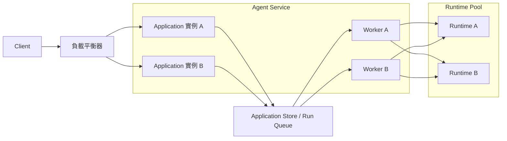
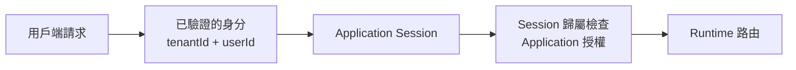
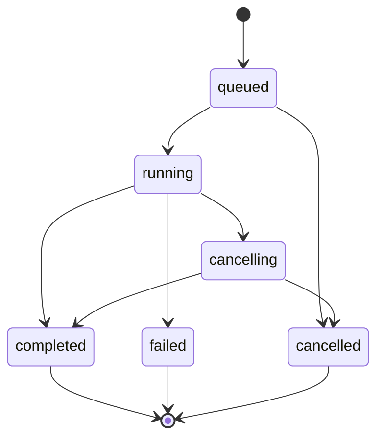
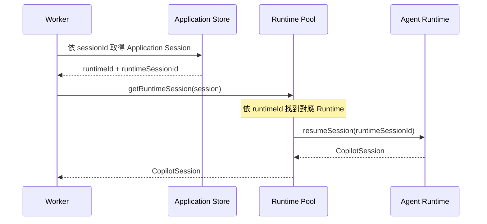

# Day 29 - 多租戶 Agent 服務：Session 隔離與 Runtime 路由

Application Run 已經將一次 Agent 工作從 HTTP Request 的生命週期中拆開，讓建立工作的請求可以先結束，再由 Agent 服務持續追蹤 Runtime 執行。用戶端可以透過 Run ID 查詢狀態、接收 SSE 事件，或在工作仍然執行時提出取消要求。不過，目前的 Application Session、Run、事件紀錄與並行控制仍然只存在單一 Agent 服務實例中，所有 Session 也只連接同一個 External Runtime。

當服務開始同時承載不同租戶，並進一步加入多個 Application 實例、Worker 與 Runtime，原本由單一服務實例維持的 Session 歸屬、Run 狀態與 Runtime 位置就需要成為 Application 明確管理的狀態。Application 必須知道一段 Session 屬於誰、目前是否已經有 Run 正在操作它，以及這段 Runtime Session 實際位於哪個執行環境，才能讓後續請求在不同服務實例之間仍然回到正確的工作範圍。

## 多租戶 Agent 服務需要處理哪些問題？

前面的 Agent 服務範例為了集中說明 Application Session 與 Application Run 的執行模型，暫時將這些狀態保存在目前服務實例的記憶體中，`CopilotSession` 也由 Runtime 整合層維護。在單一 Application 實例與單一 Runtime 的架構下，Session 歸屬、Run 狀態與 Runtime 位置都可以由目前服務實例直接掌握，因此還沒有進一步處理跨實例的狀態共享與 Runtime 路由問題。

水平擴展後，用戶端請求可能經過負載平衡器進入不同 Application 實例，等待中的 Run 也可能交給不同 Worker 執行：



在這種架構下，一段 Agent 工作不再固定屬於目前收到 HTTP Request 的服務實例。Application 實例不能再只依賴自己的記憶體判斷 Session 歸屬、Run 狀態或 Runtime 位置，也不能假設先前取得的 `CopilotSession` 仍然存在於目前實例。

對目前的 Agent 服務而言，主要還需要處理三個問題：

* **租戶與 Session 歸屬**：Application 要知道 Session 屬於哪個租戶與使用者，所有應用程式操作都先完成 Application 授權。
* **Session 執行協調**：多個 Worker 可以同時執行工作，但同一個 Application Session 仍需要避免多筆 Run 同時進入相同 Runtime Session。
* **Runtime 路由**：Application 要保存 Runtime Session 所在的位置，後續 Worker 才能找到承載原本工作脈絡的 Runtime。

這些資訊都需要由 Application 明確保存與管理。Runtime Session 可以維護 Agent 自己的工作脈絡，卻不會替應用程式決定目前請求是否有權存取這段工作，也不會替多個 Application 實例協調 Run Queue 與 Runtime 路由。

## Application Session 的租戶邊界

Application Session 原本已經保存 `ownerId`，讓 Agent 服務在取得 `runtimeSessionId` 前先完成 Session 歸屬檢查。進入多租戶服務後，單一使用者識別還不足以描述完整的資源範圍，同一個使用者識別也可能存在於不同租戶，因此 Application Session 需要進一步加入租戶資訊，讓 Session 歸屬同時包含租戶與使用者兩個層級。

資料模型可以擴充成：

```typescript
export type ApplicationSession = {
  id: string;
  tenantId: string;
  ownerId: string;
  runtimeId: string;
  runtimeSessionId: string;
  createdAt: string;
};
```

其中，`tenantId` 與 `ownerId` 描述應用程式中的 Session 歸屬；`runtimeId` 與 `runtimeSessionId` 則留給後面的 Runtime 路由使用。

收到請求後，Agent 服務應先從已驗證的身分取得目前租戶與使用者資訊：

```typescript
export type TenantContext = {
  tenantId: string;
  userId: string;
};
```

後續存取 Application Session 的順序可以整理成：



Session 查詢、建立 Run、查詢 Run、SSE 與取消操作，都應先完成 Application 授權，再進入後續的 Runtime 路由。Runtime Session 負責隔離 Agent 的執行狀態，應用程式中的租戶與資源存取權仍然由 Application 管理；即使用戶端知道合法的 Application Session ID 或 Runtime Session ID，也不能據此取得對應資源的存取權。

共用 Runtime 時，Session 可以使用的能力也需要明確限制。多使用者或共享情境下，這裡繼續使用 `mode: "empty"`，避免直接沿用 CLI 環境中的預設能力，再由 Application 決定各個 Session 可以使用的 Tools、MCP Servers、Skills 與工作區路徑：

```typescript
const client = new CopilotClient({
  mode: "empty",
  connection: RuntimeConnection.forUri(runtimeUrl),
});
```

租戶歸屬、資源授權與 Session 能力範圍都由 Application 明確管理後，共用 Runtime 才不會成為繞過應用程式邊界的另一條存取路徑。Runtime 繼續負責各個 Session 的 Agent 執行狀態，而不同租戶與 Session 之間的存取邊界仍然由 Agent 服務掌握。

## 多實例架構下的 Session 執行設計

確認 Session 的租戶歸屬與存取權後，多實例架構還需要進一步處理實際執行時的協調問題。用戶端請求可能進入不同 Application 實例，等待中的工作也可能交給不同 Worker，因此同一段 Session 不再固定由單一服務實例持續處理。

在這種情況下，Application Session 需要成為穩定的執行邊界。無論後續工作由哪個實例或 Worker 接手，Agent 服務都必須維持原本的執行脈絡，讓同一段 Session 可以在多實例架構下持續正確推進。

### Session 的執行順序與並行控制

Application Run 要能明確對應 Runtime 正在處理的工作，同一個 Application Session 同時間就只能讓一筆 Run 真正進入 Runtime Session。原本的同步設計在 Session 已經有 `running` 或 `cancelling` Run 時，會直接對新的工作回傳 `409 Conflict`。

進入多實例架構後，這項限制不能再只依賴單一服務實例的記憶體。不同 Application 實例都可能接受相同 Session 的新工作，如果各自檢查自己的狀態，就可能同時判斷目前 Session 沒有執行中的 Run，最後讓兩筆工作一起進入相同 Runtime Session。

同一個 Runtime Session 同時處理多筆 Run，可能讓 Session Context 與後續事件彼此交錯，Application 也難以判斷完成狀態與取消要求究竟屬於哪一筆工作。因此，Agent 服務讓同一個 Application Session 的 Run 依序執行，不同 Application Session 則可以並行。

新的 Run 也不需要因前一筆工作仍在執行就直接拒絕。Application 可以先接受工作，將它保存成 `queued`：



例如 Application Session A 已經有 Run 1 正在執行時，後續建立的 Run 2 會維持 `queued`；此時 Application Session B 的 Run 3 仍然可以由另一個 Worker 同時執行。

這裡的 `queued` 屬於 Application Run Queue，和 Runtime 內部的訊息排隊機制不同。Runtime 端可以透過 `mode: "enqueue"` 將新的訊息排入目前 Session；Agent 服務則在訊息送進 Runtime 之前先建立 Application Run Queue，讓 Run 狀態、Worker 執行與 Application Run 事件仍然由 Application 控制。

多個 Worker 共同取得工作時，至少需要保證三件事：

* **單一 Run 唯一執行**：同一筆 Run 不能同時被兩個 Worker 取得。
* **同一 Session 序列執行**：同一個 Application Session 同時間最多只有一筆執行中的 Run。
* **不同 Session 可以並行**：沒有共享 Session 邊界的 Run 可以同時交給不同 Worker。

這一層控制和模型如何回答沒有關係。它處理的是 Application 什麼時候允許一筆 Run 真正進入 Runtime Session，因此應該由具備原子操作能力的應用程式狀態負責。

| NOTE: |
| :--- |
| Copilot SDK 目前沒有提供內建的 Session locking。同一個 Session 如果可能由多個 Worker 或 Application 實例同時操作，執行序列化仍然需要由 Application 自行處理。 |

### Runtime Session 的定位與路由

同一個 Application Session 的工作進入可執行狀態後，Worker 還需要找到承載原本工作脈絡的 Runtime Session。當服務只有一個 External Runtime 時，Application Session 只需要保存 `runtimeSessionId`，後續就能在固定的 Runtime 中取得原本的工作階段。加入多個 Runtime 後，`runtimeSessionId` 本身已不足以決定執行位置，Application 還需要保存這段 Runtime Session 所屬的 `runtimeId`。

Worker 執行 Run 時，會先取得這筆 Run 所屬的 Application Session，再由 Runtime Pool 根據 `runtimeId` 找到對應的 Runtime，最後利用 `runtimeSessionId` 取得或恢復原本的 Runtime Session：



`runtimeId` 負責定位 Runtime，`runtimeSessionId` 則識別其中需要取得的 Runtime Session。兩項資訊一起形成 Application 保存的 Runtime 路由。

建立新的 Application Session 時，Agent 服務需要先選擇 Runtime，再保存對應的路由資訊。範例使用簡單的循環分配（Round-robin），讓不同 Session 分散到兩個 Runtime；正式服務則可以依容量、區域、租戶配置或其他部署條件選擇不同的路由策略。Application Session 建立後，後續 Run 會沿用已保存的 Runtime 路由。

Runtime 路由還需要和 Session 狀態的實際儲存位置保持一致。如果不同 Runtime 使用彼此獨立的 Session Storage，只修改 Application Session 中的 `runtimeId`，並不會讓原本的 Session 狀態一起移動。後續 Runtime 必須能取得相同的 Session 狀態，才能恢復原本的工作脈絡。

| NOTE: |
| :--- |
| 如果不同 Runtime 各自使用獨立的 Session Storage，Application 必須維持 Session 與 Runtime 的固定對應，讓後續 Run 回到能取得原本 Session 狀態的 Runtime。只有在多個 Runtime 能存取相同 Session 狀態，例如透過 `sessionFs` 將 Session 狀態導向共享儲存時，路由策略才有更大的彈性；無論採用哪種方式，同一 Session 的並行存取仍然需要由 Application 協調。 |

## 實作：將 Agent 服務擴展成多租戶架構

接下來延續既有的 `copilot-sdk-agent-service`。Application Run、Run 事件、SSE 與取消流程都繼續保留，這次加入租戶身分、`queued` Run、Worker 與 Runtime Pool。

專案結構調整為：

```text
copilot-sdk-agent-service/
├── src/
│   ├── types.ts
│   ├── identity.ts
│   ├── store.ts
│   ├── run-store.ts
│   ├── runtime-pool.ts
│   ├── run-manager.ts
│   ├── worker.ts
│   └── server.ts
└── package.json
```

各檔案負責：

* **`types.ts`**：加入租戶資訊、Runtime 路由與 `queued` Run。
* **`identity.ts`**：建立範例使用的示範身分資訊。
* **`store.ts`**：保存 Application Session 與 Session 歸屬。
* **`run-store.ts`**：保存 Run、事件紀錄與 Session 層級的工作取得狀態。
* **`runtime-pool.ts`**：管理多個 External Runtime 與 Session 路由。
* **`run-manager.ts`**：沿用 Runtime 事件映射，根據 Application Session 找到正確 Runtime。
* **`worker.ts`**：取得下一筆符合 Session 執行條件的 Run。
* **`server.ts`**：提供 Session、Run、SSE 與取消 API。

既有的 Express、Copilot SDK 與 BYOK 相依套件都不需要調整。

### 調整 Session 與 Run 資料模型

先更新 `src/types.ts`：

```typescript
export type TenantContext = {
  tenantId: string;
  userId: string;
};

export type ApplicationSession = {
  id: string;
  tenantId: string;
  ownerId: string;
  runtimeId: string;
  runtimeSessionId: string;
  createdAt: string;
};

export type RunStatus =
  | "queued"
  | "running"
  | "cancelling"
  | "completed"
  | "failed"
  | "cancelled";

export type ApplicationRun = {
  id: string;
  sessionId: string;
  status: RunStatus;
  prompt: string;
  runtimeMessageId?: string;
  workerId?: string;
  output?: string;
  error?: string;
  createdAt: string;
  startedAt?: string;
  completedAt?: string;
};

export type RunEventData =
  | { type: "run.queued" }
  | { type: "run.started" }
  | { type: "run.output.delta"; delta: string }
  | { type: "run.cancelling" }
  | { type: "run.cancel_failed"; error: string }
  | { type: "run.completed"; output?: string }
  | { type: "run.failed"; error: string }
  | { type: "run.cancelled" };

export type RunEvent = RunEventData & {
  sequence: number;
  runId: string;
  timestamp: string;
};
```

Application Session 新增 `tenantId` 與 `runtimeId`。前者描述應用程式中的租戶邊界，後者描述目前 Runtime Session 的執行位置。

Application Run 則加入 `queued`，並透過 `workerId` 與 `startedAt` 保存實際取得工作的 Worker 與開始時間。`workerId` 只屬於 Agent 服務內部的執行資訊，不需要直接暴露成應用程式對外 API 契約。

Run 事件另外增加 `run.queued`。建立 Run 後，用戶端即使在 Worker 真正開始執行前連上 SSE，也能知道目前工作已經被服務接受、正在等待執行。

### 建立租戶身分與 Session 歸屬

這個範例需要實際驗證兩個租戶之間的存取隔離，因此不能再沿用單一固定的 `demo-user`。

建立 `src/identity.ts`：

```typescript
import type { Request } from "express";
import type { TenantContext } from "./types.js";

const demoIdentities = new Set([
  "tenant-a:user-a",
  "tenant-b:user-b",
]);

export function resolveDemoIdentity(req: Request): TenantContext | undefined {
  const tenantId = req.header("x-demo-tenant-id");
  const userId = req.header("x-demo-user-id");

  if (!tenantId || !userId) {
    return undefined;
  }

  const identity = { tenantId, userId };
  const key = `${tenantId}:${userId}`;

  return demoIdentities.has(key) ? identity : undefined;
}
```

`X-Demo-Tenant-Id` 與 `X-Demo-User-Id` 只用來選擇範例中的示範身分。正式服務應該從已驗證的 Token、登入 Session 或其他身分驗證機制取得目前租戶與使用者，不能直接信任用戶端自行宣告的 HTTP Header。

接著更新 `src/store.ts`：

```typescript
import { randomUUID } from "node:crypto";
import type { ApplicationSession, TenantContext } from "./types.js";

const sessions = new Map<string, ApplicationSession>();

function createId(prefix: string): string {
  return `${prefix}_${randomUUID()}`;
}

export function createApplicationSession(
  identity: TenantContext,
  runtimeId: string,
): ApplicationSession {
  const session: ApplicationSession = {
    id: createId("session"),
    tenantId: identity.tenantId,
    ownerId: identity.userId,
    runtimeId,
    runtimeSessionId: createId("runtime"),
    createdAt: new Date().toISOString(),
  };

  sessions.set(session.id, session);
  return session;
}

export function getApplicationSession(
  sessionId: string,
): ApplicationSession | undefined {
  return sessions.get(sessionId);
}

export function getOwnedSession(
  sessionId: string,
  identity: TenantContext,
): ApplicationSession | undefined {
  const session = sessions.get(sessionId);

  if (
    !session ||
    session.tenantId !== identity.tenantId ||
    session.ownerId !== identity.userId
  ) {
    return undefined;
  }

  return session;
}

export function deleteApplicationSession(sessionId: string): void {
  sessions.delete(sessionId);
}
```

`getOwnedSession()` 現在同時檢查租戶與 Owner。後面的 Session、Run、SSE 與取消 API 都會先通過這項 Application 授權，再讀取 Runtime 路由。

Session 不存在與歸屬不符合都回傳 `undefined`，API 可以統一使用 `404 Not Found`，不額外向另一個租戶暴露某個資源是否存在。

| NOTE: |
| :--- |
| 範例中的 `sessions` 仍然是目前服務實例記憶體中的 `Map`，只能用來驗證租戶、Owner 與授權流程。真正部署成多 Application 實例時，Application Session 必須放進所有實例都能共同存取的儲存系統。 |

### 讓 Application Run 進入等待佇列

原本的 `createRun()` 會檢查 `activeRunBySession`，如果目前 Session 已經有工作執行，就直接拒絕新的 Run。

這裡改成所有通過授權與輸入檢查的工作都先建立成 `queued`，再由 Worker 判斷目前是否符合執行條件。

更新 `src/run-store.ts`：

```typescript
import { randomUUID } from "node:crypto";
import type {
  ApplicationRun,
  RunEvent,
  RunEventData,
  RunStatus,
} from "./types.js";

type RunEventListener = (event: RunEvent) => void;

const runs = new Map<string, ApplicationRun>();
const activeRunBySession = new Map<string, string>();
const eventsByRun = new Map<string, RunEvent[]>();
const listenersByRun = new Map<string, Set<RunEventListener>>();
const terminalStatuses = new Set<RunStatus>([
  "completed",
  "failed",
  "cancelled",
]);

function createId(prefix: string): string {
  return `${prefix}_${randomUUID()}`;
}

function updateRun(
  runId: string,
  patch: Partial<ApplicationRun>,
): ApplicationRun | undefined {
  const current = runs.get(runId);

  if (!current) {
    return undefined;
  }

  const updated = { ...current, ...patch };
  runs.set(runId, updated);
  return updated;
}

function releaseActiveRun(run: ApplicationRun): void {
  if (activeRunBySession.get(run.sessionId) === run.id) {
    activeRunBySession.delete(run.sessionId);
  }
}

export function isTerminalRunStatus(status: RunStatus): boolean {
  return terminalStatuses.has(status);
}

export function createRun(sessionId: string, prompt: string): ApplicationRun {
  const run: ApplicationRun = {
    id: createId("run"),
    sessionId,
    status: "queued",
    prompt,
    createdAt: new Date().toISOString(),
  };

  runs.set(run.id, run);
  eventsByRun.set(run.id, []);
  return run;
}

export function getRun(runId: string): ApplicationRun | undefined {
  return runs.get(runId);
}

export function claimNextRun(workerId: string): ApplicationRun | undefined {
  for (const run of runs.values()) {
    if (run.status !== "queued") {
      continue;
    }

    if (activeRunBySession.has(run.sessionId)) {
      continue;
    }

    const claimed = updateRun(run.id, {
      status: "running",
      workerId,
      startedAt: new Date().toISOString(),
    });

    if (!claimed) {
      continue;
    }

    activeRunBySession.set(run.sessionId, run.id);
    return claimed;
  }

  return undefined;
}

export function setRuntimeMessageId(
  runId: string,
  runtimeMessageId: string,
): void {
  updateRun(runId, { runtimeMessageId });
}

export function setRunOutput(runId: string, output: string): void {
  updateRun(runId, { output });
}

export function markRunCancelling(
  runId: string,
): ApplicationRun | undefined {
  const run = runs.get(runId);

  if (!run || run.status !== "running") {
    return undefined;
  }

  return updateRun(runId, { status: "cancelling" });
}

export function restoreRunRunning(
  runId: string,
): ApplicationRun | undefined {
  const run = runs.get(runId);

  if (!run || run.status !== "cancelling") {
    return run;
  }

  return updateRun(runId, { status: "running" });
}

export function completeRun(runId: string): ApplicationRun | undefined {
  const run = runs.get(runId);

  if (!run || terminalStatuses.has(run.status)) {
    return run;
  }

  const completed = updateRun(runId, {
    status: "completed",
    completedAt: new Date().toISOString(),
  });

  if (completed) {
    releaseActiveRun(completed);
  }

  return completed;
}

export function failRun(
  runId: string,
  error: string,
): ApplicationRun | undefined {
  const run = runs.get(runId);

  if (!run || terminalStatuses.has(run.status)) {
    return run;
  }

  const failed = updateRun(runId, {
    status: "failed",
    error,
    completedAt: new Date().toISOString(),
  });

  if (failed) {
    releaseActiveRun(failed);
  }

  return failed;
}

export function cancelRun(runId: string): ApplicationRun | undefined {
  const run = runs.get(runId);

  if (!run || terminalStatuses.has(run.status)) {
    return run;
  }

  const cancelled = updateRun(runId, {
    status: "cancelled",
    completedAt: new Date().toISOString(),
  });

  if (cancelled) {
    releaseActiveRun(cancelled);
  }

  return cancelled;
}

export function publishRunEvent(
  runId: string,
  data: RunEventData,
): RunEvent {
  const history = eventsByRun.get(runId) ?? [];
  const event: RunEvent = {
    ...data,
    sequence: history.length + 1,
    runId,
    timestamp: new Date().toISOString(),
  };

  history.push(event);
  eventsByRun.set(runId, history);

  for (const listener of listenersByRun.get(runId) ?? []) {
    try {
      listener(event);
    } catch {
      // 單一 SSE Client 的問題不影響 Run 狀態更新。
    }
  }

  return event;
}

export function getRunEvents(
  runId: string,
  afterSequence = 0,
): RunEvent[] {
  return (eventsByRun.get(runId) ?? []).filter(
    (event) => event.sequence > afterSequence,
  );
}

export function subscribeRunEvents(
  runId: string,
  listener: RunEventListener,
): () => void {
  const listeners =
    listenersByRun.get(runId) ?? new Set<RunEventListener>();

  listeners.add(listener);
  listenersByRun.set(runId, listeners);

  return () => {
    listeners.delete(listener);

    if (listeners.size === 0) {
      listenersByRun.delete(runId);
    }
  };
}
```

`claimNextRun()` 在範例中同時處理 Run 的工作取得與 Session 層級的執行協調。它只會取得 `queued` Run，而且當 `activeRunBySession` 已經存在相同 `sessionId` 時，會跳過該 Session 的其他工作。

Run 進入 `completed`、`failed` 或 `cancelled` 後，才會透過 `releaseActiveRun()` 釋放目前 Session，讓下一筆等待中的 Run 有機會被取得。

這份實作利用 JavaScript 單執行緒中一段同步函式不會交錯執行的特性，足以在目前單一 Node.js 服務實例中驗證工作取得與 Session 序列化的語意。它沒有提供跨實例原子性，因此不能直接當成正式的分散式佇列。

### 建立 Runtime Pool 與 Session 路由

接著將原本只管理單一 External Runtime 的 `runtime.ts` 改成 `runtime-pool.ts`。

建立 `src/runtime-pool.ts`：

```typescript
import {
  CopilotClient,
  RuntimeConnection,
  type CopilotSession,
  type ProviderConfig,
} from "@github/copilot-sdk";
import type { ApplicationSession } from "./types.js";

type RuntimeInstance = {
  id: string;
  url: string;
  client: CopilotClient;
  sessions: Map<string, CopilotSession>;
};

const model = process.env.MODEL_ID;
const baseUrl = process.env.MODEL_BASE_URL;
const apiKey = process.env.MODEL_API_KEY;

if (!model || !baseUrl || !apiKey) {
  throw new Error("MODEL_ID、MODEL_BASE_URL 與 MODEL_API_KEY 都必須提供。");
}

const provider: ProviderConfig = {
  type: "openai",
  baseUrl,
  apiKey,
};

const runtimeDefinitions = [
  {
    id: "runtime-1",
    url: process.env.COPILOT_RUNTIME_1_URL ?? "localhost:4321",
  },
  {
    id: "runtime-2",
    url: process.env.COPILOT_RUNTIME_2_URL ?? "localhost:4322",
  },
];

const runtimes = new Map<string, RuntimeInstance>(
  runtimeDefinitions.map(({ id, url }): [string, RuntimeInstance] => {
    const client = new CopilotClient({
      mode: "empty",
      connection: RuntimeConnection.forUri(url),
    });

    return [
      id,
      {
        id,
        url,
        client,
        sessions: new Map<string, CopilotSession>(),
      },
    ];
  }),
);

let nextRuntimeIndex = 0;

function getRuntime(runtimeId: string): RuntimeInstance {
  const runtime = runtimes.get(runtimeId);

  if (!runtime) {
    throw new Error(`找不到 Runtime: ${runtimeId}`);
  }

  return runtime;
}

export async function startRuntimePool(): Promise<void> {
  await Promise.all(
    [...runtimes.values()].map((runtime) => runtime.client.start()),
  );
}

export function selectRuntimeId(): string {
  const definitions = [...runtimes.values()];

  if (definitions.length === 0) {
    throw new Error("目前沒有可用的 Runtime");
  }

  const runtime = definitions[nextRuntimeIndex % definitions.length];
  nextRuntimeIndex += 1;
  return runtime.id;
}

export async function createRuntimeSession(
  session: ApplicationSession,
): Promise<void> {
  const runtime = getRuntime(session.runtimeId);
  const runtimeSession = await runtime.client.createSession({
    sessionId: session.runtimeSessionId,
    model,
    provider,
    streaming: true,
    availableTools: [],
  });

  runtime.sessions.set(session.runtimeSessionId, runtimeSession);
  console.log(`[runtime] session=${session.id} runtime=${runtime.id}`);
}

export async function getRuntimeSession(
  session: ApplicationSession,
): Promise<CopilotSession> {
  const runtime = getRuntime(session.runtimeId);
  const current = runtime.sessions.get(session.runtimeSessionId);

  if (current) {
    return current;
  }

  const resumed = await runtime.client.resumeSession(
    session.runtimeSessionId,
    {
      model,
      provider,
      streaming: true,
      availableTools: [],
    },
  );

  runtime.sessions.set(session.runtimeSessionId, resumed);
  return resumed;
}

export async function abortRuntimeSession(
  session: ApplicationSession,
): Promise<void> {
  const runtimeSession = await getRuntimeSession(session);
  await runtimeSession.abort();
}
```

每個 Runtime 都擁有自己的 `CopilotClient` 與目前服務實例中的 `CopilotSession` 快取。`RuntimeConnection.forUri()` 只連接已經執行中的 Runtime，不會替 Application 再啟動 Runtime 行程，適合後端服務將 Runtime 生命週期獨立管理的架構。

`selectRuntimeId()` 使用循環分配選擇新 Session 的 Runtime。這段程式只負責第一次選擇；Application Session 一旦建立，後續就不會再次呼叫這個函式決定執行位置。

真正操作既有 Runtime Session 時，`getRuntimeSession()` 會先使用 `session.runtimeId` 找到對應 Runtime，再利用 `session.runtimeSessionId` 取得或恢復原本 Session。

`runtime.sessions` 只保存目前 Agent 服務實例已經取得的 `CopilotSession` 物件。如果目前實例沒有這個物件，仍然可以根據保存的路由資訊回到正確 Runtime，再透過 `resumeSession()` 取得工作階段。這也讓 Application 管理的狀態與服務實例中的 SDK 物件維持不同的生命週期。

### 讓 Worker 執行符合條件的 Run

Run 建立後可以先停留在 `queued`，Runtime 路由也已經保存於 Application Session。接著由 Worker 取得符合條件的 Run，再把工作送到對應的 Runtime Session。

先更新 `src/run-manager.ts`：

```typescript
import {
  cancelRun,
  completeRun,
  failRun,
  getRun,
  isTerminalRunStatus,
  publishRunEvent,
  setRunOutput,
  setRuntimeMessageId,
} from "./run-store.js";
import { getRuntimeSession } from "./runtime-pool.js";
import type { ApplicationRun, ApplicationSession } from "./types.js";

function getErrorMessage(error: unknown): string {
  return error instanceof Error ? error.message : "未知的 Runtime 錯誤";
}

export async function startRun(
  run: ApplicationRun,
  session: ApplicationSession,
): Promise<void> {
  let unsubscribe = () => {};

  try {
    const runtimeSession = await getRuntimeSession(session);

    unsubscribe = runtimeSession.on((event) => {
      switch (event.type) {
        case "assistant.message_delta":
          if (!event.agentId && event.data.deltaContent) {
            publishRunEvent(run.id, {
              type: "run.output.delta",
              delta: event.data.deltaContent,
            });
          }
          break;

        case "assistant.message":
          if (!event.agentId && event.data.content) {
            setRunOutput(run.id, event.data.content);
          }
          break;

        case "session.error": {
          const current = getRun(run.id);

          if (!current || isTerminalRunStatus(current.status)) {
            unsubscribe();
            break;
          }

          failRun(run.id, event.data.message);
          publishRunEvent(run.id, {
            type: "run.failed",
            error: event.data.message,
          });

          unsubscribe();
          break;
        }

        case "session.idle": {
          const current = getRun(run.id);

          if (!current || isTerminalRunStatus(current.status)) {
            unsubscribe();
            break;
          }

          if (event.data.aborted) {
            const cancelled = cancelRun(run.id);

            if (cancelled) {
              publishRunEvent(run.id, { type: "run.cancelled" });
            }
          } else {
            const completed = completeRun(run.id);

            if (completed) {
              publishRunEvent(run.id, {
                type: "run.completed",
                output: completed.output,
              });
            }
          }

          unsubscribe();
          break;
        }
      }
    });

    publishRunEvent(run.id, { type: "run.started" });

    const runtimeMessageId = await runtimeSession.send({
      prompt: run.prompt,
    });

    setRuntimeMessageId(run.id, runtimeMessageId);
  } catch (error) {
    unsubscribe();

    const current = getRun(run.id);

    if (current && !isTerminalRunStatus(current.status)) {
      const message = getErrorMessage(error);

      failRun(run.id, message);
      publishRunEvent(run.id, {
        type: "run.failed",
        error: message,
      });
    }

    throw error;
  }
}
```

Runtime 事件與 Application Run 事件的對應方式沿用既有設計，主要差異是 `startRun()` 現在接收整個 Application Session，再由 Runtime Pool 根據其中的 `runtimeId` 找到執行位置。

這裡另外在 `session.error` 與 `send()` 的失敗處理中先確認 Run 是否已經進入終止狀態，避免同一個失敗同時經由 Runtime 事件與 `send()` 例外被重複記錄成 `run.failed`。

接著建立 `src/worker.ts`：

```typescript
import {
  claimNextRun,
  failRun,
  publishRunEvent,
} from "./run-store.js";
import { getApplicationSession } from "./store.js";
import { startRun } from "./run-manager.js";

const WORKER_POLL_INTERVAL_MS = 200;

function getErrorMessage(error: unknown): string {
  return error instanceof Error ? error.message : "未知的 Worker 錯誤";
}

function startWorker(workerId: string): NodeJS.Timeout {
  let dispatching = false;

  const poll = async () => {
    if (dispatching) {
      return;
    }

    const run = claimNextRun(workerId);

    if (!run) {
      return;
    }

    dispatching = true;

    try {
      const session = getApplicationSession(run.sessionId);

      if (!session) {
        const message = "找不到對應的 Application Session";

        failRun(run.id, message);
        publishRunEvent(run.id, {
          type: "run.failed",
          error: message,
        });
        return;
      }

      console.log(
        `[${workerId}] run=${run.id} session=${session.id} runtime=${session.runtimeId}`,
      );

      await startRun(run, session);
    } catch (error) {
      console.error(`[${workerId}] ${getErrorMessage(error)}`);
    } finally {
      dispatching = false;
    }
  };

  return setInterval(() => void poll(), WORKER_POLL_INTERVAL_MS);
}

export function startWorkers(count = 2): NodeJS.Timeout[] {
  return Array.from(
    { length: count },
    (_, index) => startWorker(`worker-${index + 1}`),
  );
}
```

Worker 每次先透過 `claimNextRun()` 取得符合條件的工作，再取得它所屬的 Application Session。真正連接 Runtime 時不需要知道這筆 Run 原本由哪一個 HTTP Request 建立，只要 Application Store 仍然保存 Session 路由，就能找到正確的執行環境。

範例啟動兩個 Worker，只是為了讓不同 Session 可以同時被取得。`WORKER_POLL_INTERVAL_MS` 也是示範值，正式 Queue Service 通常會提供自己的阻塞式接收、Consumer 或事件驅動的工作派送，不需要沿用這種服務實例內的輪詢方式。

`activeRunBySession` 則負責維持 Session 層級的執行邊界。即使兩個 Worker 同時取得工作，同一個 Session 只有第一筆 Run 能成功取得；後面的 Run 會保持 `queued`，直到前一筆工作進入終止狀態。

### 調整 Session 與 Run API

最後更新 `src/server.ts`。既有 SSE 與取消流程大致維持不變，主要加入租戶身分、`queued` Run 與 Runtime 路由。

```typescript
import express, { type Request, type Response } from "express";
import { resolveDemoIdentity } from "./identity.js";
import {
  cancelRun,
  createRun,
  getRun,
  getRunEvents,
  isTerminalRunStatus,
  markRunCancelling,
  publishRunEvent,
  restoreRunRunning,
  subscribeRunEvents,
} from "./run-store.js";
import {
  abortRuntimeSession,
  createRuntimeSession,
  selectRuntimeId,
  startRuntimePool,
} from "./runtime-pool.js";
import {
  createApplicationSession,
  deleteApplicationSession,
  getOwnedSession,
} from "./store.js";
import { startWorkers } from "./worker.js";
import type {
  ApplicationRun,
  ApplicationSession,
  RunEvent,
  TenantContext,
} from "./types.js";

const app = express();
app.use(express.json());

function getIdentity(
  req: Request,
  res: Response,
): TenantContext | undefined {
  const identity = resolveDemoIdentity(req);

  if (!identity) {
    res.status(401).json({
      error: "需要提供示範身分資訊",
    });
    return undefined;
  }

  return identity;
}

function getOwnedRun(
  runId: string,
  identity: TenantContext,
): ApplicationRun | undefined {
  const run = getRun(runId);

  if (!run) {
    return undefined;
  }

  const session = getOwnedSession(run.sessionId, identity);
  return session ? run : undefined;
}

function toSessionResponse(session: ApplicationSession) {
  return {
    id: session.id,
    createdAt: session.createdAt,
  };
}

function toRunResponse(run: ApplicationRun) {
  return {
    id: run.id,
    sessionId: run.sessionId,
    status: run.status,
    output: run.output,
    error: run.error,
    createdAt: run.createdAt,
    startedAt: run.startedAt,
    completedAt: run.completedAt,
  };
}

function writeRunEvent(res: Response, event: RunEvent): void {
  res.write(`id: ${event.sequence}\n`);
  res.write(`event: ${event.type}\n`);
  res.write(`data: ${JSON.stringify(event)}\n\n`);
}

function isTerminalRunEvent(event: RunEvent): boolean {
  return (
    event.type === "run.completed" ||
    event.type === "run.failed" ||
    event.type === "run.cancelled"
  );
}

app.post("/api/sessions", async (req, res) => {
  const identity = getIdentity(req, res);

  if (!identity) {
    return;
  }

  const runtimeId = selectRuntimeId();
  const session = createApplicationSession(identity, runtimeId);

  try {
    await createRuntimeSession(session);
    res.status(201).json(toSessionResponse(session));
  } catch (error) {
    deleteApplicationSession(session.id);
    console.error(error);

    res.status(502).json({
      error: "無法建立 Runtime Session",
    });
  }
});

app.get("/api/sessions/:sessionId", (req, res) => {
  const identity = getIdentity(req, res);

  if (!identity) {
    return;
  }

  const session = getOwnedSession(req.params.sessionId, identity);

  if (!session) {
    res.status(404).json({
      error: "找不到 Session",
    });
    return;
  }

  res.json(toSessionResponse(session));
});

app.post("/api/sessions/:sessionId/runs", (req, res) => {
  const identity = getIdentity(req, res);

  if (!identity) {
    return;
  }

  const prompt =
    typeof req.body.prompt === "string"
      ? req.body.prompt.trim()
      : "";

  if (!prompt) {
    res.status(400).json({
      error: "prompt is required",
    });
    return;
  }

  const session = getOwnedSession(req.params.sessionId, identity);

  if (!session) {
    res.status(404).json({
      error: "找不到 Session",
    });
    return;
  }

  const run = createRun(session.id, prompt);

  publishRunEvent(run.id, { type: "run.queued" });
  res.status(202).json(toRunResponse(run));
});

app.get("/api/runs/:runId", (req, res) => {
  const identity = getIdentity(req, res);

  if (!identity) {
    return;
  }

  const run = getOwnedRun(req.params.runId, identity);

  if (!run) {
    res.status(404).json({
      error: "找不到 Run",
    });
    return;
  }

  res.json(toRunResponse(run));
});

app.get("/api/runs/:runId/events", (req, res) => {
  const identity = getIdentity(req, res);

  if (!identity) {
    return;
  }

  const run = getOwnedRun(req.params.runId, identity);

  if (!run) {
    res.status(404).json({
      error: "找不到 Run",
    });
    return;
  }

  res.set({
    "Content-Type": "text/event-stream",
    "Cache-Control": "no-cache",
    Connection: "keep-alive",
  });
  res.flushHeaders();

  const lastEventId = Number(req.header("Last-Event-ID")) || 0;
  let unsubscribe = () => {};
  let replaying = true;
  const pendingEvents: RunEvent[] = [];

  const sendEvent = (event: RunEvent) => {
    writeRunEvent(res, event);

    if (isTerminalRunEvent(event)) {
      unsubscribe();
      res.end();
    }
  };

  const onEvent = (event: RunEvent) => {
    if (replaying) {
      pendingEvents.push(event);
      return;
    }

    sendEvent(event);
  };

  unsubscribe = subscribeRunEvents(run.id, onEvent);

  const history = getRunEvents(run.id, lastEventId);
  let lastSequence = lastEventId;

  for (const event of history) {
    sendEvent(event);
    lastSequence = event.sequence;

    if (isTerminalRunEvent(event)) {
      return;
    }
  }

  replaying = false;

  for (const event of pendingEvents) {
    if (event.sequence <= lastSequence) {
      continue;
    }

    sendEvent(event);
    lastSequence = event.sequence;

    if (isTerminalRunEvent(event)) {
      return;
    }
  }

  const current = getRun(run.id);

  if (current && isTerminalRunStatus(current.status)) {
    unsubscribe();
    res.end();
    return;
  }

  req.on("close", unsubscribe);
});

app.post("/api/runs/:runId/cancel", async (req, res) => {
  const identity = getIdentity(req, res);

  if (!identity) {
    return;
  }

  const run = getOwnedRun(req.params.runId, identity);

  if (!run) {
    res.status(404).json({
      error: "找不到 Run",
    });
    return;
  }

  const session = getOwnedSession(run.sessionId, identity);

  if (!session) {
    res.status(404).json({
      error: "找不到 Run",
    });
    return;
  }

  if (isTerminalRunStatus(run.status)) {
    res.status(409).json({
      error: "Run 已經結束",
      run: toRunResponse(run),
    });
    return;
  }

  if (run.status === "queued") {
    const cancelled = cancelRun(run.id);

    if (cancelled) {
      publishRunEvent(run.id, { type: "run.cancelled" });
    }

    res.status(202).json(toRunResponse(cancelled ?? run));
    return;
  }

  if (run.status === "cancelling") {
    res.status(202).json(toRunResponse(run));
    return;
  }

  const cancelling = markRunCancelling(run.id);

  if (!cancelling) {
    res.status(409).json({
      error: "目前無法取消 Run",
    });
    return;
  }

  publishRunEvent(run.id, { type: "run.cancelling" });

  try {
    await abortRuntimeSession(session);
    res
      .status(202)
      .json(toRunResponse(getRun(run.id) ?? cancelling));
  } catch (error) {
    console.error(error);

    const current = getRun(run.id);

    if (current && !isTerminalRunStatus(current.status)) {
      restoreRunRunning(run.id);
      publishRunEvent(run.id, {
        type: "run.cancel_failed",
        error: "無法中止 Runtime 執行",
      });
    }

    res.status(502).json({
      error: "無法取消 Agent Run",
    });
  }
});

await startRuntimePool();
startWorkers(2);

app.listen(3000, () => {
  console.log("Agent service listening on http://localhost:3000");
});
```

建立 Application Session 時，API 只在第一次需要 Runtime 時呼叫：

```typescript
const runtimeId = selectRuntimeId();
```

Runtime 選定後就寫入 Application Session，API 回應仍然只包含用戶端需要的 `id` 與 `createdAt`，不會把 `tenantId`、`ownerId`、`runtimeId` 或 `runtimeSessionId` 暴露給用戶端。

Run API 也不再直接呼叫 `startRun()`。工作建立後先維持 `queued`，再由 Worker 取得。這讓接受 HTTP Request 的 Application 實例與最後執行 Run 的 Worker 可以分開。

取消流程則多了一條 `queued` 路徑。尚未進入 Runtime 的 Run 可以直接改成 `cancelled`，不需要呼叫 `session.abort()`；只有已經進入 `running` 的工作才需要沿用既有的 Runtime abort 流程。

### 執行應用程式

先啟動兩個 External Runtime：

```bash
$ copilot --headless --port 4321
```

另一個 Terminal：

```bash
$ copilot --headless --port 4322
```

接著準備 Runtime 與 BYOK 模型提供者設定：

```bash
$ export COPILOT_RUNTIME_1_URL="localhost:4321"
$ export COPILOT_RUNTIME_2_URL="localhost:4322"
$ export MODEL_BASE_URL="https://<model-provider>/v1"
$ export MODEL_API_KEY="<api-key>"
$ export MODEL_ID="<model-id>"
```

啟動 Agent 服務：

```bash
$ npx tsx src/server.ts
```

先使用 Tenant A / User A 建立 Application Session：

```bash
$ curl -s -X POST \
  -H "X-Demo-Tenant-Id: tenant-a" \
  -H "X-Demo-User-Id: user-a" \
  http://localhost:3000/api/sessions
```

回應只包含 Application Session 對外需要的資訊，例如 `{"id":"session_<uuid>","createdAt":"2026-08-25T00:00:00.000Z"}`。終端機則會另外看到類似 `[runtime] session=session_<uuid> runtime=runtime-1` 的服務內部路由紀錄。

再建立第二個 Session，循環分配會讓不同 Session 依序使用 `runtime-1` 與 `runtime-2`。這裡只確認兩段 Application Session 可以具有不同的 Runtime 路由；循環分配本身不是驗證重點。

接著將第一個 Session ID 保存：

```bash
$ export SESSION_ID="session_<uuid>"
```

先驗證租戶隔離。改用 Tenant B / User B 查詢 Tenant A 建立的 Session：

```bash
$ curl -i \
  -H "X-Demo-Tenant-Id: tenant-b" \
  -H "X-Demo-User-Id: user-b" \
  "http://localhost:3000/api/sessions/$SESSION_ID"
```

服務會回傳 `404 Not Found`。Agent 服務在取得 Runtime 路由前就已經停止處理，不會因為用戶端知道 Application Session ID 就接觸對應的 Runtime Session。

接著換回 Tenant A，快速建立兩筆相同 Session 的 Run：

```bash
$ curl -s -X POST \
  -H "Content-Type: application/json" \
  -H "X-Demo-Tenant-Id: tenant-a" \
  -H "X-Demo-User-Id: user-a" \
  -d '{
    "prompt": "請完整整理多租戶 Agent 服務需要處理的 Session 隔離、執行協調與 Runtime 路由。"
  }' \
  "http://localhost:3000/api/sessions/$SESSION_ID/runs"
```

再立即建立第二筆：

```bash
$ curl -s -X POST \
  -H "Content-Type: application/json" \
  -H "X-Demo-Tenant-Id: tenant-a" \
  -H "X-Demo-User-Id: user-a" \
  -d '{
    "prompt": "延續前面的工作，再整理這套架構中 Application 應該保存哪些狀態。"
  }' \
  "http://localhost:3000/api/sessions/$SESSION_ID/runs"
```

兩筆請求都會取得 Application Run，而不再出現原本的 `409 Conflict`。分別保存兩筆回應中的 Run ID：

```bash
$ export RUN_1_ID="run_<uuid>"
$ export RUN_2_ID="run_<uuid>"
```

接著查詢第一筆 Run：

```bash
$ curl -s \
  -H "X-Demo-Tenant-Id: tenant-a" \
  -H "X-Demo-User-Id: user-a" \
  "http://localhost:3000/api/runs/$RUN_1_ID"
```

再查詢第二筆 Run：

```bash
$ curl -s \
  -H "X-Demo-Tenant-Id: tenant-a" \
  -H "X-Demo-User-Id: user-a" \
  "http://localhost:3000/api/runs/$RUN_2_ID"
```

如果第一筆仍在執行，第二筆會保持 `queued`。等第一筆 Run 進入 `completed`、`failed` 或 `cancelled` 後，`activeRunBySession` 才會釋放目前 Session，讓後續 Worker 取得第二筆 Run。兩筆工作都完成後，再次查詢可以看到各自的 `status` 與 `output`。

實際模型工作可能很快完成，因此查詢時不一定剛好能看到 `queued`。更穩定的觀察方式是搭配 Agent 服務日誌，確認相同 Session 的兩筆 Run 依序開始執行，而且都沿用相同的 `runtimeId`。如果另外在第二個 Application Session 建立 Run，則兩個 Session 可以分別由不同 Worker 同時執行。

觀察重點是不同 Session 可以並行，同一 Session 維持序列執行，而且每段 Session 都會沿用 Application Store 保存的 Runtime 路由。

## 多 Application 實例的共享狀態邊界

前面的範例已經把租戶、Run Queue、Session 層級的執行協調與 Runtime 路由放進同一套 Agent 服務模型，但程式仍然只啟動一個 Node.js Agent 服務實例。這些 `Map` 可以驗證目前要建立的責任與執行語意，還不能直接支援真正的多 Application 實例。

水平擴展後，至少有幾類 Application 狀態必須離開單一服務實例的記憶體：

* **Application Session**：租戶、Owner、`runtimeId` 與 `runtimeSessionId` 必須讓所有實例都能取得。
* **Application Run**：`queued`、`running`、`cancelling` 與終止狀態需要跨實例一致。
* **Run 事件**：SSE 重新連線如果可能進入另一個實例，事件紀錄不能只存在原本服務實例。
* **Run Queue 與工作取得狀態**：多個 Worker 同時取得工作時，Run 的唯一取得與 Session 層級的執行協調必須具備原子性。

正式實作可以依既有基礎設施選擇關聯式資料庫、Redis、Queue Service 或其他共享儲存。真正需要維持的是 `claimNextRun()` 所代表的執行條件必須以原子方式成立：這筆 Run 尚未被其他 Worker 取得，而且目前 Session 沒有其他執行中的 Run。如果不同 Worker 能在各自的操作中同時判斷成功，同一個 Session 仍然可能進入並行執行。

共享的 Application 狀態也不包含 `CopilotSession`。它是 SDK Client 在目前服務實例中的執行期物件，真正需要持久保存的是 Application Session ID、租戶與 Owner、Runtime ID，以及 Runtime Session ID。新的 Application 實例取得這些資訊後，就可以建立自己的 SDK Client、連接對應 Runtime，再利用 Runtime Session ID 重新取得原本的 Session。

Runtime 路由仍然受到 Session 狀態實際位置的限制。如果 Runtime Session 狀態分散在不同 Runtime 的本機儲存，Application 必須持續將後續工作導向能取得該狀態的 Runtime；如果透過 `sessionFs` 將 Session 狀態導向多個 Runtime 都能存取的共享儲存，路由策略就能採用不同設計。不論底層採用哪一種共享方式，Application 仍然需要負責 Session 的歸屬、Run 的執行協調與 Runtime 路由，Copilot SDK 則維持 Session 與 Runtime 的 Agent 執行能力。

## 小結

Agent 服務進入多租戶與水平擴展情境後，Application Session 不能只依賴單一服務實例維持狀態。Session 的歸屬、Run 的執行協調與 Runtime 位置都需要由 Application 明確管理，才能讓工作在不同實例與 Worker 之間持續正確執行：

* Application Session 需要保存清楚的租戶與使用者歸屬，所有 Session、Run 與 Runtime 操作都先完成 Application 授權，再進入後續執行流程。
* Application Run Queue 將工作接受與實際執行分開，同一個 Session 的 Run 依序執行，不同 Session 則可以交給不同 Worker 並行處理。
* 跨實例的工作取得與 Session 執行協調屬於 Application 責任，相關狀態需要放在可共享的儲存中，並以原子方式避免同一筆 Run 或同一個 Session 被重複取得。
* Runtime 路由需要保留 Session 的執行位置，讓後續 Worker 能根據 `runtimeId` 與 `runtimeSessionId` 回到承載原本工作脈絡的 Runtime；`CopilotSession` 則只是目前服務實例中的 SDK 執行期物件。

當這些邊界都由 Application 明確保存與協調後，多個 Application 實例、Worker 與 Runtime 才能共同處理 Agent 工作，同時維持 Application Session、Application Run 與 Runtime Session 各自的責任。
