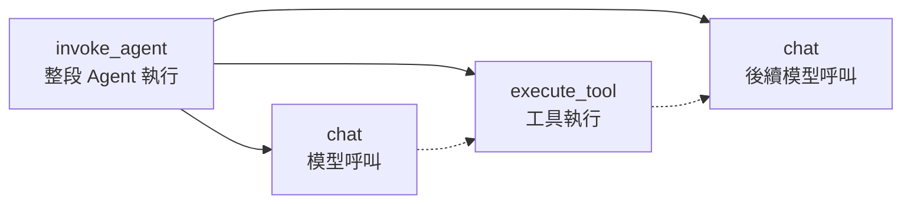
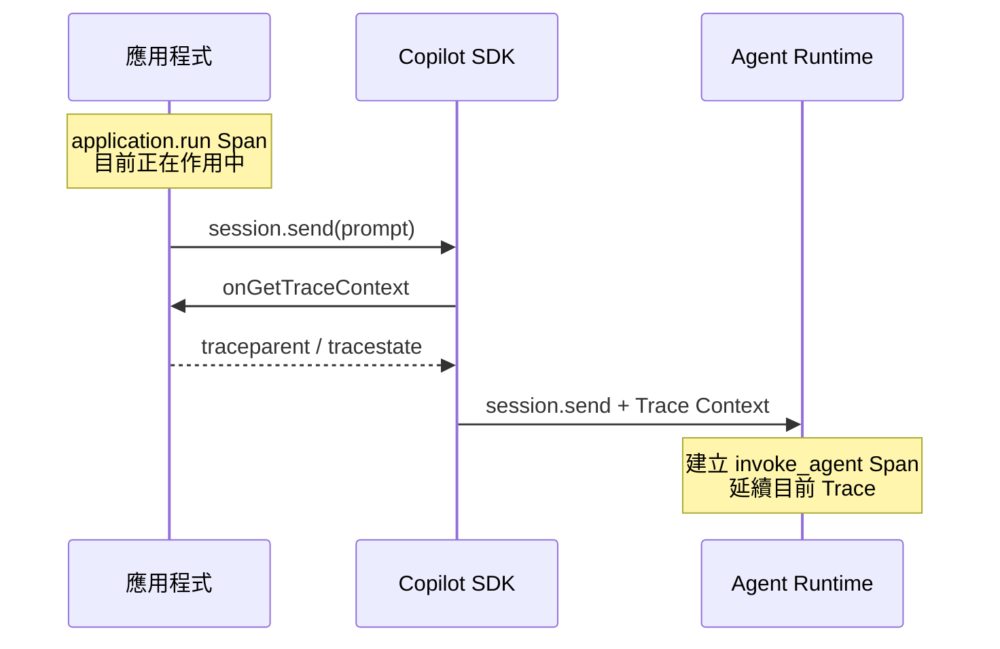
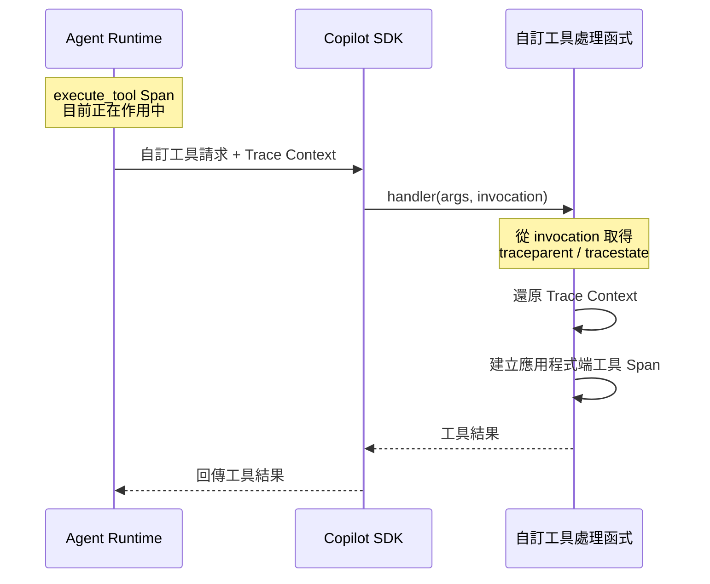

# Day 30 - Agent 服務可觀測性：OpenTelemetry 與執行追蹤

Agent 服務發展到這裡，已經可以接收使用者工作、安排執行，並讓後續請求延續原本的 Session。從產品功能來看，一筆工作可以正常送出、執行並取得結果。不過，當某次執行突然比平常慢很多，或最後直接失敗，只看到最終結果通常還不足以判斷問題究竟出在哪裡。

一筆 Agent 工作實際上會經過應用程式、Agent Runtime、模型與工具。要在正式環境中找出問題，就需要知道這次工作經過哪些執行階段、時間主要花在哪裡，以及錯誤實際發生的位置。這也是 Agent 服務開始需要進一步處理可觀測性的原因。

## Agent 服務需要觀察什麼？

當 Agent 工作開始進入正式服務，只知道最後成功或失敗通常還不夠。一次執行可能經過排隊、模型呼叫與工具處理，不同問題也需要從不同角度觀察。OpenTelemetry 可以把這些執行資訊整理成 Trace、Metrics 與 Logs，讓服務從單筆工作到整體趨勢都能建立一致的觀察方式。

這三類訊號分別處理不同問題：

* **Trace**：追蹤單筆工作經過哪些執行階段，以及時間主要花在哪裡。
* **Metrics**：觀察一段時間內的整體趨勢，例如 Run 執行時間、工具延遲或模型呼叫量是否發生變化。
* **Logs**：保存錯誤與重要狀態資訊，提供進一步診斷需要的執行細節。

對目前的 Agent 服務來說，最需要先解決的是單筆 Application Run 的執行追蹤。當某一筆 Run 明顯比平常更慢，只知道整體執行時間仍不足以定位問題，還需要進一步確認時間主要落在模型呼叫、工具執行，還是應用程式本身的處理。找到主要耗時位置後，才能繼續往對應的模型服務、工具處理函式或下游服務追查。

Metrics 則適合觀察整體趨勢，例如 Queue 等待時間、Run 執行時間、完成與失敗比例，以及 Runtime 提供的模型延遲、Token 用量、工具執行時間與 Agent Turn 數量。當指標顯示整體狀況開始變化後，再透過 Trace 找出代表性的執行個案。

這些資訊的來源也不相同。應用程式掌握 Application Session、Run Queue、Worker 與 Runtime 路由；Agent Runtime 則知道模型何時被呼叫、工具如何執行，以及 Agent Loop 經過多少次模型往返。要形成完整的執行追蹤，就需要保留這層責任差異，再把兩邊可以關聯的資訊串起來。

| INFO: |
| :--- |
| **OpenTelemetry（OTel）** 是一套開放且不綁定特定監控平台的可觀測性框架，可以用來產生、收集與匯出 Trace、Metrics 與 Logs。OpenTelemetry 本身不負責保存、查詢或視覺化資料，這些工作仍由後續的可觀測性後端處理。 |

## Copilot Runtime 如何產生 OpenTelemetry 資訊

前面已經把 Agent 服務需要觀察的資訊分成應用程式與 Runtime 兩個來源。應用程式能知道 Run 如何排隊、由哪個 Worker 執行，以及最後被路由到哪個 Runtime；工作真正進入 Agent Runtime 後，模型呼叫、工具執行與 Agent Loop 的內部執行情況，則由 Runtime 掌握。

Copilot Runtime 可以透過 OpenTelemetry 將這些執行資訊整理成 Trace 與 Metrics。Trace 保留單筆工作的實際執行路徑，Metrics 則用來觀察一段時間內的整體變化。先把這些資訊放回既有的 Agent Loop，就能看出它們分別對應到哪些執行階段。

### 從 Agent Loop 對應到 Trace

一則使用者訊息進入 Agent Loop 後，可能經過多次模型呼叫，也可能在過程中執行工具，再根據取得的結果繼續後續 Turn。這些步驟共同形成一段完整的 Agent 執行流程，但只看最後結果，仍然無法知道每個階段各自花了多少時間。

OpenTelemetry 會透過 **Trace** 記錄這段執行路徑，其中每一個可以獨立觀察的執行階段會以 **Span** 表示。以 Copilot Runtime 的 Agent 執行來看，和目前流程最直接相關的 Span 包括：

* **`invoke_agent`**：代表一則使用者訊息所引發的整段 Agent 執行，包括其中的模型呼叫與工具執行。
* **`chat`**：代表一次實際的模型請求。
* **`execute_tool`**：代表一次工具呼叫的執行。

將這些 Span 放回 Agent Loop，可以表示成：



在這條 Trace 中，`invoke_agent` 是整段 Agent 執行的 Root Span，實際發生的模型呼叫與工具執行則分別形成 `chat` 與 `execute_tool` Child Span。一次執行可能先進行模型呼叫，需要額外資訊時執行工具，再根據工具結果進入後續模型呼叫。

實際 Span 數量與執行順序仍然取決於 Agent 的處理結果。模型可能不使用工具，也可能進行多次模型或工具呼叫，因此不能把圖中的 Span 數量與順序視為固定流程。

### 透過 Runtime Metrics 觀察整體趨勢

Trace 可以拆解單筆 Agent 工作的執行路徑，如果要進一步判斷相同問題是否持續發生，就需要觀察一段時間內累積的 Metrics。Copilot Runtime 會提供模型、Agent 與工具執行相關的多項指標，其中和目前 Agent 服務較直接相關的包括：

* **`gen_ai.client.operation.duration`**：模型與 Agent 執行的時間。
* **`gen_ai.client.token.usage`**：模型輸入與輸出的 Token 用量。
* **`gen_ai.client.operation.time_to_first_chunk`**：Streaming 第一個 Chunk 的等待時間。
* **`gen_ai.invoke_agent.inference_calls`**：一次 Agent 執行發生的模型呼叫數。
* **`gen_ai.invoke_agent.tool_calls`**：一次 Agent 執行中的工具呼叫數量。
* **`github.copilot.tool.call.duration`**：不同工具的執行時間。
* **`github.copilot.agent.turn.count`**：一次 Agent 執行經過的模型往返次數。

這些 Metrics 可以用來觀察模型延遲、工具執行時間、Token 用量與 Agent 執行複雜度是否出現整體變化。當某項指標開始偏離平常狀況時，再回到對應的 Trace，就能進一步確認代表性工作實際把時間花在哪個執行階段。

## Application 與 Runtime 如何形成同一條 Trace

只觀察 Copilot Runtime 的 OpenTelemetry，可以看到 `invoke_agent`、`chat` 與 `execute_tool` 等 Runtime 執行資訊，但 Runtime 並不知道 Application Run 何時開始執行，也不掌握工作在 Application Queue 中等待多久。

如果希望 Runtime Span 與 Application Run 出現在同一條 Trace，應用程式就需要建立自己的 Span，再將目前的 Trace Context 傳進 Runtime。當 Runtime 進一步呼叫應用程式提供的自訂工具時，這份 Context 也能沿著 Copilot SDK 回到工具處理函式，讓不同執行層的 Span 維持在同一條 Trace 中。

### Application Run 是產品層的追蹤起點

Worker 取得 Run 後，應用程式已經知道目前正在執行哪一筆工作，以及這筆工作對應的 Session 與 Runtime，因此可以在這個位置建立 `application.run` Span。

這個 Span 可以加入工程診斷需要的 Attribute，例如：

* **`app.run.id`**：目前的 Application Run ID。
* **`app.session.id`**：這筆 Run 所屬的 Application Session ID。
* **`app.worker.id`**：實際取得工作的 Worker。
* **`runtime.id`**：目前工作被路由到的 Runtime。
* **`app.run.queue_wait_ms`**：Run 在 Application Queue 中等待的時間。

這些 Attribute 都屬於 Agent 服務自行定義的遙測命名，不是 Copilot SDK 或 OpenTelemetry GenAI Semantic Conventions 提供的欄位。它們用來建立產品執行與 Runtime Trace 之間的工程關聯，產品對外 API 不需要因此暴露相同資料。

`application.run` Span 可以從 Worker 真正取得 Run 後開始，持續到目前 Runtime 工作停止。Run 在 Queue 中等待的時間發生在這個 Span 之前，因此不應直接混進 Span 的執行時間。

Application Run 如果已經保存建立時間與實際開始時間，就可以計算 Queue 等待時間，再將結果記錄成對應的 Attribute。這讓單筆 Trace 可以同時知道工作開始前等待多久，以及真正開始執行後各階段花費多少時間；若要觀察所有 Run 的 Queue 等待趨勢，則適合另外建立 Application 端 Metrics。

### 把 Trace Context 傳進 Runtime

應用程式建立 `application.run` Span 後，下一步是讓 Copilot Runtime 知道目前送出的訊息屬於哪一條 Trace。

OpenTelemetry 使用 W3C Trace Context 傳遞這項關聯，主要透過 `traceparent`，以及選用的 `tracestate`，讓後續執行可以延續目前的 Trace。

以 Node.js SDK 為例，可以透過 `onGetTraceContext` 提供目前的 Trace Context。當 SDK 準備執行 `session.send` RPC 時，會呼叫這個回呼函式取得目前的 Context，再將資訊一起交給 Runtime：



當應用程式在 `application.run` 目前作用中的 Context 內呼叫 `session.send()`，`onGetTraceContext` 就能取得這個 Span 的 Trace Context。Runtime 後續建立 `invoke_agent` 時，便會將它作為 `application.run` 的 Child Span，讓模型呼叫與工具執行繼續位於同一條分散式 Trace 中。

`onGetTraceContext` 也會在 `session.create` 與 `session.resume` RPC 前被呼叫，實際取得哪一份 Trace Context，取決於操作當下作用中的 Application Context。若目的是建立單筆 Application Run 與 Agent 執行的關聯，主要需要關注的是訊息送入 Runtime 時的 Context 傳遞。

如果只需要觀察 Copilot Runtime 自己產生的 Trace，啟用 Runtime Telemetry 即可；`onGetTraceContext` 主要用於應用程式也建立自己的 Span，並希望將 Application 與 Runtime 執行關聯起來的情境。

### 自訂工具如何延續 Runtime Trace

Trace Context 也會沿著自訂工具的執行路徑回到應用程式。Runtime 準備執行自訂工具時，會建立對應的 `execute_tool` Span，再透過 Copilot SDK 將工具請求交給應用程式中的處理函式。

以 Node.js SDK 為例，工具處理函式收到的 `ToolInvocation` 會包含 `traceparent`，以及存在時的 `tracestate`。應用程式可以利用這些資訊還原目前的 Trace Context，再建立自己的工具 Span，讓它成為 Runtime `execute_tool` Span 的 Child Span。

整段 Trace Context 傳遞可以表示成：



這樣建立的工具 Span 會接在 Runtime 的 `execute_tool` Span 下方。如果工具後續還會存取資料庫、HTTP API 或其他服務，也可以沿著相同 Context 繼續建立下游 Span，讓整段工具執行維持在同一條 Trace 中。

Trace Context 只用來建立不同執行階段之間的追蹤關聯，不代表資源存取權。Copilot CLI 預設也不會將完整 Prompt、Response 或工具參數與結果寫進 OpenTelemetry；只有明確開啟 `OTEL_INSTRUMENTATION_GENAI_CAPTURE_MESSAGE_CONTENT=true` 後，這些內容才會進入遙測資料。

| NOTE: |
| :--- |
| Prompt、模型回應與工具輸入／輸出可能包含程式碼、內部資料或使用者輸入。正式服務不應只為了方便除錯就預設擷取完整 Agent 內容；即使有實際需求，也應先處理資料遮罩、存取權限與保存期限。 |

## 實作：替 Agent Run 建立端到端 Trace

接下來延續既有的 `copilot-sdk-agent-service`，把前面建立的 Trace 關係實際接進 Agent 服務。Application Session、Run Queue、Worker、Runtime Pool、SSE 與取消流程都維持原本的責任，只加入應用程式端 OpenTelemetry、Runtime 遙測設定，以及一支固定資料的 `get_service_status` 自訂工具，確認一筆 Application Run 是否能一路追蹤到 Runtime 與工具處理函式。

專案結構調整為：

```text
copilot-sdk-agent-service/
├── src/
│   ├── types.ts
│   ├── identity.ts
│   ├── store.ts
│   ├── run-store.ts
│   ├── telemetry.ts
│   ├── tools.ts
│   ├── runtime-pool.ts
│   ├── run-manager.ts
│   ├── worker.ts
│   └── server.ts
├── otel-collector.yaml
└── package.json
```

各檔案負責：

* **`telemetry.ts`**：初始化應用程式端的 OpenTelemetry Trace，並提供 Trace Context 傳遞。
* **`tools.ts`**：建立固定資料的 `get_service_status`，並延續 Runtime 傳回的 Trace Context。
* **`runtime-pool.ts`**：替 External Runtime Client 加入 `onGetTraceContext`，並將自訂工具提供給 Runtime Session。
* **`run-manager.ts`**：替 Worker 已經取得的 Application Run 建立 Span，直到 Runtime 工作真正停止。

其他檔案直接沿用既有實作，不需要調整。

### 準備 OpenTelemetry 執行環境

先安裝應用程式需要的 OpenTelemetry 套件，以及範例自訂工具使用的 Zod：

```bash
$ npm install zod \
  @opentelemetry/api \
  @opentelemetry/sdk-node \
  @opentelemetry/exporter-trace-otlp-http
```

`@opentelemetry/api` 提供 Trace、Context 與 Propagation API；`@opentelemetry/sdk-node` 負責初始化 Node.js OpenTelemetry SDK；`@opentelemetry/exporter-trace-otlp-http` 則將應用程式產生的 Span 透過 OTLP HTTP 送出。

範例使用 OpenTelemetry Collector 作為應用程式與 Runtime 共同的遙測入口。建立 `otel-collector.yaml`：

```yaml
receivers:
  otlp:
    protocols:
      http:
        endpoint: 0.0.0.0:4318

exporters:
  debug/traces:
    verbosity: detailed
  debug/metrics:
    verbosity: basic

service:
  pipelines:
    traces:
      receivers: [otlp]
      exporters: [debug/traces]
    metrics:
      receivers: [otlp]
      exporters: [debug/metrics]
```

Collector 會在 Port `4318` 接收 OTLP HTTP。應用程式目前只送出 Trace，Copilot Runtime 則會送出 Trace 與 Metrics，因此 Collector 分別建立 Trace 與 Metrics Pipeline。

Trace 的 `debug` exporter 使用 `detailed`，讓後面可以直接從 Collector Log 查看每個 Span 的 Trace ID、Span ID、Parent ID 與其他資訊；Metrics 則使用 `basic`，只確認資料是否正常進入 Collector，避免測試時輸出大量內容。

| NOTE: |
| :--- |
| 範例使用 `debug` exporter，是為了直接從 Collector Log 驗證遙測資料。正式環境通常會將 Collector 收到的 Trace 轉送到 Tempo、Grafana Cloud Traces 或其他支援 OpenTelemetry 的 Trace Backend，再透過 Grafana 等工具進行查詢與視覺化。 |

將 `<collector-version>` 換成目前要使用的 OpenTelemetry Collector 版本後，可以使用 Docker 啟動 Collector：

```bash
$ docker run --rm \
  -p 4318:4318 \
  -v "$PWD/otel-collector.yaml:/etc/otelcol/config.yaml:ro" \
  otel/opentelemetry-collector:<collector-version> \
  --config=/etc/otelcol/config.yaml
```

這個範例假設 Agent Service、External Runtime 與 Collector 都執行在同一台主機，因此後面統一使用 `localhost:4318`。

### 建立 Application 端 Trace

Runtime 會產生自己的 OpenTelemetry 資訊，Application Run 則需要由 Agent 服務自行建立 Trace。先建立 `src/telemetry.ts`，初始化應用程式端的 OpenTelemetry：

```typescript
import { context, propagation, trace } from "@opentelemetry/api";
import { OTLPTraceExporter } from "@opentelemetry/exporter-trace-otlp-http";
import { NodeSDK } from "@opentelemetry/sdk-node";

const traceExporter = new OTLPTraceExporter({
  url:
    process.env.OTEL_EXPORTER_OTLP_TRACES_ENDPOINT ??
    "http://localhost:4318/v1/traces",
});

const sdk = new NodeSDK({
  serviceName: "copilot-agent-service",
  traceExporter,
});

sdk.start();

export const tracer = trace.getTracer("copilot-agent-service");

export function getCurrentTraceContext(): Record<string, string> {
  const carrier: Record<string, string> = {};
  propagation.inject(context.active(), carrier);
  return carrier;
}
```

`NodeSDK` 初始化應用程式端的 OpenTelemetry 環境，`OTLPTraceExporter` 則將完成的 Span 傳送到 Collector。`getCurrentTraceContext()` 使用 OpenTelemetry Propagation API，將目前作用中的 W3C Trace Context 注入 `carrier`；當它在 `application.run` Span 的 Context 中執行，就能取得目前的 `traceparent`，以及存在時的 `tracestate`。

Application 端的 OpenTelemetry 準備完成後，再更新 `src/run-manager.ts`，讓每一筆真正開始執行的 Run 建立 `application.run` Span：

```typescript
import { SpanStatusCode, type Span } from "@opentelemetry/api";
import {
  cancelRun,
  completeRun,
  failRun,
  getRun,
  isTerminalRunStatus,
  publishRunEvent,
  setRunOutput,
  setRuntimeMessageId,
} from "./run-store.js";
import { getRuntimeSession } from "./runtime-pool.js";
import { tracer } from "./telemetry.js";
import type {
  ApplicationRun,
  ApplicationSession,
  RunStatus,
} from "./types.js";

function getErrorMessage(error: unknown): string {
  return error instanceof Error ? error.message : "未知的 Runtime 錯誤";
}

function finishSpan(span: Span, status: RunStatus, error?: string): void {
  span.setAttribute("app.run.status", status);

  if (status === "completed") {
    span.setStatus({ code: SpanStatusCode.OK });
  }

  if (status === "failed") {
    span.setStatus({ code: SpanStatusCode.ERROR, message: error });

    if (error) {
      span.recordException(new Error(error));
    }
  }

  span.end();
}

export async function startRun(
  run: ApplicationRun,
  session: ApplicationSession,
): Promise<void> {
  const queueWaitMs =
    run.startedAt === undefined
      ? undefined
      : Date.parse(run.startedAt) - Date.parse(run.createdAt);

  await tracer.startActiveSpan(
    "application.run",
    {
      attributes: {
        "app.run.id": run.id,
        "app.session.id": run.sessionId,
        "app.worker.id": run.workerId ?? "unknown",
        "runtime.id": session.runtimeId,
        ...(queueWaitMs === undefined
          ? {}
          : { "app.run.queue_wait_ms": queueWaitMs }),
      },
    },
    async (span) => {
      let unsubscribe = () => {};
      let spanEnded = false;

      const endSpan = (status: RunStatus, error?: string) => {
        if (spanEnded) return;

        spanEnded = true;
        finishSpan(span, status, error);
      };

      try {
        const runtimeSession = await getRuntimeSession(session);

        unsubscribe = runtimeSession.on((event) => {
          switch (event.type) {
            case "assistant.message_delta":
              if (!event.agentId && event.data.deltaContent) {
                publishRunEvent(run.id, {
                  type: "run.output.delta",
                  delta: event.data.deltaContent,
                });
              }
              break;

            case "assistant.message":
              if (!event.agentId && event.data.content) {
                setRunOutput(run.id, event.data.content);
              }
              break;

            case "session.error": {
              const failed = failRun(run.id, event.data.message);

              if (failed?.status === "failed") {
                publishRunEvent(run.id, {
                  type: "run.failed",
                  error: event.data.message,
                });

                endSpan("failed", event.data.message);
              }

              unsubscribe();
              break;
            }

            case "session.idle": {
              const current = getRun(run.id);

              if (!current || isTerminalRunStatus(current.status)) {
                unsubscribe();
                break;
              }

              if (event.data.aborted) {
                const cancelled = cancelRun(run.id);

                if (cancelled) {
                  publishRunEvent(run.id, { type: "run.cancelled" });
                  endSpan("cancelled");
                }
              } else {
                const completed = completeRun(run.id);

                if (completed) {
                  publishRunEvent(run.id, {
                    type: "run.completed",
                    output: completed.output,
                  });

                  endSpan("completed");
                }
              }

              unsubscribe();
              break;
            }
          }
        });

        publishRunEvent(run.id, { type: "run.started" });

        const runtimeMessageId = await runtimeSession.send({
          prompt: run.prompt,
        });

        setRuntimeMessageId(run.id, runtimeMessageId);
      } catch (error) {
        unsubscribe();

        const message = getErrorMessage(error);
        const failed = failRun(run.id, message);

        if (failed) {
          publishRunEvent(run.id, {
            type: "run.failed",
            error: message,
          });
        }

        endSpan("failed", message);
        throw error;
      }
    },
  );
}
```

和既有實作相比，Run 狀態更新與 Session 事件映射沒有改變。新增的核心是 `tracer.startActiveSpan()`，在 Worker 已經取得 Run 後建立 `application.run`，並將前面定義的 Run、Worker、Runtime 與 Queue 等待資訊寫入 Attribute。

`session.send()` 完成時，只代表訊息已經提交給 Runtime，不代表這筆 Run 已經完成。因此，`application.run` Span 不會跟著結束，而是保留到後續收到 `session.idle` 或 `session.error`，確認這筆 Run 已經形成最終狀態後才呼叫 `endSpan()`。如此一來，Span 的執行時間可以涵蓋 Worker 開始處理這筆 Run，到 Runtime 停止目前工作之間的完整執行區間。

### 讓 Copilot Runtime 匯出 Trace 與 Metrics

目前 Agent 服務使用 External Runtime。`RuntimeConnection.forUri()` 的責任是連接已經執行中的 Runtime，不會替它建立程序；`CopilotClient` 的 `telemetry` 設定則用來設定 SDK 啟動的 Runtime 程序。因此，External Runtime 的 OpenTelemetry 設定仍然需要由 Runtime 所在的執行環境提供。

啟動第一個 Runtime：

```bash
$ COPILOT_OTEL_ENABLED="true" \
  OTEL_EXPORTER_OTLP_ENDPOINT="http://localhost:4318" \
  OTEL_EXPORTER_OTLP_PROTOCOL="http/protobuf" \
  OTEL_SERVICE_NAME="copilot-runtime-1" \
  OTEL_INSTRUMENTATION_GENAI_CAPTURE_MESSAGE_CONTENT="false" \
  copilot --headless --port 4321
```

第二個 Runtime：

```bash
$ COPILOT_OTEL_ENABLED="true" \
  OTEL_EXPORTER_OTLP_ENDPOINT="http://localhost:4318" \
  OTEL_EXPORTER_OTLP_PROTOCOL="http/protobuf" \
  OTEL_SERVICE_NAME="copilot-runtime-2" \
  OTEL_INSTRUMENTATION_GENAI_CAPTURE_MESSAGE_CONTENT="false" \
  copilot --headless --port 4322
```

範例明確設定 `COPILOT_OTEL_ENABLED=true`，讓兩個 External Runtime 都啟用 OpenTelemetry，再透過 OTLP HTTP 將 Trace 與 Metrics 傳送到 Collector。`OTEL_SERVICE_NAME` 則讓兩個 Runtime 在 OTel Resource 中使用不同的 `service.name`，後續可以辨識實際執行工作的 Runtime。

延續前面的資料邊界，這裡也明確維持 `OTEL_INSTRUMENTATION_GENAI_CAPTURE_MESSAGE_CONTENT=false`。

### 將 Application Trace Context 傳入 Runtime

應用程式已經產生 `application.run`，Runtime 也開始輸出自己的 OpenTelemetry Span，接下來要讓兩者形成同一條 Trace。

更新 `src/runtime-pool.ts`：

```typescript
import {
  CopilotClient,
  RuntimeConnection,
  type CopilotSession,
  type ProviderConfig,
} from "@github/copilot-sdk";
import { getCurrentTraceContext } from "./telemetry.js";
import { getServiceStatus } from "./tools.js";
import type { ApplicationSession } from "./types.js";

type RuntimeInstance = {
  id: string;
  url: string;
  client: CopilotClient;
  sessions: Map<string, CopilotSession>;
};

const model = process.env.MODEL_ID;
const baseUrl = process.env.MODEL_BASE_URL;
const apiKey = process.env.MODEL_API_KEY;

if (!model || !baseUrl || !apiKey) {
  throw new Error("MODEL_ID、MODEL_BASE_URL 與 MODEL_API_KEY 都必須提供。");
}

const provider: ProviderConfig = {
  type: "openai",
  baseUrl,
  apiKey,
  wireApi: "responses",
};

const runtimeDefinitions = [
  {
    id: "runtime-1",
    url: process.env.COPILOT_RUNTIME_1_URL ?? "localhost:4321",
  },
  {
    id: "runtime-2",
    url: process.env.COPILOT_RUNTIME_2_URL ?? "localhost:4322",
  },
];

const runtimes = new Map<string, RuntimeInstance>(
  runtimeDefinitions.map(({ id, url }): [string, RuntimeInstance] => {
    const client = new CopilotClient({
      mode: "empty",
      connection: RuntimeConnection.forUri(url),
      onGetTraceContext: getCurrentTraceContext,
    });

    return [
      id,
      {
        id,
        url,
        client,
        sessions: new Map<string, CopilotSession>(),
      },
    ];
  }),
);

let nextRuntimeIndex = 0;

function getRuntime(runtimeId: string): RuntimeInstance {
  const runtime = runtimes.get(runtimeId);

  if (!runtime) {
    throw new Error(`找不到 Runtime: ${runtimeId}`);
  }

  return runtime;
}

export async function startRuntimePool(): Promise<void> {
  await Promise.all(
    [...runtimes.values()].map((runtime) => runtime.client.start()),
  );
}

export function selectRuntimeId(): string {
  const definitions = [...runtimes.values()];

  if (definitions.length === 0) {
    throw new Error("目前沒有可用的 Runtime");
  }

  const runtime = definitions[nextRuntimeIndex % definitions.length];
  nextRuntimeIndex += 1;

  return runtime.id;
}

export async function createRuntimeSession(
  session: ApplicationSession,
): Promise<void> {
  const runtime = getRuntime(session.runtimeId);

  const runtimeSession = await runtime.client.createSession({
    sessionId: session.runtimeSessionId,
    model,
    provider,
    streaming: true,
    tools: [getServiceStatus],
    availableTools: ["custom:get_service_status"],
  });

  runtime.sessions.set(session.runtimeSessionId, runtimeSession);
}

export async function getRuntimeSession(
  session: ApplicationSession,
): Promise<CopilotSession> {
  const runtime = getRuntime(session.runtimeId);
  const current = runtime.sessions.get(session.runtimeSessionId);

  if (current) {
    return current;
  }

  const resumed = await runtime.client.resumeSession(
    session.runtimeSessionId,
    {
      model,
      provider,
      streaming: true,
      tools: [getServiceStatus],
      availableTools: ["custom:get_service_status"],
    },
  );

  runtime.sessions.set(session.runtimeSessionId, resumed);
  return resumed;
}

export async function abortRuntimeSession(
  session: ApplicationSession,
): Promise<void> {
  const runtimeSession = await getRuntimeSession(session);
  await runtimeSession.abort();
}
```

這次和 Trace 串接直接相關的設定是 `onGetTraceContext: getCurrentTraceContext`。

當 `startRun()` 在 `application.run` 目前作用中的 Context 內呼叫 `runtimeSession.send()`，Node.js SDK 會透過 `getCurrentTraceContext()` 取得目前的 `traceparent` / `tracestate`，再將這些資訊加入 `session.send` RPC。Runtime 後續建立的 `invoke_agent` 也就能成為 `application.run` 的 Child Span。

`onGetTraceContext` 同樣會在 `session.create` 與 `session.resume` 前被呼叫。實際取得哪一份 Trace Context，取決於這些操作當下作用中的 Application Context；目前實作主要利用 `session.send()` 建立 Application Run 與這次 Agent 執行的關聯。

### 讓自訂工具繼續同一條 Trace

最後建立 `src/tools.ts`，讓自訂工具也能延續 Runtime 傳回的 Trace Context：

```typescript
import { context, propagation, trace } from "@opentelemetry/api";
import { defineTool } from "@github/copilot-sdk";
import { z } from "zod";

const tracer = trace.getTracer("copilot-agent-service");

const serviceStatus = {
  service: "checkout-api",
  status: "degraded",
  errorRate: 0.07,
  activeIncidents: 2,
  observedAt: "2026-08-25T08:00:00Z",
};

export const getServiceStatus = defineTool("get_service_status", {
  description: "Return fixed sample status for checkout-api",
  parameters: z.object({
    service: z.literal("checkout-api"),
  }),
  defer: "never",
  skipPermission: true,
  handler: async ({ service }, invocation) => {
    const carrier: Record<string, string> = {};

    if (invocation.traceparent) {
      carrier.traceparent = invocation.traceparent;
    }

    if (invocation.tracestate) {
      carrier.tracestate = invocation.tracestate;
    }

    const parentContext = propagation.extract(context.active(), carrier);

    return context.with(parentContext, () =>
      tracer.startActiveSpan(
        "tool.get_service_status",
        {
          attributes: {
            "app.tool.name": "get_service_status",
            "app.tool.call.id": invocation.toolCallId,
          },
        },
        async (span) => {
          try {
            return { ...serviceStatus, service };
          } finally {
            span.end();
          }
        },
      ),
    );
  },
});
```

工具本身仍然只回傳程式中的固定資料，不連接外部服務，也沒有寫入副作用。這次新增的重點是處理函式收到的第二個參數 `invocation`。

以 Node.js SDK 為例，Runtime 呼叫自訂工具時，`ToolInvocation` 會提供 `invocation.traceparent`，以及存在時的 `invocation.tracestate`。處理函式利用這些值還原 Runtime 的 Trace Context，再在這個 Context 中建立 `tool.get_service_status`，讓它成為 `execute_tool` 的 Child Span。

如果正式的自訂工具後面還會存取資料庫、HTTP API 或其他服務，只要對應的執行路徑也具備 OpenTelemetry instrumentation，就能繼續沿著相同 Context 建立後續 Child Span。

### 執行應用程式

Collector 與兩個 External Runtime 都啟動後，再準備 Agent 服務原本需要的 Runtime、BYOK 與 Application Trace 設定：

```bash
$ export COPILOT_RUNTIME_1_URL="localhost:4321"
$ export COPILOT_RUNTIME_2_URL="localhost:4322"
$ export MODEL_BASE_URL="https://<model-provider>/v1"
$ export MODEL_API_KEY="<api-key>"
$ export MODEL_ID="<model-id>"
$ export OTEL_EXPORTER_OTLP_TRACES_ENDPOINT="http://localhost:4318/v1/traces"
```

接著啟動 Agent 服務：

```bash
$ npx tsx src/server.ts
```

先建立 Application Session：

```bash
$ curl -s -X POST \
  -H "X-Demo-Tenant-Id: tenant-a" \
  -H "X-Demo-User-Id: user-a" \
  http://localhost:3000/api/sessions
```

取得 Session ID 後：

```bash
$ export SESSION_ID="session_<uuid>"
```

再建立一筆要求使用固定資料工具的 Run：

```bash
$ curl -s -X POST \
  -H "Content-Type: application/json" \
  -H "X-Demo-Tenant-Id: tenant-a" \
  -H "X-Demo-User-Id: user-a" \
  -d '{
    "prompt": "請務必使用 get_service_status 查詢 checkout-api，再根據工具實際回傳的資料整理目前服務狀態與需要注意的問題；不要自行補充工具沒有提供的資訊。"
  }' \
  "http://localhost:3000/api/sessions/$SESSION_ID/runs"
```

取得 Run ID 後仍然可以沿用既有的查詢 API：

```bash
$ export RUN_ID="run_<uuid>"

$ curl -s \
  -H "X-Demo-Tenant-Id: tenant-a" \
  -H "X-Demo-User-Id: user-a" \
  "http://localhost:3000/api/runs/$RUN_ID"
```

Run 開始執行後，可以回到 OpenTelemetry Collector 的終端機觀察 Trace。由於 Trace 的 `debug` exporter 使用 `detailed`，Collector Log 會列出每個 Span 的 `service.name`、Trace ID、Span ID、Parent ID 與執行時間等資訊。

可以先找到 `copilot-agent-service` 產生的 `application.run`，再沿著相同的 Trace ID 查看 Copilot Runtime 產生的 `invoke_agent`、`chat` 與 `execute_tool`。如果 Trace Context 傳遞正確，`invoke_agent` 的 Parent ID 會對應 `application.run` 的 Span ID；自訂工具實際執行後，應用程式端的 `tool.get_service_status` 也會出現在同一條 Trace，其中 Parent ID 對應 Runtime `execute_tool` 的 Span ID。透過這些關係，就能確認 Application、Runtime 與自訂工具的執行是否已經串進同一條分散式 Trace。

實際出現的 `chat` 與工具 Span 數量仍然取決於 Agent 執行結果。Agent 可能不使用工具，也可能進行多次模型或工具呼叫，因此觀察重點是各個實際發生的 Span 是否形成預期的 Trace 關係，不需要期待固定的 Span 數量。

## 從單筆 Trace 延伸到服務整體觀測

完成端到端 Trace 後，已經可以沿著一筆 Application Run 查看應用程式、Runtime、模型與工具的實際執行路徑。不過，正式服務不能只在單筆工作發生問題後才開始追查，還需要持續觀察一段時間內的執行狀況，判斷延遲、失敗或資源使用是否正在形成整體趨勢。

Trace 與 Metrics 分別處理不同層次的觀測需求，因此需要搭配使用。Trace 適合保留單筆工作的執行細節，Metrics 則將大量執行結果整理成可以持續觀察的指標。當 Queue 等待時間、Run 執行時間或模型延遲開始偏離平常狀況時，可以先透過 Metrics 發現變化，再利用 Trace 找到具有代表性的 Run 進一步追查。

對目前的 Agent 服務來說，需要觀察的資訊仍然依照原本的責任分工產生：

* **應用程式**：Queue 等待時間、等待中的工作數量、Run 執行時間、完成、失敗與取消比例，以及 Runtime 連線與路由失敗。
* **Copilot Runtime**：Agent 執行時間、模型延遲、首個 Chunk 等待時間、Token 用量、模型呼叫次數、工具呼叫次數、工具執行時間與 Turn 數量。

這些資訊不需要全部放進同一條 Trace。像 Queue 中等待的工作數量、Run 完成比例或模型延遲趨勢，描述的是跨多筆工作的服務狀態，更適合透過 Metrics 持續觀察；Run ID、Runtime ID，以及實際發生的模型與工具執行路徑，則適合保留在 Trace 中，協助定位單筆工作的執行情況。

因此，Agent 服務的可觀測性需要讓不同訊號各自保留適合的用途。Metrics 用來發現整體狀況的變化，Trace 則在需要進一步追查時提供單筆工作的執行路徑。兩者建立關聯後，才能同時掌握服務是否出現異常，以及問題實際發生在哪個執行階段。

## 小結

Agent 服務可以建立 Run、安排 Worker 並找到正確 Runtime，只代表工作已經能夠持續執行。進入正式環境後，還需要能判斷一筆工作實際經過哪些執行階段，以及延遲與錯誤發生在哪裡：

* Copilot Runtime 可以透過 OpenTelemetry 提供 `invoke_agent`、`chat` 與 `execute_tool` 等執行 Trace，並產生模型、Token、工具與 Turn 相關 Metrics。
* 應用程式可以替 Application Run 建立 Span，保存 Run、Worker、Runtime 路由與 Queue 等待時間等產品執行資訊。
* W3C Trace Context 讓應用程式的 Trace 可以經由 Copilot SDK 傳進 Runtime，自訂工具執行時也能將 Runtime Context 再帶回應用程式中的工具處理函式。
* Trace 與 Metrics 分別處理單筆執行診斷與整體趨勢觀察，兩者需要搭配使用。
* 遙測資料仍有自己的資料邊界，完整 Prompt、Response 與工具內容不應因為方便除錯就預設進入可觀測性後端。

把 Application Run 與 Runtime 執行串進同一條 Trace，再搭配服務與 Runtime 各自產生的 Metrics，工作變慢或失敗時就能沿著實際執行路徑定位問題。
